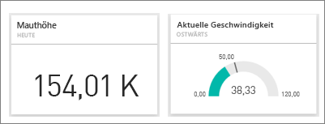
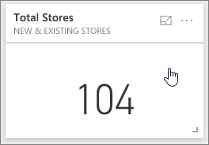
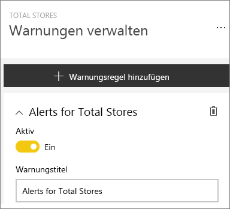
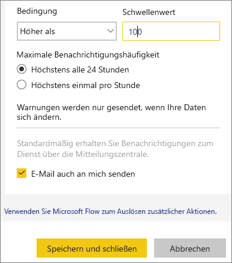
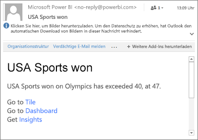
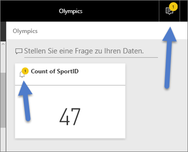
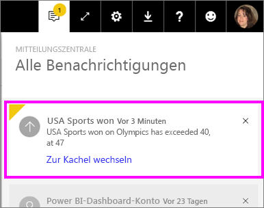
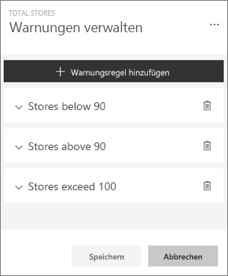
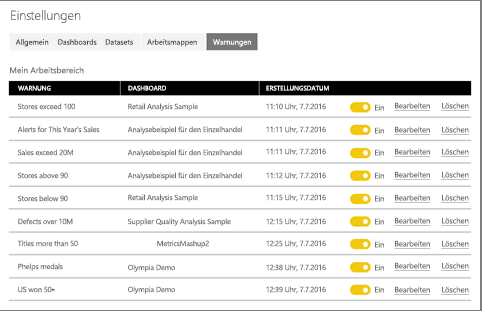

# Tutorial: Festlegen von Datenwarnungen im Power BI-Dienst
Legen Sie Warnungen fest, um Benachrichtigungen zu erhalten, wenn die Daten in den Dashboards die von Ihnen festgelegten Grenzen überschreiten. 

Sie können Warnungen für Kacheln festlegen, wenn Sie über eine Power BI Pro-Lizenz verfügen oder wenn ein Dashboard über eine [Premium-Kapazität](../service-premium.md) mit Ihnen geteilt wurde. Warnungen können nur für Kacheln, die über Berichtsvisuals angeheftet wurden, und nur für Messgeräte, KPIs und Karten festgelegt werden. Warnungen können für aus Streamingdatasets erstellte Visuals festgelegt werden, die aus einem Bericht an ein Dashboard angeheftet wurden. Sie können jedoch nicht für Streamingkacheln festgelegt werden, die mit **Kachel hinzufügen** > **Benutzerdefinierte Streamingdaten** direkt im Dashboard erstellt wurden. 

Die Warnungen werden nur Ihnen angezeigt, auch wenn Sie das Dashboard freigeben. Datenwarnungen werden mit allen Plattformen synchronisiert. Sie können Datenwarnungen daher [in den mobilen Power BI-Apps](mobile/mobile-set-data-alerts-in-the-mobile-apps.md) und im Power BI-Dienst festlegen und anzeigen. 

> [!WARNING]
> Datengesteuerte Warnungsbenachrichtigungen liefern Informationen über Ihre Daten. Wenn Sie Power BI-Daten auf einem mobilen Gerät anzeigen und das Gerät gestohlen wird, sollten Sie mithilfe des Power BI-Diensts alle Regeln für datengesteuerte Warnungen deaktivieren.
> 

In diesem Tutorial werden folgende Themen behandelt:
> [!div class="checklist"]
> * Wer kann Warnungen einrichten?
> * Welche Visuals unterstützen Warnungen?
> * Wer kann meine Warnungen sehen?
> * Funktionieren Warnungen in Power BI Desktop und mobil?
> * Wie erstelle ich eine Warnung?
> * Wo werde ich meine Warnungen erhalten?

Wenn Sie noch nicht bei Power BI registriert sind, müssen Sie sich zuerst für eine [kostenlose Testversion registrieren](https://app.powerbi.com/signupredirect?pbi_source=web).

## Festlegen von Datenwarnungen im Power BI-Dienst
Sehen Sie sich an, wie Amanda einige Datenwarnungen zu Karten auf ihrem Dashboard hinzufügt. Befolgen Sie dann die schrittweisen Anleitungen unter dem Video, um es selbst ausprobieren.

<iframe width="560" height="315" src="https://www.youtube.com/embed/JbL2-HJ8clE" frameborder="0" allowfullscreen></iframe>

In diesem Beispiel wird eine Kartenkachel aus dem Dashboard [Retail Analysis sample (Beispiel für Einzelhandelsanalyse)](http://go.microsoft.com/fwlink/?LinkId=529778) verwendet.

1. Wählen Sie von einem Messgerät, KPI oder einer Kartenkachel eines Dashboards die Auslassungspunkte aus.
   
   
2. Wählen Sie das Glockensymbol  oder **Warnungen verwalten** aus, um eine oder mehrere Warnungen für **Filialen insgesamt** hinzuzufügen.
   
1. Wählen Sie **+ Warnungsregel hinzufügen** im Bereich **Warnungen verwalten** aus.  Stellen Sie sicher, dass der Schieberegler auf **Ein** festgelegt ist, und geben Sie der Warnung einen Titel. Durch Titel lassen sich Warnungen schnell einordnen.
   
   
4. Scrollen Sie nach unten, und geben Sie die Warnungsdetails ein.  In diesem Beispiel erstellen wir eine Warnung, die uns einmal täglich benachrichtigt, wenn die Gesamtzahl der Läden die Zahl 100 überschreitet. Warnungen werden in der Mitteilungszentrale angezeigt. Und außerdem lassen wir uns von Power BI eine E-Mail senden.
   
   
5. Klicken Sie auf **Speichern und schließen**.

## Empfangen von Warnungen
Wenn die nachverfolgten Daten einen der von Ihnen festgelegten Schwellenwerte erreichen, erfolgen mehrere Aktionen. Power BI überprüft zunächst, ob seit dem Senden der letzten Warnung mehr als eine Stunde oder mehr als 24 Stunden (je nach der von Ihnen ausgewählten Option) verstrichen sind. Solange die Daten den Schwellenwert überschreiten, erhalten Sie eine Warnung.

Anschließend sendet Power BI eine Warnung an Ihre Mitteilungszentrale und optional an Ihre E-Mail-Adresse. Jede Warnung enthält einen direkten Link zu den entsprechenden Daten. Klicken Sie auf den Link, um die relevante Kachel zu sehen.  

1. Wenn Sie festgelegt haben, dass bei einer Warnung eine E-Mail an Sie gesendet wird, enthält Ihr Posteingang etwa Folgendes.
   
   
2. Power BI fügt der **Mitteilungszentrale** eine Nachricht und der entsprechenden Kachel das Symbol für eine neue Warnung hinzu.
   
   
3. Öffnen Sie die Mitteilungszentrale, um die Warnungsdetails anzuzeigen.
   
    
   
   > [!NOTE]
   > Warnungen erfolgen nur für Daten, die aktualisiert werden. Wenn Daten aktualisiert werden, überprüft Power BI, ob eine Warnung für diese Daten festgelegt ist. Wenn die Daten einen Warnungsschwellenwert erreicht haben, wird eine Warnung ausgelöst.
   > 
   > 

## Verwalten von Warnungen
Es gibt eine Reihe von Möglichkeiten zum Verwalten von Warnungen: in der Dashboardkachel, im Menü für Power BI-Einstellungen, auf einer einzelnen Kachel in der [mobilen Power BI-App auf dem iPhone](mobile/mobile-set-data-alerts-in-the-mobile-apps.md) oder in der [mobilen Power BI-App für Windows 10](mobile/mobile-set-data-alerts-in-the-mobile-apps.md).

### In der Kachel
1. Wenn Sie eine Warnung für eine Kachel ändern oder entfernen müssen, öffnen Sie das Fenster **Warnungen verwalten** erneut, indem Sie auf das Glockensymbol  klicken. Alle Warnungen, die Sie für diese Kachel festgelegt haben, werden angezeigt.
   
    .
2. Um eine Warnung zu ändern, wählen Sie den Pfeil links neben dem Namen der Warnung.
   
    .
3. Um eine Warnung zu löschen, wählen Sie den Papierkorb rechts neben dem Namen der Warnung.
   
      

### Im Menü für Power BI-Einstellungen
1. Wählen Sie das Zahnradsymbol auf der Power BI-Menüleiste.
   
    .
2. Wählen Sie unter **Einstellungen** die Option **Warnungen** aus.
   
    
3. Hier können Sie Warnungen aktivieren und deaktivieren, das Fenster **Warnungen verwalten** öffnen, um Änderungen vorzunehmen, oder die Warnung löschen.

## Tipps und Problembehandlung
* Für Bing-Kacheln und für Kartenkacheln mit Datum/Uhrzeit-Measures werden Warnungen derzeit nicht unterstützt.
* Warnungen können nur für numerische Datentypen ausgelöst werden.
* Warnungen erfolgen nur für Daten, die aktualisiert werden. Sie können nicht für statische Daten ausgelöst werden.
* Warnungen können für Streamingdatasets nur erfolgen, wenn Sie ein KPI-/Karten-/Messgerät-Visual erstellen und dieses dann an das Dashboard anheften.

## Bereinigen von Ressourcen
Anleitungen zum Löschen von Warnungen sind weiter oben beschrieben. Kurz gesagt, wählen Sie das Zahnradsymbol auf der Power BI-Menüleiste. Klicken Sie unter **Einstellungen** auf **Warnungen** und löschen Sie die Warnung.

> [!div class="nextstepaction"]
> [Festlegen von Datenwarnungen auf Ihrem mobilen Gerät](mobile/mobile-set-data-alerts-in-the-mobile-apps.md)

