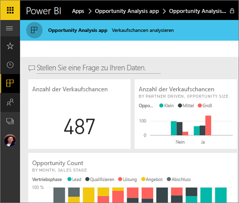
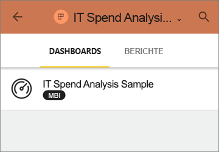
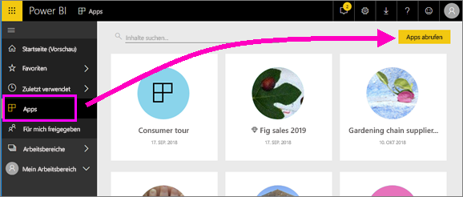
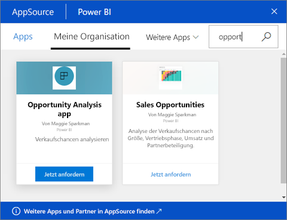

# Installieren und Verwenden von Apps mit Dashboards und Berichten in Power BI
Nachdem Sie [grundlegende Informationen zu Apps](end-user-apps.md) erhalten haben, erfahren Sie hier, wie Apps geöffnet werden und wie Sie mit ihnen interagieren. 

## Wie erhalte ich eine neue App?
Es gibt mehrere Möglichkeiten, eine neue App zu erhalten. Ein Berichts-Designer kann die App automatisch in Ihrem Power BI-Konto installieren oder Ihnen einen direkten Link zur App senden. Sie können auch in AppSource nach verfügbaren Apps suchen, die von innerhalb oder außerhalb Ihres Unternehmens bereitgestellt werden. 

Wenn Sie Power BI auf Ihrem mobilen Gerät nutzen, können Sie eine App nur über einen direkten Link und nicht über AppSource installieren. Wenn der Ersteller der App diese automatisch installieren lässt, wird sie in der Liste der Apps angezeigt.

## Installieren einer App über einen direkten Link
Wenn Sie selbst eine neue App installieren möchten, besteht die einfachste Möglichkeit darin, einen direkten Link zu verwenden, der Ihnen vom Ersteller der App per E-Mail zugesendet wird.  

**Auf Ihrem Computer** 

Wenn Sie auf den Link in der E-Mail klicken, wird der Power BI-Dienst ([https://powerbi.com](https://powerbi.com)) in einem Browser geöffnet. Bestätigen Sie, dass Sie die App installieren möchten, und die Landing Page der App wird von Power BI geöffnet.

**Auf Ihrem iOS- oder Android-Mobilgerät** 

Wenn Sie auf Ihrem Mobilgerät den Link in der E-Mail auswählen, wird die App automatisch installiert, und die Inhaltsliste der App wird in der mobilen App geöffnet. 

## Abrufen der App von Microsoft AppSource
Sie können auch in Microsoft AppSource Apps suchen und installieren. Dort werden nur Apps angezeigt, auf die Sie Zugriff haben (da der Ersteller der App Ihnen oder allen die Berechtigung dazu erteilt hat).

1. Wählen Sie **Apps**  > **Apps abrufen** aus. 
   
     
2. Sie können in AppSource unter **Meine Organisation** suchen, um die Ergebnisse einzugrenzen und die gewünschte App zu finden.
   
     
3. Wählen Sie **Jetzt anfordern** aus, um sie Ihrer Inhaltsliste „Apps“ hinzuzufügen. 

## Interagieren mit Dashboards und Berichten in der App
Jetzt können Sie in der App die Daten in den Dashboards und Berichten untersuchen. Sie haben Zugriff auf alle standardmäßigen Power BI-Interaktionen wie Filtern, Hervorheben, Sortieren und Durchführen von Drilldowns. Sie können die Daten aus einer Tabelle oder einem anderen Visual eines Berichts [in Excel exportieren](end-user-export-data.md). Informieren Sie sich über das [Interagieren mit Berichten in Power BI](end-user-reading-view.md). 

## Nächste Schritte
* [Power BI-Apps für externe Dienste](end-user-connect-to-services.md)
* Haben Sie Fragen? [Stellen Sie Ihre Frage in der Power BI-Community.](http://community.powerbi.com/)

