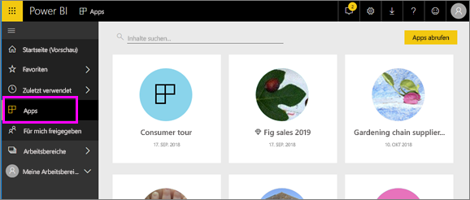

# Apps in Power BI
## Was ist eine Power BI-App?
Eine *App* ist ein Power BI-Inhaltstyp, bei dem zusammengehörige Dashboards und Berichte an einem Ort zusammengefasst werden. Eine App bündelt ein oder mehrere Dashboards sowie einen oder mehrere Berichte. Apps werden von *Power BI-Designern* erstellt und mit *Endbenutzern* wie Ihnen geteilt. 

Ihre Apps sind in der Inhaltsliste der **Apps** organisiert.

> [!NOTE]
> Für die Verwendung der Apps-Funktion ist eine Power BI Pro-Lizenz erforderlich. <!-- add link to how to figure out your license -->

## ***Designer*** und ***Endbenutzer*** von Apps
Je nach Rolle gibt es Designer, die Apps zur eigenen Nutzung oder zur Freigabe für Kollegen erstellen, und Endbenutzer, die von anderen Personen erstellte Apps erhalten und herunterladen. Dieser Artikel richtet sich an *Endbenutzer* von Apps.

## Vorteile von Apps
Apps lassen sich im Power BI-Dienst ([https://powerbi.com](https://powerbi.com)) und auf Ihrem mobilen Gerät einfach finden und installieren. Nach dem Installieren einer App müssen Sie sich nicht mehr die Namen der vielen verschiedenen Dashboards merken, da sie alle zusammen in einer App im Browser oder auf dem Mobilgerät gesammelt sind.

In Apps sehen Sie bei jeder Veröffentlichung von Updates durch den Ersteller die Änderungen. Der Ersteller steuert außerdem die Häufigkeit der planmäßigen Datenaktualisierung. Sie müssen sich also nicht darum kümmern, auf dem aktuellen Stand zu bleiben. 

<!-- add conceptual art -->
## Erhalten einer neuen App
Sie können Apps auf unterschiedliche Weise erhalten. 
- Der Ersteller kann die App automatisch in Ihrem Power BI-Konto installieren. Die neue App wird dann beim nächsten Öffnen von Power BI in der Inhaltsliste der **Apps** angezeigt. 
- Der Ersteller kann Ihnen eine E-Mail mit dem direkten Link zu einer App senden. Durch Klicken auf den Link wird die App in Power BI geöffnet.
- Sie können in AppSource nach Apps suchen. Dort werden alle Apps angezeigt, auf die Sie Zugriff haben. AppSource enthält Apps, die von Berichts-Designern sowohl innerhalb als auch außerhalb Ihres Unternehmens veröffentlicht wurden. So finden sich in AppSource beispielsweise Apps für Dienste, die Sie bereits verwenden, wie etwa Google Analytics, GitHub oder Microsoft Dynamics. 
- Wenn Sie Power BI auf Ihrem mobilen Gerät nutzen, können Sie eine App nur über einen direkten Link und nicht über AppSource installieren. Wenn der Ersteller der App diese automatisch installieren lässt, wird sie in der Liste der Apps angezeigt.

## Nächster Schritt
* [Open and interact with an app (Öffnen einer App und Interagieren mit einer App)](end-user-app-view.md)

