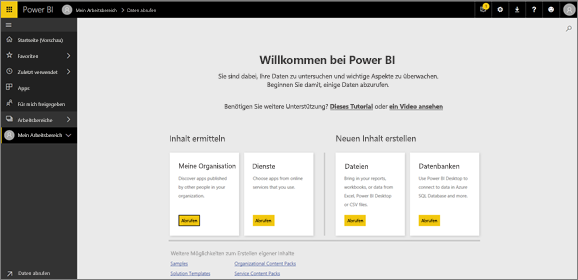
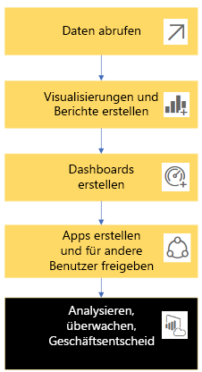
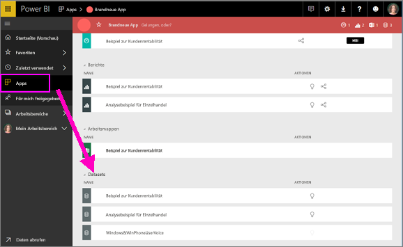
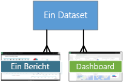
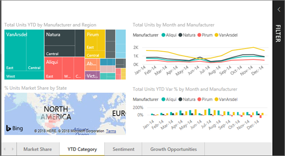
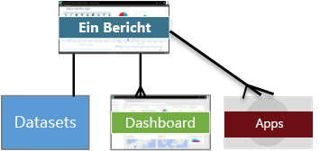
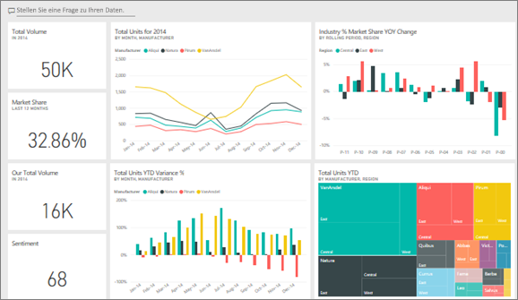
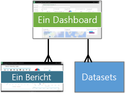
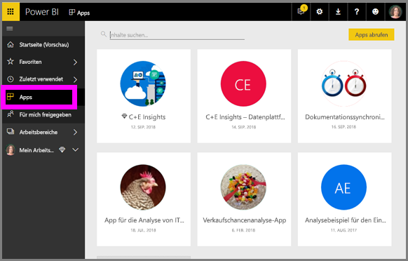
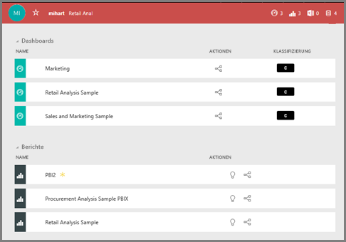

# Grundkonzepte für ***Benutzer*** des Power BI-Diensts

## *Benutzer* und *Designer* von Power BI
In diesem Artikel wird davon ausgegangen, dass Sie bereits den Übersichtsartikel [Was ist Power BI?](../power-bi-overview.md) gelesen haben und sich als ***Benutzer*** von Power BI sehen. Benutzer erhalten Power BI-Inhalte wie Dashboards und Berichte von Kollegen. Benutzer nutzen den Power BI-Dienst, also die Website-basierte Version von Power BI.

Bestimmt haben Sie schon von „Power BI Desktop“ oder einfach „Desktop“ gehört. Dies ist ein eigenständiges Tool, das die *Designer* verwenden, die Dashboards und Berichte erstellen und für Sie freigeben. Es ist wichtig zu wissen, dass es auch andere Power BI-Tools gibt. Als Benutzer arbeiten Sie aber nur mit dem Power BI-Dienst. Dieser Artikel bezieht sich nur auf den Power BI-Dienst.

## Terminologie und Konzepte
Dieser Artikel ist kein visueller Rundgang durch Power BI und auch kein praktisches Tutorial. Stattdessen ist es ein Übersichtsartikel, der Sie mit der Terminologie und den Konzepten von Power BI vertraut machen soll. Er soll Ihnen sozusagen den Fachjargon und das Gelände zeigen. Einen Rundgang durch den Power BI-Dienst und dessen Navigation können Sie in diesem [Schnellstart](end-user-experience.md) machen.

## Power BI-Dienst zum ersten Mal öffnen
Die meisten Power BI-Benutzer nutzen den Power BI-Dienst, da 1) ihr Unternehmen Lizenzen kauft und 2) ein Administrator diese Lizenzen Mitarbeitern wie Ihnen zuweist.

Öffnen Sie als Erstes einen Browser, und geben Sie **app.powerbi.com** ein. Beim ersten Öffnen sieht der Power BI-Dienst etwa wie folgt aus.

Wenn Sie Power BI verwenden, werden Sie personalisieren, was Ihnen jedes Mal beim Öffnen der Website angezeigt wird.  Manchen ist es zum Beispiel lieber, wenn sich Power BI mit der Startseite öffnet, während Andere lieber zuerst ein bevorzugtes Dashboard sehen möchten. Keine Sorge, wir erklären Ihnen, wie das geht.
- [Home preview (Vorschau der Startseite)](https://powerbi.microsoft.com/blog/introducing-power-bi-home-and-global-search)    
- [Inhalt als **ausgewählt** festlegen](end-user-featured.md)

Aber bevor wir fortfahren, wollen wir uns zuerst die Bausteine ansehen, aus denen der Power BI-Dienst besteht.

## Power BI-***Inhalt***
### Einführung in die Bausteine
Für Power BI-Benutzer gibt es 5 Bausteine: ***Visualisierungen***, ***Dashboards***, ***Berichte***, ***Apps*** und ***Datasets***. Diese werden manchmal als *Power BI*-***Inhalt*** bezeichnet. Und *Inhalt* ist in ***Arbeitsbereichen*** vorhanden. Ein typischer Workflow umfasst alle diese Bausteine:  Ein Power BI-*Designer* (gelb im folgenden Diagramm) sammelt Daten aus *Datasets*, bringt sie für die Analyse in Power BI, erstellt *Berichte* voller *Visualisierungen*, die interessante Fakten und Erkenntnisse hervorheben, heftet Visualisierungen aus Berichten an ein Dashboard an und teilt die Berichte und Dashboards mit *Benutzern* wie Ihnen (schwarz im folgenden Diagramm) in Form von *Apps* oder anderen Arten von freigegebenen Inhalten.

Das ist das Grundlegende.
*  Eine ***Visualisierung*** (oder ein *Visual*) ist eine Art von Diagramm, das von einem Power BI-*Designer* mithilfe der Daten in *Berichten* und *Datasets* erstellt wurde. In der Regel erstellen *Designer* die Visuals in Power BI Desktop.

    Weitere Informationen finden Sie unter [Visualisierungen für Power BI-*Benutzer*](end-user-visualizations.md).

*  Ein *Dataset* ist ein Container mit Daten. Dies kann zum Beispiel eine Excel-Datei der Weltgesundheitsorganisation, eine unternehmenseigene Kundendatenbank oder eine Salesforce-Datei sein.  

*  Ein *Dashboard* ist eine einzelne Anzeige mit interaktiven Visuals, Text und Grafiken. Ein Dashboard sammelt Ihre wichtigsten Metriken in einer Anzeige, um eine Geschichte zu erzählen oder eine Frage zu beantworten. Der Dashboardinhalt stammt aus einem oder mehreren Berichten und aus einem oder mehreren Datasets.

    Weitere Informationen finden Sie unter [Dashboards im Power BI-*Dienst*](end-user-dashboards.md).

*  Ein *Bericht* besteht aus einer oder mehreren Seiten mit interaktiven visuellen Elementen, Text und Grafiken, die gemeinsam einen Bericht bilden. Ein Bericht basiert auf einem einzelnen Dataset. Berichtsseiten sind oft so organisiert, dass jede ein zentrales Interessengebiet anspricht oder eine einzelne Frage beantwortet.

    Weitere Informationen finden Sie unter [Berichte in Power BI-*Benutzer*](end-user-reports.md).

*  Mit einer *App* können *Designer* zusammengehörige Dashboards und Berichte bündeln und zusammen freigeben. *Benutzer* erhalten einige Apps automatisch, können aber nach weiteren Apps suchen, die Kollegen oder die Community erstellt haben. Zum Beispiel bieten externe Dienste wie Google Analytics und Microsoft Dynamics CRM, die Sie möglicherweise bereits verwenden, Power BI-Apps an.

Wenn Sie sich als neuer Benutzer zum ersten Mal in Power BI einloggen, verfügen Sie jedoch noch nicht über Dashboards, Apps oder Berichte.
_______________________________________________________

## Datasets
Ein *Dataset* ist eine Sammlung von Daten, die *Designer* importieren oder zu denen sie eine Verbindung herstellen und dann damit Berichte und Dashboards erstellen. Als Benutzer werden Sie nicht direkt mit Datasets zu tun haben, aber es kann dennoch hilfreich sein zu wissen, welche Rolle sie in einem größeren Zusammenhang spielen.  

Jedes Dataset stellt eine einzelne Datenquelle dar, z.B. eine Excel-Arbeitsmappe auf OneDrive oder ein lokales tabellarisches SSAS-Dataset oder ein Salesforce-Dataset. Es werden viele verschiedene Datenquellen unterstützt.

Wenn ein Designer eine App für Sie freigegeben hat, können Sie sehen, welche Datasets in der App enthalten sind.

**EIN** Dataset...

* kann immer wieder verwendet werden
* kann in vielen verschiedenen Berichten verwendet werden
* Visualisierungen dieses einen Datasets können auf vielen verschiedenen Dashboards angezeigt werden

  

Darüber hinaus können Datasets aus anderen Arbeitsbereichen verwendet werden, um Inhalte (Berichte, Dashboards) in Ihrem Arbeitsbereich zu erstellen. Diese Datasets werden mit dem Symbol für referenzierte Datasets angezeigt:

Weiter geht es mit dem nächsten Baustein: Visualisierungen.
__________________________________________________________

## Visualisierungen
Visualisierungen (auch als Visuals bezeichnet) zeigen Erkenntnisse an, die in den Daten ermittelt wurden. Visualisierungen erleichtern das Interpretieren der Erkenntnis, da Ihr Gehirn ein Bild schneller verstehen kann als beispielsweise eine Tabelle mit Zahlen.

Einige der Visualisierungen, die Ihnen in Power BI begegnen werden, sind Wasserfalldiagramme, Bänderdiagramme, Treemaps, Kreisdiagramme, Trichterdiagramme, Karten, Punkt- und Blasendiagramme sowie Messgerätdiagramme. Hier finden Sie eine vollständige Liste der [Visualisierungstypen in Power BI](../power-bi-visualization-types-for-reports-and-q-and-a.md).

   

Visualisierungen werden auch von der Community zur Verfügung gestellt und heißen dann *benutzerdefinierte Visuals*. Wenn Sie einen Bericht mit einem Visual erhalten und dieses nicht erkennen, handelt es sich wahrscheinlich um ein benutzerdefiniertes Visual. Wenn Sie Hilfe beim Interpretieren des benutzerdefinierten visuellen Elements benötigen, können Sie <!--[look up the name of the report or dashboard *designer*](end-user-owner.md)-->den Namen des *Designers* des Berichts oder Dashboards suchen und ihn oder sie kontaktieren.

**EINE** Visualisierung in einem Bericht...

* kann mit Kopieren/Einfügen immer wieder im selben Bericht verwendet werden
* kann auf vielen verschiedenen Dashboards verwendet werden
__________________________________________________
## Berichte
Ein Power BI-Bericht besteht aus einer oder mehreren Seiten mit Visualisierungen, Grafiken und Text. Alle Visualisierungen in einem Bericht stammen aus einem einzelnen Dataset. *Designer* geben Berichte für *Benutzer* frei, die [mit den Berichten in der *Leseansicht* interagieren](end-user-reading-view.md).

**EIN** Bericht...

* kann mehreren Dashboards zugeordnet werden (die von diesem Bericht angehefteten Kacheln können auf mehrere Dashboards angezeigt werden).
* wird mithilfe der Daten aus nur einem Dataset erstellt  
* kann Teil mehrerer Apps sein

  

________________________________________________

## Dashboards
Ein Dashboard stellt eine angepasste Ansicht einer Teilmenge des/der zugrunde liegenden Datasets dar. *Designer* erstellen Dashboards und geben sie für *Benutzer* frei – entweder einzeln oder als Teil einer App. Ein Dashboard ist ein einzelner Zeichenbereich, der *Kacheln*, Grafiken und Text enthält.

  

Eine Kachel ist ein Rendering eines visuellen Elements, das ein *Designer* zum Beispiel aus einem Report an ein Dashboard *anheftet*.  Jede angeheftete Kachel zeigt eine [Visualisierung](end-user-visualizations.md) an, die aus einem Dataset erstellt und an dieses Dashboard angeheftet wurde. Eine Kachel kann auch eine komplette Berichtsseite, Livestreamingdaten oder ein Video enthalten. Es gibt viele Möglichkeiten, wie *Designer* Kacheln zu Dashboards hinzufügen – zu viele, um sie in diesem Übersichtsthema zu behandeln. Weitere Informationen finden Sie unter [Dashboardkacheln in Power BI](end-user-tiles.md).

Von der Benutzerseite aus können Dashboards nicht bearbeitet werden. Sie können jedoch Kommentare hinzufügen, verwandte Daten anzeigen, Dashboards als Favorit speichern, sie abonnieren und vieles mehr.

Was sind die Funktionen von Dashboards?  Hier nur einige davon:

* Sie können auf einen Blick alle Informationen erkennen, die zum Treffen von Entscheidungen erforderlich sind.
* Sie können die wichtigsten unternehmensbezogenen Informationen überwachen.
* Sie können sicherstellen, dass sich alle Kollegen auf derselben Seite befinden und dabei dieselben Informationen anzeigen und verwenden.
* Sie können die Integrität eines Geschäfts, Produkts, Unternehmensbereichs oder einer Marketingkampagne usw. überwachen.
* Sie können eine personalisierte Ansicht eines umfangreicheren Dashboards erstellen, das alle für Sie erforderlichen Metriken enthält.

**EIN** Dashboard...

* kann Visualisierungen von verschiedenen Datasets anzeigen.
* kann Visualisierungen von verschiedenen Berichten anzeigen.
* kann Visualisierungen anzeigen, die aus anderen Tools (z.B. Excel) angeheftet wurden.

  

________________________________________________

## Apps
Diese Sammlungen von Dashboards und Berichten organisieren verwandte Inhalte in einem einzigen Paket. Power BI-*Designer* erstellen sie und geben sie für Einzelpersonen, Gruppen, eine ganze Organisation oder öffentlich frei. Als Benutzer können Sie sich darauf verlassen, dass Sie und Ihre Kollegen mit denselben Daten arbeiten – einer einzigen vertrauenswürdigen Version der Wahrheit.

Apps lassen sich im Power BI-Dienst (https://powerbi.com) und auf Ihrem Mobilgerät einfach finden und installieren. Nach dem Installieren einer App müssen Sie sich nicht mehr die Namen der vielen verschiedenen Dashboards merken, da sie alle zusammen in einer App im Browser oder auf dem Mobilgerät gesammelt sind.

Diese App verfügt über drei verwandte Dashboards und drei verwandte Berichte, die zusammen eine App bilden.

In Apps sehen Sie bei jeder Veröffentlichung von Updates durch den Ersteller die Änderungen. Der Ersteller steuert außerdem die Häufigkeit der planmäßigen Datenaktualisierung. Sie müssen sich also nicht darum kümmern, auf dem aktuellen Stand zu bleiben.

Sie können Apps auf unterschiedliche Weise erhalten. Der Designer der App kann die App automatisch in Ihrem Power BI-Konto installieren oder Ihnen einen direkten Link zur App senden, oder Sie können die App in Microsoft AppSource suchen. Dort werden alle Apps angezeigt, auf die Sie Zugriff haben. In Power BI auf Ihrem Mobilgerät können Sie Apps nur über einen Direktlink und nicht aus AppSource installieren. Wenn der Designer der App diese automatisch installiert, wird sie in der Liste der Apps angezeigt.

Sobald die App installiert ist, können Sie sie einfach aus der Liste der Apps auswählen und angeben, welches Dashboard oder welcher Bericht zuerst geöffnet und erkundet werden soll.   

Hoffentlich hat Ihnen dieser Bericht einen guten Einblick in die Bausteine gegeben, aus denen der Power BI-Dienst für Benutzer besteht.

## Nächste Schritte
- Das [Glossar](end-user-glossary.md) überprüfen und Lesezeichen setzen    
- [Schnellstart: Sich mit dem Power BI-Dienst vertraut machen](end-user-experience.md)
- Die Übersicht [Power BI für Verbraucher](end-user-consumer.md) lesen    
- Ein Video ansehen, in dem Will einen Überblick über den Power BI-Dienst gibt und die grundlegenden Konzepte erklärt <iframe width="560" height="315" src="https://www.youtube.com/embed/B2vd4MQrz4M" frameborder="0" allowfullscreen></iframe>
