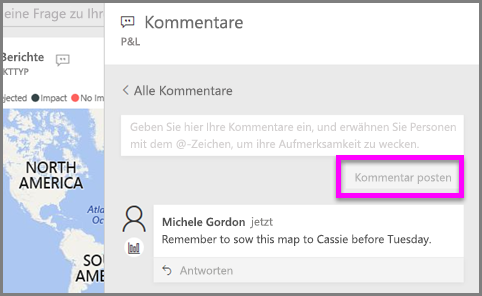
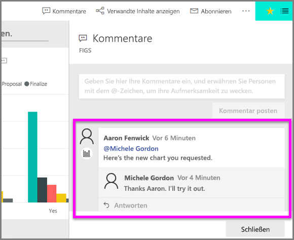

# Hinzufügen von Kommentaren zu einer Visualisierung
Fügen Sie einen persönlichen Kommentar hinzu, oder beginnen Sie mit Ihren Kollegen eine Konversation über eine Visualisierung. Die Funktion **Kommentar** ist nur eine der Möglichkeiten, wie ein *Consumer* mit einer Visualisierung interagieren kann. 

## Verwenden der Kommentarfunktion

1. Zeigen Sie auf die Visualisierung, und wählen Sie die Auslassungspunkte (...) aus.    
2. Wählen Sie in der Dropdownliste **Kommentar hinzufügen** aus.

      

3.  Geben Sie Ihren Kommentar ein, und wählen Sie **Kommentar posten** aus. Dies ist ein Kommentar an mich selbst, einschließlich Rechtschreibfehlern.

      

4. Hier ist eine Konversation mit dem *Designer* der Visualisierung zu sehen. Er benutzt das @-Symbol, um sicherzustellen, dass ich den Kommentar sehe. Ich weiß, dass dieser Kommentar für mich ist. Wenn ich dieses App-Dashboard in Power BI öffne, wähle ich in der Kopfzeile **Kommentare** aus. Im Bereich **Kommentare** wird unsere Konversation angezeigt. 

      

5. Klicken Sie auf **Schließen**, um zum Dashboard oder Bericht zurückzukehren.

## Nächste Schritte
Zurück zu [Visualisierungen für Consumer](end-user-visualizations.md)    
<!--[Select a visualization to open a report](end-user-open-report.md)-->