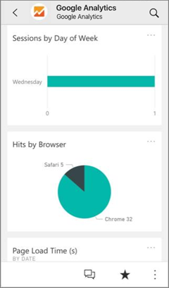
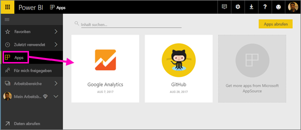
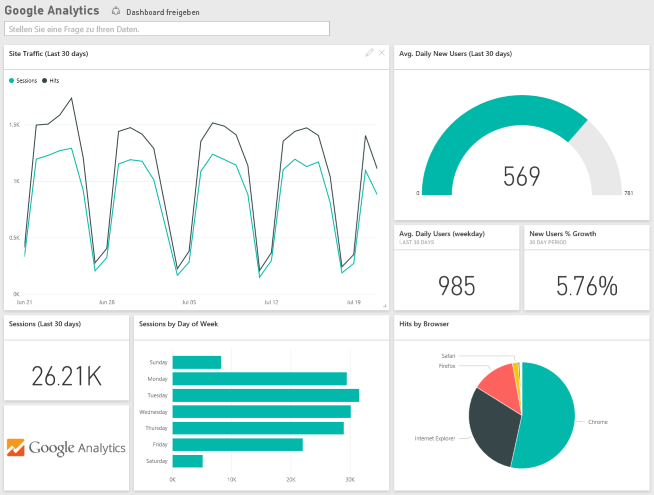
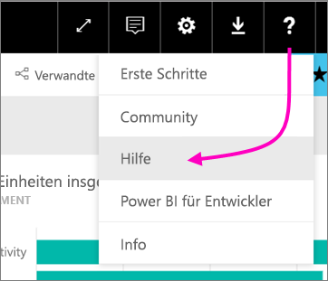

# Herstellung einer Verbindung mit den verwendeten Diensten mithilfe von Power BI

Nachdem Sie die App installiert haben, können Sie das Dashboard und die Berichte im Power BI-Dienst ([https://powerbi.com](https://powerbi.com)) und in den mobilen Power BI-Apps anzeigen. 

## Erste Schritte
[!INCLUDE [powerbi-service-apps-get-more-apps](.././includes/powerbi-service-apps-get-more-apps.md)]

## Anzeigen des Dashboards und der Berichte
Wenn der Importvorgang abgeschlossen ist, wird die neue App auf der Seite „Apps“ angezeigt.

1. Wählen Sie im linken Navigationsbereich **Apps** und dann die App aus.
   
     
2. Sie können eine Frage im Bereich für Fragen und Antworten stellen oder auf eine Kachel klicken, um den zugrunde liegenden Bericht zu öffnen. 
   
    
   
    Sie können die Daten im Bericht filtern und hervorheben, jedoch keine Änderungen speichern.

## Inhalt
Nachdem die Verbindung mit einem Dienst hergestellt wurde, wird die neu erstellte App mit einem Dashboard, Berichten und einem Dataset angezeigt. Die Daten aus dem Dienst beziehen sich auf ein bestimmtes Szenario und enthalten möglicherweise nicht alle Informationen aus dem Dienst. Die Daten werden automatisch einmal täglich aktualisiert. Sie können den Zeitplan für die Aktualisierung steuern, indem Sie das Dataset auswählen.

Weitere Informationen zum Herstellen einer Verbindung mit bestimmten Diensten finden Sie unter den jeweiligen Hilfeseiten.

## Problembehandlung
**Leere Kacheln**  
Möglicherweise wird eine Reihe leerer Kacheln auf dem Dashboard angezeigt, während Power BI zunächst die Verbindung mit dem Dienst herstellt. Falls nach zwei Stunden immer noch ein leeres Dashboard angezeigt wird, ist die Verbindung wahrscheinlich fehlgeschlagen. Wenn keine Fehlermeldung mit Informationen zum Beheben des Problems angezeigt wurde, senden Sie bitte ein Support-Ticket.

* Wählen Sie das Fragezeichen (**?**) in der rechten oberen Ecke und dann **Hilfe** aus.
  
    

**Fehlende Informationen**  
Das Dashboard und die Berichte enthalten Inhalte aus dem Dienst mit Fokus auf einem bestimmten Szenario und nicht alle Informationen aus dem Dienst. Wenn Sie eine bestimmte Metrik im Inhaltspaket nicht sehen, fügen Sie bitte auf der Seite [Power BI-Support](https://support.powerbi.com/forums/265200-power-bi) einen Vorschlag hinzu.

## Vorschlagen von Diensten
Verwenden Sie einen Dienst, den Sie für eine Power BI-App vorschlagen möchten? Gehen Sie auf die Seite [Power BI-Support](https://support.powerbi.com/forums/265200-power-bi), und lassen Sie es uns wissen.

Verfügen Sie über einen Dienst, für den Sie eine App erstellen möchten? [Reichen Sie Ihren Antrag ein](https://azure.microsoft.com/marketplace/programs/certified/apply/), und wählen Sie für den Einstieg „Power BI-Inhaltspaket veröffentlichen“.

## Nächste Schritte
* [Was sind Apps in Power BI?](../service-install-use-apps.md)
* [Abrufen von Daten in Power BI](../service-get-data.md)
* Weitere Fragen? [Stellen Sie Ihre Frage in der Power BI-Community.](http://community.powerbi.com/)

