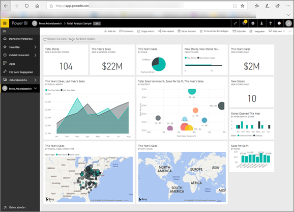

<!-- fold this topic into existing topics -->
# Power BI für Verbraucher
Die Art und Weise, wie Sie mit Power BI interagieren, hängt von Ihrer Position ab. Wenn Sie *Endbenutzer* oder *Kunde* sind, empfangen Sie Dashboards, Berichte und Apps von Kollegen. Sie arbeiten im ***Power BI-Dienst***, prüfen diese Inhalte und interagieren mit diesen, um Entscheidungen für Ihr Unternehmen zu treffen.

Wenn Sie sich noch nicht mit Power BI auskennen, sollten Sie zunächst die [Übersicht zu Power BI](../power-bi-overview.md) lesen. Darin erfahren Sie mehr zu den einzelnen Tools, aus denen Power BI zusammengesetzt ist.

Wenn Sie ein Kunde sind, haben Sie nicht auf alle Funktionen von Power BI Zugriff. Dies stellt allerdings kein Problem dar, da Sie in Ihrer Position schließlich weder Dashboards noch Berichte erstellen müssen. Sie müssen Power BI nur zu Analyse- und Überwachungszwecken nutzen, verschiedene Optionen testen und Entscheidungen treffen.

Wenn Sie sich die Artikel für Kunden durchlesen, lernen Sie die entsprechende Terminologie kennen, erhalten einen Überblick über den Power BI-Dienst, und erfahren, wie Sie zu einzelnen Inhalten navigieren und anschließend mit diesen interagieren können.  Fangen wir an.

## Nächste Schritte

[Terminologie und Konzepte für Power BI-*Kunden*](end-user-basic-concepts.md)

<!-- [Get started guide for *consumers*] -->
[Erste Schritte mit dem Power BI-Dienst](../service-get-started.md)

