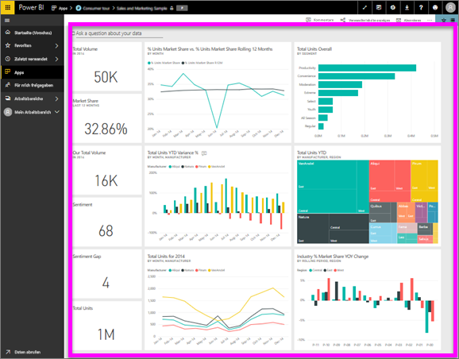

# Anzeigen eines Dashboards
Power BI-Benutzer verbringen viel Zeit damit, Dashboards anzuzeigen. Dashboards sind darauf ausgelegt, spezifische Informationen aus den zugrunde liegenden Berichten und Datasets hervorzuheben. Und Power BI-Benutzer verwenden diese Informationen zum Nachverfolgen, Überwachen, Beantworten von Fragen, zu Testzwecken und mehr – um datenbasierte Geschäftsentscheidungen zu treffen.

Power BI Pro ist sowohl für Freigeben eines Dashboards als auch Anzeigen eines freigegebenen Dashboards erforderlich.

## Öffnen eines Dashboards
Dashboards lassen sich von zahlreichen Orten im Power BI-Dienst öffnen.  Das wichtigste ist, herauszufinden, aus welchen Inhalten ein Dashboard besteht (im Gegensatz zu einem Bericht z. B.). Wenn Sie ein Dashboard identifiziert haben, ist es einfach, es zu öffnen – Sie müssen nur klicken, und schon füllt das Dashboard Ihren Power BI-Zeichenbereich aus.

|              |         |
|------------|--------------------------------|
|      |Die einfachste Möglichkeit zum Identifizieren eines Dashboards ist es, danach zu suchen.  Dashboard-Symbol. Wenn Sie Inhalt mit diesem Symbol suchen, wählen Sie es aus, um das Dashboard zu öffnen. |
|                    |          |

 

<!--insert aGIF-->

Sie können Dashboards in allen in der linken Navigationsleiste vorhandenen Containern finden. 
- **Start** (Vorschau)
- **Favoriten** – falls Sie [ein Dashboard als Favorit festgelegt haben](end-user-favorite.md).
- **Zuletzt verwendet** – falls Sie zuletzt ein Dashboard besucht haben.
- **Apps** – die meisten Apps enthalten sowohl Dashboards als auch Berichte.
- **Für mich freigegeben** – wenn ein Kollege [ein Dashboard für Sie freigegeben hat](end-user-shared-with-me.md).
- **Mein Arbeitsbereich** – wenn Sie eins der [Power BI-Beispiele](../sample-datasets.md) heruntergeladen haben.

## Nächste Schritte
* Machen Sie sich mit Dashboards vertraut, indem Sie sich eine Tour durch eines unserer [Beispiel-Dashboards](../sample-tutorial-connect-to-the-samples.md) ansehen.
* Informieren Sie sich über [Dashboardkacheln](end-user-tiles.md), und erfahren Sie, wie Sie damit interagieren.
* Sie möchten eine bestimmte Dashboardkachel im Auge behalten und eine E-Mail erhalten, wenn ein bestimmter Grenzwert erreicht wird? [Erstellen Sie Datenwarnungen auf Kacheln](end-user-alerts.md).
* Stellen Sie Fragen zu Dashboards. Mit [Power BI Q&A](end-user-q-and-a.md) können Sie Fragen zu Ihren Daten stellen und erhalten eine Antwort in Form einer Visualisierung. 