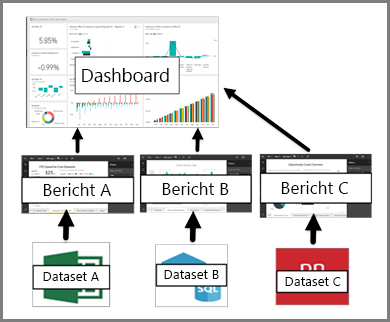

# Dashboard für Benutzer des Power BI-Diensts

Ein Power BI-***Dashboard*** ist eine einzelne Seite (häufig als Zeichenbereich bezeichnet), auf der mithilfe von Visualisierungen eine Geschichte erzählt wird. Wegen der Beschränkung auf eine Seite erkennen Sie ein gut gestaltetes Dashboard daran, dass die Geschichte auf ihre Kernaussagen verdichtet ist.

Die Visualisierungen auf einem Dashboard werden als *Kacheln* bezeichnet und werden von den Erstellern der Berichten an ein Dashboard *angeheftet*. Durch Auswählen einer Kachel gelangen Sie zur Berichtsseite, auf der die Visualisierung erstellt wurde. Wenn Sie mit Power BI noch nicht vertraut sind, lesen Sie den Artikel [Grundkonzepte des Power BI-Diensts](end-user-basic-concepts.md).

> [!NOTE]
> Sie können Dashboards auf [mobilen Geräten anzeigen und freigeben](mobile/mobile-apps-view-dashboard.md).
>
> Für die Anzeige eines Dashboards, das für Sie freigegeben wurde, ist Power BI Pro erforderlich.
> 

Die Visualisierungen eines Dashboards stammen aus Berichten. Jeder Bericht basiert auf einem Dataset. Sie können sich ein Dashboard als Fenster zu den zugrunde liegenden Berichten und Datasets vorstellen. Wenn Sie eine Visualisierung auswählen, gelangen Sie zu dem Bericht (und damit dem Dataset), mit dem sie erstellt wurde.

## Vorteile von Dashboards
Mit Dashboards können Sie die Entwicklung Ihres Geschäfts verfolgen, entscheidenden Fragen nachgehen und die wichtigsten Metriken immer im Auge behalten. Jede Visualisierung eines Dashboards kann auf einem oder vielen Datasets, auf einem einzelnen Bericht oder zahllosen Berichten basieren. Ein Dashboard fasst lokale und Clouddaten zusammen und bietet eine konsolidierte Ansicht – unabhängig vom Speicherort der Daten.

Ein Dashboard sieht nicht nur gut aus, es ist ausgesprochen interaktiv, weitgehend anpassbar und immer aktuell, wenn sich die zugrunde liegenden Daten ändern.

## Dashboards und Berichte für Power BI-***Kunden***
Als Zeichenbereiche, die ebenfalls Visualisierungen enthalten, werden Berichte gerne mit Dashboards verwechselt. Es gibt aber einige wichtige Unterschiede für Power BI-*Kunden*.

| **Eigenschaften** | **Dashboards** | **Berichte** |
| --- | --- | --- |
| Pages |Eine Seite |Eine oder mehrere Seiten |
| Datenquellen |Ein oder mehrere Berichte und ein oder mehrere Datasets pro Dashboard |Ein Dataset pro Bericht |
| Abonnieren |Es können Dashboard-E-Mails abonniert werden. |Es können E-Mails der Berichtsseite abonniert werden. |
| Filter |Keine Filter, keine Slices |Viele Filter, Hervorhebungen und Slices |
| Benachrichtigungen festlegen |Benachrichtigungen können erstellt werden. Sie erhalten eine E-Mail, wenn bestimmte Bedingungen erfüllt sind. |Nein |
| Empfohlen |Ein Dashboard kann als „ausgewähltes“ Dashboard festgelegt werden. |Ein ausgewählter Bericht kann nicht erstellt werden. |
| Abfragen in natürlicher Sprache |Über das Dashboard verfügbar |Über Berichte nicht verfügbar |
| Zugrunde liegende Dataset-Tabellen und Felder sichtbar |Nein. Exportieren von Daten, aber Tabellen und Felder im Dashboard nicht sichtbar |Ja. Tabellen, Felder und Werte des Datasets sichtbar |

## Ersteller und Anwender von Dashboards
Als ein Power BI-***Kunden*** erhalten Sie Dashboards von *Erstellern*. In diesen Themen erhalten Sie weitere Informationen zu Dashboards:

* [Anzeigen eines Dashboards](end-user-dashboard-open.md)
* Informieren Sie sich über [Dashboardkacheln](end-user-tiles.md), und erfahren Sie, wie Sie damit interagieren.
* Sie möchten eine bestimmte Dashboardkachel im Auge behalten und eine E-Mail erhalten, wenn ein bestimmter Grenzwert erreicht wird? [Erstellen Sie Datenwarnungen auf Kacheln](end-user-alerts.md).
* Stellen Sie Fragen zu Dashboards. Mit [Power BI Q&A](end-user-q-and-a.md) können Sie Fragen zu Ihren Daten stellen und erhalten eine Antwort in Form einer Visualisierung.

> [!TIP]
> Über das Inhaltsverzeichnis finden Sie bei Bedarf weitere Antworten.
> 

## Nächste Schritte
[Anzeigen eines Dashboards](end-user-dashboard-open.md) 