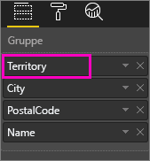
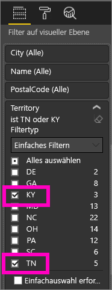
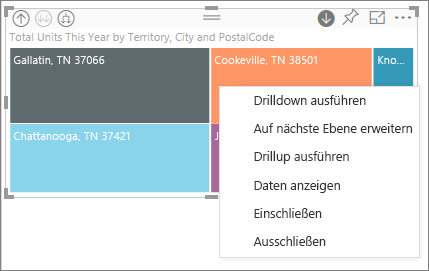
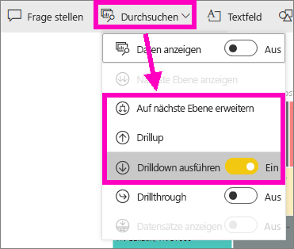
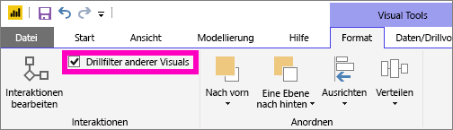
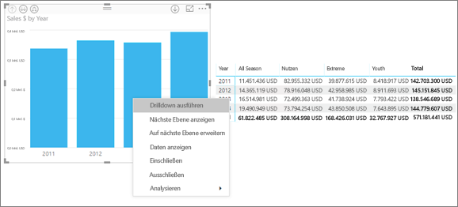
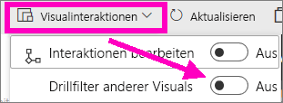
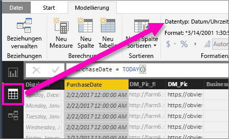

# Drillmodus in einer Visualisierung in Power BI

## Ein Drillvorgang setzt eine Hierarchie voraus
Wenn eine Visualisierung eine Hierarchie aufweist, können Sie einen Drilldown ausführen, um weitere Details einzublenden. Sie verfügen beispielsweise über eine Visualisierung eines Olympia-Medaillenspiegels, hierarchisch geordnet nach Sportart, Disziplin und Ereignis. Standardmäßig würde die Visualisierung die Anzahl der Medaillen nach Sportart anzeigen – Gymnastik, Skisport, Wassersport usw. Da jedoch eine Hierarchie vorhanden ist, wird durch die Auswahl eines Visualisierungselements (etwa eines Balkens, einer Linie oder einer Blase) ein zunehmend detaillierteres Bild angezeigt werden. Sie würden beispielsweise das Element **Wassersport** auswählen, um Daten für Schwimmsport, Kunstspringen und Wasserball anzuzeigen.  Sie wählen das Element **Kunstspringen** aus, um Details zu Sprungbrett, Sprungturm und Synchronsprung-Veranstaltungen anzuzeigen.

Sie können Hierarchien Berichten hinzufügen, deren Eigentümer Sie sind, jedoch nicht Berichten, die für Sie freigegeben wurden.
Sie sind nicht sicher, welche Power BI-Visualisierungen eine Hierarchie enthalten?  Zeigen Sie mit dem Mauszeiger auf eine Visualisierung. Wenn diese Drilldown-Steuerelemente in den oberen Ecken sichtbar sind, weist die Visualisierung eine Hierarchie auf.

   

Datumsangaben sind ein eindeutiger Hierarchietyp. Wenn Sie einer Visualisierung ein Datumsfeld hinzufügen, wird in Power BI automatisch eine Zeithierarchie hinzugefügt, die Jahr, Quartal, Monat und Tag enthält. Weitere Informationen finden Sie unter [Visuelle Hierarchien und Drilldown](../guided-learning/visualizations.yml?tutorial-step=18), oder sehen Sie sich das Video unten an.

  <iframe width="560" height="315" src="https://www.youtube.com/embed/MNAaHw4PxzE?list=PL1N57mwBHtN0JFoKSR0n-tBkUJHeMP2cP" frameborder="0" allowfullscreen></iframe>

> [!NOTE]
> Informationen zum Erstellen von Hierarchien mit Power BI Desktop erhalten Sie im Video zum [Erstellen und Hinzufügen von Hierarchien](https://youtu.be/q8WDUAiTGeU).
> 

## Voraussetzungen

1. Ein Drillvorgang erfordert im Power BI-Dienst und in Power BI Desktop eine Visualisierung mit einer Hierarchie. 
   
2. [Öffnen Sie hierfür das Retail Analysis Sample](../sample-datasets.md), und erstellen Sie eine Treemap, in der **Total Units This Year** (Werte) nach **Territory**, **City**, **PostalCode** und **Name** (Gruppe) betrachtet werden.  Die Treemap weist eine Hierarchie aus Gebiet, Stadt, Postleitzahl und Ortsname auf. Jedes Gebiet umfasst eine oder mehrere Städte, jede Stadt weist eine oder mehrere Postleitzahlen auf usw. In der Standardeinstellung werden in der Visualisierung nur die Gebietsdaten angezeigt, da *Territory* (Gebiet) in der Liste als erster Eintrag aufgeführt wird.
   
   

2. Der Zusammenhang zwischen den verschiedenen Drillsymbolen kann schwer zu verstehen sein. Filtern Sie deshalb die Treemap, sodass nur zwei der kleineren Gebiete angezeigt werden: **KY** und **TN**. Wählen Sie die Treemap aus, und erweitern Sie unter **Filter auf visueller Ebene** **Territory**, und wählen Sie **KY** und **TN** aus.

        

   Jetzt werden nur diese beiden Gebiete in der Treemap angezeigt.

   

## Drei Möglichkeiten, auf das Drill-Feature zuzugreifen
Es stehen mehrere Optionen zur Verfügung, um auf die Features „Drilldown“, „Drillup“ und „Erweitern“ für Visualisierungen mit Hierarchien zuzugreifen. In diesem Artikel wird die erste Option erklärt. Sobald Sie ein grundlegendes Verständnis von Drilldown und Erweitern haben, erreichen Sie mit allen drei Methoden das gleiche Ergebnis, sodass Sie sich für das Feature entscheiden können, das für Sie am besten geeignet ist.

- Zeigen Sie mit dem Mauszeiger auf eine Visualisierung. Dann werden die Symbole angezeigt, und Sie können sie verwenden.  

    

- Klicken Sie mit der rechten Maustaste auf eine Visualisierung. Dann wird das Menü angezeigt, und Sie können die Optionen verwenden.
    
    

- Klicken Sie in der Power BI-Menüleiste auf **Durchsuchen**.

   

## Drillvorgänge
### Drilldown
Es gibt mehrere Möglichkeiten, einen Drilldown für Ihre Visualisierungen durchzuführen. Durch einen ***Drilldown*** erreichen Sie die nächstniedrigere Ebene einer Hierarchie. Wenn Sie sich also gerade die Ebene **Territory** ansehen, können Sie einen Drilldown auf die Ebene der Stadt, dann der Postleitzahl und dann des Namens durchführen. Durch jeden Schritt in diesem Vorgang erhalten Sie neue Informationen.

### Erweitern

Durch ***Auf nächste Ebene erweitern*** wird der aktuellen Ansicht eine weitere Hierarchieebene hinzugefügt. Wenn Sie sich gerade die Ebene **Territory** ansehen, können Sie Ihrer Treemap Informationen zur Stadt, der Postleitzahl und dem Namen hinzufügen. Durch jeden Schritt in diesem Vorgang werden die gleichen Informationen und eine Ebene mit neuen Informationen angezeigt.

Außerdem können Sie Drilldown- und Erweiterungsvorgänge entweder für ein Feld oder für alle Felder gleichzeitig durchführen. 

## Drilldown für alle Felder gleichzeitig

1. Beginnen Sie auf der höchsten Ebene der Treemap, auf der Daten für KY und TN angezeigt werden. Erhöhen Sie die Breite Ihrer Treemap, indem Sie auf einen Ziehpunkt klicken und diesen nach rechts ziehen. 

     .

2. Um für ***alle Felder gleichzeitig*** einen Drilldown durchzuführen, wählen Sie den doppelten Pfeil in der linken oberen Ecke der Visualisierung aus . Ihre Treemap zeigt nun Stadtdaten für Kentucky und Tennessee an. 

    
   
5. Führen Sie noch einmal einen Drilldown auf die Hierarchieebene der Postleitzahl durch.

    

3. Um einen Drilldown bei der Sicherung durchzuführen, wählen Sie den Pfeil nach oben in der oberen linken Ecke der Visualisierung aus .

## Drilldown für jeweils ein Feld
Bei dieser Methode wird das Drilldownsymbol in der rechten oberen Ecke der Visualisierung verwendet. 

1. Wählen Sie das Drilldownsymbol aus, um es zu aktivieren . Jetzt können Sie einen ***Drilldown für ein Feld*** durchführen. 
   
   

   Wenn Drilldown nicht aktiviert ist, wird beim Auswählen eines visuellen Elements (z.B. eines Balkens, einer Blase oder eines Blatts) kein Drilldown durchgeführt. Stattdessen werden die anderen Diagramme auf der Berichtseite kreuzgefiltert.

2. Klicken Sie auf das *Blatt* für **TN**. Jetzt werden in Ihrer Treemap alle Städte in Tennessee angezeigt, in denen es ein Geschäft gibt. 

    

2. Jetzt können Sie entweder weiter einen Drilldown für Tennessee durchführen, oder Sie können einen Drilldown für eine bestimmte Stadt in Tennessee durchführen, oder Sie können die Hierarchie erweitern (weitere Informationen dazu im Abschnitt zum **gleichzeitigen Erweitern aller Felder** weiter unten). Führen Sie weiter einen Drilldown für ein Feld durch.  Klicken Sie auf **Knoxville, TN**. Ihre Treemap zeigt jetzt die Postleitzahl Ihres Geschäfts in Knoxville an. 

   

    Beachten Sie, dass sich der Titel ändert, wenn Sie einen Drilldown und anschließend einen Drillup ausführen.  

## Erweitern von einem Feld und von allen Feldern
Eine Treemap, die nur die Postleitzahl anzeigt, ist nicht nützlich.  Erweitern Sie also auf die nächste Ebene in der Hierarchie.  

1. Wählen Sie in der aktuellen Treemap das *Symbol für die nächste Ebene* . Ihre Treemap zeigt nun die folgenden zwei Ebenen Ihrer Hierarchie: die Postleitzahl und den Namen des Geschäfts. 

    

2. Klicken Sie auf den Drillup-Pfeil, bis Sie die zweite Ebene **Total units this year by territory and city** erreichen, um alle vier Datenebenen für Tennessee anzuzeigen. 

    

3. Achten Sie darauf, dass Drilldown immer noch aktiviert ist , und klicken Sie auf das *Symbol für die nächste Ebene* . Jetzt zeigt Ihre Treemap zusätzliche Informationen an. Es werden nicht nur die Stadt und der Staat angezeigt, sondern auch die Postleitzahl. 

    

4. Wählen Sie das Symbol *Auf nächste Ebene erweitern* erneut aus, um alle vier Hierarchieebenen der Informationen zu Tennessee auf Ihrer Treemap anzuzeigen. Zeigen Sie auf ein Blatt, um noch mehr Informationen anzuzeigen.

   

## Drillfilter anderer Visuals
Wenn Sie im Drillmodus arbeiten, ist es Ihre Entscheidung, wie sich Drilldown- und Erweiterungsvorgänge auf die anderen Visualisierungen auf Ihrer Seite auswirken. 

Standardmäßig filtern Drillvorgänge nicht andere Visuals in einem Bericht. Dieses Feature kann in Power BI Desktop und im Power BI-Dienst aktiviert werden. 

1. Klicken Sie in Power BI-Desktop auf die Registerkarte **Format**, und aktivieren Sie das Kontrollkästchen für **Drillfilter anderer Visuals**.

    

2. Wenn Sie jetzt einen Drilldown (bzw. Drillup- oder Erweiterungsvorgang) in einem Visual mit einer Hierarchie durchführen, werden dadurch die anderen Visuals auf der Seite gefiltert. 

    

    

> [!NOTE]
> Wenn Sie dieses Feature im Power BI-Dienst aktivieren möchten, klicken Sie in der Menüleiste oben auf **Visualinteraktionen > Drillfilter anderer Visuals**.
>
> 

## Grundlegendes zur Hierarchieachse und Hierarchiegruppe
Sie können sich die Hierarchieachse und -gruppe als die Mechanismen vorstellen, die Sie zum Erhöhen und Reduzieren der Granularität der anzuzeigenden Daten verwenden können. Alle Daten, die in Kategorien und Unterkategorien eingeteilt werden können, sind dafür qualifiziert, eine Hierarchie zu besitzen. Dies schließt natürlich Datums- und Uhrzeitangaben mit ein.

Sie können in Power BI Visualisierungen erstellen, die über eine Hierarchie verfügen. Wählen Sie dazu mindestens ein Datenfeld aus, das Sie entweder der Datenquelle **Achse** oder **Gruppe** zusammen mit den Daten hinzufügen, die Sie als Datenfelder unter **Werte** untersuchen möchten. Sobald *Drillmodussymbole* in der oberen linken und rechten Ecke Ihrer Visualisierung angezeigt werden, wissen Sie, dass Ihre Daten hierarchisch sind. 

Es ist ganz hilfreich, sich zwei Typen hierarchischer Daten vorzustellen:
- Datums- und Uhrzeitdaten: Wenn Sie über ein Datenfeld mit dem DateTime-Datentyp verfügen, besitzen Sie bereits hierarchische Daten. Power BI erstellt automatisch eine Hierarchie für Datenfelder, deren Werte in eine [DateTime](https://msdn.microsoft.com/library/system.datetime.aspx)-Struktur aufgelöst werden können. Sie müssen der **Achse** oder **Gruppe** jeweils nur ein DateTime-Feld hinzufügen
- Kategorische Daten: Wenn Ihre Daten von Sammlungen abstammen, die untergeordnete Sammlungen enthalten oder in einem anderen Fall über Datenzeilen verfügen, die gemeinsame Werte beinhalten, besitzen Sie hierarchische Daten.

Power BI ermöglicht eine Detailanzeige für eine oder alle Teilmengen. Sie können einen Drilldown durch Ihre Daten ausführen, um eine einzelne Teilmenge pro Ebene anzuzeigen, oder alle Teilmengen gleichzeitig auf jeder Ebene anzuzeigen. Sie können beispielsweise einen Drilldown für ein bestimmtes Jahr durchführen, oder Sie können alle Ergebnisse für jedes Jahr anzeigen, wenn Sie die Hierarchie abgehen. Sie können ebenso einen Drillup ausführen.

In den folgenden Abschnitten werden Drilldowns von der höchsten Ansicht, der mittleren Ansicht und der niedrigsten Ansicht beschrieben

### Hierarchische Datums- und Uhrzeitdaten
Befolgen Sie in diesem Beispiel das [Analysebeispiel für den Einzelhandel](../sample-datasets.md), und erstellen Sie eine Ansicht eines gestapelten Säulendiagramms, das die Angaben **Monat** (Achse) nach **TotalSales** (Gesamtverkäufe) (Werte) enthält.  

Obwohl das Datenfeld „Achse“ **Monat** ist, erstellt es noch immer die Kategorie **Jahr** unter **Achse**. Der Grund dafür ist, dass Power BI die vollständige DateTime-Struktur für alle gelesenen Werte bereitstellt. Auf der obersten Hierarchieebene werden Daten für das Jahr angezeigt.

Mit dem Drilldownmodus können Sie auf die Säule im Diagramm klicken und diese eine Ebene in der Hierarchie heruntersetzen. Es werden drei Säulen für die verfügbaren Daten der Quartale angezeigt. Wählen Sie aus den Symbolen links oben die Option **Expand all down one level of the hierarchy** (Alles eine Hierarchieebene nach unten erweitern) aus. Wiederholen Sie diesen Schritt, um zur niedrigsten Ebene der Hierarchie zu gelangen, die die Ergebnisse für jeden Monat zeigt.

Abgesehen von der Visualisierung können wir die Hierarchie sehen, die in den für jeden Bericht gerenderten Daten übernommen wird. Die folgende Tabelle werden die Ergebnisse von **Daten anzeigen** mit einem Drilldown von einem Monat oder allen Monaten in einem Bericht angezeigt. 

Beachten Sie, dass die Daten für Quartals- und Jahresberichte übereinstimmen. Nach dem Drilldown zur Detailebene, die für **Werte** festgelegt ist, können Sie jedoch sehen, wie der einzelne Bericht genauer wird und dass der Bericht „all months“ (alle Monate) über mehr Daten verfügt.

|Modus „Erweitern“|Jahr|Quartal|Monat|Tag|
| ---|:---:|:---:|:---:|---|
|Einfach|||||
|Alle|||||

### Hierarchische Kategoriedaten
Daten, die aus Sammlungen und Untersammlungen generiert wurden, sind hierarchisch. Ein gutes Beispiel hierfür sind Standortdaten. Nehmen wir hierfür eine Tabelle in einer Datenquelle, die die Säulen „Land“, „Staat“, „Stadt“ und „PLZ“ besitzt. Daten, deren Werte für Land, Staat und Stadt übereinstimmen, sind hierarchisch.

Nehmen Sie hierzu wieder das [Analysebeispiel für Einzelhandel](../sample-datasets.md) her. Erstellen Sie eine Ansicht eines gestapelten Säulendiagramms, das so aussieht: **Gesamte Einheiten in diesem Jahr** (Werte) nach **Gebiet**, **Stadt**, **Postleitzahl** und **Name** (Gruppe).  

Wählen Sie mit aktivierten Drilldownmodus aus den Symbolen links oben dreimal die Option **Alles eine Hierarchieebene nach unten erweitern** aus.
Sie sollten sich auf der untersten Ebene der Hierarchie befinden, auf der die Ergebnisse für Gebiet, Stadt und Postleitzahl angezeigt werden.

Abgesehen von der Visualisierung können wir die Hierarchie sehen, die in den für jeden Bericht gerenderten Daten übernommen wird. Die folgende Tabelle zeigt die Ergebnisse von **Daten anzeigen** in einem Bericht an, der einen Drilldown für ein einzelnes Gebiet oder alle Gebiete durchführt. Wenn Sie einen Drilldown ausführen, können Sie sehen, wie ein einzelner Bericht genauer wird und dass der Bericht „alle Gebiete“ über mehr Daten verfügt.

| Modus „Erweitern“|Gebiet|City|PLZ|Name|
| ---|:---:|:---:|:---:|---|
|Einfach|||||
|Alle|||||

## Überlegungen und Einschränkungen
* Wenn Sie einer Visualisierung ein Datumsfeld hinzufügen, wird dadurch keine Hierarchie erstellt. Möglicherweise wird das Feld „Datum“ nicht tatsächlich als Datum gespeichert. Wenn Sie Eigentümer des Datasets sind, öffnen Sie es in der *Datensicht* in Power BI Desktop, wählen Sie die Spalte mit dem Datum aus, und ändern Sie auf der Registerkarte „Modellierung“ den **Datentyp** in **Datum** oder **Datum/Uhrzeit**. Wenn der Bericht für Sie freigegeben wurde, wenden Sie sich an den Eigentümer, um die Änderung anzufordern.  
  
  

## Nächste Schritte
[Visualisierungen in Power BI-Berichten](../visuals/power-bi-report-visualizations.md)

[Power BI-Berichte](end-user-reports.md)

[Power BI – Grundkonzepte](end-user-basic-concepts.md)

Weitere Fragen? [Wenden Sie sich an die Power BI-Community](http://community.powerbi.com/)

