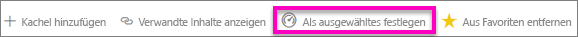
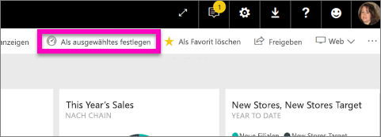
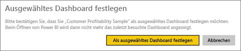
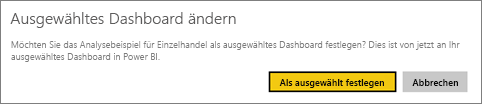
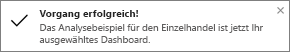
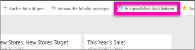

# Ausgewählte Dashboards im Power BI-Dienst
## Erstellen eines ausgewählten Dashboards
Viele Benutzer haben ein bevorzugtes Dashboard.  Dies kann das Dashboard sein, mit dem Sie Ihr Unternehmen verwalten, oder ein Dashboard mit einer Aggregation von Kacheln aus unterschiedlichen Dashboards und Berichten.

Wenn Sie ein Dashboard als *ausgewählt* festlegen, wird bei jedem Öffnen des Power BI-Diensts dieses Dashboard angezeigt.  

Sie können auch mehrere Dashboards als *Favoriten* auswählen. Siehe [Dashboardfavoriten](end-user-favorite.md).

> [!NOTE] 
>Dieses Thema bezieht sich auf den Power BI-Dienst und nicht auf Power BI Desktop.

Wenn Sie noch kein Dashboard als ausgewählt festgelegt haben, wird Power BI mit dem zuletzt verwendeten Dashboard geöffnet.  

### So legen Sie ein **ausgewähltes Dashboard** fest
Sehen Sie, wie ein ausgewähltes Dashboard erstellt wird, und befolgen Sie anschließend die Anleitung unter dem Video, um es selbst auszuprobieren.

<iframe width="560" height="315" src="https://www.youtube.com/embed/G26dr2PsEpk" frameborder="0" allowfullscreen></iframe>

1. Öffnen Sie das Dashboard, das Sie als *Ausgewählt* festlegen möchten. 
2. In der oberen Navigationsleiste wird **Als ausgewählt festlegen** oder nur das entsprechende Symbol  angezeigt. Wählen Sie eines der beiden aus.
   
    
3. Bestätigen Sie Ihre Auswahl.
   
    

## Ändern des ausgewählten Dashboards
Selbstverständlich können Sie später jederzeit ein neues Dashboard als ausgewähltes Dashboard festlegen.

1. Führen Sie die obigen Schritte 1 und 2 aus.
   
    
2. Wählen Sie **Als ausgewähltes festlegen**. Wenn das Dashboard nicht mehr als „ausgewählt“ festgelegt ist, bleibt es trotzdem in Ihrem Arbeitsbereich erhalten.  
   
    

## Entfernen des ausgewählten Dashboards
Wenn kein Dashboard als ausgewähltes Dashboard festgelegt sein soll, können Sie diese Festlegung aufheben.

1. Öffnen Sie das zurzeit ausgewählte Dashboard.
2. Wählen Sie in der oberen Menüleiste **Ausgewähltes deaktivieren**.
   
    

Power BI wird jetzt mit dem zuletzt verwendeten Dashboard geöffnet.  

## Nächste Schritte
[Hinzufügen von Dashboards als „Favoriten“](end-user-favorite.md)

Weitere Fragen? [Wenden Sie sich an die Power BI-Community](http://community.powerbi.com/)

