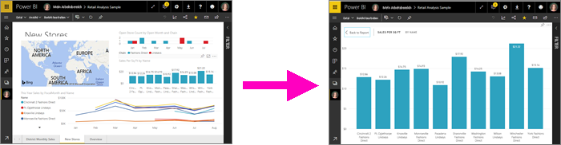
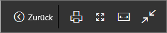
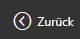
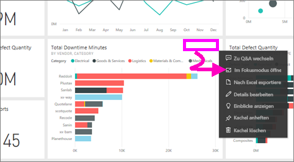
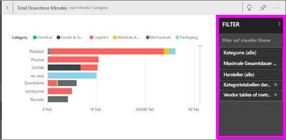
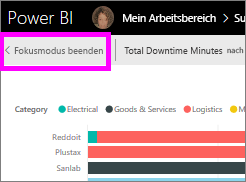
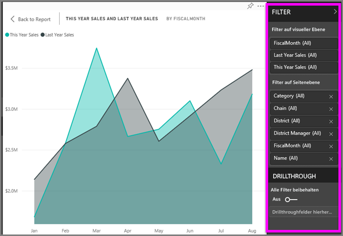
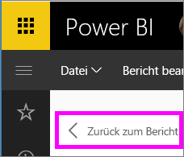

# Anzeigen von Inhalten im Detail: Fokusmodus und Vollbildmodus

<iframe width="560" height="315" src="https://www.youtube.com/embed/dtdLul6otYE" frameborder="0" allowfullscreen></iframe>

Der Fokusmodus und der Vollbildmodus sind zwei verschiedene Möglichkeiten, um weitere Details in Ihren Visuals, Berichten und Dashboards anzuzeigen.  Der Hauptunterschied besteht darin, dass in der Vollbildansicht alle Bereiche rund um Ihre Inhalte entfernt werden, während Sie im Fokusmodus weiterhin mit Ihren Visuals interagieren können. Sehen wir uns die Parallelen und die Unterschiede genauer an.  

|Inhalt    | Fokusmodus  |Vollbildmodus  |
|---------|---------|----------------------|
|Dashboard     |   Nicht möglich     | Ja |
|Berichtseite   | Nicht möglich  | Ja|
|Berichtsvisualisierung | Ja    | Ja |
|Dashboardkachel | Ja    | Ja |
|Windows 10 Mobile | Nicht möglich | Ja |

## Was ist der Vollbildmodus?

Zeigen Sie Ihre Inhalte aus dem Power BI-Dienst (Dashboards, Berichtsseiten, Kacheln und Visuals) ohne störende Menüs und Navigationsleisten an.  Sie erhalten jederzeit eine aufgeräumte vollständige Ansicht Ihrer Inhalte auf einen Blick. Dies wird gelegentlich auch als TV-Modus bezeichnet.   

Um den Vollbildmodus zu öffnen, wählen Sie das Symbol **Vollbild**  aus der Menüleiste des Power BI-Diensts oberhalb des Dashboards, des Berichts, der Kachel im Fokusmodus oder des Visuals im Fokusmodus aus.  Der ausgewählte Inhalt füllt den gesamten Bildschirm aus.
Wenn Sie Power BI Mobile verwenden, ist [der Vollbildmodus für mobile Windows 10-Apps verfügbar](./mobile/mobile-windows-10-app-presentation-mode.md). 

Einige Verwendungsmöglichkeiten des Vollbildmodus:

* Präsentieren Ihrer Dashboards, Kacheln, Visualisierungen oder Berichte in einer Besprechung oder Konferenz
* Anzeigen in einem Büro auf einem dedizierten großen Bildschirm oder Projektor
* Anzeigen auf einem kleinen Bildschirm
* Überprüfen im gesperrten Modus – Sie können den Bildschirm berühren oder mit dem Mauszeiger auf Kacheln zeigen, ohne den zugrunde liegenden Bericht oder das Dashboard zu öffnen.

## Was ist der Fokusmodus?
Im ***Fokusmodus*** können Sie ein Visual oder eine Kachel erweitern (ausklappen) und so mehr Details anzeigen.  Vielleicht verwenden Sie ein Dashboard oder einen Bericht, der etwas unübersichtlich ist, und möchten nur ein einzelnes Visual vergrößern.  Dies ist ein perfekter Verwendungszweck des Fokusmodus.  

Im Fokusmodus kann ein Power BI-*Consumer* mit Filtern interagieren, die bei Erstellung des Visuals angewendet wurden.  Im Power BI-Dienst können Sie den Fokusmodus für eine Dashboardkachel oder ein Berichtsvisual verwenden.

## Arbeiten im Vollbildmodus
Um entweder ein Dashboard oder eine Berichtsseite im Vollbildmodus zu öffnen, wählen Sie das Vollbildsymbol  aus der oberen Navigationsleiste aus. Sobald Sie sich im Vollbildmodus befinden, wird durch Bewegen der Maus oder des Cursors ein Kontextmenü angezeigt. Weil der Vollbildmodus für eine breite Vielfalt an Inhalten verfügbar ist, sind die Optionen im Kontextmenü jeweils etwas unterschiedlich, aber ziemlich selbsterklärend.  Zeigen Sie einfach auf ein Symbol, um eine Definition zu erhalten.

Menü für Dashboards    
    

Menü für Berichtsseiten    
    

  *     
  Kehren Sie mit der Schaltfläche **Zurück** zur vorherigen Seite in Ihrem Browser zurück. Wenn die vorherige Seite eine Power BI-Seite war, wird sie ebenfalls im Vollbildmodus angezeigt.  Der Vollbildmodus bleibt so lange aktiviert, bis Sie ihn beenden.

  *     
  Verwenden Sie diese Schaltfläche, um die Dashboard- oder Berichtsseite im Vollbildmodus zu drucken.

  *     
    Verwenden Sie die Schaltfläche **An Bildschirmgröße anpassen**, um das Dashboard so groß wie möglich anzuzeigen, ohne dass Bildlaufleisten verwendet werden.  

    

  *        
    Manchmal sind Bildlaufleisten nicht wichtig, und das Dashboard soll auf der gesamten Breite des verfügbaren Bereichs angezeigt werden. Wählen Sie die Schaltfläche **An Breite anpassen** aus.    

    

  *        
    Verwenden Sie in Berichten im Vollbildmodus diese Pfeile, um zwischen den Seiten im Bericht zu wechseln.    
  * Um den Vollbildmodus zu beenden, klicken Sie auf das Symbol **Vollbildmodus beenden**.

      

## Arbeiten im Fokusmodus
Es gibt zwei Möglichkeiten, den Fokusmodus zu öffnen: eine für Dashboardkacheln und eine andere für Berichtsvisualisierungen.

### Fokusmodus in Dashboards
1. Öffnen Sie ein Dashboard im Power BI-Dienst.

2. Zeigen Sie auf eine Dashboardkachel oder eine Berichtsvisualisierung, klicken Sie auf die Auslassungspunkte (...), und wählen Sie dann **Im Fokusmodus öffnen** aus.

    .

2. Die Kachel wird geöffnet und füllt den gesamten Berichtszeichenbereich.

   

3. Erweitern Sie den Bereich „Filter“, um alle auf diese Visualisierung angewendeten Filter anzuzeigen.

   

4. Probieren Sie die Funktion aus, indem Sie die [Filter ändern](end-user-report-filter.md) und in Ihren Daten nach interessanten Erkenntnissen suchen.  

5. Beenden Sie den Fokusmodus, und wechseln Sie zurück zum Dashboard, indem Sie **Fokusmodus beenden** (in der linken oberen Ecke des Visuals) auswählen.

        

## Fokusmodus für Berichtvisualisierungen
1. Öffnen Sie einen Bericht im Power BI-Dienst.  In diesem Beispiel zeigen wir die Verwendung des Analysebeispiels für den Einzelhandel.

1. Nachdem der Bericht geöffnet wurde, wählen Sie die **Registerkarte „Monatsumsätze nach Bezirk“** aus.

2. Zeigen Sie auf das Flächendiagramm in der unteren linken Ecke, und klicken Sie auf das Symbol **Fokusmodus** .  

   
2. Die Visualisierung wird geöffnet und füllt den gesamten Zeichenbereich.

   
3. Erweitern Sie optional den Bereich „Filter“, um mit den auf dieses Visual angewendeten Filtern zu interagieren. Sehen Sie sich die Daten genauer an, um neue Erkenntnisse zu gewinnen und Antworten auf Fragen zu finden. Als *Consumer* können Sie weder neue Filter hinzufügen, noch die in den Visualisierungen verwendeten Felder ändern oder neue Visualisierungen erstellen.  Allerdings werden alle Änderungen, die Sie an den vorhandenen Filtern vornehmen, beim Beenden von Power BI gespeichert. Wenn Power BI Ihre Änderungen nicht speichern soll, wählen Sie **Auf Standard zurücksetzen** aus.   

   

5. Beenden Sie den Fokusmodus, und wechseln Sie zurück zum Bericht, indem Sie **Zurück zum Bericht** (in der linken oberen Ecke des Visuals) auswählen.

      

## Zu beachtende Aspekte und Problembehandlung
* Wenn Sie den Fokusmodus für eine Visualisierung in einem Bericht verwenden, können Sie alle Filter anzeigen und damit interagieren: auf Visual-, Seiten-, Drillthrough- und Berichtsebene.    
* Wenn Sie den Fokusmodus für eine Visualisierung in einem Dashboard verwenden, können Sie nur den Filter auf Visualebene anzeigen und damit interagieren.

## Nächste Schritte
[Anzeigeeinstellungen für Berichte](end-user-report-view.md)