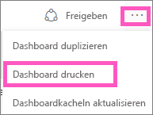
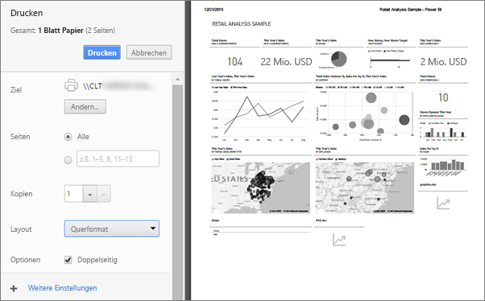
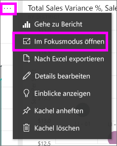
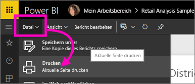

# Drucken im Power BI-Dienst
Drucken Sie vom Power BI-Dienst aus ein ganzes Dashboard, eine Dashboardkachel, eine Berichtsseite oder eine Berichtsvisualisierung. Berichte können nur seitenweise gedruckt werden. Es ist nicht möglich, den ganzen Bericht auf einmal zu drucken.

> [!NOTE]
> Die Druckfunktion ist nur im Power BI-Dienst und nicht in Power BI Desktop verfügbar.
> 
> 

Sehen Sie sich an, wie Amanda aus ihrem Dashboard und Bericht druckt. Befolgen Sie dann die schrittweisen Anleitungen unter dem Video, um es selbst ausprobieren.

<iframe width="560" height="315" src="https://www.youtube.com/embed/jtlLGRKBvXY" frameborder="0" allowfullscreen></iframe>

## Drucken eines Dashboards
1. Öffnen Sie das Dashboard, das Sie drucken möchten.
2. Wählen Sie in der rechten oberen Ecke die Auslassungspunkte (...) und dann **Dashboard drucken**aus.
   
    
3. Das Fenster „Drucken“ wird im Browser geöffnet. Wählen Sie die Einstellungen und das Druckziel aus, und klicken Sie auf **Drucken**.
   
   > [!NOTE]
   > Das eingeblendete Dialogfeld „Drucken“ hängt vom verwendeten Browser ab.
   > 
   
    

## Drucken einer Dashboardkachel
1. [Öffnen Sie die Kachel im Fokusmodus](end-user-focus.md), indem Sie zuerst auf die Auslassungspunkte und anschließend auf das Fokussymbol  klicken.
   
    
2. Öffnen Sie die Kachel im [Vollbildmodus](end-user-focus.md), indem Sie in der oberen Navigationsleiste auf das Vollbildsymbol  klicken.
3. Zeigen Sie auf die Kachel, um das Menü „Optionen“ anzuzeigen.
   
    
4. Klicken Sie auf das Drucksymbol .     
   
   > [!NOTE]
   > Das eingeblendete Dialogfeld „Drucken“ hängt vom verwendeten Browser ab.
   > 
   > 

## Drucken einer Berichtsseite
Berichte können seitenweise gedruckt werden.

1. Öffnen Sie den Bericht im Lesemodus oder in der Bearbeitungsansicht.
2. Wählen Sie **Datei** > **Drucken** aus, um die aktuelle Berichtsseite zu drucken.
   
    
3. Das Fenster „Drucken“ wird im Browser geöffnet.
   
   > [!NOTE]
   > Das eingeblendete Dialogfeld „Drucken“ hängt vom verwendeten Browser ab.
   > 
   > 

## Drucken einer Berichtsvisualisierung
1. [Öffnen Sie das visuelle Element im Fokusmodus](end-user-focus.md), indem Sie mit dem Mauszeiger auf die Kachel zeigen und rechts oben auf das Fokussymbol  klicken.
2. Führen Sie die Schritte 2 bis 3 unter *Drucken einer Berichtsseite* weiter oben aus.

## Zu beachtende Aspekte und Problembehandlung
* F: Ich kann die Schaltfläche **Drucken** nicht finden.    
* A: Wenn Sie Power BI Desktop verwenden, wird die Druckfunktion nicht unterstützt.  Drucken funktioniert nur im Power BI-Dienst.
* F: Ich kann nicht alle Berichtseiten auf einmal drucken.    
* A: Das ist richtig. Berichte können nur seitenweise gedruckt werden.
* F: Ich kann den Bericht nicht als PDF-Datei drucken.    
* A: Diese Option wird nur angezeigt, wenn Sie bereits den PDF-Treiber in Ihrem Browser konfiguriert haben.    
* F: Wenn ich **Drucken** auswähle, wird etwas anderes als hier angezeigt.    
* A: Der Druckbildschirm variiert je nach Browser und Softwareversion.
* F: Mein Ausdruck ist nicht richtig skaliert.  Das Dashboard passt nicht auf die Seite. Weitere Fragen zur Skalierung und Ausrichtung.    
* A: Wir können nicht garantieren, dass das gedruckte Exemplar genau mit der Anzeige im Power BI-Dienst übereinstimmt. Funktionen wie die Skalierung, Ränder, visuelle Details, die Ausrichtung und die Größe werden nicht von Power BI gesteuert. Hilfe bei derartigen Problemen erhalten Sie in der Dokumentation Ihres Browsers.      

## Nächste Schritte
[Freigeben von Dashboards und Berichten für Kollegen und andere Personen](../service-share-dashboards.md)

Weitere Fragen? [Wenden Sie sich an die Power BI-Community](http://community.powerbi.com/)

