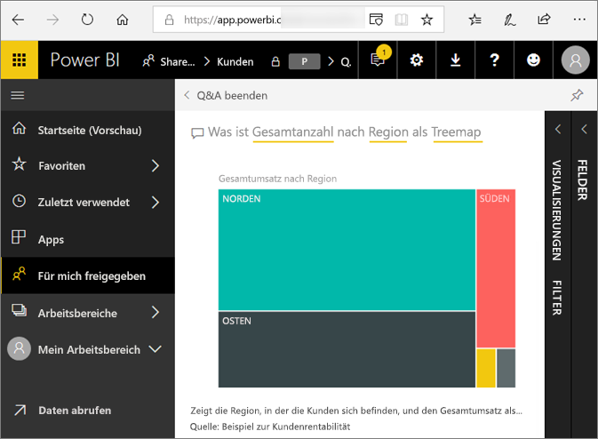
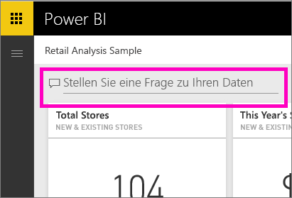
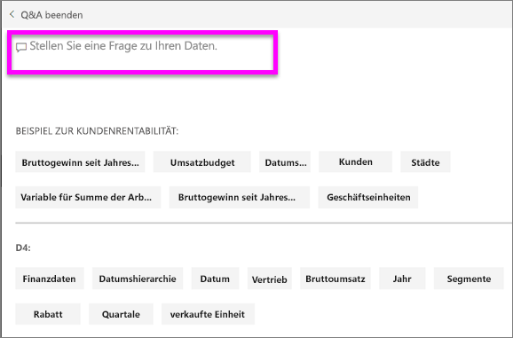
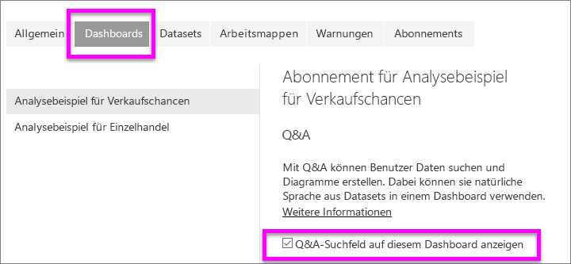
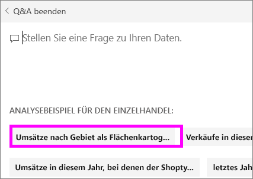

# Q&A für Power BI-**Verbraucher**
## Was ist Q&A?
Manchmal ist die schnellste Möglichkeit, um eine Antwort auf Basis Ihrer Daten zu erhalten, eine Frage in natürlicher Sprache zu stellen. Beispiel: „Wie lautet der Gesamtumsatz für das letzte Jahr“.  
Verwenden Sie den Bereich für Fragen und Antworten (F&A), um Ihre Daten mithilfe intuitiver Möglichkeiten der natürlichen Sprache zu untersuchen und die entsprechenden Antworten in Form von Diagrammen und Grafiken zu erhalten. Der Bereich für Fragen und Antworten unterscheidet sich von einer Suchmaschine. Dieser Bereich stellt ausschließlich Ergebnisse zu den Daten in Power BI bereit.

**Power BI Q&A** unterstützt nur die Beantwortung von Fragen in natürlicher Sprache, die in Englisch gestellt werden. Es steht eine Vorschauversion für Spanisch zur Verfügung, die von Ihrem Power BI-Administrator aktiviert werden kann.

**Power BI Q&A** ist in Pro- und Premium-Lizenzen enthalten. 
>

Fragen stellen ist erst der Anfang.  Viel Spaß bei Ihrer Reise, bei der Sie Daten optimieren oder eine Frage erweitern, vertrauenwürdige neue Informationen entdecken, sich die Details genauer ansehen und für eine breitere Übersicht den Fokus herausnehmen. Sie werden begeistert sein, welche Einblicke Sie gewinnen und welche Entdeckungen Sie machen werden.

Die Erfahrung ist wahrhaft interaktiv... und schnell! Unterstützt durch einen In-Memory-Speicher wird die Antwort nahezu unmittelbar zurückgegeben.

## Wo finde ich die Q&A-Funktion?
Die Q&A-Funktion ist im Power BI-Dienst im Dashboard enthalten, in Power BI Mobile finden Sie sie ganz unten und in Power BI Embedded über der Visualisierung. Sie können mit Q&A Daten untersuchen, jedoch keine mit Q&A erstellten Visualisierungen speichern, es sei denn, der Designer hat Ihnen Bearbeitungsberechtigungen erteilt.

## Wie kann Q&A Fragen beantworten?
Q&A sucht in allen dem Dashboard zugeordneten Datasets nach Antworten. Wenn ein Dataset über eine Kachel auf dem Dashboard verfügt, sucht Q&A in diesem Dataset nach Antworten. 

## Wie beginne ich?
Machen Sie sich zunächst mit dem Inhalt vertraut. Sehen Sie sich die Visualisierungen auf dem Dashboard und im Bericht an. Verschaffen Sie sich ein Gefühl für den Typ und Bereich der Daten, die Ihnen zur Verfügung stehen. Navigieren Sie dann zurück zum Dashboard, und platzieren Sie Ihren Mauszeiger auf dem Fragefeld. Die Q&A-Anzeige wird geöffnet.

 

* Wenn die Achsenbeschriftungen und -werte der Visualisierungen Begriffe wie „Umsätze“, „Konto“, „Monat“ und „Chancen“ enthalten, können Sie ganz einfach Fragen stellen wie z.B.: „Welches *Konto* hat die besten *Chancen*, oder *Umsätze* nach Monat als Balkendiagramm anzeigen“.

* Wenn Sie über Website-Leistungsdaten in Google Analytics verfügen, können Sie mit Q&A in Erfahrung bringen, wie viel Zeit auf einer Website verbracht wird, wie häufig einzelne Seiten aufgerufen werden und wie die Benutzerbindung aussieht. Wenn Sie demografische Daten benötigen, können Sie auch Alter und Haushaltseinkommen nach Ort erfragen.

Am unteren Rand des Bildschirms werden Ihnen weitere nützliche Elemente angezeigt. Q&A zeigt Ihnen für jedes Dataset Schlüsselwörter und manchmal sogar Beispiel- bzw. vorgeschlagene Fragen an. Wählen Sie eine dieser Optionen aus, um Sie dem Fragefeld hinzuzufügen. 

Eine weitere Art, in der Q&A Sie beim Stellen von Fragen unterstützt, sind Eingabeaufforderungen, automatische Vervollständigung und visuelle Hinweise. 

 

### Welche Visualisierung verwendet Q&A?
Q&A wählt die beste Visualisierung basierend auf den angezeigten Daten aus. Manchmal werden Daten in den zugrunde liegenden Datasets als bestimmter Typ oder bestimmte Kategorie definiert. Dadurch weiß Q&A, wie sie angezeigt werden sollen. Wenn Daten z. B. als Datentyp definiert sind, müssen sie wahrscheinlich als Liniendiagramm angezeigt werden. Daten, die als eine Stadt kategorisiert werden, müssen wahrscheinlich als Karte angezeigt werden.

Sie können Q&A auch mitteilen, welche Visualisierung verwendet werden soll, indem Sie Ihrer Frage diese Information hinzufügen. Bedenken Sie jedoch, dass Q&A Daten nicht immer im angeforderten Visualisierungstyp anzeigen kann. Q&A fordert Sie mit einer Liste umsetzbarer Visualisierungstypen zur Eingabe auf.

## Zu beachtende Aspekte und Problembehandlung
**Frage**: Ich finde Q&A auf diesem Dashboard nicht.    
**Antwort 1**: Wenn Sie kein Fragefeld finden können, überprüfen Sie zunächst Ihre Einstellungen. Klicken Sie hierzu auf das Zahnradsymbol in der oberen rechten Ecke der Power BI-Symbolleiste.   

Klicken Sie dann auf **Einstellungen** > **Dashboards**. Stellen Sie sicher, dass die Option **Show the Q&A search box on this dashboard** (Q&A-Suchfeld auf diesem Dashboard anzeigen) aktiviert ist.
  

**Antwort 2**: In einigen Fällen hat der *Designer* des Dashboards oder Ihr Administrator die Q&A-Funktion deaktiviert. Wenden Sie sich an die zuständige Person, um festzustellen, ob sie wieder aktiviert werden kann.   

**Frage**: Ich erhalte nicht die Ergebnisse, die ich sehen möchte, wenn ich eine Frage eingebe.    
**Antwort**: Wenden Sie sich an den *Designer* des Dashboards. Es gibt viele Dinge, die der Designer tun kann, um die Q&A-Ergebnisse zu verbessern. Beispielsweise kann der Designer Spalten im Dataset umbenennen, um Begriffe zu verwenden, die einfacher zu verstehen sind (z.B. `CustomerFirstName` anstelle von `CustFN`). Da der Designer das Dataset sehr gut kennt, kann er sich hilfreiche Fragen ausdenken und dem Q&A-Canvas hinzufügen.

## Nächste Schritte

