<!-- once the sample apps are live, change this so consumers can follow along -->
# Schnellstart: Informationen zu Funktionen für ***Benutzer*** in Power BI
In dieser Schnellstartanleitung erfahren Sie, wie Sie mit Power BI interagieren können, um nach datengesteuerten Geschäftsinformationen zu suchen. Dieser Artikel bietet keinen detaillierten Einblick, sondern vielmehr einen groben Überblick über eine Vielzahl der verfügbaren Aktionen für **Benutzer** in Power BI.

Wenn Sie noch nicht bei Power BI registriert sind, müssen Sie sich zuerst für eine [kostenlose Testversion registrieren](https://app.powerbi.com/signupredirect?pbi_source=web).

## Voraussetzungen
- Power BI service (app.powerbi.com)
<!-- app from AppSource -->

## Leseansicht
Die Leseansicht ist im Power BI-Dienst für *Benutzer* von Berichten verfügbar. Wenn ein Kollege einen Bericht mit Ihnen teilt, können Sie diesen in der Leseansicht untersuchen und mit ihm interagieren. 

Der zweite Berichtsmodus im Power BI-Dienst ist die [Bearbeitungsansicht](../service-interact-with-a-report-in-editing-view.md), die für *Designer* von Berichten verfügbar ist.  

Die Leseansicht ist eine leistungsstarke und sichere Möglichkeit, Ihre Dashboards und Berichte eingehend zu untersuchen. Während Sie die mit Ihnen geteilten Dashboards und Berichte untersuchen, bleiben die zugrunde liegende Datasets intakt und unverändert. 

In der Leseansicht können Sie auf visuelle Elemente Kreuzhervorhebung und Kreuzfilterung auf einer Seite anwenden.  Heben Sie einfach einen Wert in einem Visual hervor, oder wählen Sie ihn aus, um seine Auswirkung auf die anderen Visuals sofort anzuzeigen. Verwenden Sie den Bereich „Filter“, um Filter auf einer Berichtsseite hinzuzufügen und zu ändern, und ändern Sie die Sortierung der Werte in einer Visualisierung. Dies sind nur einige der Funktionen für  *Benutzer* in Power BI.  Lesen Sie weiter, um darüber und über vieles weitere mehr zu erfahren.

 
### Anzeigen einer App
In Power BI bündeln *Apps* verwandte Dashboards und Berichte zusammen an einem Ort.

1. Wählen Sie **Apps**  > **Apps abrufen** aus. 
   
     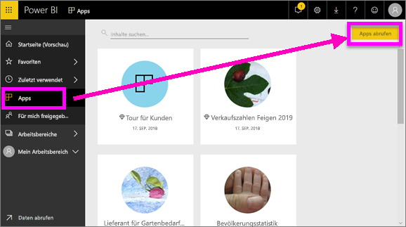
2. Suchen Sie in AppSource unter **Meine Organisation**, um die Ergebnisse einzugrenzen und die gewünschte App zu finden.
   
     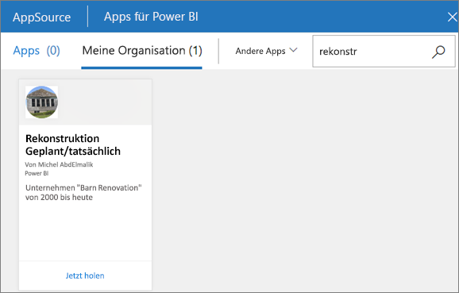
3. Wählen Sie **Jetzt anfordern** aus, um sie dem Container „Apps“ hinzuzufügen. 

### Anzeigen eines Dashboards
Diese App öffnet ein Dashboard. Ein Power BI-***Dashboard*** ist eine einzelne Seite (häufig als Zeichenbereich bezeichnet), auf der mithilfe von Visualisierungen eine Geschichte erzählt wird. Wegen der Beschränkung auf eine Seite erkennen Sie ein gut gestaltetes Dashboard daran, dass die Geschichte auf ihre Kernaussagen verdichtet ist.

Die Visualisierungen auf einem Dashboard werden als *Kacheln* bezeichnet. Kacheln stammen aus Berichten und werden an ein Dashboard *angeheftet*.

### Abonnieren eines Dashboards (oder Berichts)
Power BI muss nicht geöffnet werden, um ein Dashboard zu überwachen.  Sie können es stattdessen abonnieren, und Power BI wird Ihnen nach einem von Ihnen festgelegten Zeitplan eine Momentaufnahme dieses Dashboards per E-Mail zusenden. 

.

1. Klicken Sie in der oberen Menüleiste auf **Abonnieren**, oder klicken Sie auf das Briefumschlagsymbol .
   
   

3. Mithilfe des gelben Schiebereglers können Sie das Abonnement aktivieren und deaktivieren.  Fügen Sie optional E-Mail-Adressinformationen hinzu. 

    In den unten stehenden Screenshots sehen Sie, dass Sie beim Abonnieren eines Berichts eigentlich eine *Berichtsseite* abonnieren.  Klicken Sie auf **Weiteres Abonnement hinzufügen**, und wählen Sie die gewünschten Seiten aus, um mehrere Seiten in einem Bericht zu abonnieren. 
      
   
   
    Durch das Aktualisieren der Berichtsseite wird nicht das Dataset aktualisiert. Nur der Besitzer des Datasets kann ein Dataset manuell aktualisieren. Um den Namen des zugrunde liegenden Datasets nachzuschlagen, wählen Sie in der oberen Menüleiste **Verwandte Inhalte anzeigen** aus.

### Verwandte Inhalte anzeigen
Im Bereich **verwandte Inhalte** sehen Sie, wie Ihre Inhalte im Power BI-Dienst (Dashboards, Berichte und Datasets) miteinander verbunden sind. Der Bereich enthält nicht nur die verwandten Inhalte, sondern ermöglicht es auch, Aktionen auszuführen und komfortabel zwischen den verknüpften Inhalten zu navigieren.

Wählen Sie in einem Dashboard oder Bericht in der oberen Menüleiste **Verwandte Inhalte anzeigen** aus.

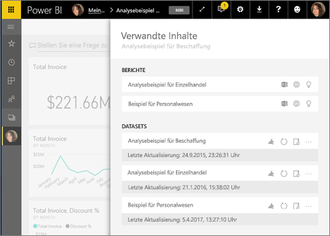

### Verwenden von Q&A für Fragen in natürlicher Sprache
Manchmal ist die schnellste Möglichkeit, um eine Antwort auf Basis Ihrer Daten zu erhalten, eine Frage in natürlicher Sprache zu stellen. Das Q&A-Fragefeld befindet sich am oberen Rand Ihres Dashboards. Beispiel: „Zeige mir die Anzahl großer Verkaufschancen sortiert nach Vertriebsphase in einem Trichterdiagramm an.“ 

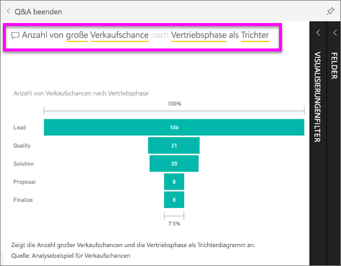

### Hinzufügen von Dashboards als „Favoriten“
Wenn Sie einen Inhalt als *Favorit* speichern, können Sie von der linken Navigationsleiste aus darauf zugreifen. Die linke Navigationsleiste ist in fast jedem Bereich in Power BI sichtbar. Favoriten sind üblicherweise die Dashboards, Berichtsseiten und Apps, die Sie am häufigsten besuchen.

1. Beenden Sie Q&A, um zum Dashboard zurückzukehren.    
2. Klicken Sie in der oberen rechten Ecke von Power BI auf **Favorit** oder auf das Sternsymbol .
   
   

### Öffnen und Anzeigen von Berichten und Berichtsseiten
Ein Bericht besteht aus einer oder mehreren Seiten mit visuellen Elementen. Power BI-Berichte werden von *Berichts-Designern* erstellt und entweder [direkt für *Kunden*](end-user-shared-with-me.md) oder als Teil einer [App](end-user-apps.md) freigegeben. 

Berichte können aus einem Dashboard geöffnet werden. Die meisten Dashboardkacheln sind aus Berichten *angeheftet*. Das Auswählen einer Kachel öffnet den Bericht, mit dem diese Kachel erstellt wurde. 

1. Wählen Sie in einem Dashboard eine Kachel aus. In diesem Beispiel wurde die Kachel „Revenue“ (Umsatz) in einem Säulendiagramm ausgewählt.

    

2.  Der entsprechende Bericht wird geöffnet. Beachten Sie, dass wir uns auf der Seite „Revenue overview“ (Umsatzübersicht) befinden. Dies ist die Berichtseite, die das im Dashboard ausgewählte Säulendiagramm enthält.

    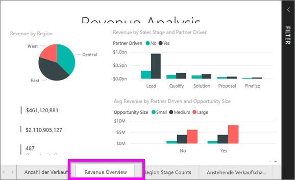

### Anpassen der Anzeigegröße
Berichte werden auf vielen verschiedenen Geräten mit unterschiedlichen Bildschirmgrößen und Seitenverhältnissen angezeigt.  Die Standardanzeige entspricht unter Umständen nicht dem, was Sie auf Ihrem Gerät anzeigen möchten.  

1. Um diese anzupassen, wählen Sie in der oberen Menüleiste **Ansicht** aus.

    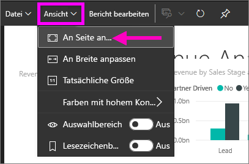

2.  Wählen Sie eine der Anzeigeoptionen aus. In diesem Beispiel haben wir **An Seite anpassen** ausgewählt.

    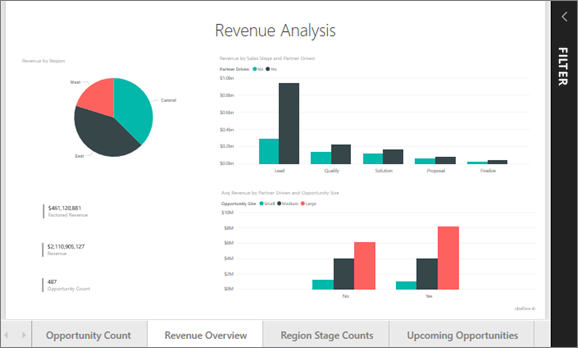    

### Verwenden des Bereichs „Filter“ in Berichten
Wenn der Autor des Berichts einer Berichtsseite Filter hinzugefügt hat, können Sie mit diesen interagieren und Ihre Änderungen im Bericht speichern.

1. Wählen Sie oben rechts das Symbol **Filter** aus.
   
   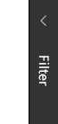  

2. Wählen Sie eine Visualisierung aus, um ihn zu aktivieren. Ihnen werden alle Filter angezeigt, die auf diese Visualisierung (Filter auf visueller Ebene), auf die gesamte Berichtsseite (Filter auf Seitenebene) und auf den gesamten Bericht (Filter auf Berichtsebene) angewandt werden.
   
   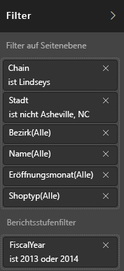

3. Zeigen Sie auf einen Filter, und erweitern Sie ihn, indem Sie den Pfeil nach unten auswählen.
   
   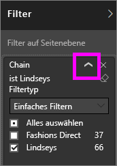

4. Ändern Sie die Filter, und beobachten Sie die Auswirkungen auf die visuellen Elemente.  
   
     
     

### Finden Sie heraus, wie alle visuellen Elemente auf einer Seite miteinander verbunden sind.
Kreuzhervorhebung und Kreuzfilterung bei verknüpften Visualisierungen auf einer Seite Visualisierungen auf einer Berichtsseite sind alle miteinander „verknüpft“.  Wenn Sie also einen oder mehrere Werte in einer Visualisierung auswählen, werden andere Visualisierungen, die den gleichen Wert verwenden, auf Grundlage Ihrer Auswahl geändert.

> 
### Details für Visualisierung anzeigen
Zeigen Sie auf ein visuelles Element, um die Details anzuzeigen.

### Visualisierung sortieren
Visuelle Elemente auf einer Berichtsseite können mit den von Ihnen vorgenommenen Änderungen sortiert und gespeichert werden. 

1. Zeigen Sie auf ein visuelles Element, um es zu aktivieren.    
2. Klicken Sie auf die Auslassungspunkte (...), um Sortieroptionen zu öffnen.

     

###  Öffnen des Bereichs **Auswahl**
Sie können ganz einfach zwischen den Visualisierungen auf der Berichtsseite wechseln. 

1. Wählen Sie **Ansicht > Auswahlbereich** aus, um den Auswahlbereich zu öffnen. Schalten Sie **Auswahlbereich** auf „Ein“ um.

    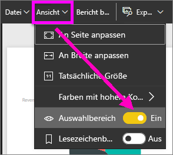

2. Der Auswahlbereich öffnet sich in Ihrem Berichtszeichenbereich. Wählen Sie eine Visualisierung aus der Liste aus, um ihn zu aktivieren.

    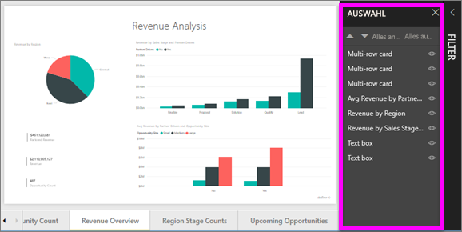

### Einzelne visuelle Elemente vergrößern
Zeigen Sie auf eine Visualisierung, und wählen Sie das Symbol für den **Fokusmodus** aus: . Wenn Sie eine Visualisierung im Fokusmodus anzeigen, wird diese erweitert, sodass sie den gesamten Berichtszeichenbereich ausfüllt, wie unten dargestellt.

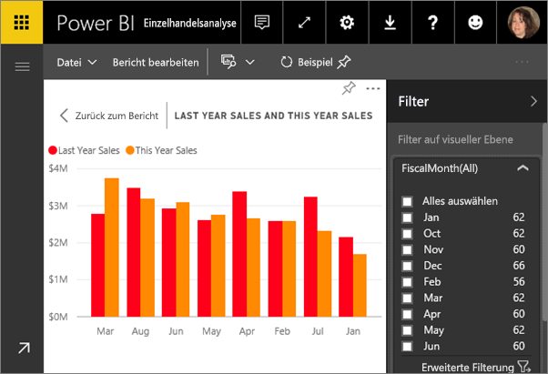

Wählen Sie zum Anzeigen dieser Visualisierung ohne störende Menüleisten, ohne den Filterbereich und andere Chromelemente das Symbol **Vollbild**  auf der oberen Menüleiste aus.

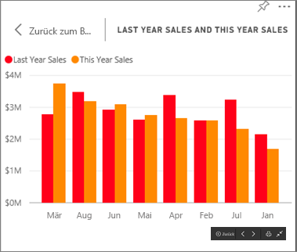

### Anzeigen der zum Erstellen einer Visualisierung verwendeten Daten
Eine Power BI-Visualisierung wird mithilfe von Daten aus zugrunde liegenden Datasets erstellt. Sie haben in Power BI die Möglichkeit, die Daten *anzuzeigen*, die der Visualisierung zugrunde liegen. Wenn Sie **Daten anzeigen** auswählen, werden die Daten in Power BI unter (oder neben) der Visualisierung angezeigt.

1. Öffnen Sie im Power BI-Dienst einen Bericht, und wählen Sie ein visuelles Element aus.  
2. Um die Daten hinter dem visuellen Element anzuzeigen, klicken Sie auf die Auslassungspunkte (...) und dann auf **Daten anzeigen**.
   
   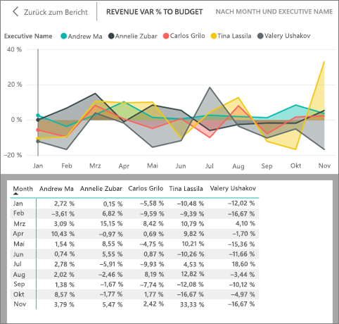

Das war ein kurzer Überblick einiger der Aktionen, die für **Benutzer** im Power BI-Dienst verfügbar sind.  

## Bereinigen von Ressourcen
- Wenn Sie mit einer App verbunden sind, wählen Sie in der linken Navigationsleiste **Apps** aus, um die Apps-Inhaltsliste zu öffnen. Zeigen Sie auf die zu löschende App, und klicken Sie auf das Papierkorbsymbol.

- Wenn Sie einen Power BI-Beispielbericht importiert oder sich mit ihm verbunden haben, klicken Sie in der linken Navigationsleiste auf **Mein Arbeitsbereich**. Suchen Sie unter den Registerkarten am oberen Rand das Dashboard, den Bericht und das Dataset, und klicken Sie für alle drei jeweils auf das Papierkorbsymbol.

## Nächste Schritte

