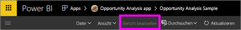
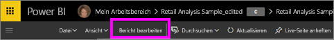
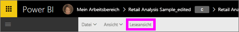

# Leseansicht und Bearbeitungsansicht für Berichte im Power BI-Dienst
Im Power BI-Dienst (nicht in Power BI Desktop) stehen zwei Modi bereit, um Berichte anzuzeigen und mit ihnen zu interagieren: die Leseansicht und die Bearbeitungsansicht. Die Leseansicht ist für alle Benutzer verfügbar und ist speziell für die *Benutzer* von Daten konzipiert, während die Bearbeitungsansicht nur für *Berichtersteller* und -besitzer zur Verfügung steht.

## Leseansicht für Berichte

 Die Leseansicht bietet eine Möglichkeit, um den Bericht zu untersuchen und damit zu interagieren – so können Sie bedenkenlos mit dem Bericht experimentieren und sich mit den Daten vertraut machen. Die Leseansicht ist für die *Benutzer* von Berichten konzipiert, die die Berichte in Apps öffnen oder für die [Berichte freigegeben werden](../service-share-dashboards.md). Durch die Leseansicht wird sichergestellt, dass alle Benutzer eines bestimmten Berichts den gleichen Bericht und die gleichen Visualisierungen wahlweise mit den gleichen Filtern sehen.  Benutzer können zwar mit den Berichten interagieren und vorhandene Filter ändern (diese Veränderungen werden im Bericht gespeichert), allerdings keine neuen Filter hinzufügen.

> [!NOTE]
> Unter bestimmten Umständen sehen die Benutzer von Berichten aufgrund von Sicherheits- und Datenberechtigungen auf Zeilenebene unterschiedliche Daten.

## Bearbeitungsansicht für Berichte

Die Bearbeitungsansicht ist nur für die Ersteller von Berichten und die Benutzer verfügbar, die [einen Bericht als Mitglied oder Administrator eines App-Arbeitsbereichs besitzen](../service-create-distribute-apps.md).

Die Bearbeitungsansicht ist für die *Ersteller* von Berichten konzipiert. Hier können die Ersteller Datasets importieren und verbinden, Daten untersuchen sowie Berichte und Dashboards erstellen. In der Bearbeitungsansicht können *Ersteller* noch tiefer in die Daten eindringen, indem sie Felder hinzufügen und entfernen, den Visualisierungstyp ändern, neue Visualisierungen erstellen und Visualisierungen und Seiten zum Bericht hinzufügen und daraus entfernen. Sie können dann die erstellten Berichte für Kollegen freigeben.

## Leseansicht und Bearbeitungsansicht im Vergleich
In diesem Diagramm werden nicht alle Berichtsfunktionen im Power BI-Dienst aufgeführt. Es enthält nur die Berichtsaufgaben, die nicht in **beiden** Ansichten (Lese- und Bearbeitungsansicht) verfügbar sind.

|Aufgabe  | Leseansicht  | Bearbeitungsansicht |
|-------------------------|-------|-------|
|**Berichte, allgemein**  |
| [Erstellen oder Bearbeiten eines Berichts](../service-report-create-new.md) | Nein  | Ja |
| [Freigeben eines Berichts](../service-share-reports.md)| Ja | Ja, außerdem Verwalten von Berechtigungen, einschließlich Zuweisen der Berechtigung *Besitzer*. |
| [Erstellen von permanenten Filtern auf Visualebene, Drillthrough-Filtern sowie Filtern auf Seiten- und Berichtsebene im Bereich „Filter“](../power-bi-report-add-filter.md) | Nein  | Ja |
| [Verwenden des Bereichs „Filter“ in Berichten](end-user-report-filter.md) | Ja, mit dem Bericht können vorhandene Filter verwendet und Veränderungen gespeichert werden, neue Filter können allerdings nicht hinzugefügt werden. | Ja |
| [Verwenden des Analysebereichs für den Bericht](../service-analytics-pane.md) | Nein | Ja |
| [Berichtsoptionen unter **Ansicht**](../power-bi-report-display-settings.md) | Ja, bis auf einige Ausnahmen. | Ja, alle einschließlich Gitternetzlinien, Andocken und Sperren. |
| [Erstellen einer Zeitplanaktualisierung](../refresh-data.md) | Nein  | Ja |
| [Abonnieren eines Berichts](end-user-subscribe.md) | Ja | Nein |
| [Q&A – Stellen von Fragen in Berichten](end-user-q-and-a.md) | Nein  | Ja |
| [Anzeigen von Nutzungsmetriken](../service-usage-metrics.md) | Ja, im Zeichenbereich des Berichts. | Ja, in der Berichtliste (Inhaltsansicht) |
| [Verwandte Inhalte anzeigen](end-user-related.md) | Ja, im Zeichenbereich des Berichts. | Ja, in der Berichtliste (Inhaltsansicht) |
| [Speichern eines Berichts](../service-report-save.md) | Ja, aber nur mit **Speichern unter**. | Ja |
| [Löschen eines Berichts](../service-delete.md) | Nein  | Ja |
|**Berichtseiten** |
| [Hinzufügen oder Umbenennen einer Berichtseite](../power-bi-report-add-page.md)  | Nein  | Ja  |
| [Duplizieren einer Berichtseite](../power-bi-report-copy-paste-page.md) | Nein  | Ja |
| [Löschen einer Berichtseite](../service-delete.md) | Nein | Ja |
|**Arbeiten mit Berichtsvisualisierungen**|
| [Hinzufügen von Visualisierungen zu einem Bericht](../visuals/power-bi-report-add-visualizations-i.md) | Nein  | Ja |
| [Hinzufügen von Textfeldern und Formen zu einem Bericht](../power-bi-reports-add-text-and-shapes.md) | Nein  | Ja |
| [Verwenden des Bereichs „Formatierung“ in einem Bericht](../service-the-report-editor-take-a-tour.md) | Nein | Ja |
| [Festlegen von visuellen Interaktionen](end-user-interactions.md) | Nein  | Ja |
| [Anzeigen der zum Erstellen der Visualisierung verwendeten Daten](end-user-show-data.md) | Nein  | Ja |
| [Konfigurieren von Drilling](end-user-drill.md) | Nein  | Ja |
| [Ändern der verwendeten Visualisierung](../visuals/power-bi-report-change-visualization-type.md) | Nein | Ja|
| [Löschen von Visualisierungen, Textfeldern oder Formen](../service-delete.md)| Nein | Ja |

## Navigieren zwischen Bearbeitungs- und Leseansicht
Beachten Sie, dass nur Berichtersteller und -besitzer einen Bericht in der Bearbeitungsansicht öffnen können.

1. Ein Bericht wird standardmäßig in der Leseansicht geöffnet. Sie können an der Option **Bericht bearbeiten** erkennen, ob Sie sich in der Leseansicht befinden. Wenn **Bericht bearbeiten** ausgegraut angezeigt wird, sind Sie nicht berechtigt, den Bericht in der Bearbeitungsansicht zu öffnen.

   

2. Wenn **Bericht bearbeiten** nicht ausgegraut ist, können Sie die Option auswählen, um den Bericht in der Bearbeitungsansicht zu öffnen.

   

   Der Bericht wird dann in der Bearbeitungsansicht mit denselben [Anzeigeeinstellungen](../power-bi-report-display-settings.md) angezeigt, die Sie zuletzt in der Leseansicht verwendet haben.

2. Wählen Sie zum Zurückkehren zur Leseansicht in der oberen Navigationsleiste **Leseansicht** aus.

    

## Nächste Schritte
Es gibt viele Möglichkeiten, um mit einem Bericht in der Leseansicht zu interagieren und die Daten so zu analysieren und aufzuteilen, dass Einblicke und Antworten gewonnen werden können.  Im nächsten Thema, [Interagieren mit einem Bericht in der Leseansicht von Power BI](../service-interact-with-a-report-in-editing-view.md), werden einige davon genauer beschrieben.    
Zurück zu [Berichte in Power BI](end-user-reports.md)    
