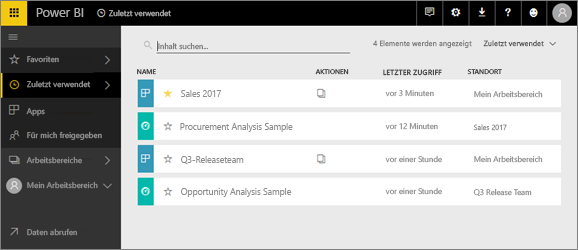
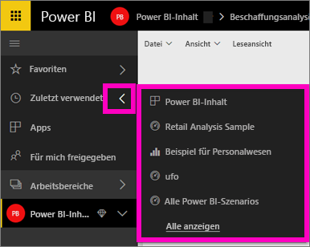
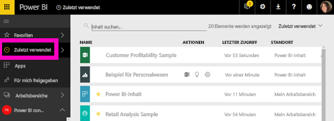

# **Zuletzt verwendete** Inhalte im Power BI-Dienst
Die zuletzt verwendeten Inhalte sind die letzten Elemente, die Sie im Power BI-Dienst geöffnet haben (maximal 20 Elemente).  Dazu gehören Dashboards, Berichte, Apps und Arbeitsmappen in allen Ihren Arbeitsbereichen.

Lassen Sie sich von Amanda zeigen, wie im Power BI-Dienst Inhaltslisten des Typs **Zuletzt verwendet** aufgefüllt werden, und befolgen Sie dann die detaillierten Anweisungen unter dem Video, um es selbst ausprobieren.

<iframe width="560" height="315" src="https://www.youtube.com/embed/G26dr2PsEpk" frameborder="0" allowfullscreen></iframe>

## Anzeigen von zuletzt verwendeten Inhalten
Um die letzten fünf besuchten Elemente anzuzeigen, wählen Sie im linken Navigationsbereich den Pfeil rechts neben **Zuletzt verwendet** aus.  Hier können Sie zuletzt verwendeten Inhalt auswählen, um ihn zu öffnen. Es werden nur die letzten fünf verwendeten Elemente aufgeführt.

Wenn mehr als fünf zuletzt besuchte Elemente vorhanden sind, wählen Sie **Alle anzeigen** aus, um den Bildschirm „Zuletzt verwendet“ zu öffnen (siehe unten). Sie können auch im linken Navigationsbereich auf **Zuletzt verwendet** oder das Symbol „Zuletzt verwendet“  klicken.

Von hier aus können Sie mit dem Inhalt wie auf den einzelnen Registerkarten [**Dashboards**](end-user-dashboards.md), [**Berichte**](end-user-reports.md) und **Arbeitsmappen** sowie auf dem Bildschirm „Apps“ <!--[**Apps**](end-user-apps.md)--> interagieren.

## Nächste Schritte
<!--[Power BI service Apps](end-user-apps.md)-->

Weitere Fragen? [Wenden Sie sich an die Power BI-Community](http://community.powerbi.com/)

