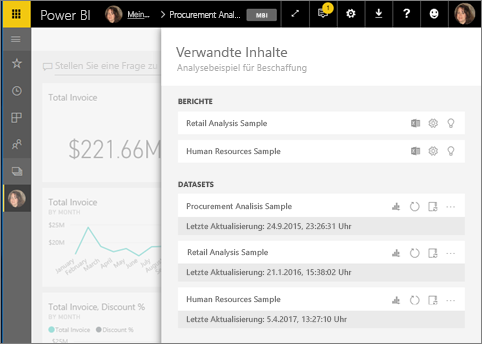
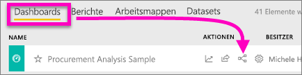
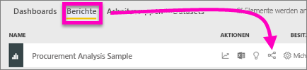
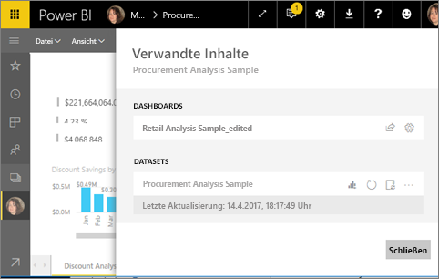
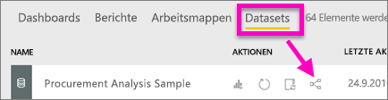
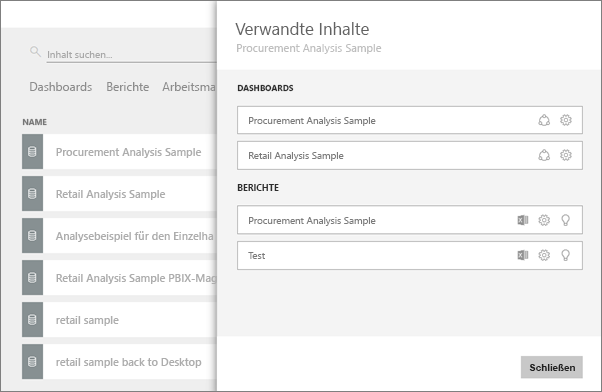

# Anzeigen verwandter Inhalte im Power BI-Dienst
Im Bereich **verwandte Inhalte** sehen Sie, wie Ihre Inhalte im Power BI-Dienst (Dashboards, Berichte und Datasets) miteinander verbunden sind. Der Bereich „Verwandte Inhalte“ ist auch eine Startplattform für die Ausführung von Aktionen. Von hier aus können Sie aktualisieren, umbenennen, Einblicke generieren und vieles mehr. Wenn Sie einen verwandten Bericht oder ein verwandtes Dashboard auswählen, wird das ausgewählte Element in Ihrem Power BI-Arbeitsbereich geöffnet.   

In Power BI basieren Berichte auf Datasets, werden visuelle Berichtselemente an Dashboards angeheftet, und visuelle Dashboardelemente sind wiederum mit Berichten verknüpft. Aber woher wissen Sie, welche Dashboards visuelle Elemente aus Ihrem Marketingbericht hosten? Und wie finden Sie diese Dashboards? Basieren die visuellen Elemente in Ihrem Beschaffungsdashboard auf mehreren Datasets? Und falls ja: Wie heißen sie, und wie können Sie sie öffnen und bearbeiten? Wird Ihr HR-Dataset überhaupt in einem Bericht oder Dashboard genutzt? Kann es verschoben werden, ohne dass fehlerhafte Links entstehen? Fragen wie diese werden alle im Bereich **Verwandte Inhalte** beantwortet.  Der Bereich enthält nicht nur die verwandten Inhalte, sondern ermöglicht auch, Aktionen auszuführen und komfortabel zwischen den verwandten Inhalten zu navigieren.

> [!NOTE]
> Das Feature „Verwandte Inhalte“ kann nicht für Streamingdatasets verwendet werden.
> 
> 

## Anzeigen verwandter Inhalte für ein Dashboard
Sehen Sie sich an, wie Will verwandte Inhalte für ein Dashboard anzeigt. Befolgen Sie dann die detaillierten Anweisungen unter dem Video, um es selbst mit dem Beispieldataset für die Beschaffungsanalyse auszuprobieren.

<iframe width="560" height="315" src="https://www.youtube.com/embed/B2vd4MQrz4M#t=3m05s" frameborder="0" allowfullscreen></iframe>

Zum Öffnen des Bereichs **Verwandte Inhalte** benötigen Sie mindestens *Anzeigeberechtigungen* für ein Dashboard. In diesem Beispiel verwenden wir das [Analysebeispiel für Beschaffung](../sample-procurement.md).

**1. Methode**

Wählen Sie in einem Arbeitsbereich die Registerkarte **Dashboards** und anschließend das **Verwandte Inhalte**-Symbol  aus.

 

**2. Methode**

Wenn Sie ein Dashboard geöffnet haben, klicken Sie auf    in der oberen Menüleiste.

Der Bereich **Verwandte Inhalte** wird geöffnet. Hier finden Sie alle Berichte, für die Visualisierungen an das Dashboard angeheftet sind, sowie die dazugehörigen Datasets. Für dieses Dashboard sind Visualisierungen aus drei verschiedenen Berichten angeheftet, und diese Berichte basieren auf drei verschiedenen Datasets.

Von hier aus können Sie direkt Aktionen für die verwandten Inhalte ausführen.  Wählen Sie beispielsweise einen Berichtsnamen aus, um den entsprechenden Bericht zu öffnen.  Durch Auswählen eines Symbols für einen aufgeführten Bericht können Sie ihn [in Excel analysieren](../service-analyze-in-excel.md), [umbenennen](../service-rename.md) oder [Einblicke erhalten](end-user-insights.md). Für ein Dataset können Sie durch Auswählen eines Symbols [einen neuen Bericht erstellen](../service-report-create-new.md), das Dataset [aktualisieren](../refresh-data.md), umbenennen oder [in Excel analysieren](../service-analyze-in-excel.md), [Einblicke erhalten](end-user-insights.md) oder das Fenster **Einstellungen** für das Dataset öffnen.  

## Anzeigen verwandter Inhalte für einen Bericht
Zum Öffnen des Bereichs **Verwandte Inhalte** benötigen Sie mindestens *Anzeigeberechtigungen* für einen Bericht. In diesem Beispiel verwenden wir das [Analysebeispiel für Beschaffung](../sample-procurement.md).

**1. Methode**

Wählen Sie in einem Arbeitsbereich die Registerkarte **Berichte** und anschließend das **Verwandte Inhalte anzeigen**-Symbol  aus.

 

**2. Methode**

Öffnen Sie den Bericht in der [Leseansicht](end-user-reading-view.md), und wählen Sie in der oberen Menüleiste das Symbol  aus.

Der Bereich **Verwandte Inhalte** wird geöffnet. Hier finden Sie das zugeordnete Dataset sowie alle Dashboards mit mindestens einer angehefteten Kachel aus dem Bericht. Bei diesem Bericht sind Visualisierungen an zwei verschiedene Dashboards angeheftet.

Von hier aus können Sie direkt Aktionen für die verwandten Inhalte ausführen.  Wählen Sie beispielsweise einen Dashboardnamen aus, um das entsprechende Dashboard zu öffnen.  Für jedes Dashboard in der Liste können Sie durch Auswählen eines Symbols [das Dashboard für andere freigeben](../service-share-dashboards.md) oder das Fenster **Einstellungen** für das Dashboard öffnen. Für das Dataset können Sie durch Auswählen eines Symbols [einen neuen Bericht erstellen](../service-report-create-new.md), das Dataset [aktualisieren](../refresh-data.md), umbenennen oder [in Excel analysieren](../service-analyze-in-excel.md), [Einblicke erhalten](end-user-insights.md) oder das Fenster **Einstellungen** für das Dataset öffnen.  

## Anzeigen verwandter Inhalte für ein Dataset
Zum Öffnen des Bereichs **Verwandte Inhalte** benötigen Sie mindestens *Anzeigeberechtigungen* für ein Dataset. In diesem Beispiel verwenden wir das [Analysebeispiel für Beschaffung](../sample-procurement.md).

Wählen Sie in einem Arbeitsbereich die Registerkarte **Datasets** aus, und suchen Sie anschließend das **Verwandte Inhalte anzeigen**-Symbol aus  aus.

Wählen Sie das Symbol aus, um den Bereich **Verwandte Inhalte** zu öffnen.

Von hier aus können Sie direkt Aktionen für die verwandten Inhalte ausführen. Wählen Sie beispielsweise einen Dashboard- oder Berichtsnamen aus, um das entsprechende Dashboard oder den entsprechenden Bericht zu öffnen.  Für jedes Dashboard in der Liste können Sie durch Auswählen eines Symbols [das Dashboard für andere freigeben](../service-share-dashboards.md) oder das Fenster **Einstellungen** für das Dashboard öffnen. Durch Auswählen eines Symbols für einen Bericht können Sie ihn [in Excel analysieren](../service-analyze-in-excel.md), [umbenennen](../service-rename.md) oder [Einblicke erhalten](end-user-insights.md).  

## Einschränkungen und Problembehandlung
* Wenn Sie „Verwandte Inhalte anzeigen“ nicht sehen, suchen Sie stattdessen nach . Wählen Sie das Symbol aus, um den Bereich **Verwandte Inhalte** zu öffnen.
* Um verwandte Inhalte für einen Bericht öffnen zu können, müssen Sie sich in der [Leseansicht](end-user-reading-view.md) befinden.
* Das Feature „Verwandte Inhalte“ kann nicht für Streamingdatasets verwendet werden.

## Nächste Schritte
* [Erste Schritte mit dem Power BI-Dienst](../service-get-started.md)
* Weitere Fragen? [Wenden Sie sich an die Power BI-Community](http://community.powerbi.com/)

