# Überblick über den Berichtsbereich „Filter“
In diesem Artikel sehen wir uns den Berichtsbereich „Filter“ im Power BI-Dienst genauer an.

Es gibt viele verschiedene Arten von Datenfiltern in Power BI. Lesen Sie den Artikel [Informationen zu Filtern und Hervorhebungen](../power-bi-reports-filters-and-highlighting.md).

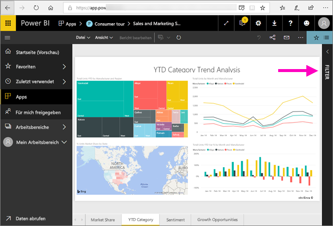

## Arbeiten mit dem Bereich „Filter“ in Berichten
Wenn ein Kollege einen Bericht mit Ihnen teilt, suchen Sie immer nach dem Bereich **Filter**. Manchmal befindet er sich zugeklappt am rechten Rand des Berichts. Klicken Sie darauf, um ihn aufzuklappen.   

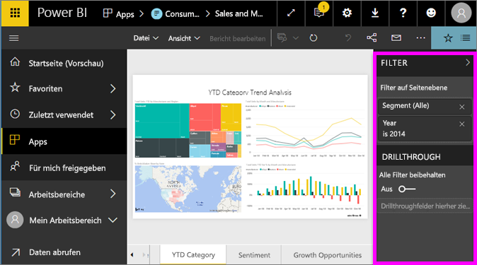

Der Bereich „Filter“ enthält Filter, die dem Bericht durch den Berichts-*Designer* hinzugefügt wurden. *Kunden* wie Sie können mit den Filtern interagieren und Ihre Änderungen speichern, aber dem Bericht keine neuen Filter hinzufügen. Auf dem obigen Screenshot hat der Designer beispielsweise zwei Filter auf Seitenebene hinzugefügt: „Segment“ und „Year“. Sie können mit diesen Filtern interagieren und sie ändern, Sie können jedoch keinen dritten Filter auf Seitenebene hinzufügen.

Im Power BI-Dienst speichern Berichte alle von Ihnen im Bereich „Filter“ vorgenommen Veränderungen, und diese Veränderungen werden in der mobilen Version des Berichts übernommen. Klicken Sie auf der oberen Menüleiste auf **Auf Standardwert zurücksetzen**, um den Bereich „Filter“ auf den Standard zurückzusetzen.     

## Öffnen Sie den Bereich „Filter“.
Wenn ein Bericht geöffnet ist, wird der Bereich „Filter“ auf der rechten Seite des Berichtszeichenbereichs angezeigt. Wenn der Bereich nicht angezeigt wird, können Sie ihn mit dem Pfeil in der oberen rechten Ecke erweitern.  

In diesem Beispiel arbeiten wir mit einer Visualisierung mit sechs Filtern. Auch die Berichtsseite verfügt über Filter, die Sie unter der Überschrift **Seitenfilter** finden. Es ist ein [Drillthrough-Filter](../power-bi-report-add-filter.md) vorhanden, und der gesamte Bericht weist ebenfalls einen Filter auf:  **Geschäftsjahr** ist 2013 oder 2014.

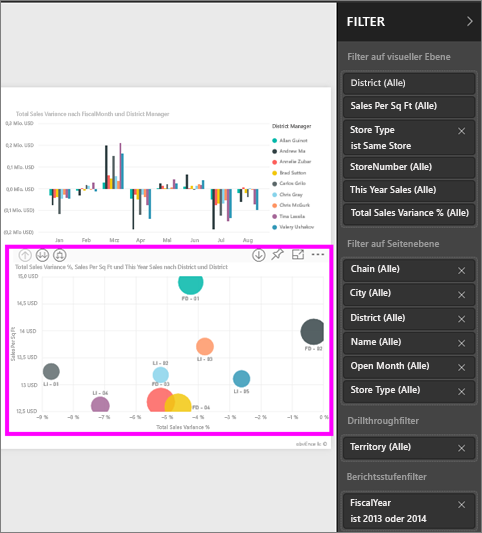

Neben einigen Filtern sehen Sie das Wort **Alle**; dies bedeutet, dass sämtliche Werte in den Filter eingeschlossen werden.  Beispiel: **Chain(Alle)** (siehe Screenshot oben) zeigt an, dass diese Berichtsseite Informationen über alle Ketten enthält.  Andererseits können wir der Angabe **Geschäftsjahr ist 2013 oder 2014** entnehmen, dass der Bericht ausschließlich Informationen aus den Geschäftsjahren 2013 und 2014 umfasst.

Jeder, der den Bericht aufruft, kann auch mit den Filtern interagieren.

- Durchsuchen Sie Filter auf Seiten-, Visual-, Berichts- oder Drillthroughebene, um den gewünschten Wert zu suchen und auszuwählen. 

    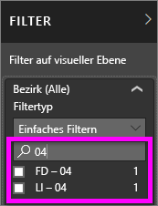

- Einzelheiten zum Filter können angezeigt werden, indem mit dem Cursor auf den Pfeil neben dem Filter gezeigt und dieser ausgewählt wird.
  
   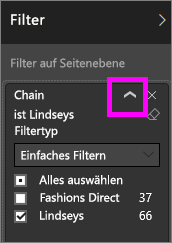
* Sie können den Filter anpassen, indem Sie z.B. **Lindseys** in **Fashions Direct** ändern.
  
     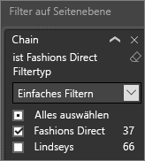

* Setzen Sie die Filter auf ihren Ausgangszustand zurück, indem Sie auf **Auf Standardwert zurücksetzen** in der oberen Menüleiste klicken.    
    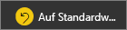
    
* Löschen Sie den Filter, indem Sie das **x** neben dem Filternamen auswählen.
  
    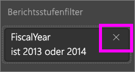

  Wenn Sie einen Filter löschen, wird nur der Filter aus der Liste entfernt. Die Informationen des Berichts bleiben selbstverständlich erhalten.  Beispiel: Wenn Sie den Filter **Geschäftsjahr gleich 2013 oder 2014** löschen, bleiben die Informationen zum Geschäftsjahr intakt. Da der Filter entfernt wurde, ist der Bericht dann allerdings nicht mehr auf die Geschäftsjahre 2013 und 2014 eingeschränkt. Vielmehr werden alle Geschäftsjahre, die in den Daten enthalten sind, angezeigt.  Sobald Sie einen Filter löschen, können Sie ihn nicht mehr anpassen, da er aus der Liste entfernt wird. Daher wird empfohlen, den Filter mit dem Radierersymbol  zu löschen.
  
  

## Löschen eines Filters
 Klicken Sie im erweiterten oder Standard-Filtermodus auf das Radierersymbol   , um den Filter zu löschen. 

## Arten von Filtern: Textfeldfilter
### Listenmodus
Das Aktivieren eines Kontrollkästchens aktiviert oder deaktiviert den Wert. Das Kontrollkästchen **Alle** kann verwendet werden, um den Status aller Kontrollkästchen ein- und auszuschalten. Die Kontrollkästchen stellen die verfügbaren Werte für dieses Feld dar.  Wenn Sie den Filter anpassen, wird er mit Ihrer Auswahl aktualisiert. 

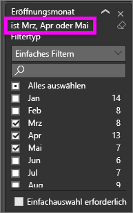

Beachten Sie, das die Anpassung jetzt „is Mar, Apr or May“ angibt.

### Erweiterter Modus
Wählen Sie **Erweiterte Filterung** aus, um in den erweiterten Modus zu wechseln. Verwenden Sie die Dropdownsteuerelemente und Textfelder, um die einzubeziehenden Felder zu identifizieren. Durch die Wahl zwischen **Und** und **Oder**können Sie komplexe Filterausdrücke erstellen. Wählen Sie die Schaltfläche **Filter anwenden** , wenn Sie die Werte wie gewünscht festgelegt haben.  

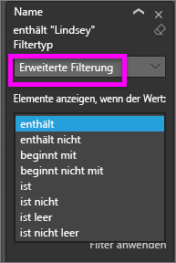

## Arten von Filtern: Nummernfeldfilter
### Listenmodus
Bei endlichen Werten wird beim Auswählen des Feldnamens eine Liste angezeigt.  Unter **Textfeldfilter** &gt; **Listenmodus** oben finden Sie Hilfe zur Verwendung von Kontrollkästchen.   

### Erweiterter Modus
Wenn die Werte unendlich sind oder einen Bereich darstellen, wird beim Auswählen des Feldnamens der erweiterte Filtermodus geöffnet. Verwenden Sie die Dropdownliste und Textfelder, um den Bereich von Werten anzugeben, die Sie anzeigen möchten. 

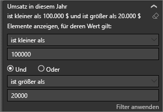

Durch die Wahl zwischen **Und** und **Oder**können Sie komplexe Filterausdrücke erstellen. Wählen Sie die Schaltfläche **Filter anwenden** , wenn Sie die Werte wie gewünscht festgelegt haben.

## Arten von Filtern: Datum und Uhrzeit
### Listenmodus
Bei endlichen Werten wird beim Auswählen des Feldnamens eine Liste angezeigt.  Unter **Textfeldfilter** &gt; **Listenmodus** oben finden Sie Hilfe zur Verwendung von Kontrollkästchen.   

### Erweiterter Modus
Wenn die Feldwerte Datum oder Uhrzeit darstellen, können Sie bei der Verwendung von Datums-/Uhrzeitfiltern eine Start- bzw. Endzeit angeben.  

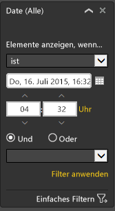

## Nächste Schritte
[Lernen Sie, wie und warum es zu Kreuzfilterung und -hervorhebung von Visualisierungen auf einer Berichtsseite kommt](end-user-interactions.md)