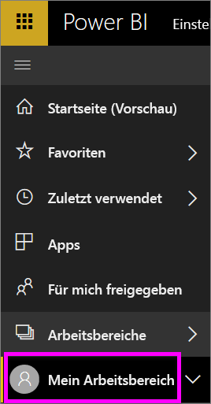
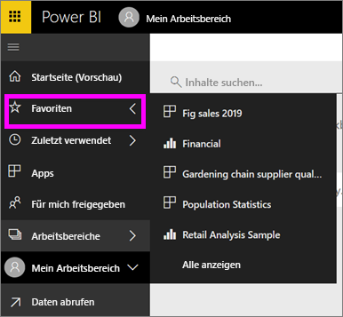

# Navigation: Suchen und Sortieren von Inhalten im Power BI-Dienst
Für die Navigation in Inhalten im Power BI-Dienst gibt es verschiedene Möglichkeiten. Die Inhalte sind in Ihrem Arbeitsbereich nach verschiedenen Typen unterteilt: Dashboards, Berichte, Arbeitsmappen und Datasets.  Außerdem sind Inhalte nach Nutzung kategorisiert: Favoriten, zuletzt verwendet, Apps, für mich freigegeben und ausgewählt. Für die Navigation an einem zentralen Ort organisiert die Startseite alle Inhalte auf einer Seite. Anhand dieser unterschiedlichen Wege, Inhalte aufzurufen, finden Sie schnell das Gesuchte im Power BI-Dienst.  

## Navigation in Arbeitsbereichen

Power BI-*Benutzer* haben in der Regel nur einen Arbeitsbereich: **Mein Arbeitsbereich**. **Mein Arbeitsbereich** enthält nur Inhalte, wenn Sie Beispiele von Microsoft heruntergeladen oder erstellt oder Ihre eigenen Inhalte heruntergeladen haben.  

In **Mein Arbeitsbereich** unterteilt der Power BI-Dienst Ihre Inhalte nach Typ: Dashboards, Berichte, Arbeitsmappen und Datasets. Wenn Sie einen Arbeitsbereich auswählen, wird diese Unterteilung angezeigt. In diesem Beispiel enthält **Mein Arbeitsbereich** ein Dashboard, zwei Berichte, keine Arbeitsmappe und zwei Datasets.

________________________________________

## Navigation über die linke Navigationsleiste
Auf der linken Navigationsleiste werden Inhalte so klassifiziert, dass Sie das Gesuchte schnell und einfach finden können.  

- Inhalte, die für Sie freigegeben werden, sind unter **Für mich freigegeben** verfügbar.
- Der von Ihnen zuletzt angezeigt Inhalt steht unter **Zuletzt verwendet** zur Verfügung. 
- Ihre Apps finden Sie durch Auswahl von **Apps**.
- **Start** ist eine Einzelseitenansicht Ihrer wichtigsten Inhalte und vorgeschlagenen Inhalte sowie Lernquellen.

Außerdem können Sie Inhalte als [Favorit](end-user-favorite.md) und [Ausgewählt](end-user-featured.md) markieren. Wählen Sie das Dashboard aus, das Sie voraussichtlich am häufigsten öffnen, und legen Sie es als *ausgewähltes* Dashboard fest. Immer wenn Sie den Power BI-Dienst öffnen, wird Ihr ausgewähltes Dashboard zuerst angezeigt. Haben Sie eine Reihe von Dashboards und Apps, die Sie häufig aufrufen? Sie können sie als Favoriten festlegen, damit sie im linken Navigationsbereich immer verfügbar sind.

.

## Zu beachtende Aspekte und Problembehandlung
* Für Datasets kann mit der Option **Sortieren nach** nicht nach Besitzer sortiert werden.

## Nächste Schritte
[Power BI – Grundkonzepte](end-user-basic-concepts.md)

Weitere Fragen? [Wenden Sie sich an die Power BI-Community](http://community.powerbi.com/)
