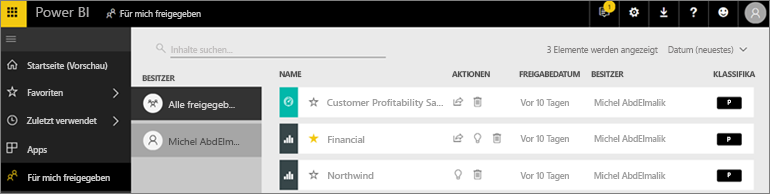
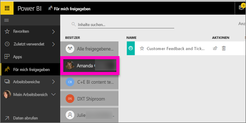

# Anzeigen der Dashboards und Berichte, die mit mir geteilt wurden
## Für mich freigegeben

Wenn ein Kollege Inhalte mit Ihnen teilt und dazu die Schaltfläche **Freigeben** verwendet, werden diese in Ihrem Container **Für mich freigegeben** angezeigt. Das Dashboard oder der Bericht ist nur über **Für mich freigegeben** und nicht über **Apps** verfügbar.

Sehen Sie sich an, wie Amanda die Inhaltsliste **Für mich freigegeben** erläutert und veranschaulicht, wie Sie durch die Liste navigieren und sie filtern. Befolgen Sie dann die schrittweisen Anleitungen unter dem Video, um es selbst ausprobieren. Damit Sie Dashboards anzeigen können, die für Sie freigegeben sind, benötigen Sie eine Power BI Pro-Lizenz. Details finden Sie unter [Was ist Power BI Premium?](../service-premium.md).

<iframe width="560" height="315" src="https://www.youtube.com/embed/G26dr2PsEpk" frameborder="0" allowfullscreen></iframe>

Sie erhalten Möglichkeiten zum Interagieren mit den Dashboards und Berichten, je nach den Berechtigungen, die Ihnen der Designer erteilt. Hierzu zählt die Fähigkeit zum Kopieren des Dashboards, zum Öffnen des Berichts [in der Leseansicht](end-user-reading-view.md) und zum erneuten Freigeben für andere Kollegen.

## Im Container **Für mich freigegeben** verfügbare Aktionen
* Wählen Sie das Sternsymbol aus, um [ein Dashboard oder einen Bericht als Favoriten hinzuzufügen](end-user-favorite.md).
* Entfernen eines Dashboards oder Berichts  
* Manche Dashboards und Berichte können erneut geteilt werden  
* Wenn Ihre Listen sehr umfangreich werden, können Sie zudem [das Suchfeld und die Sortierfunktion verwenden, um das Gewünschte zu suchen](end-user-search-sort.md).
  
  > [!NOTE]
  > Um Informationen zu EGRC-Klassifizierungen zu erhalten, wählen Sie die Klassifizierungsschaltfläche aus, oder besuchen Sie [Datenklassifizierung für Dashboards](../service-data-classification.md).
  > 
  > 
* Wählen Sie den Namen eines Dashboards aus, um es zu öffnen und zu untersuchen. Nachdem Sie das freigegebene Dashboard geöffnet haben, können Sie mithilfe von Q&A Fragen zu den zugrunde liegenden Daten stellen oder eine Kachel auswählen, um den Bericht zu öffnen und in der Leseansicht mit ihm zu interagieren.

## Filtern von freigegebenen Dashboards nach Besitzer
Die Inhalte im Bildschirm **Für mich freigegeben** können nach dem Besitzer der Inhalte gefiltert werden. Wenn ich beispielsweise **Amanda** auswähle, wird nur das Dashboard angezeigt, das Amanda für mich freigegeben hat.

