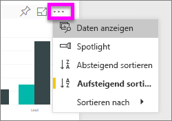
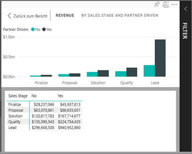
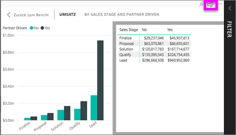

# Anzeigen der Daten, die zum Erstellen der Visualisierung verwendet wurden
## Daten anzeigen
Eine Power BI-Visualisierung wird mithilfe von Daten aus zugrunde liegenden Datasets erstellt. Sie haben in Power BI die Möglichkeit, die Daten *anzuzeigen*, die der Visualisierung zugrunde liegen. Wenn Sie **Daten anzeigen** auswählen, werden die Daten in Power BI unter (oder neben) der Visualisierung angezeigt.

## Verwenden von *Daten anzeigen* im Power BI-Dienst
1. Öffnen Sie im Power BI-Dienst einen Bericht, und wählen Sie ein Visual aus.  
2. Klicken Sie zum Anzeigen der für das Visual verwendeten Daten auf die Auslassungspunkte (...) und dann auf **Daten anzeigen**.
   
   
3. Standardmäßig werden die Daten unter der Visualisierung angezeigt.
   
   

4. Wählen Sie zum Ändern der Ausrichtung rechts oben in der Visualisierung das vertikale Layout  aus.
   
   

### Nächste Schritte
[Visualisierungen in Power BI-Berichten](../visuals/power-bi-report-visualizations.md)    
[Power BI-Berichte](end-user-reports.md)    
