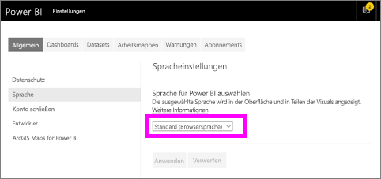
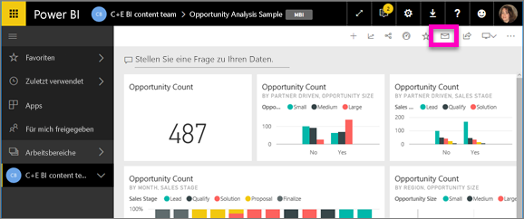
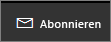
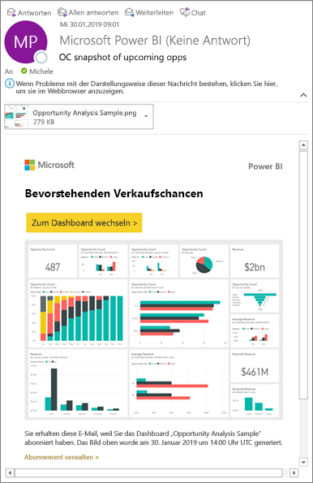
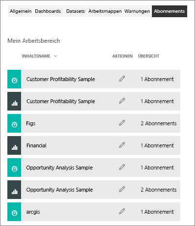

# Abonnieren eines Berichts oder Dashboards im Power BI-Dienst 
Es war noch nie so einfach, bei den wichtigsten Dashboards und Berichten auf dem aktuellen Stand zu bleiben. Wenn Sie die Berichtsseiten und Dashboards abonnieren, die für Sie am wichtigsten sind, erhalten Sie von Power BI per E-Mail eine Momentaufnahme. Sie geben an, wie oft Sie E-Mails von Power BI erhalten möchten: täglich, wöchentlich oder wenn die Daten aktualisiert werden. Sie können sogar eine spezifische Uhrzeit festlegen, zu der Power BI die E-Mails sendet, oder die Ausführung sofort starten.  

Für E-Mails und Momentaufnahmen wird die Sprache verwendet, die in den Power BI-Einstellungen festgelegt ist. Weitere Informationen finden Sie unter [Unterstützte Sprachen und Länder/Regionen für Power BI](../supported-languages-countries-regions.md). Wenn keine Sprache definiert ist, verwendet Power BI die Sprache, die der Gebietsschemaeinstellung Ihres aktuellen Browsers entspricht. Sie können die Spracheinstellung anzeigen bzw. festlegen, indem Sie zuerst auf das Zahnradsymbol  >  **und dann auf Einstellungen > Allgemein > Sprache** klicken. 

Die E-Mail, die Sie erhalten, enthält einen Link, mit dem Sie zum Bericht/Dashboard wechseln können. Wenn Sie diesen Link auf mobilen Geräten auswählen, auf denen Power BI-Apps installiert sind, wird die App gestartet (statt die Standardaktion auszuführen, d.h. den Bericht oder das Dashboard auf der Power BI-Website zu öffnen).

## Anforderungen
Das **Erstellen** eines Abonnements ist ein Feature von Power BI Pro.   

## Abonnieren eines Berichts oder Dashboards
Egal, ob Sie ein Dashboard oder einen Bericht abonnieren – der Vorgang ist ähnlich. Sie können Dashboards und Berichte im Power BI-Dienst über dieselbe Schaltfläche abonnieren.
 
.

1. Öffnen Sie das Dashboard oder den Bericht.
2. Klicken Sie in der oberen Menüleiste auf **Abonnieren**, oder klicken Sie auf das Briefumschlagsymbol .
   
   

   
    
    Die linke Anzeige wird angezeigt, wenn Sie in einem Dashboard auf **Abonnieren** klicken. Die rechte Anzeige wird angezeigt, wenn Sie auf einer Berichtsseite auf **Abonnieren** klicken. Klicken Sie auf **Weiteres Abonnement hinzufügen**, und wählen Sie die gewünschten Seiten aus, um mehrere Seiten in einem Bericht zu abonnieren. 

4. Mithilfe des gelben Schiebereglers können Sie das Abonnement aktivieren und deaktivieren.  Wenn Sie den Schieberegler auf „Aus“ stellen, wird das Abonnement nicht gelöscht. Verwenden Sie zum Löschen des Abonnements das Papierkorbsymbol.

4. Fügen Sie optional E-Mail-Adressinformationen hinzu. 

5. Wählen Sie eine Option für **Häufigkeit** für Ihr Abonnement aus.  Ihnen stehen folgende Optionen zur Verfügung: Täglich, Wöchentlich und Nach Datenaktualisierung (einmal täglich).  Wenn Sie die E-Mail des Abonnements nur an bestimmten Tagen erhalten möchten, können Sie **Wöchentlich** und dann die konkreten Tage auswählen.  Wenn Sie die E-Mail des Abonnements zum Beispiel nur an Werktagen erhalten möchten, können Sie **Wöchentlich** für die Häufigkeit auswählen und die Kontrollkästchen bei „Sa“ und „So“ deaktivieren.   

6. Planen Sie den Zeitpunkt, zu dem die E-Mail gesendet wird, indem Sie „Täglich“ oder „Wöchentlich“ auswählen und einen **geplanten** **Zeitpunkt** für das Abonnement festlegen.   

7. Legen Sie das Start- und Enddatum fest, indem Sie die Datumsangaben in die Datumsfelder eingeben. Der Startzeitpunkt Ihres Abonnements ist standardmäßig das Datum, an dem Sie es erstellt haben, und das Enddatum ist standardmäßig ein Jahr später. Wenn ein Abonnement ein Enddatum erreicht, wird es deaktiviert, bis Sie es erneut aktivieren.  Vor dem geplanten Enddatum werden Sie per Benachrichtigung(en) gefragt, ob Sie das Abonnement verlängern möchten.     

8. Klicken Sie auf **Jetzt ausführen**, um Ihr Abonnement zu überprüfen und auszuprobieren.  Dadurch wird Ihnen die E-Mail sofort gesendet. 

8. Wenn alles in Ordnung ist, klicken Sie auf **Speichern und schließen**, um das Abonnement zu speichern. Sie erhalten eine E-Mail und eine Momentaufnahme des Dashboards oder Berichts gemäß des festgelegten Zeitplans. Für alle Abonnements, für die die Häufigkeit **Nach Datenaktualisierung** festgelegt ist, werden E-Mails erst nach der ersten geplanten Aktualisierung des Tages versendet.
   
   
   
    Durch das Aktualisieren der Berichtsseite wird nicht das Dataset aktualisiert. Nur der Besitzer des Datasets kann ein Dataset manuell aktualisieren. Um den Namen des zugrunde liegenden Datasets nachzuschlagen, wählen Sie in der oberen Menüleiste **Verwandte Inhalte anzeigen** aus.
   
    

## Verwalten Ihrer Abonnements
Nur Sie können Ihre Abonnements verwalten. Klicken Sie erneut auf **Abonnieren**, und klicken Sie dann in der unteren linken Ecke auf **Alle Abonnements verwalten** (siehe Screenshots oben). 

Ein Abonnement wird beendet, wenn die Pro-Lizenz abläuft, das Dashboard oder der Bericht vom Besitzer gelöscht wird oder das zum Erstellen des Abonnements verwendete Benutzerkonto gelöscht wird.

## Zu beachtende Aspekte und Problembehandlung
* Dashboards mit mehr als 25 angehefteten Kacheln oder vier angehefteten Berichtsseiten werden in an Benutzer gesendeten Abonnement-E-Mails möglicherweise nicht vollständig dargestellt. Es wird empfohlen, dass Sie die Anzahl der angehefteten Kacheln auf unter 25 und der angehefteten Liveberichten auf unter vier reduzieren, um sicherzustellen, dass die E-Mails ordnungsgemäß dargestellt werden.  
* Wenn auf Kacheln Sicherheit auf Zeilenebene (Row Level Security, RLS) angewendet wurde, werden diese Kacheln bei Dashboard-E-Mail-Abonnements nicht angezeigt.  Wenn das Dataset RLS verwendet, können Sie kein neues Abonnement für Berichts-E-Mail-Abonnements erstellen.
* Abonnements von Berichtseiten sind mit dem Namen der Berichtseite verknüpft. Wenn Sie eine Berichtsseite abonnieren und diese umbenannt wird, müssen Sie Ihr Abonnement erneut erstellen.
* Wenn Sie das Abonnementfeature nicht verwenden können, wenden Sie sich an Ihren Systemadministrator. Möglicherweise hat Ihre Organisation das Feature aus Authentifizierungs- oder anderen Gründen deaktiviert.  
* E-Mail-Abonnements bieten keine Unterstützung für die meisten [benutzerdefinierten Visuals](../power-bi-custom-visuals.md).  Die Ausnahme sind benutzerdefinierte Visuals, die [zertifiziert](../power-bi-custom-visuals-certified.md) wurden.  
* E-Mail-Abonnements bieten aktuell keine Unterstützung für R-gestützte benutzerdefinierte Visuals.  
* Insbesondere für Abonnements von Dashboards werden bestimmte Typen von Kacheln noch nicht unterstützt.  Dazu zählen Streamingkacheln, Videokacheln und benutzerdefinierte Kacheln mit Webinhalten.     
* Aufgrund der Beschränkungen für die E-Mail-Größe können Dashboards oder Berichte mit extrem großen Bildern möglicherweise nicht abonniert werden.    
* Die Aktualisierung von Datasets, die mit Dashboards und Berichten verknüpft sind, die seit mehr als zwei Monaten nicht besucht wurden, wird von Power BI automatisch deaktiviert.  Wenn Sie jedoch einem Dashboard oder Bericht ein Abonnement hinzufügen, wird die Aktualisierung nicht ausgesetzt, auch wenn das Dashboard bzw. der Bericht längere Zeit nicht besucht wurde.    

## Nächste Schritte

[Suchen und Sortieren von Inhalten](end-user-search-sort.md)
