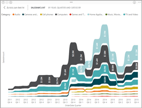

# Visualisierungstypen in Power BI
In Berichten, Dashboards, Apps und Q&A finden Sie Visualisierungen. Einige der Visualisierungstypen sind in Power BI enthalten, und einige andere sind *benutzerdefinierte Visuals*. Benutzerdefinierte Visuals werden außerhalb von Power BI erstellt, damit *Berichts-Designer* sie zu Power BI-Berichten, -Dashboards und -Apps hinzufügen können. 

Dieser Artikel bietet eine Übersicht über die in Power BI enthaltenen Visualisierungen.  Auf diese Visualisierungen werden Sie die meiste Zeit stoßen. 

> [!NOTE]
> Erkunden Sie den Abschnitt **Power BI-Visuals** von [Microsoft AppSource](https://appsource.microsoft.com/marketplace/apps?product=power-bi-visuals), um mehr über benutzerdefinierte Visuals zu erfahren. Zu jedem Visual finden Sie eine Beschreibung, Informationen zum Ersteller und Screenshots oder ein Video. 

## Liste der in Power BI verfügbaren Visualisierungen
Alle hier genannten Visualisierungen finden Sie in Power BI-Apps, -Dashboards und -Berichten, und Sie können sie [in Q&A angeben](#gna).

### Flächendiagramme: einfach (überlappend) und gestapelt

Das einfache Flächendiagramm basiert auf dem Liniendiagramm, wobei beim Flächendiagramm der Bereich zwischen Achse und Linie ausgefüllt ist. Flächendiagramme betonen das Ausmaß von Veränderungen im Laufe der Zeit und können dazu genutzt werden, um den gesamten Wert über einen Trend hinweg hervorzuheben. Beispielsweise können Daten, die den Gewinn im Zeitverlauf darstellen, in ein Flächendiagramm gezeichnet werden, um den Gesamtgewinn zu verdeutlichen.

### Balken- und Säulendiagramme

 

Balkendiagramme sind die Standarddarstellung für einen bestimmten Wert über verschiedene Kategorien hinweg.

### Karten: einzelne Zahl

Karten mit einzelnen Zahlen zeigen einen einzelnen Fakt bzw. Datenpunkt an. Manchmal ist eine einzelne Zahl das Wichtigste, das Sie in Ihrem Power BI-Dashboard oder Bericht nachverfolgen möchten, wie z.B. der Gesamtumsatz, der Marktanteil im Jahresverlauf oder die Gesamtverkaufschancen.  

### Karten: mehrzeilig

Mehrzeilige Infokarten zeigen einen oder mehrere Datenpunkte in ihrer eigenen Zeile an.

### Kombinationsdiagramme

Ein Kombinationsdiagramm vereinigt ein Säulendiagramm und ein Liniendiagramm. Die Kombination von zwei Diagrammen in einem ermöglicht einen schnelleren Vergleich von Daten. Kombinationsdiagramme können eine oder zwei Y-Achsen aufweisen, achten Sie also genau darauf. 

Kombinationsdiagramme sind gut für folgende Zwecke geeignet:
- Bei einem Liniendiagramm und ein Säulendiagramm mit der gleichen X-Achse
- Zum Vergleichen mehrerer Measures mit verschiedenen Wertebereichen
- Zum Verdeutlichen der Zusammenhänge zweier Measures in einer Visualisierung
- Zum Prüfen, ob eine Kennzahl das durch eine andere Kennzahl vorgegebene Ziel erfüllt
- Zur Platzersparnis im Zeichenbereich

### Ringdiagramme

Ringdiagramme ähneln Kreisdiagrammen.  Sie zeigen die Beziehung von Teilen zu einem Ganzen. Der einzige Unterschied ist, dass die Mitte leer und Platz für eine Beschriftung oder ein Symbol bleibt.

### Trichterdiagramme

Trichter unterstützen die Visualisierung von Prozessen mit Phasen, bei denen Elemente fortlaufend von einer Phase in die nächste übergehen.  Ein Vertriebsprozess der mit Leads beginnt und mit dem vollendeten Kauf endet ist ein Beispiel dafür.

Ein Beispiel ist etwa ein Trichterdiagramm für den Verkauf, das die von den Kunden durchlaufenen Phasen nachverfolgt: Lead > Qualifizierter Lead > Potenzieller Kunde > Vertrag > Abschluss. Die Form des Trichterdiagramms zeigt auf einen Blick den Zustand des nachverfolgten Prozesses an.
Jede Phase des Diagramms stellt einen prozentualen Anteil am Gesamtwert dar. Daher hat ein Trichterdiagramm in den meisten Fällen die Form eines Trichters, wobei die erste Phase am größten und jede nachfolgende Phase etwas kleiner ist. Ein birnenförmiges Diagramm ist hilfreich, um ein Problem im Prozess zu identifizieren. In der Regel ist jedoch die erste Phase (die „Trichteröffnung“) am größten.

Trichterdiagramme sind gut für folgende Zwecke geeignet:
- Bei fortlaufenden Daten über mindestens vier Phasen hinweg
- Bei einer voraussichtlich größeren Anzahl an „Elementen“ in der ersten Phase im Vergleich zur letzten Phase
- Zum Berechnen potenzieller Werte (Umsatz/Verkäufe/Aufträge usw.) nach Phasen
- Zum Berechnen und Nachverfolgen der Konvertierungs- und Kundenbindungsrate
- Zum Erkennen von Engpässen in einem linearen Prozess
- Zum Nachverfolgen des Workflows in Bezug auf den Warenkorb
- Zum Nachverfolgen des Fortschritts und Erfolgs von Click-Through-Werbe-/Marketingkampagnen

### Messgerätdiagramme

Ein Diagramm für ein radiales Messgerät verfügt über einen Kreisbogen und zeigt einen einzelnen Wert an, mit dem der Fortschritt bei Erreichen eines Ziels oder KPI-Werts gemessen wird. Das Ziel bzw. der Zielwert wird durch die Linie (Nadel) dargestellt. Der Fortschritt zur Erreichung des Ziels wird durch die Schattierung dargestellt. Der Wert, der für diesen Fortschritt steht, ist innerhalb des Bogens in Fettschrift angegeben. Alle möglichen Werte sind gleichmäßig auf den Bogen verteilt, vom kleinsten Wert (ganz links) bis zum höchsten Wert (ganz rechts).

Im Beispiel oben fungieren wir als Autohändler, der die durchschnittlichen Verkäufe seines Vertriebsteams pro Monat verfolgt. Unser Ziel ist der Wert 140, der durch die schwarze Nadel angegeben ist. Der kleinste Wert für die durchschnittlichen Verkäufe ist 0, und der höchste Wert ist auf 200 festgelegt. Die blaue Schattierung zeigt, dass im aktuellen Monat derzeit ein Durchschnitt von ca. 120 Verkäufen erzielt wurde. Glücklicherweise ist noch eine Woche Zeit, um unser gestecktes Ziel zu erreichen.

Radiale Messgeräte sind gut für folgende Zwecke geeignet:
- Anzeigen des Fortschritts zur Erreichung eines Ziels
- Darstellen eines Quantil-Measures, z. B. eines KPI
- Anzeigen der Integrität eines Measures
- Anzeigen von Informationen, die schnell überblickt und verstanden werden

<!-- ### Key influencers chart

A key influencer chart displays the major contributors to a selected result or value.  -->

### KPIs

Ein Key Performance Indicator (KPI) ist ein visueller Hinweis, mit dem der Fortschritt in Bezug auf ein messbares Ziel kommuniziert wird. 

KPIs sind für folgende Zwecke gut geeignet:
- zum Messen des Fortschritts (wo habe ich Vorsprung, wo bin ich im Rückstand?)
- zum Messen der Entfernung bis zum Ziel (wie groß ist mein Vorsprung oder Rückstand?)

### Liniendiagramme

Liniendiagramme heben die allgemeine Form einer ganzen Wertereihe hervor, in der Regel im Zeitverlauf.

### Karten: einfache Karten

Verwenden Sie eine einfache Karte, um kategorische und quantitative Informationen mit räumlichen Standorten zu verknüpfen.

### Karten: ArcGIS-Karten

Die Kombination von ArcGIS Maps und Power BI bietet völlig neue Möglichkeiten der Kartendarstellung, die über die Darstellung von Punkten auf einer Karte weit hinausgeht. Die verfügbaren Optionen für Basiskarten, Standorttypen, Designs, Symbolstile und Referenzebenen ermöglichen das Erstellen von beeindruckenden, aussagekräftigen Kartenvisualisierungen. Die Kombination von autoritativen Datenebenen (z.B. Volkszählungsdaten) auf einer Karte mit räumlicher Analyse vermittelt ein tieferes Verständnis der Daten in der Visualisierung.

### Karten: gefüllte Karten (Choropleth)

In einem Flächenkartogramm wird mithilfe von Schattierungen, Farben oder Mustern angezeigt, in welchem Verhältnis Werte innerhalb eines geografischen Gebiets stehen. Diese relativen Unterschiede werden mithilfe von Schattierungen angezeigt, wobei hell eine geringe Menge/Häufigkeit und dunkel eine große Menge/Häufigkeit anzeigt.

### Karten: Flächenkartogramme

Flächenkartogramme vergleichen Regionen auf einer Karte mithilfe von Farben. Im Gegensatz zum Visual „Karte“ kann das Visual „Flächenkartogramm“ keine genauen geografischen Standorte von Datenpunkten auf einer Karte anzeigen. Stattdessen soll es vor allem Regionen auf einer Karte in Beziehung zueinander setzen, indem diese unterschiedliche Farben erhalten.

### Matrix

Das Visual „Matrix“ ist eine Art Tabellenvisual (siehe „Tabelle“ unten), das ein abgestuftes Layout unterstützt. Berichts-Designer fügen Matrixvisuals oft in Berichte und Dashboards ein, damit Benutzer mindestens ein Element (Zeilen, Spalten, Zellen) auswählen können, um es anderen Visuals auf einer Berichtseite gegenüberzustellen.  

### Kreisdiagramme

Kreisdiagramme zeigen die Beziehung von Teilen zum Ganzen. 

### Bänderdiagramm

Bänderdiagramme zeigen, welche Datenkategorie den höchsten Rang (bzw. höchsten Wert) hat. Menübanddiagramme eignen sich gut zum Anzeigen von Rangänderungen, wobei der höchste Rang (Wert) immer für jeden Zeitraum oben angezeigt wird.

### Punkt-, Blasen- und Punktplotdiagramme

Ein Punktdiagramm weist immer zwei Wertachsen auf, sodass ein Satz von numerischen Daten entlang einer horizontalen Achse und ein anderer Satz von numerischen Werten entlang einer vertikalen Achse angezeigt werden. Das Diagramm zeigt Schnittpunkte von x- und y-Zahlenwerten an, wobei diese Werte in jeweils einem einzelnen Punkt kombiniert werden. Diese Datenpunkte können in Abhängigkeit von den Daten gleichmäßig oder ungleichmäßig auf der horizontalen Achse verteilt sein.

In einem Blasendiagramm werden Datenpunkte durch Blasen ersetzt. Hierbei repräsentiert die Größe der Blase eine zusätzliche Dimension der Daten.

Punktplotdiagramme ähneln Blasen- und Punktdiagrammen mit der Ausnahme, dass numerische oder Kategoriedaten entlang der X-Achse dargestellt werden können.

### Punktdiagramme mit hoher Dichte

Definitionsgemäß werden Stichproben von Daten mit hoher Dichte entnommen, um schnell Visualisierungen zu erstellen, die auf Interaktivität reagieren. Die Stichprobenentnahme mit hoher Dichte nutzt einen Algorithmus, der überlappende Punkte ausschließt und sicherstellt, dass alle Punkte im Dataset im Visual dargestellt werden. Es wird nicht lediglich eine Stichprobe der Daten dargestellt.  

Damit werden Reaktionsfähigkeit, Darstellung und die Erhaltung von wichtigen Punkten im gesamten Dataset optimal miteinander vereint.

### Datenschnitte

Ein Datenschnitt ist ein eigenständiges Diagramm, das dazu verwendet werden kann, andere Visuals auf der Seite zu filtern. Für Datenschnitte gibt es viele verschiedene Formate (Kategorie, Bereich, Datum usw.) und sie können dazu konfiguriert werden, die Auswahl nur eines, vieler oder aller verfügbarer Werte zuzulassen. 

Datenschnitte sind für folgende Zwecke geeignet:
- Anzeigen häufig verwendeter oder wichtiger Filter für den einfacheren Zugriff im Zeichenbereich des Berichts
- Einfacheres Anzeigen des aktuellen gefilterten Zustands, ohne dass das Öffnen einer Dropdownliste erforderlich ist
- Filtern nach Spalten, die nicht benötigt und in den Datentabellen ausgeblendet werden
- Erstellen fokussierterer Berichte durch das Einfügen von Datenschnitten neben wichtigen visuellen Elementen

### Eigenständige Bilder

Ein eigenständiges Bild ist eine Grafik, die einem Bericht oder Dashboard hinzugefügt wurde. 

### Tabellen

Eine Tabelle ist ein Raster, das zusammengehörende Daten in einer logischen Folge von Zeilen und Spalten enthält. Zudem können auch Kopfzeilen und eine Zeile für Summen enthalten sein. Tabellen empfehlen sich insbesondere für quantitative Vergleiche, bei denen Sie viele Werte einer einzigen Kategorie betrachten. In dieser Tabelle werden beispielsweise fünf verschiedene Measures für die Kategorie angezeigt.

Tabellen sind für folgende Zwecke gut geeignet:
- Anzeigen und Vergleichen detaillierter Daten und genauer Werte (anstelle von visuellen Darstellungen)
- Auflisten von Daten in einem Tabellenformat
- Anzeigen numerischer Daten nach Kategorien

### Treemaps

Kacheldiagramme sind Diagramme mit farbigen Rechtecken, deren Größe einen Wert darstellt.  Sie können eine hierarchische Struktur aufweisen, bei denen Rechtecke in den Hauptrechtecken geschachtelt werden. Die Größe der einzelnen Rechtecke hängt von den gemessenen Werten ab. Die Rechtecke werden von oben links (das Größte) nach unten rechts (das Kleinste) angeordnet.

Treemaps sind gut geeignet:
- Zum Anzeigen großer Mengen hierarchischer Daten
- Bei einer Anzahl von Werten, die für ein Balkendiagramm zu groß wäre
- Zum Darstellen des Verhältnisses zwischen den einzelnen Teilen und der Gesamtmenge
- Zum Anzeigen der Verteilung der einzelnen Werte innerhalb jeder Kategorieebene in der Hierarchie
- Zum Anzeigen von Attributen über Größe und Farbcodierung
- Zum Erkennen von Mustern, Ausreißern, den wichtigsten Einflussfaktoren und Ausnahmen

### Wasserfalldiagramme

Wasserfalldiagramme zeigen eine laufende Summe an, während Werte hinzugefügt oder entfernt werden. Sie zeigen, wie ein anfänglicher Wert (z. B. das Nettoeinkommen) durch eine Reihe von positiven und negativen Änderungen beeinflusst wird.

Die Säulen sind farbkodiert, damit Sie Zu- und Abnahmen der Werte schnell erkennen können. Die Säulen für den Anfangs- und den Endwert gehen häufig von der horizontalen Achse aus, während die Zwischenwerte unverankerte Säulen sind. Aufgrund dieses Aussehens werden Wasserfalldiagramme auch als „Brückendiagramme“ bezeichnet.

Wasserfalldiagramme sind gut für folgende Zwecke geeignet:
- Bei Änderungen der Zahlen im Laufe der Zeit oder über andere Kategorien hinweg
- Zum Überwachen der wichtigsten Änderungen am Gesamtwert
- Zum Anzeigen des jährlichen Gewinns Ihres Unternehmens mithilfe einer Darstellung verschiedener Umsatzquellen und letztendlich des Gesamtgewinns (oder -verlusts)
- Zum Illustrieren der Mitarbeiterzahl Ihres Unternehmens zu Jahresbeginn und -ende
- Zum Visualisieren Ihrer Einnahmen und Ausgaben pro Monat und des laufenden Kontostands für Ihr Konto

## Angeben der verwendeten Visualisierung für Q&A
Bei der Eingabe von Abfragen in natürlicher Sprache über den Bereich für Fragen und Antworten in Power BI können Sie den Visualisierungstyp in der Abfrage angeben.  Beispiel:

***Umsätze nach Bundesland als Treemap***

## Nächste Schritte
[Visualisierungen in Power BI-Berichten](end-user-visualizations.md)    
[„The right visual reference“ von sqlbi.com](http://www.sqlbi.com/wp-content/uploads/videotrainings/dashboarddesign/visuals-reference-may2017-A3.pdf)