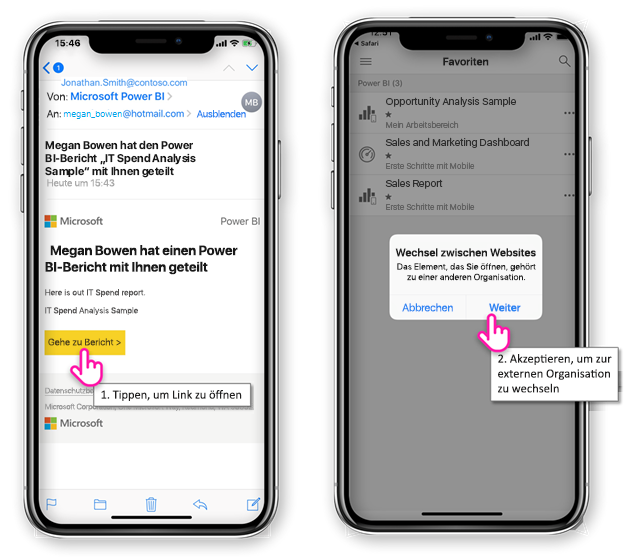
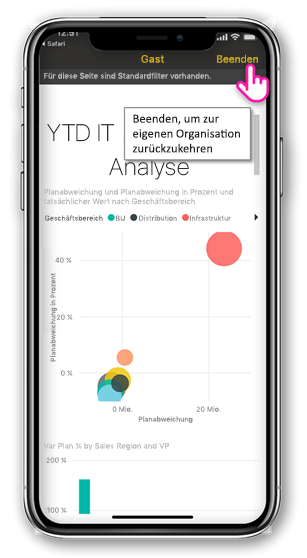
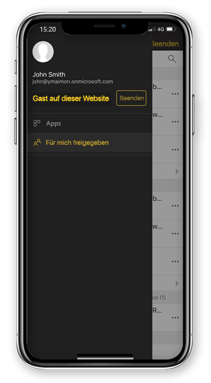

# Power BI-Inhalte anzeigen, die aus einer externen Organisation für Sie freigegeben

Powerbi arbeitet mit Azure Active Directory Business-to-Business (Azure AD B2B), um sichere Verteilung von Power BI-Inhalten an Gastbenutzer außerhalb Ihrer Organisation zu ermöglichen. Und externe Gastbenutzer die mobile Power BI-app verwenden können, den Zugriff auf diese Power BI-Inhalte, die für sie freigegeben. 

Gilt für:

|  |  |  |  |
|:--- |:--- |:--- |:--- |
| iPhones |iPads |Android-Telefone |Android-Tablets |

## Zugreifen auf freigegebenen Inhalt

**Zunächst benötigen Sie eine Person aus einer externen Organisation auf ein Element mit Ihnen teilen.** Wenn sich jemand [ein Element mit Ihnen gemeinsam](../../service-share-dashboards.md), entweder aus derselben Organisation oder einer externen Organisation erhalten Sie eine e-Mail mit einem Link zu, die des freigegebenen Elements. Folgen diesen Link auf Ihrem Mobilgerät, wird die mobile Power BI-app geöffnet. Wenn die app erkennt, dass das Element aus einer externen Organisation freigegeben wurde, mit dem die app in der Organisation mit Ihrer Identität verbindet. Die app lädt dann alle Elemente, die aus dieser Organisation für Sie freigegeben wurden.

> [!NOTE]
> Wenn dies das erste Element, das Sie als eine externe Gastbenutzer freigegeben ist, müssen Sie die Einladung in einem Browser in Anspruch nehmen. Sie können anfordern, die Einladung in Power BI-app nicht möglich.

Solange Sie zu einer externen Organisation verbunden sind, wird ein schwarzer Header in der app angezeigt. Dieser Header gibt an, dass Sie nicht mit Ihrer eigenen Organisation verbunden sind. Beenden Sie den Gastmodus zum Verbinden mit Ihrer eigenen Organisation zurück.

Obwohl Sie eine Power BI-Artefaktlink zur Verbindung mit einer externen Organisation benötigen, sobald Ihre app wechselt, können Sie alle Elemente, die für Sie freigegeben (nicht nur das Element, die Sie aus der die e-Mail-Adresse geöffnet) zugreifen. Um alle Elemente, die Sie zugreifen können in der externen Organisation anzuzeigen, wechseln Sie zu der app-Menü, und wählen Sie **für mich freigegeben**. Klicken Sie unter **Apps** finden Sie apps, die Sie ebenfalls verwenden können.

## Einschränkungen

- Für den bedingten Zugriff und anderen Intune-Richtlinien werden in Azure AD B2B und in Power BI mobile nicht unterstützt. Das bedeutet, dass es sich bei die app nur Richtlinien von der eigenen Organisation, erzwingt, wenn sie vorhanden sind.
- Erste Schritte mit Pushbenachrichtigungen empfangen werden, von der eigenen Organisation-Website (auch wenn der Benutzer als Gast zu einer externen Organisation verbunden ist). Öffnen die Benachrichtigung die Verbindung der app, die eigene Organisation Standort des Benutzers.
- Wenn die app des Benutzers heruntergefahren beim erneut geöffnet, die app verbindet sich automatisch mit der eigenen Organisation des Benutzers.
- Einige Aktionen sind deaktiviert, wenn die Verbindung mit einer externen Organisation hergestellt,: Favoriten Elemente, datenwarnungen, Kommentieren und freigeben.
- Offline-Daten ist nicht verfügbar, während der Verbindung mit einer externen Organisation.
- Wenn Sie die Unternehmensportal-app auf Ihrem Gerät installiert haben, muss Ihr Gerät registriert werden.
