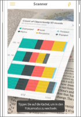
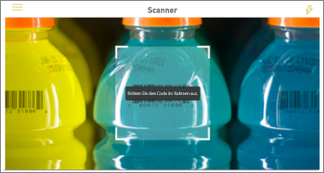

# Erfassen von realen Daten mit den mobilen Power BI-Apps
Mobile Power BI-Apps können die reale Welt durch viele verschiedene Möglichkeiten direkt mit verwandten BI-Informationen verbinden. 

## QR-Codes für Kacheln
Erstellen Sie einen QR-Code für einen Bericht oder eine Kachel in einem Dashboard, und fügen Sie den QR-Code an einer beliebigen Stelle hinzu. Wenn Ihre Kollegen den Code mit ihren iPhones, Android-Telefonen oder mit der Power BI for Mixed Reality-App, wird die Kachel angezeigt, die dem QR-Code zugeordnet ist. Auf einem iPhone kann die Kachel im Augmented Reality-Modus angesehen werden.

Weitere Informationen zu

* [Erstellen eines QR-Codes für eine Kachel in Power BI](../../service-create-qr-code-for-tile.md)
* [Scannen eines Power BI-QR-Codes mit einem mobilen Gerät](mobile-apps-qr-code.md)
* [Scannen eines QR-Codes mit der Power BI for Mixed Reality-App](mobile-mixed-reality-app.md#scan-a-report-qr-code-in-holographic-view)

## QR-Codes für Berichte
Erstellen Sie einen QR-Code für einen Bericht.  Wenn Ihre Kollegen den Code mit ihren iPhones scannen (die Funktion wird bald für Android-Telefone verfügbar sein), wird der Bericht angezeigt, den dem QR-Code zugeordnet ist. 

Mehr über [Erstellen eines QR-Codes für einen Bericht in Power BI](../../service-create-qr-code-for-report.md)

## Barcodes
Markieren Sie Barcode-Daten in Ihrem Bericht, damit Ihre Kollegen einen Barcode auf einem Produkt scannen können und direkt zu diesem Bericht, der für diese Produkt herausgefiltert wurde, weitergeleitet werden.

Weitere Informationen zu

* [Markieren von Barcodes in Power BI Desktop für die mobilen Power BI-Apps](../../desktop-mobile-barcodes.md)
* [Scannen eines Barcodes mit der Power BI-App auf dem iPhone](mobile-apps-scan-barcode-iphone.md)

## Filtern nach Speicherort
Kategorisieren Sie geografische Daten in einem Bericht in Power BI Desktop. Ihren Kollegen wird dann dieser Bericht in der mobilen Power BI-App für iOS angezeigt. Power BI verwendet automatisch geografische Filter, die zum Standort passen.

Weitere Informationen finden Sie unter [Filter a report by location in the Power BI mobile apps for iOS](mobile-apps-geographic-filtering.md) (Filtern eines Berichts nach Speicherort in den mobilen Power BI-Apps für iOS).

## Nächste Schritte
* [Erstellen eines QR-Codes für eine Kachel in Power BI](../../service-create-qr-code-for-tile.md)
* [Erstellen eines QR-Codes für einen Bericht in Power BI](../../service-create-qr-code-for-report.md)

