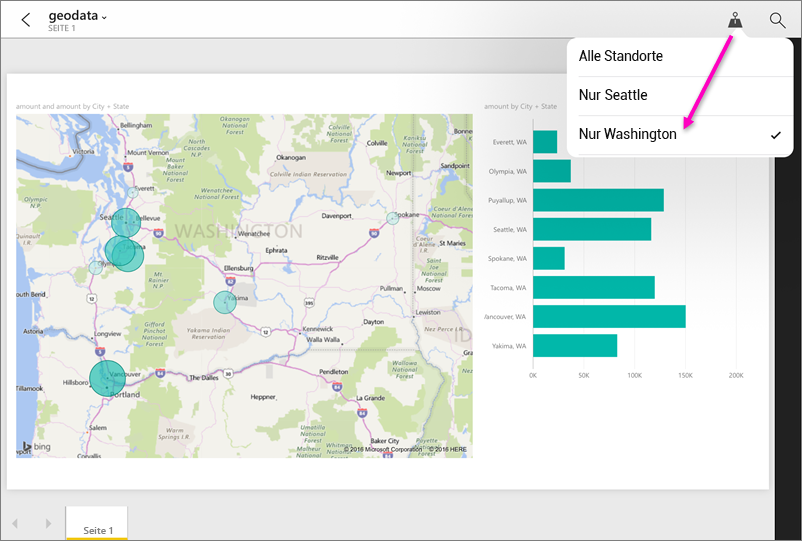

# Filtern eines Berichts nach geografischem Standort in den mobilen Power BI-Apps
Gilt für:

|  |  |  |  |  |
|:--- |:--- |:--- |:--- |:--- |
| iPhones |iPads |Android-Telefone |Android-Tablets |Windows 10-Smartphones |

Wird beim Betrachten eines Power BI-Berichts auf Ihrem mobilen Gerät in der rechten oberen Ecke ein kleines Nadelsymbol angezeigt? Wenn dies der Fall ist, können Sie diesen Bericht basierend auf Ihrem geografischen Standort filtern.

> [!NOTE]
> Sie können nur nach Ort filtern, wenn die geografischen Namen im Bericht Englisch sind, z.B. „New York City“ oder „Germany“. Auf Windows 10-Smartphones werden geografische Filter unterstützt, auf Windows 10-Tablets und -PCs nicht.
> 
> 

## Filtern Ihres Berichts nach Ihrem geografischen Standort
1. Öffnen Sie einen Bericht in der mobilen Power BI-App auf Ihrem mobilen Gerät.
2. Wenn der Bericht geografische Daten enthält, wird eine Meldung angezeigt, in der Sie aufgefordert werden, Power BI zu gestatten, auf Ihren Standort zuzugreifen. Klicken Sie auf **Zulassen**, und tippen Sie dann erneut auf **Zulassen**.
3. Tippen Sie auf das Stecknadelsymbol . Je nach den im Bericht enthaltenen Daten können Sie nach Stadt, Bundesland/Kanton oder Land/Region filtern. Der Filter listet nur die Optionen auf, die mit Ihrer aktuellen Position übereinstimmen.
   
    

## Warum sehe ich im Bericht keine Positionsmarkierungen?
Alle drei Bedingungen müssen zutreffen, damit Positionsmarkierungen angezeigt werden. 

* Der Ersteller des Berichts hat in Power BI Desktop in mindestens einer Spalte [geografische Daten kategorisiert](../../desktop-mobile-geofiltering.md) (wie Stadt, Bundesland, Land/Region).
* Sie befinden sich an einem Standort, für den Daten in einer dieser Spalten vorhanden sind.
* Sie verwenden eines dieser mobilen Geräte:
  * iOS (iPad, iPhone, iPod)
  * Android-Telefon oder Tablet
  * Windows 10-Smartphone (andere Windows 10-Geräte wie PCs und Tablets unterstützten geografische Filter nicht)

Weitere Informationen finden Sie unter [Einrichten von geografischen Filtern](../../desktop-mobile-geofiltering.md) in Power BI Desktop.

### Nächste Schritte
* [Connect to Power BI data from the real world](mobile-apps-data-in-real-world-context.md) (Verbinden mit realen Power BI-Daten mit den Apps für mobile Geräte)
* [Datenkategorisierung in Power BI Desktop](../../desktop-data-categorization.md) 
* Haben Sie Fragen? [Stellen Sie Ihre Frage in der Power BI-Community.](http://community.powerbi.com/)

