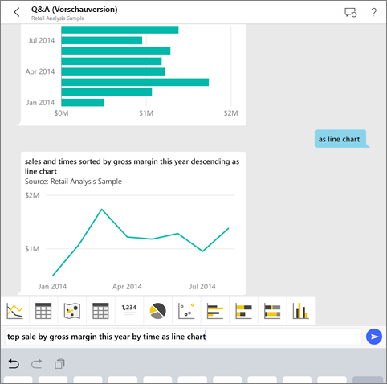
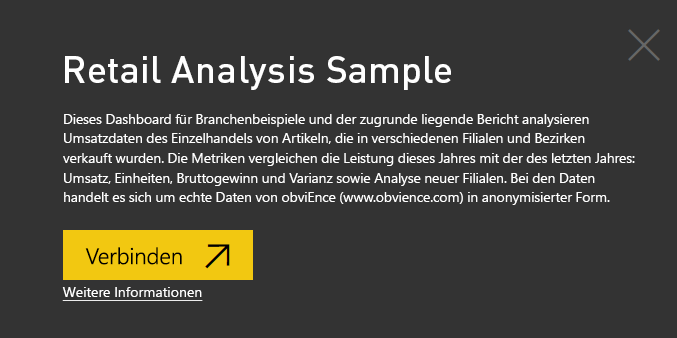
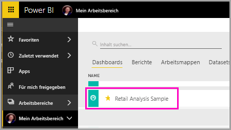
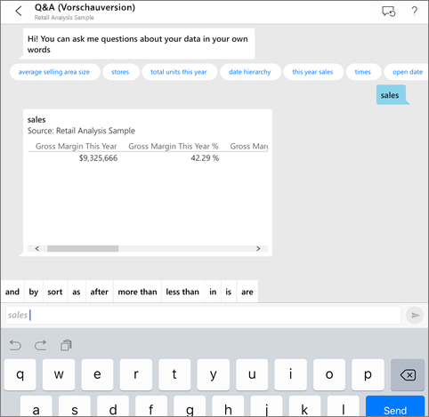
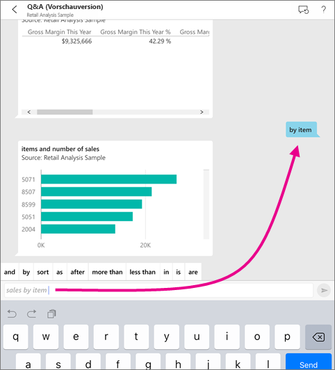
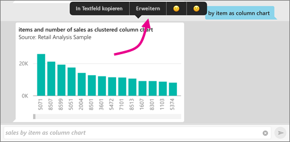
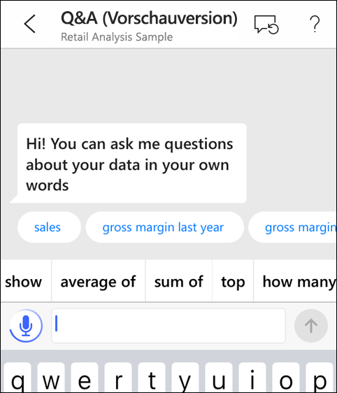
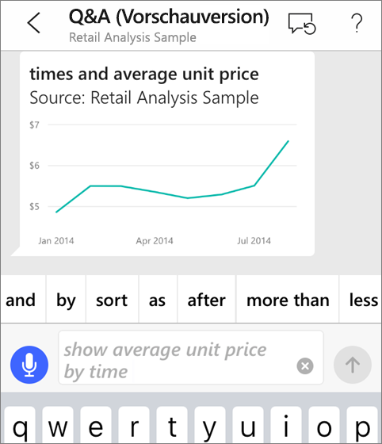
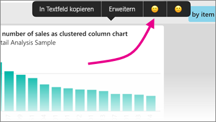

# Virtueller Q&A-Analyst in iOS-Apps – Power BI

Am schnellsten nähern Sie sich Ihren Daten, wenn Sie Fragen in eigenen Worten stellen können. In diesem Artikel verwenden Sie den virtuellen Q&A-Analysten in der mobilen Microsoft Power BI-App auf Ihrem iPad, iPhone und iPod Touch, um Fragen zu Ihren Beispieldaten zu stellen und wichtige Einblicke anzuzeigen. 

Gilt für:

|  |  |
|:--- |:--- |
| iPhones |iPads |

Der virtuelle Q&A-Analyst ist eine BI-Benutzeroberfläche für die Kommunikation, der auf zugrunde liegende Q&A-Daten im Power BI-Dienst [(https://powerbi.com)](https://powerbi.com) zugreift. Der Analyst schlägt Dateneinblicke vor, und Sie können über die Tastatur oder per Spracheingabe selbst Fragen stellen.

Wenn Sie noch nicht bei Power BI registriert sind, müssen Sie sich zuerst für eine [kostenlose Testversion registrieren](https://app.powerbi.com/signupredirect?pbi_source=web).

## Voraussetzungen

### Installieren der Power BI für iOS-App
[Laden Sie die iOS-App](http://go.microsoft.com/fwlink/?LinkId=522062 "Herunterladen der iPhone-App") aus dem Apple App Store auf Ihr iPad, Ihr iPhone oder Ihren iPod Touch herunter.

Folgende Versionen unterstützen die Power BI für iOS-App:
- iPad mit iOS 10 oder höher
- iPhone 5 und höher mit iOS 10 oder höher 
- iPod Touch mit iOS 10 oder höher

### Beispiele herunterladen
Der erste Schritt besteht darin, die Beispiele zu Einzelhandelsanalyse und Opportunityanalyse im Power BI-Dienst herunterzuladen.

**Abrufen des Beispiels für die Einzelhandelsanalyse**

1. Öffnen Sie den Power BI-Dienst (app.powerbi.com), und melden Sie sich an.

2. Wählen Sie im linken Navigationsbereich die Optionen **Arbeitsbereiche** und **Mein Arbeitsbereich** aus.

3. Wählen Sie in der linken unteren Ecke **Daten abrufen** aus.
   
    

3. Wählen Sie auf der Seite „Daten abrufen“ das Symbol **Beispiele** aus.
   
   

4. Wählen Sie das **Beispiel für die Einzelhandelsanalyse** aus.
 
    
 
8. Wählen Sie **Verbinden** aus.  
  
   
   
5. Das Inhaltspaket wird in Power BI importiert, und dem aktuellen Arbeitsbereich werden ein neues Dashboard, ein neuer Bericht und ein neues Dataset hinzugefügt.
   
   

**Abrufen des Beispiels für die Opportunityanalyse**

- Führen Sie die gleichen Schritte aus wie für das Beispiel für die Einzelhandelsanalyse. Wählen Sie in Schritt 4 jedoch das **Beispiel für die Opportunityanalyse** aus.

    
  
Sie können die Beispiele jetzt auf Ihrem iOS-Gerät anzeigen.

## Fragen stellen auf dem iPhone oder iPad
1. Tippen Sie auf Ihrem iPhone oder iPad auf die globale Navigationsschaltfläche  > **Arbeitsbereiche** > **Mein Arbeitsbereich**, und öffnen Sie das Dashboard für das Beispiel für die Einzelhandelsanalyse.

2. Tippen Sie im Aktionsmenü unten auf der Seite (auf einem iPad oben auf der Seite) auf das Symbol „Virtueller Q&A-Analyst“ .
     Der virtuelle Q&A-Analyst bietet einige Vorschläge für den Einstieg.
3. Geben Sie **show** ein, tippen Sie in der Liste der Vorschläge auf **sales** (Umsatz) und anschließend auf **Senden** .

    
4. Tippen Sie in den Schlüsselwörtern auf **nach** und dann in der Vorschlagsliste auf **Element** > **Senden** .

    
5. Tippen Sie in den Schlüsselwörtern auf **as**, dann auf das Säulendiagrammsymbol  und zuletzt auf **Senden** .
6. Tippen Sie lang auf das resultierende Diagramm, und tippen Sie dann auf **Erweitern**.

    

    Das Diagramm wird in der App im Fokusmodus geöffnet.

    
7. Tippen Sie in der linken oberen Ecke auf den Pfeil, um zum Chatfenster des virtuellen Q&A-Analysten zurückzukehren.
8. Tippen Sie rechts im Textfeld auf das X, um den Text zu löschen und neu zu beginnen.
9. Die nächste Frage: Tippen Sie in den Schlüsselwörtern auf **top** und dann auf **sale by avg $/unit ly** > **Senden** .

    
10. Wählen Sie in den Schlüsselwörtern **by** aus, und tippen Sie dann oben in der Vorschlagsliste auf **time** > **Senden** .

     
11. Tippen Sie auf **as** und dann in der Vorschlagsliste auf das Liniendiagrammsymbol  > **Senden** .

    

## Fragen per Spracheingabe
Sie können nun in der mobilen Power BI-App Ihre Fragen per Spracheingabe stellen, anstatt sie einzugeben.

1. Tippen Sie auf das Symbol „Virtueller Q&A-Analyst“  im Aktionsmenü unten auf der Seite (auf einem iPad oben auf der Seite).
2. Tippen Sie auf das Mikrofon-Symbol .

    

1. Wenn das Mikrofon-Symbol aktiv ist, beginnen Sie mit der Spracheingabe. Beispiel: Sagen Sie „durchschnittlicher Stückpreis nach Zeit“, und tippen Sie auf **Senden** .

    

### Sie haben Fragen zum Datenschutz bei der Verwendung der Spracherkennung?
Informationen hierzu finden Sie im Abschnitt zur Spracherkennung im Artikel [Neuigkeiten in iOS](https://go.microsoft.com/fwlink/?linkid=845624) in den Apple iOS-Entwicklerhandbüchern.

## Hilfe und Feedback
* Benötigen Sie Hilfe? Sagen Sie einfach „Hallo“ oder „Hilfe“, und lassen Sie sich beim Formulieren einer neuen Frage unterstützen.
* Möchten Sie zu den Ergebnissen ein Feedback geben? Tippen Sie lang auf ein Diagramm oder ein anderes Ergebnis, und tippen Sie dann auf das Smiley oder das Stirnrunzeln.

    

    Ihr Feedback ist anonym. Es hilft uns, bessere Antworten zu geben.

## Verbessern der Ergebnisse des virtuellen Q&A-Analysten
Mit gezielteren Fragen erhalten Sie und Ihre Kunden bessere Ergebnisse, wenn Sie den virtuellen Q&A-Analysten mit einem Dataset verwenden; die Qualität des Datasets selbst hat ebenfalls einen Einfluss auf die Qualität der Ergebnisse.

### Formulieren von Fragen
* Befolgen Sie diese [Tipps zum Stellen von Fragen mit dem virtuellen Q&A-Analysten](../end-user-q-and-a-tips.md) im Power BI-Dienst und in der mobilen iOS-App.

### Verbessern von Datasets
* Verbessern Sie ein Dataset in Power BI Desktop und im Power BI-Dienst zum [Optimieren Ihrer Daten mit Q&A und dem virtuellen Q&A-Analysten](../../service-prepare-data-for-q-and-a.md).

## Nächste Schritte
* [Q&A im Power BI-Dienst](../end-user-q-and-a.md)
* Haben Sie Fragen? [Bereich für mobile Apps in der Power BI-Community](https://go.microsoft.com/fwlink/?linkid=839277)
