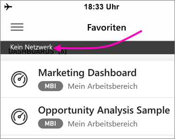

# Offlinemodus zum Anzeigen von Daten in mobilen Power BI-Apps
Gilt für:

|  |  |  |  |  |
|:--- |:--- |:--- |:--- |:--- |
| iPhones |iPads |Android-Telefone |Android-Tablets |Windows 10-Geräte |

Power BI in einer mobilen App hat gegenüber der Verwendung in einem mobilen Browser einen entscheidenden Vorteil: Sie können Ihre Daten auch dann anzeigen, wenn keine Netzverbindung besteht. Dies wird als Offlinemodus bezeichnet. 

Power BI aktualisiert die Daten häufig, sodass Sie jederzeit aktuelle Antworten auf geschäftliche Fragen erhalten – selbst wenn Sie unterwegs sind oder sich in anderen Mobilfunknetzen aufhalten („Roaming“).

## Datenzugriff im Offlinebetrieb
Während Sie offline sind, können Sie auf die Dashboards, auf die Sie vorher über die mobile App zugegriffen haben, zugreifen und mit diesen interagieren.

Zusätzlich haben Sie schreibgeschützten Zugriff auf alle Power BI-Berichte, auf die Sie zuvor über die mobile App zugegriffen haben. Sie können die vollständigen Berichte anzeigen, aber Sie können keine Filter, Kreuzfilter oder Slicer verwenden.

## Datenaktualisierung im Hintergrund
Durch die Aktualisierung im Hintergrund werden Ihre Dashboardfavoriten sowie die Dashboards und Berichte, die Sie in den letzten zwei Wochen angezeigt haben, mit den Daten im Power BI-Dienst (nicht der Datenquelle) aktualisiert. Wenn eine WLAN-Verbindung besteht, wird die Aktualisierung im Hintergrund alle 2 Stunden ausgeführt. Wenn die Verbindung hingegen über ein 3G-Netz erfolgt, werden die Inhalte in Power BI alle 24 Stunden aktualisiert.

Sie können die Datenaktualisierung im Hintergrund deaktivieren, z. B. um das beanspruchte Datenvolumen zu reduzieren. Überprüfen Sie hierzu die Einstellungen auf Ihrem Gerät.

> [!NOTE]
> Wenn Sie die mobile Power BI-App auf einem iOS-Gerät verwenden und Ihr Unternehmen Microsoft Intune MAM konfiguriert hat, ist die Datenaktualisierung im Hintergrund deaktiviert. Power BI aktualisiert die Daten über den Power BI-Dienst im Web, wenn Sie das nächste Mal die App aufrufen.
> 
> Erfahren Sie mehr über das [Konfigurieren der mobilen Power BI-Apps mit Microsoft Intune](../../service-admin-mobile-intune.md). 
> 
> 

## Anzeige des Offlinemodus
Power BI zeigt klar an, wenn Sie in den Offline- oder Onlinemodus wechseln. Außerdem wird angezeigt, welche Dashboards, Berichte und Kacheln nicht offline verfügbar sind.

## Einschränkungen
Wenn Sie Power BI auf Ihrem Mobilgerät im Offlinemodus nutzen, gelten diese Einschränkungen:

* Power BI kann bis zu 250 MB Daten offline zwischenspeichern.
* Für einige Kacheltypen ist eine aktive Serververbindung nötig. Sie stehen daher offline nicht zur Verfügung &#150; z.B. Kacheln von Bing-Karten und einige benutzerdefinierte Kacheln.
* Vollständige Excel-Arbeitsmappen sind in Power BI nicht offline verfügbar.
* Sie können mobile Reporting Services-Berichte und KPIs offline anzeigen, wenn Sie sie angezeigt haben, während sie verbunden waren. Sie aktualisieren sich nicht im Hintergrund. Sie aktualisieren sich jedes Mal, wenn Sie sie öffnen.
* In den mobilen Power BI-Apps können Sie keine Power BI Desktop-Dateien (PBIX-Dateien) anzeigen, die im Power BI-Berichtsserver gespeichert sind. 

## Nächste Schritte
Ihr Feedback hilft uns zu entscheiden, welche Features wir künftig realisieren. Geben Sie deshalb Ihr Votum ab, welche Features Sie sich in den mobilen Power BI-Apps wünschen. 

* [Power BI-Apps für mobile Geräte](mobile-apps-for-mobile-devices.md)
* Folgen Sie @MSPowerBI auf Twitter
* Werden Sie Teil der [Power BI-Community](http://community.powerbi.com/), um sich mit den Mitgliedern auszutauschen
* [Was ist Power BI?](../../power-bi-overview.md)

