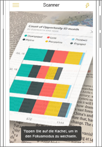
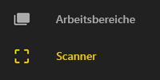
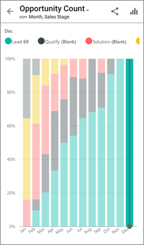

# Scannen eines Power BI-QR-Codes mit einem mobilen Gerät
Gilt für:

|  |  |  |
|:--- |:--- |:--- |:--- |
| iPhones |Android-Telefone |Android-Tablets |

QR-Codes in Power BI können alle Elemente in der realen Welt direkt mit verwandten BI-Informationen verknüpfen – es ist keine Navigation oder Suche erforderlich.

Angenommen, ein Kollege hat für einen Bericht oder eine Kachel in einem Dashboard [einen QR-Code im Power BI-Dienst erstellt](../../service-create-qr-code-for-tile.md), das Dashboard oder den Bericht für Sie freigegeben und den QR-Code an einer geeigneten Stelle platziert &#150; beispielsweise in einer E-Mail oder in einem bestimmten Element. 

Der QR-Code kann für einen sofortigen Zugriff auf die entsprechende Kachel oder den entsprechenden Bericht direkt mit dem Smartphone gescannt werden. Dabei kann entweder der Scanner der Power BI-App selbst verwendet werden oder ein anderer auf dem Smartphone installierter Scanner. 

Wenn Ihr Kollege das Dashboard oder den Bericht nicht für Sie freigegeben hat, können Sie den Zugriff direkt über die mobile App anfordern. 

> [!NOTE]
> Sie können auch [einen QR-Code mit der Power BI für Mixed Reality-App scannen](mobile-mixed-reality-app.md#scan-a-report-qr-code-in-holographic-view).

## Scannen eines Power BI-QR-Codes mit dem Power BI-Scanner auf dem iPhone
1. Öffnen Sie in der mobilen Power BI-App oben links das globale Navigationsmenü . 
2. Scrollen Sie nach unten bis **Scanner**, und wählen Sie diesen Eintrag aus. 
   
    
3. Wenn die Kamera nicht aktiviert ist, müssen Sie der Power BI-App die Verwendung der Kamera gestatten. Eine einmalige Genehmigung ist erforderlich. 
4. Richten Sie den Scanner auf den Power BI-QR-Code. 
   
    
5. Die Kachel oder der Bericht wird im Augmented-Reality-Modus über dem Hintergrund schwebend angezeigt.
   
    
6. Tippen Sie auf den Bericht oder die Kachel, um sie im Fokusmodus zu öffnen, oder gehen Sie zurück zum Scanner.

### Scannen des QR-Codes mit einem externen Scanner auf dem iPhone
1. Richten Sie einen beliebigen, auf dem Smartphone installierten Scanner auf den gewünschten Power BI-QR-Code, um direkt auf die zugehörige Kachel oder den entsprechenden Bericht zuzugreifen. 
2. Wenn Sie die Power BI-App nicht installiert haben, werden Sie zum [Apple App Store](http://go.microsoft.com/fwlink/?LinkId=522062) weitergeleitet, um sie herunterzuladen.

## Scannen eines Power BI-QR-Codes mit dem Power BI-Scanner auf dem Android-Gerät
1. Tippen Sie in der mobilen Power BI-App in der linken oberen Ecke auf die globale Navigationsschaltfläche . 
2. Scrollen Sie nach unten zu **QR-Scanner**, und wählen Sie diesen Eintrag aus.
   
    
3. Wenn die Kamera nicht aktiviert ist, müssen Sie der Power BI-App die Verwendung der Kamera gestatten. Eine einmalige Genehmigung ist erforderlich. 
4. Richten Sie den Scanner auf den Power BI-QR-Code. 
   
    
5. Die Kachel bzw. der Bericht wird automatisch in Power BI geöffnet.
   
    

### Scannen des QR-Codes mit einem externen Scanner auf dem Android-Gerät
1. Richten Sie einen beliebigen, auf dem Android-Gerät installierten Scanner auf den gewünschten Power BI-QR-Code, um direkt auf die Kachel oder den Bericht zuzugreifen. 
2. Wenn Sie die Power BI-App nicht installiert haben, werden Sie zu [Google Play weitergeleitet, um sie herunterzuladen](http://go.microsoft.com/fwlink/?LinkID=544867). 

## Nächste Schritte
* [Connect to Power BI data from the real world](mobile-apps-data-in-real-world-context.md) (Verbinden mit realen Power BI-Daten mit den Apps für mobile Geräte)
* [Erstellen eines QR-Codes für eine Kachel im Power BI-Dienst](../../service-create-qr-code-for-tile.md)
* [Erstellen eines QR-Codes für einen Bericht im Power BI-Dienst](../../service-create-qr-code-for-report.md)
* Sie können auch [einen QR-Code mit der Power BI für Mixed Reality-App scannen](mobile-mixed-reality-app.md).
* Haben Sie Fragen? [Stellen Sie Ihre Frage in der Power BI-Community.](http://community.powerbi.com/)

