# Anzeigen von Dashboards und Berichten in mobilen Power BI-Apps
Gilt für:

|  |  |  |  |  |
|:--- |:--- |:--- |:--- |:--- |
| [iPhones](mobile-apps-view-dashboard.md#view-dashboards-on-your-iphone) |[iPads](mobile-apps-view-dashboard.md#view-dashboards-on-your-ipad) |[Android-Smartphones](mobile-apps-view-dashboard.md#view-dashboards-on-your-android-phone) |[Android-Tablets](mobile-apps-view-dashboard.md#view-dashboards-on-your-android-tablet) |[Windows 10-Geräte](mobile-apps-view-dashboard.md#view-dashboards-on-your-windows-10-device) |

Dashboards sind Portale für den Lebenszyklus und die Prozesse des Unternehmens. Ein Dashboard stellt eine Übersicht dar, eine zentrale Stelle, um den aktuellen Status des Unternehmens zu überwachen.

## Erstellen von Dashboards im Power BI-Dienst (https://powerbi.com)
**Sie erstellen keine Dashboards in den mobilen Apps.** 

Wenn Sie Dashboards und Berichte auf Ihrem mobilen Gerät anzeigen möchten, müssen Sie diese in einem Webbrowser erstellen oder dort eine Verbindung mit diesen herstellen. 

1. Rufen Sie den Power BI-Dienst auf ([https://www.powerbi.com](https://www.powerbi.com)), und [registrieren Sie sich für ein Konto](../../service-self-service-signup-for-power-bi.md).
2. [Erstellen Sie Ihre eigenen Power BI-Dashboards und Berichte](../../service-get-started.md), oder stellen Sie eine Verbindung mit vorhandenen [Power BI-Apps](../end-user-connect-to-services.md) her, um eine Vielzahl von Diensten zu nutzen, z.B. [Microsoft Dynamics CRM](../../service-connect-to-microsoft-dynamics-crm.md) und [Adobe Analytics](../../service-connect-to-adobe-analytics.md).

Hier sehen Sie ein Power BI-Dashboard im Power BI-Dienst:

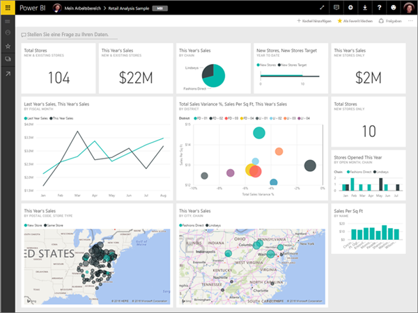

## Anzeigen von Dashboards auf dem iPhone
1. Öffnen Sie die Power BI-App auf Ihrem iPhone und melden Sie sich an.
   
   Müssen Sie die [iPhone-App](http://go.microsoft.com/fwlink/?LinkId=522062) aus dem Apple App Store herunterladen?
2. Tippen Sie auf ein Dashboard, um es zu öffnen.  
   
    
   
   * Die gelben Sterne  kennzeichnen die Dashboards, die Favoriten sind. 
   * Die Bezeichnung unterhalb jedes Dashboardnamens (in diesem Fall „MBI“)  gibt an, wie die Daten in den einzelnen Dashboards klassifiziert sind. Erfahren Sie mehr über die [Klassifizierung von Daten in Power BI](../../service-data-classification.md).
   
   Standardmäßig sehen Power BI-Dashboards auf dem iPhone etwas anders aus. Alle Kacheln werden in der gleichen Größe angezeigt und sind nacheinander von oben nach unten angeordnet.
   
    
   
   > [!TIP]
   > Wenn Sie Besitzer des Dashboards sind, können Sie im Power BI-Dienst [eine Ansicht des Dashboards speziell für Smartphones](../../service-create-dashboard-mobile-phone-view.md) im Hochformat erstellen. 
   > 
   > 
   
    Drehen Sie Ihr Smartphone alternativ auf die Seite, um das Dashboard im Querformat auf Ihrem Smartphone anzuzeigen.
   
    
3. Streichen Sie nach oben oder unten, um alle Kacheln im Dashboard anzuzeigen. Sie können:
   
   * [Tippen Sie auf eine Kachel](mobile-tiles-in-the-mobile-apps.md), um sie im Fokusmodus zu öffnen und mit ihr zu interagieren.
   * Tippen Sie auf den Stern , um [sie als Favoriten festzulegen](mobile-apps-favorites.md).
   * Tippen Sie auf **Einladen** , um [einen Kollegen einzuladen](mobile-share-dashboard-from-the-mobile-apps.md), Ihr Dashboard aufzurufen.
   * [Synchronisieren Sie das Dashboard mit Ihrer Apple Watch](mobile-apple-watch.md).
4. Um zur Liste der Dashboards zurückzukehren, tippen Sie auf den Pfeil neben dem Dashboardtitel, und tippen Sie anschließend auf **Mein Arbeitsbereich**.
   
   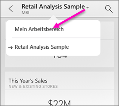

### Anzeigen von Dashboards im Querformat auf dem iPhone
Drehen Sie Ihr Smartphone einfach auf die Seite, um Dashboards im Querformat anzuzeigen. Das Layout des Dashboards ändert sich von einer Reihe von Kacheln in eine Ansicht des gesamten Dashboards. Das Layout der Dashboardkacheln entspricht dem im Power BI-Dienst.

Mithilfe der Zusammendrückbewegung können Sie unterschiedliche Bereiche des Dashboards vergrößern und verkleinern und mit einer Schwenkbewegung navigieren. Sie können auch [auf eine Kachel tippen](mobile-tiles-in-the-mobile-apps.md), um die Kachel im Fokusmodus zu öffnen und mit Ihren Daten zu interagieren.

## Anzeigen von Dashboards auf dem iPad
1. Öffnen Sie die Power BI-App.
   
   Sie haben die [iPad-App](http://go.microsoft.com/fwlink/?LinkId=522062) noch nicht aus dem Apple App Store heruntergeladen?
2. Tippen Sie auf **Dashboards** am oberen Rand der App.  
   
   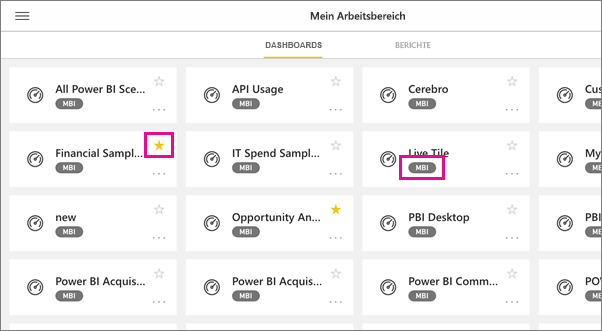
   
   * Die gelben Sterne  kennzeichnen die Dashboards, die Favoriten sind. 
   * Die Bezeichnung unterhalb jedes Dashboardnamens (in diesem Fall „MBI“)  gibt an, wie die Daten in den einzelnen Dashboards klassifiziert sind. Erfahren Sie mehr über die [Klassifizierung von Daten in Power BI](../../service-data-classification.md).
3. Sie können ein Dashboard aus Ihrem Arbeitsbereich freigeben. Tippen Sie auf die Auslassungspunkte (**...**) in der unteren rechten Ecke der Dashboardkachel, und tippen Sie auf **Andere einladen**.
   
   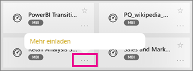
4. Sie könne auch auf ein Dashboard tippen, um es zu öffnen und die Kacheln in diesem Dashboard anzuzeigen. Im Dashboard können Sie mit folgenden Elementen interagieren:
   
   * [Tippen Sie auf eine Kachel](mobile-tiles-in-the-mobile-apps.md), um mit der Kachel zu interagieren.
   * die Berichte hinter den Kacheln [öffnen](mobile-reports-in-the-mobile-apps.md).
   * [Laden Sie andere zum Betrachten des Dashboards ein](mobile-share-dashboard-from-the-mobile-apps.md).
   * [Versehen Sie Momentaufnahmen einer Kachel mit Kommentaren, und geben Sie sie anschließend frei](mobile-annotate-and-share-a-tile-from-the-mobile-apps.md).
5. Um zu „Mein Arbeitsbereich“ zurückzukehren, tippen Sie in der linken oberen Ecke auf den Namen des Dashboards, und tippen Sie dann auf **Mein Arbeitsbereich**.
   
   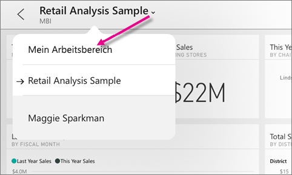

## Anzeigen von Dashboards auf dem Android-Mobiltelefon
1. Öffnen Sie die Power BI-App auf Ihrem Android-Mobiltelefon und melden Sie sich.
   
   Sie haben [die Android-App](http://go.microsoft.com/fwlink/?LinkID=544867) noch nicht heruntergeladen?
2. Tippen Sie auf ein Dashboard, um es zu öffnen.   
   
   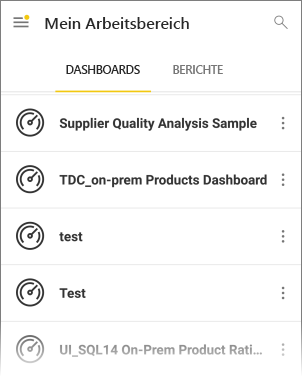

    Gelbe Sterne  kennzeichnen die Dashboards, die Favoriten sind. 

    Eine Bezeichnung unterhalb eines Dashboardnamens (in diesem Fall „MBI“)  gibt an, wie die Daten im jeweiligen Dashboard klassifiziert sind. Erfahren Sie mehr über die [Klassifizierung von Daten in Power BI](../../service-data-classification.md).

    Power BI-Dashboards sehen auf Android-Mobiltelefonen etwas anders aus. Alle Kacheln werden in der gleichen Breite angezeigt und sind nacheinander von oben nach unten angeordnet.

    

    Wenn Sie Besitzer des Dashboards sind, können Sie im Power BI-Dienst [eine Ansicht des Dashboards speziell für Smartphones](../../service-create-dashboard-mobile-phone-view.md) im Hochformat erstellen. 

1. Tippen Sie auf dem Dashboard auf die vertikalen Auslassungspunkte (...) neben dem Namen, um einen Kollegen einzuladen, das Dashboard zu aktualisieren oder Informationen davon abzurufen:
   
   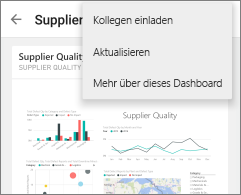
2. Streichen Sie nach oben oder unten, um alle [Kacheln im Dashboard](mobile-tiles-in-the-mobile-apps.md) anzuzeigen. 
3. Gehen Sie zurück zur Dashboard-Startseite, tippen Sie auf den Namen des Dashboards, um die Breadcrumbspur zu öffnen, und tippen Sie dann auf **Mein Arbeitsbereich**.   

## Anzeigen von Dashboards auf dem Android-Tablet
1. Öffnen Sie die Power BI-App auf Ihrem Android-Tablet und melden Sie sich an.
   
   Sie haben [die Android-App](http://go.microsoft.com/fwlink/?LinkID=544867) noch nicht heruntergeladen?
2. Tippen Sie auf ein Dashboard, um es zu öffnen.   
   
   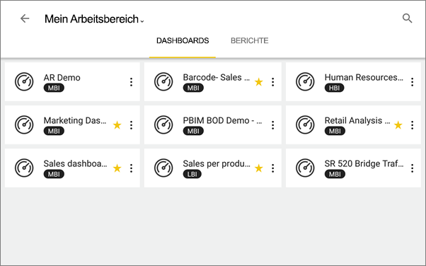
   
   * Die gelben Sterne  kennzeichnen die Dashboards, die Favoriten sind. 
   * Die Bezeichnung unterhalb jedes Dashboardnamens (in diesem Fall „MBI“)  gibt an, wie die Daten in den einzelnen Dashboards klassifiziert sind. Erfahren Sie mehr über die [Klassifizierung von Daten in Power BI](../../service-data-classification.md).
3. Tippen Sie auf dem Dashboard auf die vertikalen Auslassungspunkte (...) neben dem Namen, um einen Kollegen einzuladen, das Dashboard zu aktualisieren oder Informationen davon abzurufen:
   
   
4. Streichen Sie nach oben oder unten, um alle [Kacheln im Dashboard](mobile-tiles-in-the-mobile-apps.md) anzuzeigen. 
   
   Mithilfe der Zusammendrückbewegung können Sie unterschiedliche Bereiche des Dashboards vergrößern und verkleinern und mit einer Schwenkbewegung navigieren. Sie können auch [auf eine Kachel tippen](mobile-tiles-in-the-mobile-apps.md), um die Kachel im Fokusmodus zu öffnen und mit Ihren Daten zu interagieren.
5. Gehen Sie zurück zur Dashboard-Startseite, tippen Sie auf den Namen des Dashboards, um die Breadcrumbspur zu öffnen, und tippen Sie dann auf **Mein Arbeitsbereich**:
   
    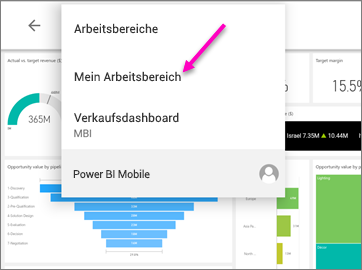

    Mithilfe der Zusammendrückbewegung können Sie unterschiedliche Bereiche des Dashboards vergrößern und verkleinern und mit einer Schwenkbewegung navigieren. Sie können auch [auf eine Kachel tippen](mobile-tiles-in-the-mobile-apps.md), um die Kachel im Fokusmodus zu öffnen und mit Ihren Daten zu interagieren.

## Anzeigen von Dashboards auf dem Windows 10-Gerät
1. Öffnen Sie die Power BI-App auf Ihrem Windows 10-Gerät, und melden Sie sich an.
   
   Sie haben [die App](http://go.microsoft.com/fwlink/?LinkID=526478) noch nicht heruntergeladen?
2. Tippen Sie auf ein Dashboard, um es zu öffnen.   
   
   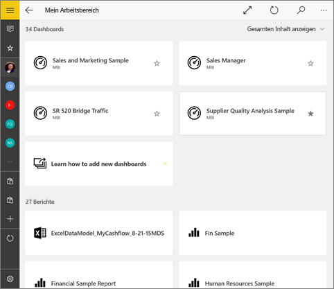
   
   * Die schwarzen Sterne kennzeichnen die Dashboards, die Favoriten sind. 
   * Die Bezeichnung unterhalb jedes Dashboardnamens (in diesem Beispiel: **MBI**) gibt an, wie die Daten in den einzelnen Dashboards klassifiziert sind. Erfahren Sie mehr über die [Klassifizierung von Daten in Power BI](../../service-data-classification.md).
   
   Power BI-Dashboards sehen auf dem Windows 10 Phone etwas anders aus. Alle Kacheln werden in der gleichen Breite angezeigt und sind nacheinander von oben nach unten angeordnet.
   
   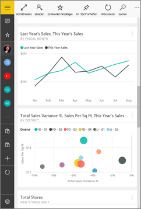
   
    Sie können Ihr Telefon auch auf die Seite drehen, um Dashboards im Querformat anzuzeigen.
   
   > [!TIP]
   > Wenn Sie Besitzer des Dashboards sind, können Sie im Power BI-Dienst [eine Ansicht des Dashboards speziell für Smartphones](../../service-create-dashboard-mobile-phone-view.md) im Hochformat erstellen. 
   > 
   > 
3. Im Dashboard können Sie folgende Aktionen ausführen:
   
   * [Tippen Sie auf eine Kachel](mobile-tiles-in-the-mobile-apps.md), um sie zu öffnen und damit zu interagieren.
   * Tippen Sie auf das Symbol **Vollbild** , um Ihr Power BI-Dashboard ohne Ränder oder Menüs zu präsentieren, wie die **Bildschirmpräsentationsansicht** in PowerPoint.
   * Tippen Sie auf das Symbol **Einladen** , um [Ihr Dashboard für einen Kollegen freizugeben](mobile-share-dashboard-from-the-mobile-apps.md).
   * Tippen Sie auf den Stern , um [das Dashboard als Favoriten festzulegen](mobile-apps-favorites.md).
   * Tippen Sie auf das Symbol **An Startmenü anheften**, um das [Dashboard an Ihren Windows-Startbildschirm anzuheften](mobile-pin-dashboard-start-screen-windows-10-phone-app.md). 
4. Gehen Sie zurück zur Dashboard-Startseite, tippen Sie auf den Namen des Dashboards, um die Breadcrumbspur zu öffnen, und tippen Sie dann auf **Mein Arbeitsbereich**:
   
    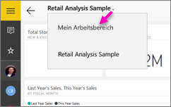

### Anzeigen von Dashboards im Querformat auf dem Windows 10 Phone
Sie können Dashboards auch im Querformat anzeigen, indem Sie Ihr Telefon einfach drehen. Das Layout des Dashboards ändert sich von einer Reihe von Kacheln in eine Ansicht des gesamten Dashboards. Das Layout der Dashboardkacheln entspricht dem im Power BI-Dienst.

Mithilfe der Zusammendrückbewegung können Sie unterschiedliche Bereiche des Dashboards vergrößern und verkleinern und mit einer Schwenkbewegung navigieren. Sie können auch [auf eine Kachel tippen](mobile-tiles-in-the-mobile-apps.md), um die Kachel im Fokusmodus zu öffnen und mit Ihren Daten zu interagieren.

## Erstellen einer Telefonansicht eines Dashboards im Power BI-Dienst
Wenn Sie der Besitzer des Dashboards sind, können Sie *im Power BI-Dienst* eine Ansicht des Dashboards speziell für Smartphones im Hochformat erstellen. 

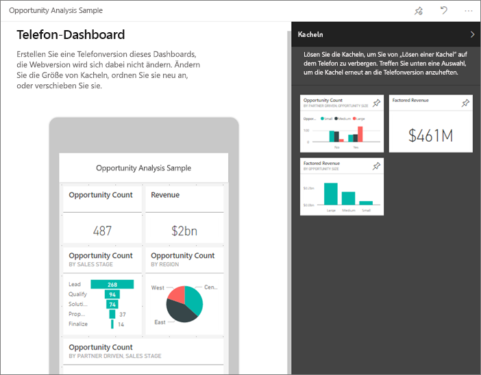

Lesen Sie mehr unter [Create a phone view of a dashboard in Power BI](../../service-create-dashboard-mobile-phone-view.md) (Erstellen einer Telefonansicht eines Dashboards in Power BI).

## Nächste Schritte
* [Herunterladen der Android-App](http://go.microsoft.com/fwlink/?LinkID=544867) aus dem Google Play Store  
* [Erste Schritte mit der Android-App für Power BI](mobile-android-app-get-started.md)  
* [Was ist Power BI?](../../power-bi-overview.md)
* Haben Sie Fragen? [Stellen Sie Ihre Frage in der Power BI-Community.](http://community.powerbi.com/)

