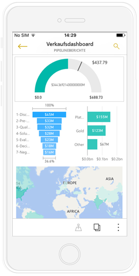
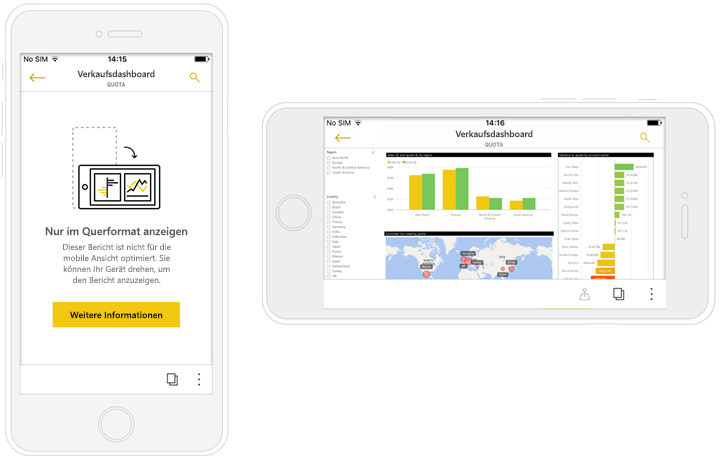
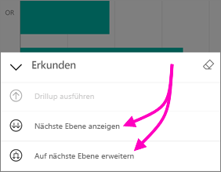
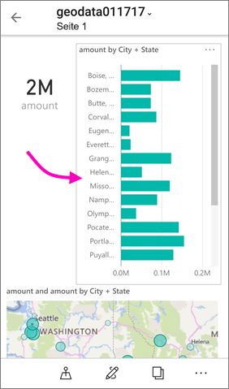

# Anzeigen von Power BI-Berichten, die für das Smartphone optimiert sind

Gilt für:

|  |  |
|:--- |:--- |
| iPhones |Android-Telefone |

Wenn Sie Power BI-Berichten auf Ihrem Telefon anzeigen, überprüft Power BI, um festzustellen, ob der Bericht für Smartphones optimiert wurde. Falls Ja, wird von Power BI automatisch den optimierten Bericht im Hochformat geöffnet.

Wenn kein für das Smartphone optimierter Bericht vorhanden ist, wird der Bericht zwar geöffnet, jedoch in der nicht optimierten Querformatansicht. Auch wenn Sie bei einem für das Smartphone optimierten Bericht das Smartphone auf die Seite drehen, wird der Bericht in der nicht optimierten Ansicht mit dem ursprünglichen Berichtslayout geöffnet. Wenn nur einige Seiten optimiert sind, wird in der Hochformatansicht eine Meldung angezeigt, die Ihnen mitteilt, dass der Bericht im Querformat verfügbar ist.

In für das Smartphone optimierten Berichten werden alle anderen Features von Power BI-Berichten ausgeführt. Weitere Informationen über die Ihnen zur Verfügung stehenden Möglichkeiten finden Sie unter:

* [Berichte auf iPhones](mobile-reports-in-the-mobile-apps.md). 
* [Berichte auf Android-Smartphones](mobile-reports-in-the-mobile-apps.md).

## Filtern der Berichtsseite auf einem Smartphone
Wenn bei einem für das Smartphone optimierten Bericht Filter definiert wurden, können Sie diese Filter beim Anzeigen des Berichts auf einem Smartphone verwenden. Der Bericht wird auf Ihrem Smartphone, in dem Bericht im Web gefilterten Werte geöffnet. Es wird eine Meldung angezeigt, dass die Seite aktive Filter enthält. Sie können die Filtereinstellungen auf Ihrem Smartphone ändern.

1. Tippen Sie auf das Symbol „Filter“  am unteren Rand der Seite. 
2. Verwenden Sie die grundlegenden oder erweiterten Filter, um die Ergebnisse anzuzeigen, an denen Sie interessiert sind.
   
    

## Kreuzhervorhebung visuelle Objekte
Kreuzhervorhebung visueller Elemente im Hochformat Ansicht nach Ihren vorstellungen dies der Fall ist in Power BI-Dienst und auf Smartphones im Querformat anzeigen: Wenn Sie Daten in einem Visual auswählen, werden die verknüpften Daten in den anderen Visuals auf der jeweiligen Seite hervorgehoben.

Erfahren Sie mehr über das [Filtern und Hervorheben in Power BI](../../power-bi-reports-filters-and-highlighting.md).

## Auswählen visueller Elemente
Wenn Sie in Smartphoneberichten ein visuelles Element auswählen, wird dieses hervorgehoben, und es erhält den Fokus. Gesten für den Zeichenbereich werden unwirksam.

Sobald das visuelle Element ausgewählt ist, können Sie Aktionen in ihm ausführen, z. B. in ihm scrollen. Um die Auswahl eines visuellen Elements aufzuheben, tippen Sie auf eine beliebige Position außerhalb des visuellen Elements.

## Öffnen visueller Elemente im Fokusmodus
Smartphoneberichte bieten zudem einen fokusmodus: Sie erhalten eine größere Ansicht eines einzelnen visual und untersuchen es noch einfacher.

* Tippen Sie in einem Smartphonebericht auf die Auslassungspunkte ( **...** ) in der oberen rechten Ecke eines visuellen Elements und dann auf **Auf Fokusmodus erweitern**.
  
    

Was Sie im fokusmodus tun übernommen werden, in den Zeichenbereich des Berichts und umgekehrt. Wenn Sie einen Wert in einem visuellen Element hervorheben und anschließend zurück zu den gesamten Bericht gilt, wird der Bericht z. B. mit dem Wert gefiltert, die Sie im visuellen Element hervorgehoben.

Aufgrund der Einschränkungen durch die Bildschirmgröße können manche Aktionen nur im Fokusmodus ausgeführt werden:

* **Durchführen eines Drilldowns** auf die Informationen in einem visuellen Element. Weitere Informationen über das Durchführen von [Drilldown und Drillup](mobile-apps-view-phone-report.md#drill-down-in-a-visual) in einem Smartphonebericht finden Sie weiter unten.
* **Sortieren** der Werte im visuellen Element.
* **Wiederherstellen**: Löschen der Untersuchungsschritte, die Sie für ein visuelles Element durchgeführt haben, und Wiederherstellen der Definition, die bei der Erstellung des Berichts festgelegt wurde.
  
    Um alle Untersuchungsschritte aus einem visuellen Element zu löschen, tippen Sie auf die Auslassungspunkte ( **...** ) und dann auf **Zurücksetzen**.
  
    
  
    Zurücksetzen steht auf Berichtsebene, Löschen der Untersuchungsschritte aus alle Visualisierungen auf der visuellen Ebene, das Löschen der Untersuchungsschritte aus der ausgewählten Visualisierung.   

## Durchführen von Drilldown in einem visuellen Element
Wenn in einem visuellen Element Hierarchieebenen definiert sind, können Sie einen Drilldown auf die Detailinformationen im visuellen Element durchführen und dann wieder zur höheren Ebene zurückkehren. Sie können im Power BI-Dienst und in Power BI Desktop [Drilldowns in einem Visual](../end-user-drill.md) ausführen.

Es gibt einige Typen von Drilldown:

### Drilldown auf einen Wert
1. Tippen Sie lang (tippen und halten), auf einen Datenpunkt in einem visuellen Element.
2. QuickInfo angezeigt wird, und wenn Hierarchie definiert ist, klicken Sie dann die QuickInfo-Fußzeile zeigt Drilldown- und Pfeil nach oben.
3. Tippen Sie auf den Pfeil nach unten für den Drilldown

    
    
4. Tippen Sie auf den Pfeil nach oben für Drillup.

### Auf nächste Ebene einen Drilldown
1. Tippen Sie in einem Bericht auf einem Smartphone auf die Auslassungspunkte ( **...** ) in der oberen rechten Ecke und dann auf **Auf Fokusmodus erweitern**.
   
    
   
    In diesem Beispiel zeigen die Balken die Werte für Bundesländer an.
2. Tippen Sie auf das Symbol „Durchsuchen“  unten links.
   
    
3. Tippen Sie auf **Nächste Ebene anzeigen** oder **Auf nächste Ebene erweitern**.
   
    
   
    Jetzt zeigen die Balken die Werte für Städte an.
   
    
4. Wenn Sie auf den Pfeil in der oberen linken Ecke tippen, kehren Sie zum Smartphonebericht zurück, in dem die Werte noch auf die untere Ebene erweitert sind.
   
    
5. Um auf die ursprüngliche Ebene zurückzukehren, tippen Sie erneut auf die Auslassungspunkte ( **...** ) und dann auf **Zurücksetzen**.
   
    

## Ein Wert von Drillthrough
Drillthrough verbindet Werte auf der Seite einen Bericht mit anderen Seiten des Berichts. Wenn Sie einen Drillthrough von einem Datenpunkt zu einer anderen Berichtsseite durchführen, werden die Datenpunktwerte werden verwendet, um die Seite die drilled filtern, oder sie werden im Kontext der ausgewählten Daten.
Berichtsautoren können [definieren Drillthrough](https://docs.microsoft.com/power-bi/desktop-drillthrough) beim Erstellen des Berichts.

1. Tippen Sie lang (tippen und halten), auf einen Datenpunkt in einem visuellen Element.
2. QuickInfo wird angezeigt, und wenn Drillthrough definiert ist, klicken Sie dann die QuickInfo-Fußzeile zeigt Drillthrough-Pfeil.
3. Tippen Sie auf den Pfeil für Drillthrough

    

4. Wählen Sie die Berichtsseite zum Ausführen eines Drillthroughs

    

5. Verwenden Sie die Schaltfläche "zurück", der app-Header, um zur Seite zurückzukehren, die Sie aus gestartet.

## Nächste Schritte
* [Erstellen von Berichten, die für die Power BI-Smartphone-Apps optimiert sind](../../desktop-create-phone-report.md)
* [Erstellen einer Telefonansicht eines Dashboards in Power BI](../../service-create-dashboard-mobile-phone-view.md)
* [Erstellen von dynamischen Visuals, die für eine beliebige Größe optimiert sind](../../visuals/desktop-create-responsive-visuals.md)
* Weitere Fragen? [Stellen Sie Ihre Frage in der Power BI-Community.](http://community.powerbi.com/)

