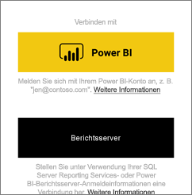
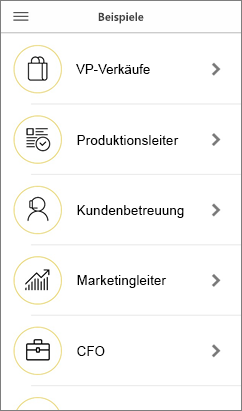
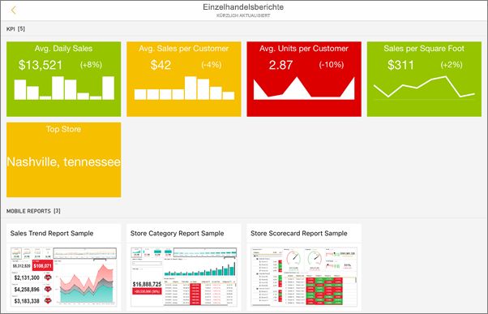
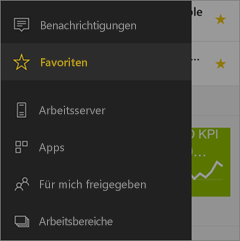
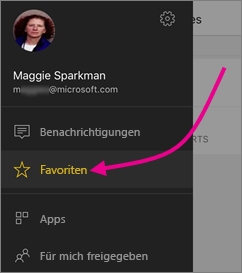
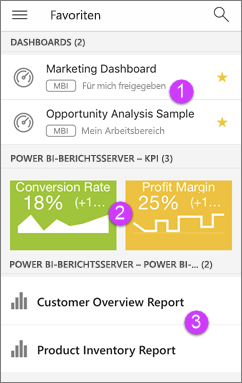

# Erste Schritte mit der mobilen Power BI-App auf iOS-Geräten
Die iOS-App für Microsoft Power BI auf dem iPhone, iPad oder iPod Touch bietet Ihnen die mobile BI-Umgebung für Power BI, Power BI-Berichtsserver und Reporting Services. Mit dem touchfähigen, mobilen Livezugriff auf lokale Server und die Cloud können Sie Ihre Unternehmensdashboards überall anzeigen und mit ihnen interagieren. Untersuchen Sie die Daten in Dashboards, und geben Sie diese dann über eine E-Mail oder SMS für Kollegen frei. Bleiben Sie auf dem neuesten Stand mit den aktuellsten Daten auf Ihrer [Apple Watch](mobile-apple-watch.md).  

Sie erstellen Power BI-Berichte in Power BI Desktop und veröffentlichen sie:

* [Veröffentlichen Sie sie im Power BI-Dienst](../../service-get-started.md), und erstellen Sie Dashboards.
* [Veröffentlichen Sie sie lokal auf dem Power BI-Berichtsserver](../../report-server/quickstart-create-powerbi-report.md).

In der mobilen Power BI-App für iOS interagieren Sie anschließend mit Ihren Dashboards und Berichten, die sich auf lokalen Servern oder in der Cloud befinden können.

Machen Sie sich [mit den Neuerungen bei den Power BI-Mobile Apps](mobile-whats-new-in-the-mobile-apps.md) vertraut.

## Herunterladen der App
[Laden Sie die iOS-App herunter](http://go.microsoft.com/fwlink/?LinkId=522062 "Download the iOS app") aus dem Apple App Store auf Ihr iPhone, iPad oder den iPod Touch herunter.

Sie können die Power BI für iOS-App auf iPhone 5 und höher mit iOS 10 oder höher ausführen. Sie können die App auch auf einem iPad oder iPod Touch mit iOS 10 oder höher ausführen. 

## Registrieren beim Power BI-Dienst
Wenn Sie sich noch nicht registriert haben, wechseln Sie zu [powerbi.com](https://powerbi.microsoft.com/get-started/), und klicken Sie unter **Power BI - Cloud collaboration and sharing** (Power BI – Zusammenarbeit und Freigabe in der Cloud) auf **Kostenlos testen**.

## Erste Schritte mit der Power BI-App
1. Öffnen Sie die Power BI-App auf Ihrem iOS-Gerät.
2. Um Ihre Power BI-Dashboards anzuzeigen, tippen Sie auf **Power BI**.  
   Zum Anzeigen der mobilen Reporting Services-Berichte und -KPIs tippen Sie auf **SQL Server Reporting Services**.
   
   
   
   Tippen Sie in der App auf die globale Navigationsschaltfläche  in der linken oberen Ecke, um zwischen den beiden Elementen zu wechseln. 

## Testen der Power BI- und Reporting Services-Beispiele
Sie können die Power BI- und Reporting Services-Beispiele auch ohne Registrierung testen. Nachdem Sie die App heruntergeladen haben, können Sie die Beispiele anzeigen oder loslegen. Sie können von der globalen Navigation jederzeit zu den Beispielen zurückkehren.

### Power BI-Beispiele
Sie können die Power BI-Dashboard-Beispiele anzeigen und mit ihnen interagieren, es gibt jedoch einige Funktionen, die Ihnen dabei nicht zur Verfügung stehen. Sie können nicht die zu den Dashboards gehörenden Berichte öffnen, die Beispiele nicht für andere freigeben und die Beispiele nicht zu Ihren Favoriten machen.

1. Tippen Sie auf die globale Navigationsschaltfläche  in der linken oberen Ecke.
2. Tippen Sie auf das Zahnradsymbol rechts oben , und tippen Sie anschließend auf **Power BI-Beispiele**.
3. Wählen Sie eine Rolle aus, um das Beispieldashboard für diese Rolle anzuzeigen.  
   
   
   
   > [!NOTE]
   > In den Beispielen sind nicht alle Features verfügbar. Sie können z. B. keine Beispielberichte anzeigen, die den Dashboards zugrunde liegen. 
   > 
   > 

### Mobile Reporting Services-Beispielberichte
1. Tippen Sie auf die globale Navigationsschaltfläche  in der linken oberen Ecke.
2. Tippen Sie auf das Zahnradsymbol rechts oben , und tippen Sie anschließend auf **Reporting Services-Beispiele**.
3. Öffnen Sie dann entweder den Ordner „Retail Reports“ oder „Sales Reports“, um die zugehörigen KPIs und mobilen Berichte auszuwählen.
   
   

## Suchen von Inhalten in Dashboards in mobilen Power BI-Apps
Ihre Dashboards und Berichte sind an unterschiedlichen Stellen in den mobilen Power BI-Apps gespeichert, abhängig davon, woher sie stammen. [Weitere Informationen zum Suchen von Inhalten in den mobilen Apps](mobile-apps-quickstart-view-dashboard-report.md). Außerdem können Sie jederzeit nach allen Inhalten in den mobilen Power BI-Apps suchen. 

[Weitere Informationen zum Suchen von Inhalten in den mobilen Apps](mobile-apps-quickstart-view-dashboard-report.md).

## Anzeigen Ihrer als Favoriten gespeicherten Dashboards, KPIs und Berichte
Auf der Seite „Favoriten“ in den mobilen Apps werden alle als Favoriten gespeicherten Power BI-Dashboards zusammen mit Power BI-Berichtsserver- und Reporting Services-KPIs und -Berichten angezeigt. Wenn Sie ein Dashboard als *Favoriten* in den mobilen Power BI-Apps speichern, können Sie auf allen Ihren Geräten darauf zugreifen, auch über den Power BI-Dienst in Ihrem Browser. 

* Tippen Sie auf **Favoriten**.
  
   
  
   Sie sehen alle Ihre Favoriten zusammen auf dieser Seite:
  
   
  
  1. Dashboards im Power BI-Dienst
  2. KPIs in Power BI-Berichtsserver
  3. Power BI-Berichte in Power BI-Berichtsserver

Weitere Informationen zu [Favoriten in den mobilen Power BI-Apps](mobile-apps-favorites.md).

## Unterstützung für die mobilen Power BI-Apps in Unternehmen
Unternehmen können Microsoft Intune verwenden, um Geräte und Anwendungen, einschließlich der mobilen Power BI-Apps für Android und iOS, zu verwalten.

Mit Microsoft Intune können Unternehmen Einstellungen steuern, z.B. eine Zugriffs-PIN anfordern, festlegen, wie Daten von der Anwendung verarbeitet werden, und sogar Anwendungsdaten verschlüsseln, wenn die App nicht genutzt wird.

> [!NOTE]
> Wenn Sie die mobile Power BI-App auf einem iOS-Gerät verwenden und Ihr Unternehmen Microsoft Intune MAM konfiguriert hat, ist die Datenaktualisierung im Hintergrund deaktiviert. Power BI aktualisiert die Daten über den Power BI-Dienst im Web, wenn Sie das nächste Mal die App aufrufen.
> 

Erfahren Sie mehr über das [Konfigurieren der mobilen Power BI-Apps mit Microsoft Intune](../../service-admin-mobile-intune.md). 

## Nächste Schritte

* [Was ist Power BI?](../../power-bi-overview.md)
* Haben Sie Fragen? [Stellen Sie Ihre Frage in der Power BI-Community.](http://community.powerbi.com/)

