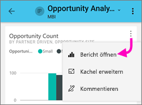

# Durchsuchen von Berichten in den mobilen Power BI-Apps
Gilt für:

|  |  |  |  |  |
|:--- |:--- |:--- |:--- |:--- |
| iPhones |iPads |Android-Telefone |Android-Tablets |Windows 10-Geräte |

Ein Power BI-Bericht ist eine interaktive Ansicht Ihrer Daten, und mit den darin enthaltenen Visuals werden unterschiedliche Ergebnisse und Erkenntnisse zu diesen Daten dargestellt. Das Anzeigen von Berichten in den mobilen Power BI-Apps ist der dritte Schritt in einem dreistufigen Prozess.

1. [Erstellen Sie Berichte in Power BI Desktop](../../desktop-report-view.md). Sie können in Power BI Desktop sogar [einen Bericht für Telefone optimieren](mobile-apps-view-phone-report.md). 
2. Veröffentlichen Sie diese Berichte im Power BI-Dienst [(https://powerbi.com)](https://powerbi.com) oder auf dem [Power BI-Berichtsserver](../../report-server/get-started.md).  
3. Anschließend können Sie in den mobilen Power BI-Apps mit diesen Berichten interagieren.

## Öffnen eines Power BI-Berichts in der mobilen App
Power BI-Berichte werden abhängig von ihrer Herkunft an verschiedenen Stellen in der mobilen App gespeichert. Sie können sich in „Apps“, „Für mich freigegeben“, „Arbeitsbereiche“ (einschließlich „Mein Arbeitsbereich“) oder auf einem Berichtsserver befinden. Manchmal müssen Sie einen Bericht in einem entsprechenden Dashboard suchen, und manchmal sind Berichte aufgelistet.

In Listen und Menüs finden Sie ein Symbol neben dem Berichtsnamen, hilft Ihnen zu verstehen, dass dieses Element aus einem Bericht ist. 

 

Es gibt zwei Symbole für Berichte in Power BI Mobile apps:

*  Gibt an, einen Bericht, der wird im Querformat in der app angezeigt werden und wird genauso aussehen, wie sie im Browser dargestellt wird.

*  Gibt an, einen Bericht, der mindestens ein Telefon optimierte Berichtsseite enthält, die im Hochformat angezeigt werden. 

Hinweis: Halten Sie Ihr Telefon im Querformat, erhalten immer das Layout mit Querformat, Sie auch, wenn die Berichtsseite smartphonelayout aufweist. 

Um zu einem Bericht aus einem Dashboard erhalten möchten, tippen Sie auf die Auslassungspunkte (...) in der oberen rechten Ecke einer Kachel > **Bericht öffnen**.
  
  
  
  Nicht alle Kacheln verfügen über eine Option zum Öffnen als Bericht. Beispielsweise werden für Kacheln, die durch Stellen einer Frage im Q&A-Feld erstellt wurden, keine Berichte geöffnet, wenn Sie auf die Kachel tippen. 
  
## Interagieren mit Berichten
Nachdem Sie einen Bericht in der app geöffnet haben, können Sie damit arbeiten. Es gibt viele Dinge, die Sie mit dem Bericht und die Daten ausführen können. In der Fußzeile des Berichts finden Sie Aktionen, die Sie ausführen können, für den Bericht, und klicken Sie auf der und lang Tippen auf die Daten in den Bericht auch slice und den Daten arbeiten können.

### Tippen Sie auf verwenden, und tippen Sie lang auf
Tippen Sie auf eine Maus gleich klicken Sie auf. Daher sollten Sie den Bericht basierend auf einen Datenpunkt Hervorhebung, tippen Sie auf diesem Datenpunkt.
Tippen auf einen Slicer-Wert, wird dieser Wert ausgewählt und der Rest des Berichts aufteilen, um diesen Wert. Tippen auf einen Link, werden Schaltfläche oder ein Lesezeichen basierend auf die vom Autor definierte Aktion aktiviert.

Wahrscheinlich haben Sie bemerkt, dass wenn Sie auf ein visuelles Element tippen, wird ein Rahmen angezeigt. Auf der oberen rechten Ecke des Rahmens steht es mit den Auslassungspunkten (...). Tippen, wird ein Menü mit Aktionen angezeigt, die Sie auf das visuelle ausführen können.

### QuickInfo und Drilldown-Aktionen

Wenn Sie lange Tippen Sie auf (tippen und halten) einen Datenpunkt, eine QuickInfo wird angezeigt, präsentieren die Werte, die diesen Datenpunkt darstellt. 

Berichtsautoren können Hierarchien in den Daten und die Beziehungen zwischen den Seiten des Berichts definieren. Hierarchie können Drilldowns, einen Drilldown nach oben, und zeigen Sie Details zu einer anderen Berichtsseite aus einem visuellen Element und einen Wert. Wenn Sie lange auf einen Wert neben QuickInfo tippen werden also der relevanten drilloptionen zur Verfügung in der Fußzeile angezeigt. 

Wenn Sie beim *Drillthrough* auf einen bestimmten Teil eines Visual tippen, gelangen Sie zu einer anderen Berichtsseite, die nach dem Wert gefiltert ist, auf den Sie getippt haben.  Der Autor eines Berichts kann mindestens eine Drillthroughoption festlegen, durch die Sie auf eine andere Seite weitergeleitet werden. In diesem Fall können Sie entscheiden, auf welche Seite Sie einen Drillthrough durchführen möchten. Schaltfläche "zurück" gelangen Sie zurück zur vorherigen Berichtseite.

Erfahren Sie, wie Sie [Drillthrough in Power BI Desktop verwenden](../../desktop-drillthrough.md).
   
   > [!IMPORTANT]
   > In Power BI Mobile-app ist die Matrix- und tabellenvisuals Details über nur einen Zellenwert, und nicht von Spalten- und Zeilenüberschriften aktiviert.
   
   
   
### Verwenden die Aktionen in der Fußzeile des Berichts
Die Fußzeile des Berichts hat die Aktionen, die Sie ausführen können, auf die aktuelle Berichtsseite oder auf den gesamten Bericht. Die Fußzeile hat schnellen Zugriff auf die nützlichsten Aktionen aus, und alle Aktionen können über die Auslassungspunkte (...) zugegriffen werden.

Sind die Aktionen, die Sie anhand der Fußzeile ausführen können:
1) Berichtsfilter zurücksetzen und übergreifende hervorheben Auswahl wieder auf den ursprünglichen Zustand.
2) Öffnen Sie die Konversation Bereich zum Anzeigen oder Hinzufügen von Kommentaren für diesen Bericht.
3) Öffnen Sie den Bereich "Filter" zum Anzeigen und ändern Sie den Filter, die derzeit für den Bericht angewendet.
4) Listen Sie alle Seiten in diesem Bericht. Tippen Sie auf den Namen lädt und präsentieren dieser Seite.
Verschieben zwischen den Berichtseiten kann durch Wischen von der Rand des Bildschirms, das Center erfolgen.
5) Zeigen Sie alle Aktionen für den Bericht an.

#### Alle Aktionen für den Bericht
Tippen auf der... Option in der Fußzeile des Berichts, gelangen alle Aktionen, die Sie für einen Bericht ausführen können. 

Einige der Aktionen kann deaktiviert werden, da sie bestimmte Berichtsfunktionen abhängig sind.
Beispiel:
1) **Nach dem aktuellen Standort filtern** ist aktiviert, wenn die Daten im Bericht vom Autor mit geografischen Daten kategorisiert wurde. [Erfahren Sie, wie zum Identifizieren von geografischer Daten in Ihrem Bericht](https://docs.microsoft.com/power-bi/desktop-mobile-geofiltering).
2) **Überprüfung, um den Bericht von Barcode filtern** ist nur aktiviert, wenn das Dataset im Bericht als Barcode markiert wurde. [Wie Markieren von Barcodes in Power BI Desktop](https://docs.microsoft.com/power-bi/desktop-mobile-barcodes). 
3) **Laden Sie** ist nur aktiviert, wenn Sie diesen Bericht für andere Benutzer freigeben dürfen. Sie haben eine Berechtigung nur dann, wenn Sie der Besitzer des Berichts sind, oder wenn Sie erneut freigeben Berechtigung vom Besitzer gegeben wurden.
4) **Kommentieren und freigeben** möglicherweise deaktivieren, wenn es steht eine [-Schutzrichtlinie für Intune](https://docs.microsoft.com/intune/app-protection-policies) in Ihrer Organisation, die nicht zulässig in mobilen Power BI-app freigeben. 

## Nächste Schritte
* [Anzeigen von und Interagieren mit Power BI-Berichten, die für das Smartphone optimiert sind](mobile-apps-view-phone-report.md)
* [Erstellen einer für Smartphones optimierten Version eines Berichts](../../desktop-create-phone-report.md)
* Haben Sie Fragen? [Stellen Sie Ihre Frage in der Power BI-Community.](http://community.powerbi.com/)

