# Festlegen von Datenwarnungen in den mobilen Power BI-Apps
Gilt für:

|  |  |  |  |  |
|:--- |:--- |:--- |:--- |:--- |
| iPhones |iPads |Android-Telefone |Android-Tablets |Windows 10-Geräte |

Sie können Warnungen für Dashboards in den mobilen Power BI-Apps und im Power BI-Dienst festlegen. Mit Warnungen werden Sie benachrichtigt, wenn die Daten in einer Kachel die von Ihnen festgelegten Grenzen überschreiten. Warnungen können für Kacheln mit einer einzelnen Zahl (beispielsweise Karten und Messgeräte) verwendet werden, aber nicht für Streamingdaten. Sie können Datenwarnungen auf dem mobilen Gerät festlegen und im Power BI-Dienst anzeigen und umgekehrt. Nur Sie können die festgelegten Datenwarnungen sehen, auch wenn Sie ein Dashboard oder eine Momentaufnahme einer Kachel freigeben.

Sie können Warnungen für Kacheln festlegen, wenn Sie über eine Power BI Pro-Lizenz verfügen oder wenn das freigegebene Dashboard zu einer Premium-Kapazität gehört. 

> [!WARNING]
> Datengesteuerte Warnungsbenachrichtigungen liefern Informationen über Ihre Daten. Wenn das Gerät gestohlen wird, sollten Sie im Power BI-Dienst alle Regeln für datengesteuerte Warnungen deaktivieren. 
> 
> Erfahren Sie mehr über das [Verwalten von Datenwarnungen im Power BI-Dienst](../../service-set-data-alerts.md).
> 
> 

## Datenwarnungen auf einem iPhone oder iPad
### Festlegen einer Warnung auf einem iPhone oder iPad
1. Tippen Sie in einem Dashboard auf eine Zahlen- oder Maßstabkachel, um sie im Fokusmodus zu öffnen.  
   
   
2. Tippen Sie auf das Glockensymbol , um eine Warnung hinzuzufügen.  
3. Tippen Sie auf **Warnungsregel hinzufügen**.
   
   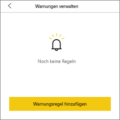
4. Wählen Sie aus, ob Sie Warnungen bei Über- oder Unterschreiten eines Werts empfangen möchten, und legen Sie dann den Wert fest.
   
   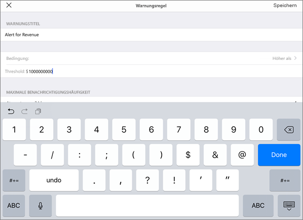
5. Legen Sie fest, ob Warnungen stündlich oder täglich empfangen werden sollen und ob zusammen mit der Warnung auch eine E-Mail an Sie gesendet werden soll.
   
   > [!NOTE]
   > Sie empfangen Warnungen nicht jede Stunde oder jeden Tag, wenn die Daten während dieser Zeit nicht aktualisiert wurden.
   > 
   > 
6. Sie können auch den Warnungstitel ändern.
7. Tippen Sie auf **Speichern**.
8. Eine einzelne Kachel kann Warnungen für Werte über und unter einem Schwellenwert enthalten. Tippen Sie in **Benachrichtigungen verwalten** auf **Warnungsregel hinzufügen**.
   
   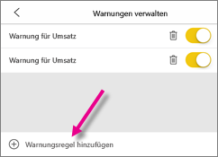

### Verwalten von Warnungen auf dem iPhone oder iPad
Sie können einzelne Warnungen auf dem Mobilgerät verwalten oder [alle Warnungen im Power BI-Dienst verwalten](../../service-set-data-alerts.md).

1. Tippen Sie in einem Dashboard auf eine Zahlen- oder Maßstabkachel, die eine Warnung aufweist.  
   
   
2. Tippen Sie auf das Glockensymbol .  
3. Tippen Sie auf den Namen der Warnung, um sie zu bearbeiten, tippen Sie auf den Schieberegler, um E-Mail-Benachrichtigungen zu deaktivieren, oder tippen Sie auf den Papierkorb, um die Warnung zu löschen.
   
    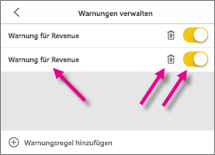

## Datenwarnungen auf einem Android-Gerät
### Festlegen einer Warnung auf einem Android-Gerät
1. Tippen Sie in einem Power BI-Dashboard auf eine Zahlen- oder Maßstabkachel, um sie zu öffnen.  
2. Tippen Sie auf das Glockensymbol , um eine Warnung hinzuzufügen.  
   
   
3. Tippen Sie auf das Plussymbol (+).
   
   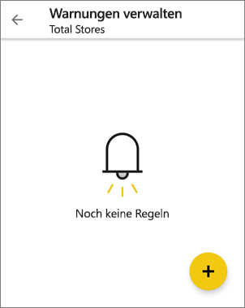
4. Wählen Sie aus, ob Sie Warnungen bei Über- oder Unterschreiten eines Werts empfangen möchten, und geben Sie den Wert ein.
   
   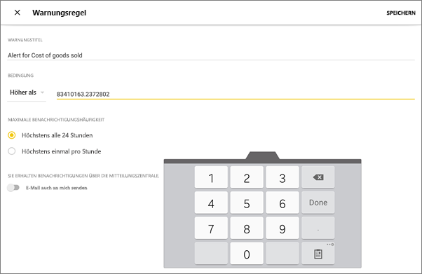
5. Tippen Sie auf **Fertig**.
6. Legen Sie fest, ob Warnungen stündlich oder täglich empfangen werden sollen und ob zusammen mit der Warnung auch eine E-Mail an Sie gesendet werden soll.
   
   > [!NOTE]
   > Sie empfangen Warnungen nicht jede Stunde oder jeden Tag, wenn die Daten während dieser Zeit nicht aktualisiert wurden.
   > 
   > 
7. Sie können auch den Warnungstitel ändern.
8. Tippen Sie auf **Speichern**.

### Verwalten von Warnungen auf einem Android-Gerät
Sie können einzelne Warnungen in der mobilen Power BI-App verwalten oder [alle Warnungen im Power BI-Dienst verwalten](../../service-set-data-alerts.md).

1. Tippen Sie in einem Dashboard auf eine Karten- oder Maßstabkachel, die eine Warnung aufweist.  
2. Tippen Sie auf das Glockensymbol .  
3. Tippen Sie auf die Warnung, um einen Wert zu ändern oder die Warnung zu deaktivieren.
   
    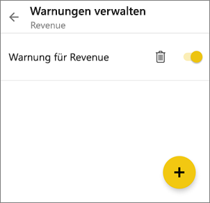
4. Tippen Sie auf das Pluszeichen (+), um derselben Kachel eine weitere Warnung hinzuzufügen.
5. Um die Warnung ganz zu entfernen, tippen Sie auf das Papierkorbsymbol .

## Datenwarnungen auf einem Windows-Gerät
### Festlegen von Datenwarnungen auf einem Windows-Gerät
1. Tippen Sie in einem Dashboard auf eine Zahlen- oder Maßstabkachel, um sie zu öffnen.  
2. Tippen Sie auf das Glockensymbol , um eine Warnung hinzuzufügen.  
   
   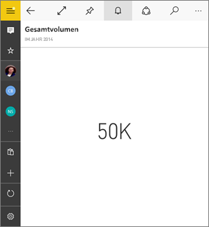
3. Tippen Sie auf das Plussymbol (+).
   
   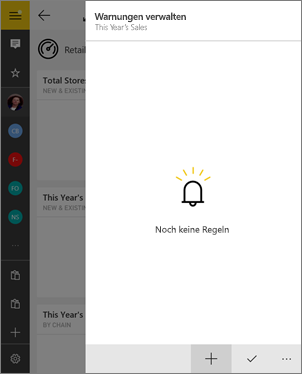
4. Wählen Sie aus, ob Sie Warnungen bei Über- oder Unterschreiten eines Werts empfangen möchten, und geben Sie den Wert ein.
   
   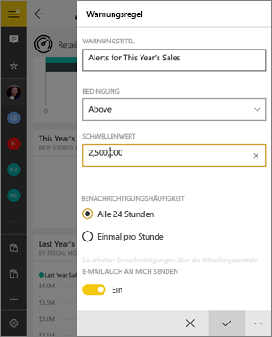
5. Legen Sie fest, ob Warnungen stündlich oder täglich empfangen werden sollen und ob zusammen mit der Warnung auch eine E-Mail an Sie gesendet werden soll.
   
   > [!NOTE]
   > Sie empfangen Warnungen nicht jede Stunde oder jeden Tag, wenn die Daten während dieser Zeit nicht aktualisiert wurden.
   > 
   > 
6. Sie können auch den Warnungstitel ändern.
7. Tippen Sie auf das Häkchen.
8. Eine einzelne Kachel kann Warnungen für Werte über und unter einem Schwellenwert enthalten. Tippen Sie in **Warnungen verwalten** auf das Pluszeichen (+).
   
   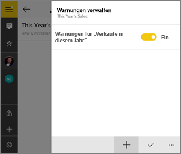

### Verwalten von Warnungen auf einem Windows-Gerät
Sie können einzelne Warnungen in der mobilen Power BI-App verwalten oder [alle Warnungen im Power BI-Dienst verwalten](../../service-set-data-alerts.md).

1. Tippen Sie in einem Dashboard auf eine Karten- oder Maßstabkachel, die eine Warnung aufweist.  
2. Tippen Sie auf das Glockensymbol .  
   
   
3. Tippen Sie auf die Warnung, um einen Wert zu ändern oder die Warnung zu deaktivieren.
   
    
4. Um die Warnung vollständig zu löschen, klicken Sie mit der rechten Maustaste darauf, oder halten Sie die Warnung gedrückt, und wählen Sie **Löschen** aus.

## Empfangen von Warnungen
Sie empfangen Warnungen in der Power BI-[Mitteilungszentrale](mobile-apps-notification-center.md) auf dem Mobilgerät oder im Power BI-Dienst zusammen mit Benachrichtigungen zu neuen Dashboards, die für Sie freigegeben wurden.

Häufig wird die tägliche Aktualisierung von Datenquellen festgelegt, manche werden jedoch in kürzeren Abständen aktualisiert. Wenn die Daten im Dashboard aktualisiert werden und die nachverfolgten Daten einen der von Ihnen festgelegten Schwellenwerte erreichen, erfolgen mehrere Aktionen.

1. Power BI überprüft, ob seit dem Senden der letzten Warnung mehr als eine Stunde oder mehr als 24 Stunden (je nach der von Ihnen ausgewählten Option) verstrichen sind.
   
   Solange die Daten den Schwellenwert überschreiten, erhalten Sie stündlich oder alle 24 Stunden eine Warnung.
2. Wenn Sie festgelegt haben, dass bei einer Warnung eine E-Mail an Sie gesendet wird, enthält Ihr Posteingang etwa Folgendes.
   
   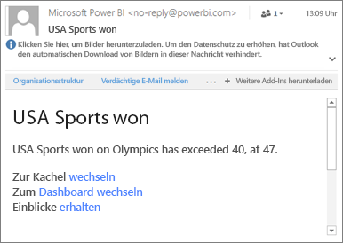
3. Power BI fügt der **Mitteilungszentrale** eine Nachricht und der entsprechenden Kachel das Symbol für eine neue Warnung  hinzu.
4. Tippen Sie auf die globale Navigationsschaltfläche  zum [Öffnen der **Mitteilungszentrale**](mobile-apps-notification-center.md) und Anzeigen der Warnungsdetails.
   
     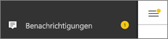 

> [!NOTE]
> Warnungen erfolgen nur für Daten, die aktualisiert werden. Wenn Daten aktualisiert werden, überprüft Power BI, ob eine Warnung für diese Daten festgelegt ist. Wenn die Daten einen Warnungsschwellenwert erreicht haben, wird eine Warnung ausgelöst.
> 
> 

## Tipps und Problembehandlung
* Für Bing-Kacheln und für Kartenkacheln mit Datum/Uhrzeit-Measures werden Warnungen derzeit nicht unterstützt.
* Warnungen können nur für numerische Daten ausgelöst werden.
* Warnungen erfolgen nur für Daten, die aktualisiert werden. Sie können nicht für statische Daten ausgelöst werden.
* Warnungen können nicht mit Kacheln verwendet werden, die Streamingdaten enthalten.

## Nächste Schritte
* [Verwalten von Warnungen im Power BI-Dienst](../../service-set-data-alerts.md)
* [Mobile Power BI-Mitteilungszentrale](mobile-apps-notification-center.md)
* Haben Sie Fragen? [Stellen Sie Ihre Frage in der Power BI-Community.](http://community.powerbi.com/)

