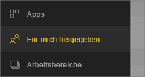
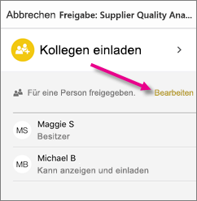
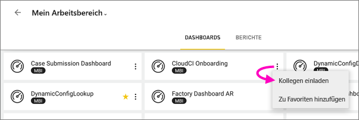
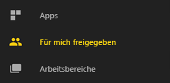
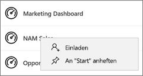
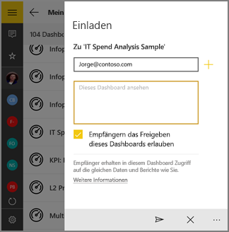

# Freigeben eines Dashboards oder Berichts in den mobilen Power BI-Apps
Gilt für:

|  |  |  |  |  |
|:--- |:--- |:--- |:--- |:--- |
| iPhones |iPads |Android-Telefone |Android-Tablets |Windows 10-Geräte |

Mit einer [Power BI Pro-Lizenz](../../service-features-license-type.md) können Sie andere Personen dazu einladen, sich Ihre Dashboards und Berichte anzusehen, indem Sie Links aus der mobilen Power BI-App freigeben. Sie können diese mit jedem teilen, unabhängig davon, ob die Person sich innerhalb oder außerhalb Ihrer Organisation befindet und ob sie ein Firmen-E-Mail-Konto hat oder nicht. Sie benötigen ebenfalls Power BI Pro-Lizenzen, oder es muss sich um Inhalte in einer [Premium-Kapazität](../../service-premium-what-is.md) handeln.

Aus den mobilen Power BI-Apps für iOS und Android können Sie auch [eine Momentaufnahme einer Kachel, eines Berichts oder einer Visualisierung mit Anmerkungen versehen und freigeben](mobile-annotate-and-share-a-tile-from-the-mobile-apps.md). 

## Freigeben über Ihr iPhone
1. Tippen Sie auf der Aktionssymbolleiste am unteren Rand des Dashboards oder Berichts auf das Symbol **Freigeben** .
   
   
2. Geben Sie die Namen (durch Kommas getrennt) und eine Nachricht ein, die Ihre Einladung begleitet.
3. Um eine erneute Freigabe zu ermöglichen, lassen Sie **Allow recipients to reshare** (Empfängern das Freigeben erlauben) ausgewählt.
   
   Mithilfe der erneuten Freigabe können Ihre Kollegen die E-Mail-Einladung an andere Personen in Ihrem Unternehmen weiterleiten, entweder über das Web oder mobile Apps.
5. Tippen Sie in der rechten oberen Ecke auf **Senden** .
   
   Die Empfänger erhalten eine Einladung per E-Mail, die einen direkten Link zum Dashboard oder Bericht enthält. Nach einem Monat läuft die Einladung ab. Wenn sie diese in einem Browser oder in der mobilen Power BI-App öffnen, wird die Einladung dem Abschnitt **Für mich freigegeben** ihres Power BI-Kontos hinzugefügt.
   
   
   
   Weitere Informationen finden Sie in den [Hinweisen zum Freigeben für Kollegen](../../service-share-dashboards.md).

### Aufheben von Freigaben über Ihr iPhone
Sie können die Freigabe nur aufheben, wenn Sie der Besitzer sind.

1. Tippen Sie auf der Aktionssymbolleiste am unteren Rand des Dashboards oder Berichts auf das Symbol **Freigeben** .
2. Tippen Sie auf **Kollegen einladen**.
   
   Ihnen wird mit den folgenden Meldungen die Liste mit den Kollegen angezeigt, für die Sie das Dashboard oder den Bericht freigegeben haben:
   
   * **Kann anzeigen**: Sie können Elemente anzeigen, aber nicht freigeben.
   * **Kann anzeigen und einladen**: Sie können Elemente anzeigen und für andere Kollegen freigeben.
1. Tippen Sie auf **Bearbeiten**.
   
    
4. Um die Freigabe aufzuheben, tippen Sie auf den roten Kreis neben dem Namen und dann auf **Löschen**.

## Freigeben über Ihr iPad
1. Tippen Sie auf das Symbol **Freigeben**  in der oberen rechten Ecke des Dashboards oder Berichts.
2. Geben Sie die E-Mail-Adressen und eine Nachricht ein, die Ihre Einladung begleitet.
3. Um eine erneute Freigabe zu ermöglichen, lassen Sie **Allow recipients to reshare** (Empfängern das Freigeben erlauben) ausgewählt.
   
   Mithilfe der erneuten Freigabe können Ihre Kollegen die E-Mail-Einladung an andere Personen in Ihrem Unternehmen weiterleiten, entweder über das Web oder mobile Apps. 

4. Tippen Sie in der rechten oberen Ecke auf **Senden** .
   
   Die Empfänger erhalten eine Einladung per E-Mail, die einen direkten Link zum Dashboard oder Bericht enthält. Nach einem Monat läuft die Einladung ab. Wenn sie diese in einem Browser oder in der mobilen Power BI-App öffnen, wird die Einladung dem Abschnitt **Für mich freigegeben** ihres Power BI-Kontos hinzugefügt.
   
   
   
   Weitere Informationen finden Sie in den [Hinweisen zum Freigeben für Kollegen](../../service-share-dashboards.md).

### Aufheben der Freigabe über Ihr iPad
Sie können die Freigabe nur aufheben, wenn Sie der Besitzer sind.

1. Tippen Sie auf das Symbol **Freigeben**  in der oberen rechten Ecke des Dashboards oder Berichts.
   
   Ihnen wird mit den folgenden Meldungen die Liste mit den Kollegen angezeigt, für die Sie das Dashboard oder den Bericht freigegeben haben:
   
   * **Kann anzeigen**: Sie können Elemente anzeigen, aber nicht freigeben.
   * **Kann anzeigen und einladen**: Sie können Elemente anzeigen und für andere Kollegen freigeben.
2. Tippen Sie auf **Bearbeiten**.
3. Um die Freigabe aufzuheben, tippen Sie auf den roten Kreis neben dem Namen und dann auf **Löschen**.

## Freigeben über Ihr Android-Gerät
1. Tippen Sie auf der Startseite des Dashboards oder Berichts auf die Auslassungspunkte (...) und dann auf **Invite a colleague** (Kollegen einladen).
   
   
2. Oder tippen Sie auf einem Dashboard oder Bericht auf das Symbol „Einladen“. .

    Wenn Sie der Besitzer des Dashboards sind, sehen Sie die Liste der Kollegen, mit denen Sie das Dashboard oder den Bericht geteilt haben, einschließlich der folgenden Anmerkungen:

    -   **Kann anzeigen**: Sie können Elemente anzeigen, aber nicht freigeben.
    -   **Kann anzeigen und erneut freigeben**: Sie können Elemente anzeigen und für andere Kollegen freigeben.

1. Geben Sie die E-Mail-Adressen und eine Nachricht ein, die Ihre Dashboard-Einladung begleitet. Andernfalls sendet Power BI eine Standardnachricht.
2. Um eine erneute Freigabe zu ermöglichen, lassen Sie **Empfängern das Freigeben des Dashboards erlauben** ausgewählt.
   
   Mithilfe der erneuten Freigabe können Ihre Kollegen die E-Mail-Einladung an andere Personen in Ihrem Unternehmen über den Browser oder mobile Apps weiterleiten.
   
1. Tippen Sie zum Senden der E-Mail im oberen rechten Bereich auf das Symbol **Senden** .
   
   Die Empfänger erhalten eine Einladung per E-Mail, die einen direkten Link zum Dashboard enthält. Nach einem Monat läuft die Einladung ab. Wenn sie diese in einem Browser oder in der mobilen Power BI-App öffnen, wird die Einladung dem Abschnitt **Für mich freigegeben** ihres Power BI-Kontos hinzugefügt.
   
   
   
   Weitere Informationen finden Sie in den [Hinweisen zum Freigeben von Dashboards für Kollegen](../../service-share-dashboards.md).

### Aufheben der Freigabe über Ihr Android-Gerät
Sie können die Freigabe nur aufheben, wenn Sie der Besitzer sind.

1. Tippen Sie in der rechten oberen Ecke Ihres Dashboards oder Berichts auf das Symbol „Einladen“ . 
   
   Sie sehen die Liste der Kollegen, für die Sie das Dashboard oder den Bericht freigegeben haben.
2. Um die Freigabe für einen Kollegen aufzuheben, tippen Sie auf das **X** neben einem Namen und dann auf **Entfernen**.

## Freigeben über Ihr Windows 10-Gerät:
1. Tippen Sie auf einem Dashboard oder Bericht auf das Symbol „Einladen“. .
   
   Sie können auch auf der Startseite der Dashboards oder Berichte mit der rechten Maustaste klicken oder diese gedrückt halten und auf **Einladen** tippen.
   
   
   
   Wenn Sie der Besitzer des Dashboards sind, sehen Sie die Liste der Kollegen, mit denen Sie das Dashboard geteilt haben, mit den folgenden Anmerkungen:
   
   **Kann anzeigen**: Sie können Elemente anzeigen, aber nicht freigeben.
   
   **Kann anzeigen und erneut freigeben**: Sie können Elemente anzeigen und für andere Kollegen freigeben.
2. Geben Sie die E-Mail-Adressen und eine Nachricht ein, die Ihre Einladung begleitet. Andernfalls sendet Power BI eine Standardnachricht.
   
   
3. Um eine erneute Freigabe zu ermöglichen, lassen Sie **Allow recipients to reshare** (Empfängern das Freigeben erlauben) ausgewählt.
   
   Mithilfe der erneuten Freigabe können Ihre Kollegen dieses Dashboard oder diesen Bericht mit anderen Benutzern in Ihrer Organisation gemeinsam nutzen, entweder über den Browser oder über mobile Apps.
   
1. Tippen Sie auf das Symbol **Senden** oder .
   
   Die Empfänger erhalten eine Einladung per E-Mail, die einen direkten Link zum Dashboard oder Bericht enthält. Nach einem Monat läuft die Einladung ab. Wenn sie diese in einem Browser oder in der mobilen Power BI-App öffnen, wird die Einladung dem Abschnitt **Für mich freigegeben** ihres Power BI-Kontos hinzugefügt.
   
   
   
   Weitere Informationen finden Sie in den [Hinweisen zum Freigeben für Kollegen](../../service-share-dashboards.md).

## Nächste Schritte
* [Kommentieren und Freigeben einer Momentaufnahme einer Kachel, eines Berichts oder einer Visualisierung in den mobilen Apps](mobile-annotate-and-share-a-tile-from-the-mobile-apps.md)
* [Freigeben Ihrer Power BI-Dashboards und -Berichte für Kollegen und andere](../../service-share-dashboards.md)
* Haben Sie Fragen? [Stellen Sie Ihre Frage in der Power BI-Community.](http://community.powerbi.com/)

