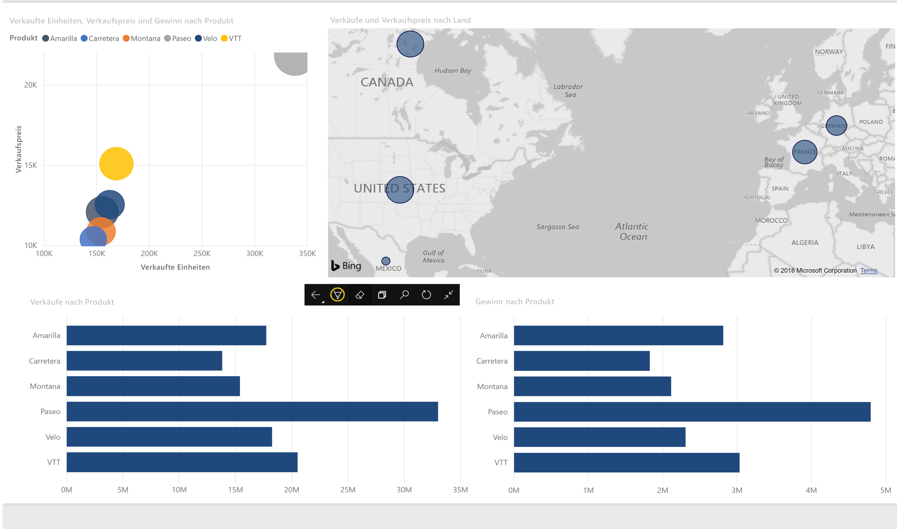

# Anzeigen von Berichten und Dashboards im Präsentationsmodus auf dem Surface Hub und Windows 10-Geräten
Sie können den Präsentationsmodus zum Anzeigen von Berichten und Dashboards auf Windows 10-Geräten und dem Surface Hub im Vollbildmodus verwenden. 

Der Power BI-Präsentationsmodus eignet sich für Besprechungen und Konferenzen, für einen dedizierten Projektor im Büro oder einfach für die maximale Raumausnutzung auf kleinen Bildschirmen. 

Im Präsentationsmodus der mobilen Power BI-App für Windows 10 werden alle „Zierleisten“, wie etwa die Navigations- und die Menüleiste, entfernt, um Ihnen und den Mitgliedern Ihres Teams die Konzentration auf die Daten in Ihrem Bericht zu erleichtern. Im Präsentationsmodus steht Ihnen eine Symbolleiste mit Aktionen zur Verfügung, die Ihnen die Interaktion und gemeinsame Arbeit mit den Daten ermöglicht.

Sie können auch [Dashboards und Berichte über den Power BI-Dienst im Vollbildmodus anzeigen](../end-user-focus.md), wenn diese im Web verfügbar sind.

> [!NOTE]
> Der Präsentationsmodus unterscheidet sich vom [Fokusmodus für Kacheln](mobile-tiles-in-the-mobile-apps.md).
> 
> 

## Verwenden des Präsentationsmodus
Tippen Sie in der mobilen Power BI-App auf das Symbol **Vollbild**, um in den Vollbildmodus zu wechseln.
 Die Zierleisten der App verschwinden, und am unteren Bildschirmrand oder an den Seiten rechts und links (abhängig von der Größe Ihres Bildschirms) wird eine Symbolleiste angezeigt.

Auf der Symbolleiste können Sie die folgenden Aktionen ausführen:

1. Tippen Sie auf das Symbol "Zurück",  um zur vorherigen Seite zurück zu gelangen. Durch langes Tippen auf das Symbol werden die Brotkrümelfenster eingeblendet, mit denen Sie zum enthaltenden Ordner Ihres Berichts oder Dashboards navigieren können.
2. Mit dem Symbol „Freihand“  können Sie eine Farbe für Zeichnungen und Anmerkungen mit dem Surface-Stift auf Ihrer Berichtsseite auswählen. 
3. Verwenden Sie das Symbol „Seiten“,  um die aktuell präsentierte Berichtsseite zu ersetzen.
4. Tippen Sie auf das Suchsymbol,  um nach weiteren Artefakten in Power BI zu suchen.
5. Tippen Sie zum Beenden des Präsentationsmodus auf das Symbol mit den gegeneinander gerichteten Pfeilen  auf der Symbolleiste.

Sie können die Symbolleiste lösen und sie an eine beliebige Position auf dem Bildschirm ziehen. Dies ist auf großen Bildschirmen nützlich, wenn Sie sich auf einen bestimmten Bereich in Ihrem Bericht konzentrieren, aber die Tools zugleich zu Ihrer Verfügung haben möchten. Platzieren Sie einfach Ihren Finger auf der Symbolleiste, und wischen Sie mit ihr in den Zeichenbereich des Berichts.

## Nächste Schritte
* [Anzeigen von Dashboards und Berichten im Vollbildmodus über den Power BI-Dienst](../end-user-focus.md)
* Haben Sie Fragen? [Stellen Sie Ihre Frage in der Power BI-Community.](http://community.powerbi.com/)

