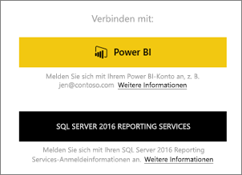
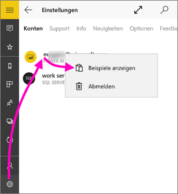
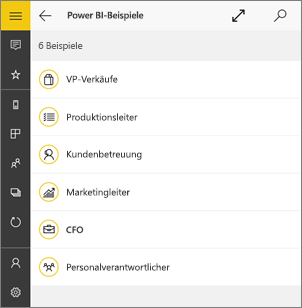
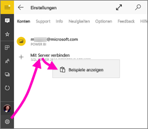
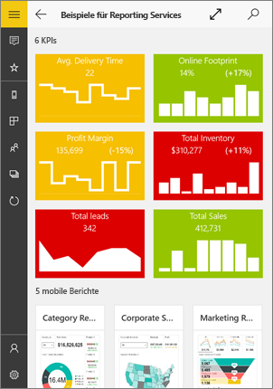
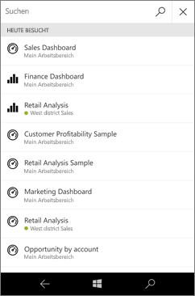
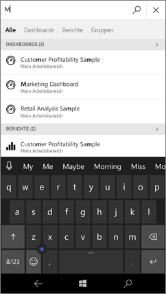
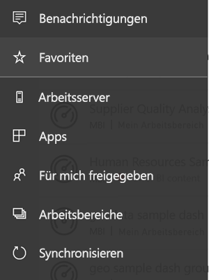
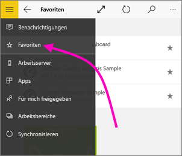
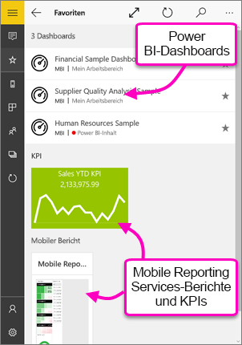

# Erste Schritte mit der mobilen Power BI-App für Windows 10
Die mobile Power BI-App für Windows 10 stellt Power BI mit touchfähigem mobilem Zugriff auf Ihre aktuellen Geschäftsdaten auf Ihrem Tablet oder Smartphone bereit. Auf Ihrem [Windows-Startbildschirm](mobile-pin-dashboard-start-screen-windows-10-phone-app.md) können Sie Ihre Unternehmensdashboards überall anzeigen und damit interagieren.

Mit Ihren Daten [erstellen Sie Dashboards und Berichte im Power BI-Dienst](../../service-get-started.md). 

Über die mobile Power BI-App für Windows 10 interagieren Sie dann mit den Dashboards und Berichten, untersuchen die darin enthaltenen Daten und geben Sie für andere frei.

## Das Wichtigste zuerst
* [**Laden Sie die mobile Power BI-App für Windows 10**](http://go.microsoft.com/fwlink/?LinkID=526478) aus dem Windows Store herunter.
  
  Auf Ihrem Gerät muss Windows 10 ausgeführt werden. Die App kann auf Geräten mit mindestens 3 GB RAM und 8 GB internem Speicher ausgeführt werden.
   
* Machen Sie sich [mit den Neuerungen bei den Power BI-Mobile Apps](mobile-whats-new-in-the-mobile-apps.md) vertraut.

## Registrieren beim Power BI-Dienst im Web
Wenn Sie sich noch nicht registriert haben, wechseln Sie zum [Power BI-Dienst](http://powerbi.com/), um sich für ein eigenes Konto zum Erstellen und Speichern von Dashboards und Berichten und zum Zusammenführen Ihrer Daten zu registrieren. Melden Sie sich dann auf Ihrem Windows 10-Gerät bei Power BI an, um die eigenen Dashboards von überall aus anzeigen zu können.

1. Tippen Sie im Power BI-Dienst auf [Registrieren](http://go.microsoft.com/fwlink/?LinkID=513879), um ein Power BI-Konto zu erstellen.
2. Beginnen Sie mit dem [Erstellen eigener Dashboards und Berichte](../../service-get-started.md).

## Erste Schritte mit der Power BI-App
1. Öffnen Sie auf Ihrem Windows 10-Gerät auf der Startseite die Power BI-App.
   
   
2. Um Ihre Power BI-Dashboards und -Berichte anzuzeigen, tippen Sie auf **Power BI**. Melden Sie sich mit den gleichen Anmeldeinformationen wie für Ihr Power BI-Konto im Web an. 
   
   Zum Anzeigen der mobilen Reporting Services-Berichte und -KPIs tippen Sie auf **SQL Server 2016 Reporting Services**. Melden Sie sich mit Ihren SQL Server Reporting Services-Anmeldeinformationen an.
   
   
3. Tippen Sie auf **Jetzt erkunden**  , um Ihre eigenen Dashboards anzuzeigen.

## Testen der Power BI- und Reporting Services-Beispiele
Sie können die Power BI- und Reporting Services-Beispiele auch ohne Registrierung testen. Nachdem Sie die App heruntergeladen haben, können Sie die Beispiele anzeigen oder loslegen. Sie können von der Startseite der Dashboards jederzeit zu den Beispielen zurückkehren.

### Power BI-Beispiele
Sie können die Power BI-Dashboard-Beispiele anzeigen und mit ihnen interagieren, es gibt jedoch einige Funktionen, die Ihnen dabei nicht zur Verfügung stehen. Sie können nicht die zu den Dashboards gehörenden Berichte öffnen, die Beispiele nicht für andere freigeben und die Beispiele nicht zu Ihren Favoriten machen.

1. Tippen Sie auf die globale Navigationsschaltfläche  in der linken oberen Ecke.
2. Tippen Sie auf das Symbol **Einstellungen** , tippen Sie auf Ihren Namen, und tippen Sie dann auf **Beispiele anzeigen**.
   
   
3. Wählen Sie eine Rolle aus, um das Beispieldashboard für diese Rolle anzuzeigen.  
   
   

### Mobile Reporting Services-Beispielberichte
1. Tippen Sie auf die globale Navigationsschaltfläche  in der linken oberen Ecke.
2. Tippen Sie auf das Symbol **Einstellungen** , klicken Sie mit der rechten Maustaste auf **Mit Server verbinden** (oder halten Sie diese Option gedrückt), und tippen Sie dann auf **Beispiele anzeigen**.
   
   
3. Öffnen Sie dann den Ordner „Retail Reports“ oder „Sales Reports“, um die zugehörigen KPIs und mobilen Berichte auszuwählen.
   
   

## Suchen nach Dashboards, Berichten und Apps
Sie können schnell nach Dashboards, Berichten und Apps suchen, indem Sie Text im Suchfeld eingeben, das sich immer oben in der App befindet.

1. Tippen Sie oben rechts auf das Suchsymbol.
   
   
   
   Power BI zeigt die neuesten Dashboards, Berichte und Apps an.
   
   
2. Schon während der Eingabe zeigt Power BI alle relevanten Ergebnisse an.
   
   

## Suchen von Inhalten in Dashboards in mobilen Power BI-Apps
Ihre Dashboards und Berichte sind an unterschiedlichen Stellen in den mobilen Power BI-Apps gespeichert, abhängig davon, woher sie stammen. [Weitere Informationen zum Suchen von Inhalten in den mobilen Apps](mobile-apps-quickstart-view-dashboard-report.md). Außerdem können Sie jederzeit nach allen Inhalten in den mobilen Power BI-Apps suchen. 

## Anzeigen Ihrer als Favoriten gespeicherten Dashboards, KPIs und Berichte
Sie können alle als Favoriten gespeicherten Power BI-Dashboards sowie Reporting Services-KPIs und mobile Berichte auf der Seite „Favoriten“ in den mobilen Apps anzeigen. Wenn Sie ein Dashboard als *Favoriten* in den mobilen Power BI-Apps speichern, können Sie auf allen Ihren Geräten darauf zugreifen, auch über den Power BI-Dienst in Ihrem Browser. 

* Tippen Sie auf **Favoriten**.
  
   
  
   Auf dieser Seite befinden sich Ihre Power BI-Favoriten und Ihre Favoriten aus dem Reporting Services-Webportal.
  
   

Weitere Informationen zu [Favoriten in den mobilen Power BI-Apps](mobile-apps-favorites.md).

## Nächste Schritte
Hier finden Sie weitere Möglichkeiten, die die Power BI-App für Windows 10-Geräte für Dashboards und Berichte in Power BI sowie mobile Reporting Services-Berichte und KPIs auf dem Reporting Services-Webportal bietet.

### Power BI- Dashboards und -Berichte
* Zeigen Sie [Ihre Apps](../../service-create-distribute-apps.md) an.
* Zeigen Sie Ihre [Dashboards](mobile-apps-view-dashboard.md) an.
* [Heften Sie Power BI-Kacheln oder ein -Dashboard](mobile-pin-dashboard-start-screen-windows-10-phone-app.md) als Live-Kacheln an die Startseite Ihres Gerätes an.
* [Geben Sie Kacheln frei](mobile-windows-10-phone-app-get-started.md).
* Geben Sie [Dashboards](mobile-share-dashboard-from-the-mobile-apps.md) frei.

### Mobile Reporting Services-Berichte und KPIs
* [Zeigen Sie mobile Reporting Services-Berichte und KPIs](mobile-app-windows-10-ssrs-kpis-mobile-reports.md) in der Power BI-App für Windows 10-Geräte an.
* Erstellen Sie [KPIs im Reporting Services-Webportal](https://msdn.microsoft.com/library/mt683632.aspx).
* [Erstellen Sie eigene mobile Berichte mit dem SQL Server Mobile Report Publisher](https://msdn.microsoft.com/library/mt652547.aspx), und veröffentlichen Sie sie auf dem Reporting Services-Webportal.

## Nächste Schritte
* [Laden Sie die Power BI-App](http://go.microsoft.com/fwlink/?LinkID=526478) aus dem Windows Store herunter.  
* [Was ist Power BI?](../../power-bi-overview.md)
* Haben Sie Fragen? [Stellen Sie Ihre Frage in der Power BI-Community.](http://community.powerbi.com/)

