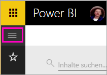
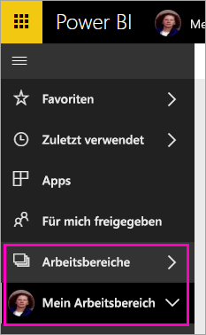
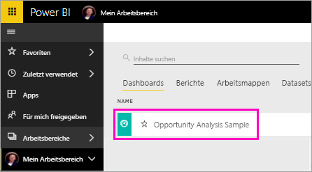
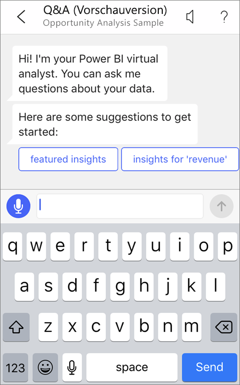
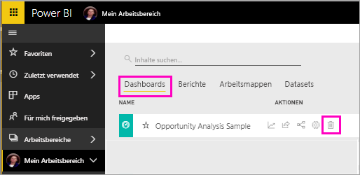

# Tutorial Stellen von Fragen zu Ihren Daten mit dem virtuellen Q&A-Analysten in iOS-Apps – Power BI

Am schnellsten nähern Sie sich Ihren Daten, wenn Sie Fragen in eigenen Worten stellen können. In diesem Tutorial verwenden Sie den virtuellen Q&A-Analysten in der mobilen Microsoft Power BI-App auf Ihrem iPad, iPhone und iPod Touch, um Fragen zu Ihren Beispieldaten zu stellen und wichtige Einblicke anzuzeigen. 

Gilt für:

|  |  |
|:--- |:--- |
| iPhones |iPads |

Der virtuelle Q&A-Analyst ist eine BI-Benutzeroberfläche für die Kommunikation, der auf zugrunde liegende Q&A-Daten im Power BI-Dienst [(https://powerbi.com)](https://powerbi.com) zugreift. Der Analyst schlägt Dateneinblicke vor, und Sie können über die Tastatur oder per Spracheingabe selbst Fragen stellen.

In diesem Tutorial erhalten Sie Informationen zu den folgenden Vorgängen:

> [!div class="checklist"]
> * Installieren der mobilen Power BI-App für iOS
> * Herunterladen eines Power BI-Beispieldashboards und -berichts
> * Anzeigen der von der mobilen App vorgeschlagenen Einblicke

Wenn Sie noch nicht bei Power BI registriert sind, müssen Sie sich zuerst für eine [kostenlose Testversion registrieren](https://app.powerbi.com/signupredirect?pbi_source=web).

## Voraussetzungen

### Installieren der Power BI für iOS-App
[Laden Sie die iOS-App](http://go.microsoft.com/fwlink/?LinkId=522062 "Herunterladen der iPhone-App") aus dem Apple App Store auf Ihr iPad, Ihr iPhone oder Ihren iPod Touch herunter.

Folgende Versionen unterstützen die Power BI für iOS-App:
- iPad mit iOS 10 oder höher
- iPhone 5 und höher mit iOS 10 oder höher 
- iPod Touch mit iOS 10 oder höher

### Herunterladen des Beispiels für die Opportunityanalyse
Der erste Schritt im Tutorial ist das Herunterladen der Beispiele zur Opportunityanalyse im Power BI-Dienst.

1. Öffnen Sie den Power BI-Dienst in einem Browser (app.powerbi.com), und melden Sie sich an.

1. Klicken Sie auf das globale Navigationssymbol, um den linken Navigationsbereich zu öffnen.

    

2. Wählen Sie im linken Navigationsbereich **Arbeitsbereiche** > **Mein Arbeitsbereich** aus.

    

3. Wählen Sie in der linken unteren Ecke **Daten abrufen** aus.
   
    

3. Wählen Sie auf der Seite „Daten abrufen“ das Symbol **Beispiele** aus.
   
   

4. Wählen Sie das **Beispiel für die Opportunityanalyse** aus.
 
    
 
8. Wählen Sie **Verbinden** aus.  
  
   
   
5. Power BI importiert das Beispiel, wodurch dem Arbeitsbereich ein neues Dashboard, ein neuer Bericht und ein neues Dataset hinzugefügt werden.
   
   

Sie können das Beispiel jetzt auf Ihrem iOS-Gerät anzeigen.

## Ausgewählte Einblicke
1. Öffnen Sie die Power BI-App auf Ihrem iPhone oder iPad, und melden Sie sich mit den Anmeldeinformationen Ihres Power BI-Kontos an – dies sind die gleichen, die Sie für den Power BI-Dienst im Browser verwendet haben.

1.  Tippen Sie auf die globale Navigationsschaltfläche  > **Arbeitsbereiche** > **Mein Arbeitsbereich**, und öffnen Sie das Dashboard für das Beispiel für die Opportunityanalyse.

2. Tippen Sie auf das Symbol „Virtueller Q&A-Analyst“  im Aktionsmenü unten auf der Seite (auf einem iPad oben auf der Seite).

     

     Der virtuelle Q&A-Analyst von Power BI bietet einige Vorschläge für den Einstieg.

     
3. Tippen Sie auf **featured insights** (Ausgewählte Einblicke).

     Der virtuelle Q&A-Analyst stellt einige Einblicke vor.
4. Scrollen Sie nach rechts, und tippen Sie auf **Insight 2**.

    

     Der virtuelle Q&A-Analyst zeigt „Insight 2“ an.

    
5. Tippen Sie auf das Diagramm, um es im Fokusmodus zu öffnen.

    
6. Tippen Sie in der linken oberen Ecke auf den Pfeil, um zur Oberfläche des virtuellen Q&A-Analysten zurückzukehren.

## Bereinigen von Ressourcen

Wenn Sie das Tutorial beendet haben, können Sie das Dashboard, den Bericht und das Dataset für das Beispiel für die Opportunityanalyse löschen.

1. Öffnen Sie den Power BI-Dienst (app.powerbi.com), und melden Sie sich an.

2. Wählen Sie im linken Navigationsbereich **Arbeitsbereiche** > **Mein Arbeitsbereich** aus.

3. Klicken Sie auf der Registerkarte **Dashboards** neben dem Dashboard für die Opportunityanalyse auf das Mülleimersymbol zum **Löschen**.

    

4. Wählen Sie die Registerkarte **Berichte**aus, und führen Sie die gleichen Schritte für den Bericht für die Opportunityanalyse durch.

5. Wählen Sie die Registerkarte **Datasets**aus, und führen Sie die gleichen Schritte für das Dataset für die Opportunityanalyse durch.

## Nächste Schritte

Sie haben den virtuellen Q&A-Assistenten in den mobilen Power BI-Apps für iOS getestet. Erfahren Sie mehr über Fragen und Antworten im Power BI-Dienst.
> [!div class="nextstepaction"]
> [Q&A im Power BI-Dienst](../end-user-q-and-a.md)

