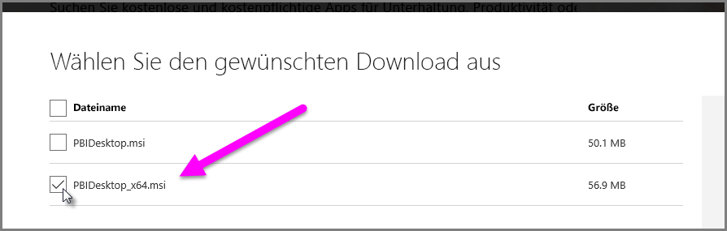

# Beheben von Problemen beim Importieren von Access- und XLS-Dateien in Power BI Desktop
In **Power BI Desktop** verwenden sowohl **Access-Datenbanken** als auch frühe Versionen von **Excel-Arbeitsmappen** (XLS-Dateien vom Typ Excel 97 bis 2003) das *Access-Datenbankmodul*. Es gibt drei häufige Situationen, die dazu führen können, dass die Access-Datenbank-Engine nicht ordnungsgemäß funktioniert:

## Situation 1: Es ist keine Access-Datenbank-Engine installiert
Wenn die Power BI Desktop-Fehlermeldung angibt, dass das Access-Datenbankmodul nicht installiert ist, müssen Sie die Version des Access-Datenbankmoduls (entweder 32-Bit oder 64-Bit) installieren, die Ihrer Version von Power BI Desktop entspricht. Sie können das Access-Datenbankmodul von der [Downloadseite](http://www.microsoft.com/download/details.aspx?id=13255) aus installieren.

>[!NOTE]
>Wenn sich die Bitversion des installierten Access-Datenbank-Engine von der Bitversion Ihrer Microsoft Office-Installation unterscheidet, können Office-Anwendungen die Access-Datenbank-Engine nicht verwenden.

## Situation 2: Die Bitversion der Access-Datenbank-Engine (32 Bit oder 64 Bit) unterscheidet sich von Ihrer Power BI Desktop-Bitversion
Diese Situation tritt häufig auf, wenn es sich bei der installierten Version von Microsoft Office um eine 32-Bit-Version und bei Power BI Desktop um eine 64-Bit-Version handelt. Das gleiche Problem kann auch im umgekehrten Fall auftreten, sodass nicht übereinstimmende Bit-Versionen in jedem Fall problematisch sind. (Wenn Sie ein Office 365-Abonnement verwenden, kann ein anderes Problem auftreten. Unter **Situation 3** finden Sie die entsprechende Lösung.) Der Fehler durch nicht übereinstimmende Bit-Versionen kann mithilfe jeder dieser Lösungen behoben werden:

1. Ändern Sie die Power BI Desktop-Version, sodass diese mit der Bitversion Ihrer Microsoft Office-Installation übereinstimmt. Um die Bitversion von Power BI Desktop zu ändern, deinstallieren Sie Power BI Desktop, und installieren Sie anschließend die Version von Power BI Desktop, die Ihrer Office-Installation entspricht. Zum Auswählen einer Version von Power BI Desktop wählen Sie auf der Downloadseite für Power BI Desktop **Erweiterte Downloadoptionen**aus.
   
   
   
   Wählen Sie auf der daraufhin angezeigten Downloadseite Ihre Sprache aus, und wählen Sie dann die Schaltfläche **Herunterladen** aus. Aktivieren Sie auf dem daraufhin angezeigten Bildschirm das Kontrollkästchen neben „PBIDesktop.msi“ für die 32-Bit-Version oder neben „PBIDesktop_x64.msi“ für die 64-Bit-Version. Im folgenden Bildschirm ist die 64-Bit-Version ausgewählt.
   
   
   
   >[!NOTE]
   >Wenn Sie mit der 32-Bit-Version von Power BI Desktop sehr große Datenmodelle erstellen, können Probleme auftreten, weil nicht genügend Arbeitsspeicher vorhanden ist.
2. Ändern Sie die Microsoft Office-Version, sodass diese mit der Bitversion Ihrer Power BI Desktop-Installation übereinstimmt. Um die Bitversion von Microsoft Office zu ändern, deinstallieren Sie Microsoft Office, und installieren Sie anschließend die Office-Version, die Ihrer Power BI Desktop-Installation entspricht.
3. Wenn der Fehler beim Öffnen einer XLS-Datei (einer Excel 97 bis 2003-Arbeitsmappe) auftritt, können Sie die Verwendung des Access-Datenbankmoduls vermeiden, indem Sie die XLS-Datei in Excel öffnen und als XLSX-Datei speichern.
4. Wenn die vorherigen drei Lösungen nicht möglich sind, können Sie beide Versionen der Access-Datenbank-Engine installieren. Dies wird jedoch *nicht* als Problemumgehung empfohlen. Das Installieren beider Versionen löst dieses Problem für Power Query für Excel und Power BI Desktop, führt jedoch zu Fehlern und Problemen bei Anwendungen, die automatisch (standardmäßig) die zuerst installierte Bitversion der Access-Datenbank-Engine verwenden. Um beide Bitversionen der Access-Datenbank-Engine zu installieren, [laden Sie beide Versionen herunter](http://www.microsoft.com/download/details.aspx?id=13255), und führen Sie beide mithilfe des Schalters */passive* aus. Beispiel:
   
       c:\users\joe\downloads\AccessDatabaseEngine.exe /passive
   
       c:\users\joe\downloads\AccessDatabaseEngine_x64.exe /passive

## Situation 3: Probleme mit Access- oder XLS-Dateien bei einem Office 365-Abonnement
Wenn Sie ein Office 365-Abonnement wie **Office 2013** oder **Office 2016** verwenden, wird der Anbieter der Access-Datenbank-Engine an einem virtuellen Registrierungsstandort registriert, auf den *ausschließlich* Office-Prozesse zugreifen können. Da es kein Office-Prozess ist, kann das Mashup-Modul (führt Power BI Desktop sowie Excel-Versionen aus, die nicht Teil von Office 365 sind) den Anbieter des Access-Datenbankmoduls nicht verwenden.

Um das Problem zu lösen, können Sie die Redistributable des Access-Datenbankmoduls, die der Bit-Version Ihrer Power BI Desktop-Installation entspricht, [herunterladen und installieren](http://www.microsoft.com/download/details.aspx?id=13255) (zu Bit-Versionen siehe die Abschnitte oben).

## Weitere für den Import problematische Situationen
Wir sind bemüht, im Zusammenhang mit Access- und XLS-Dateien auftretende Probleme möglichst umfassend darzustellen. Wenn ein Problem auftritt, das in diesem Artikel nicht behandelt wird, können Sie sich mit entsprechenden Fragen gerne an den [Power BI-Support](https://powerbi.microsoft.com/support/) wenden. Wir erweitern unsere Artikel regelmäßig um Lösungen für Probleme, die viele Kunden betreffen.

