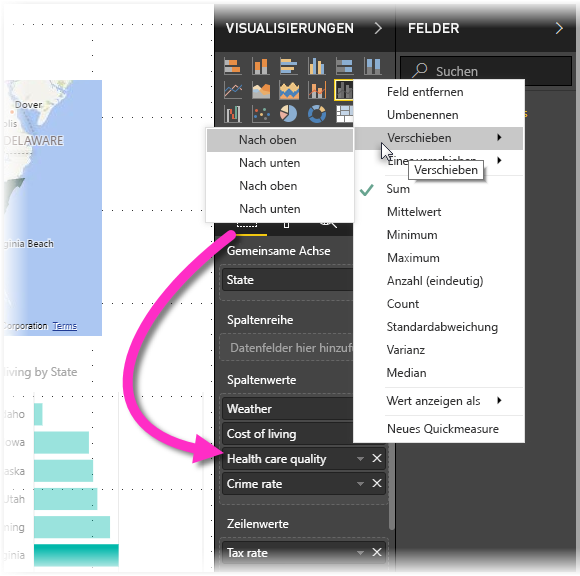

# Barrierefreiheit in Power BI Desktop-Berichten
Power BI verfügt über Features, die von Personen mit Behinderungen für die leichtere Nutzung von und Interaktion mit Power BI-Berichten verwendet werden können. Zu diesen Funktionen gehört die Möglichkeit, einen Bericht mithilfe der Tastatur oder einer Sprachausgabe zu verwenden, den Fokus per TAB-Taste auf die verschiedenen Objekte auf einer Seite zu verlagern und Marker in Visualisierungen sinnvoll einzusetzen.

## Nutzen eines Power BI Desktop-Berichts mit Tastatur oder Sprachausgabe
Ab der im September 2017 veröffentlichten Version von **Power BI Desktop** können Sie die **?** -Taste drücken, um ein Fenster anzuzeigen, in dem die in **Power BI Desktop** verfügbaren Tastenkombinationen für Barrierefreiheit beschrieben werden.

Mit den Erweiterungen für die Barrierefreiheit können Sie einen Power BI-Bericht mithilfe der folgenden Techniken mit Tastatur oder Sprachausgabe nutzen:

Wenn Sie einen Bericht anzeigen, sollte der Überprüfungsmodus deaktiviert sein.

Sie können den Fokus zwischen den Seitenregisterkarten von Berichten oder den Objekten auf einer bestimmten Berichtsseite mithilfe von **STRG+F6** wechseln.

* Verwenden der *TAB*-Taste oder der *PFEILTASTEN* zum Bewegen des Fokus von einer Berichtsseite zur nächsten, wenn sich der Fokus auf *Seitenregisterkarten des Berichts* befindet. Der Titel der Berichtsseite und ihr aktueller Auswahlstatus werden von der Sprachausgabe vorgelesen. Um die Berichtsseite zu laden, die aktuell den Fokus hat, können die *EINGABETASTE* oder die *LEERTASTE* verwendet werden.
* Wenn der Fokus auf einer geladenen *Berichtsseite* liegt, verwenden Sie die *TAB*-Taste, um den Fokus auf die einzelnen Objekte auf der Seite zu bewegen. Zu diesen zählen alle Textfelder, Bilder, Formen und Diagramme. Die Sprachausgabe liest den Typ des Objekts, den Titel (sofern vorhanden) und die Beschreibung des Objekts, falls sie vom Autor des Berichts angegeben wurde. 

Beim Navigieren zwischen Visuals können Sie **ALT+UMSCHALT+F10** drücken, um den Visualheader zu fokussieren. Dieser enthält verschiedene Optionen, darunter das Sortieren, das Exportieren der Daten hinter dem Diagramm und der Fokusmodus. 

Sie können **ALT+UMSCHALT+F11** drücken, um eine barrierefreie Version des Fensters *Daten anzeigen* zu öffnen. Dadurch können Sie die im Visual verwendeten Daten in einer HTML-Tabelle untersuchen und dabei die gleichen Tastenkombinationen verwenden, die Sie normalerweise mit der Sprachausgabe verwenden. 

> [!NOTE]
> Das Feature „Daten anzeigen“ ist nur über diese Tastenkombination für die Sprachausgabe verfügbar. Wenn Sie das Fenster „Daten anzeigen“ über die Option im Visualheader öffnen, kann die Sprachausgabe nicht darauf zugreifen. Aktivieren Sie den Überprüfungsmodus, wenn Sie „Daten anzeigen“ verwenden, um von allen heißen Schlüsseln zu profitieren, die von Ihrer Bildschirmsprachausgabe bereitgestellt werden.

Ab dem **Power BI Desktop**-Release von Juli 2018 verfügen Slicer auch über integrierte Barrierefreiheitsfunktionen. Wenn Sie einen Slicer auswählen, verwenden Sie zum Anpassen des Werts die STRG- und die NACH-RECHTS-TASTE, um die verschiedenen Steuerelemente im Slicer zu durchlaufen. Wenn Sie z.B. am Anfang die STRG- und die NACH-RECHTS-TASTE drücken, befindet sich der Fokus auf dem Radierer. Das Drücken der LEERTASTE entspricht dem Klicken auf die Schaltfläche „Radierer“, wodurch alle Werte im Slicer gelöscht werden. 

Mithilfe der TABULATORTASTE können Sie alle Steuerelemente in einem Slicer durchlaufen. Wenn der Radierer aktiv ist, verschieben Sie den Fokus durch Drücken der TABULATORTASTE auf die Dropdown-Schaltfläche. Wenn Sie die TABULATORTASTE erneut drücken, verschieben Sie den Fokus auf den ersten Slicerwert (sofern mehrere Werte für den Slicer vorhanden sind, z.B. ein Bereich). 

Diese zusätzlichen Barrierefreiheitsfunktionen wurden entwickelt, damit Benutzer Power BI-Berichte per Sprachausgabe und Tastaturnavigation umfassend verwenden können.

## Tipps zum Erstellen barrierefreier Berichte
Die folgenden Tipps können Ihnen beim Erstellen von **Power BI Desktop**-Berichten mit besserer Barrierefreiheit helfen.

### Allgemeine Tipps zum Erstellen barrierefreier Berichte

* Aktivieren Sie für **Liniendiagramm**-, **Flächendiagramm**- und **Kombinationsdiagramm**-Visuals sowie für **Punktdiagramm**- und **Blasendiagramm**-Visuals Marker, und verwenden Sie für jede Linie eine andere *Markerform*.
  
  * Um *Marker* zu aktivieren, wählen Sie im Bereich **Visualisierungen** den Abschnitt **Format** aus, erweitern Sie den Abschnitt **Formen**, scrollen Sie dann nach unten bis zum Ein-/Ausschalter **Marker**, und schalten Sie ihn *Ein*.
  * Wählen Sie anschließend im Dropdownfeld im Abschnitt **Formen** den Namen jeder Linie (oder Fläche bei einem **Flächendiagramm**) aus. Unterhalb des Dropdownfelds können Sie anschließend viele Aspekte des für die ausgewählte Linie verwendeten Markers anpassen, einschließlich dessen Form, Farbe und Größe.
  
  
  
  * Die Verwendung einer anderen *Markierungsform* für jede Linie macht es den Nutzern des Berichts leichter, die Linien (oder Flächen) voneinander zu unterscheiden.
* Verwenden Sie zum Übermitteln von Informationen nicht nur Farbmarkierungen. Zusätzlich zur Verwendung von Formen in Linien- und Punktdiagrammen sollten Sie sich nicht auf die bedingte Formatierung verlassen, um Einblicke in Tabellen und Matrizen zu gewähren. 
* Wählen Sie eine Sortierreihenfolge für jedes Visual in Ihrem Bericht mit Bedacht aus. Wenn Benutzer der Sprachausgabe zu den Daten hinter dem Diagramm navigieren, wird die gleiche Sortierreihenfolge wie beim Visual verwendet.
* Wählen Sie im Designkatalog ein *Design* mit hohem Kontrast aus, das für Farbenblinde geeignet ist, und importieren Sie es mithilfe der [**Design**-Vorschaufunktion](desktop-report-themes.md).
* Geben Sie zu jedem Objekt in einem Bericht *Alternativtext* an. Auf diese Weise stellen Sie sicher, dass Personen, die Ihren Bericht verwenden, verstehen, was Sie mit einem visuellen Element kommunizieren möchten, selbst wenn sie das visuelle Element, das Bild, die Form oder das Textfeld nicht sehen können. Sie können zu jedem Objekt in einem *Power BI Desktop*-Bericht **Alternativtext** angeben, indem Sie das Objekt (wie etwa ein Visual, eine Form usw.) auswählen und im Bereich **Visualisierungen** den Bereich **Format** auswählen, **Allgemein** erweitern, dann nach unten scrollen und das Textfeld **Alternativtext** ausfüllen.
  
  
* Stellen Sie sicher, dass in Ihren Berichten ein ausreichender Kontrast zwischen Text- und Hintergrundfarben vorhanden ist. Es gibt verschiedene Tools, die Sie zum Überprüfen der Farben in Ihrem Bericht verwenden können, z.B. [Colour Contrast Analyser](https://developer.paciellogroup.com/resources/contrastanalyser/). 
* Verwenden Sie Textgrößen und -schriftarten, die leicht lesbar sind. Kleine Textgrößen oder -schriftarten, die schwierig zu lesen sind, verringern die Barrierefreiheit.
* Schließen Sie in alle Visuals einen Titel, Achsenbezeichnungen und Datenbezeichnungen ein.
* Verwenden Sie aussagekräftige Titel für alle Seiten des Berichts.
* Vermeiden Sie, wenn möglich, die Verwendung dekorativer Formen und Bilder im Bericht, da diese in der Registerkartenreihenfolge des Berichts enthalten sind. Wenn Sie dekorative Objekte in Ihren Bericht einfügen müssen, aktualisieren Sie den alternativen Text des Objekts, um Benutzer der Sprachausgabe wissen zu lassen, dass es zur Dekoration dient.

### Anordnen von Elementen in Feld-Buckets
Ab der Oktober 2018-Version von **Power BI Desktop** kann mit der Tastatur im **Felder**-Bereich navigiert werden, und der Bereich interagiert auch mit Sprachausgaben. 

Um den Prozess der Erstellung von Berichten mit Sprachausgaben zu verbessern, ist ein Kontextmenü verfügbar, um das Verschieben von Feldern innerhalb des Bereichs nach oben oder unten in der Liste **Felder** zu ermöglichen bzw. das Verschieben des Felds in andere Bereiche, wie z. B. **Legende**, **Wert** oder andere.

## Unterstützung für hohen Berichtskontrast

Wenn Sie unter Windows einen der Modi für hohen Kontrast verwenden, gelten die ausgewählten Einstellungen und die Palette auch für Berichte in **Power BI Desktop**. 

**Power BI Desktop** erkennt automatisch, welches Design für hohen Kontrast unter Windows verwendet wird, und wendet diese Einstellungen auf Ihre Berichte an. Der Bericht ist auch nach der Veröffentlichung im Power BI-Dienst oder einem anderen Dienst in diesen kontrastreichen Farben gehalten.

Der Power BI-Dienst versucht auch, die für Windows ausgewählten Kontrasteinstellungen zu erkennen. Wie effektiv und genau diese Erkennung ist, hängt jedoch von dem Browser ab, in dem der Power BI-Dienst verwendet wird. Wenn Sie das Design im Power BI-Dienst manuell festlegen möchten, klicken Sie auf **Ansicht > Farben mit hohem Kontrast**, und wählen Sie dann das Design aus, das Sie auf den Bericht anwenden möchten.

In **Power BI Desktop** spiegeln einige Bereiche, z.B. die Felder **Visualisierungen** und **Felder**, nicht die Auswahl des Windows-Farbschemas mit hohem Kontrast wider.

## Überlegungen und Einschränkungen
Es gibt einige bekannte Probleme und Einschränkungen bei den Barrierefreiheitsfeatures. Diese werden in der folgenden Liste beschrieben:

* Wenn Sie die Sprachausgabe mit **Power BI Desktop** verwenden, erzielen Sie die bestmögliche Leistung, wenn Sie die Sprachausgabe Ihrer Wahl starten, bevor Sie Dateien in Power BI Desktop öffnen.
* Wenn Sie die Sprachausgabe von Microsoft verwenden, gibt es einige Einschränkungen beim Anzeigen von Daten als HTML-Tabelle.

## Tastenkombinationen
Tastenkombinationen sind hilfreich, um sich in Power BI-Berichten mithilfe einer Tastatur zu bewegen. Die folgende Tabelle beschreibt die Tastenkombinationen, die in einem Power BI-Bericht zur Verfügung stehen. Zusätzlich zur Verwendung dieser Tastenkombinationen in Power BI Desktop funktionieren diese Tastenkombinationen auch in diesen Benutzeroberflächenelementen:

* Dialogfeld „Q&A-Explorer“
* Dialogfeld „Erste Schritte“
* Dateimenü und Info-Dialogfeld
* Warnungsleiste
* Dialogfeld zur Dateiwiederherstellung
* Dialogfeld für Stirnrunzeln

Wir arbeiten fortlaufend daran, die Barrierefreiheit weiter zu verbessern, deshalb bieten die oben aufgeführten Benutzeroberflächenelemente darüber hinaus auch eine Sprachausgabe und Einstellungen für einen hohen Kontrast.

### Häufig verwendete Tastenkombinationen
| Zweck           | Tastenkombination                |
| :------------------- | :------------------- |
| Fokus zwischen Abschnitten verschieben  | STRG+F6 |
| Fokus im Abschnitt nach vorne verschieben | TAB         |
| Fokus im Abschnitt nach hinten verschieben | UMSCHALT+TAB |
| Objekt auswählen oder Auswahl aufheben | EINGABETASTE oder LEERTASTE |
| Mehrere Objekte auswählen | STRG+LEERTASTE |

### Auf Visual
| Zweck           | Tastenkombination                |
| :------------------- | :------------------- |
| Fokus auf Visualmenü verschieben | ALT+UMSCHALT+F10 |
| Daten anzeigen | ALT+UMSCHALT+F11  |
| Visual eingeben | STRG+NACH-RECHTS-TASTE |
| Ebene eingeben | Daten |
| Ebene oder Visual beenden | ESC |
| Datenpunkt auswählen oder Auswahl aufheben | EINGABETASTE oder LEERTASTE |
| Mehrfachauswahl | STRG+EINGABETASTE oder STRG+LEERTASTE |
| Rechtsklick | <ul><li>Windows-Tastatur: Windows-Taste + F10.  Die Windows-Taste befindet sich zwischen der linken ALT-TASTE und der Taste mit den spitzen Klammern.</li><li>Andere Tastatur: UMSCHALT+F10</li></ul> |
| Auswahl löschen | STRG+UMSCHALT+C |

### Tabelle und Matrix-Navigation
| Zweck           | Tastenkombination                |
| :------------------- | :------------------- |
| Verschieben des Fokus nach oben / unten eine Zelle (über alle Zellen in allen Bereichen)  | Oben-Taste, Schlüssel / nach-unten-Taste |
| Verschieben des Fokus nach links / rechts von einer Zelle (über alle Zellen in allen Bereichen)  | Linke Pfeiltaste bzw. rechte Pfeiltaste |

### Navigationsbereich
| Zweck           | Tastenkombination                |
| :------------------- | :------------------- |
| Mehrfachauswahl | STRG+LEERTASTE |
| Eine einzelne Tabelle reduzieren | NACH-LINKS-TASTE |
| Eine einzelne Tabelle erweitern | NACH-RECHTS-TASTE |
| Alle Tabellen reduzieren | ALT+UMSCHALT+1 |
| Alle Tabellen erweitern | ALT+UMSCHALT+9 |
| Kontextmenü öffnen | <ul><li>Windows-Tastatur: Windows-Taste + F10.  Die Windows-Taste befindet sich zwischen der linken ALT-TASTE und der Taste mit den spitzen Klammern.</li><li>Andere Tastatur: UMSCHALT+F10</li></ul> |

### Slicer
| Zweck           | Tastenkombination                |
| :------------------- | :------------------- |
| Interagieren mit einem Slicer | STRG+NACH-RECHTS-TASTE |

### Auswahlbereich
| Zweck           | Tastenkombination                |
| :------------------- | :------------------- |
| Auswahlbereich aktivieren | F6 |
| Ein Objekt auf die nächsthöhere Ebene verschieben | STRG+UMSCHALT+F |
| Ein Objekt auf die nächste tiefere Ebene verschieben | STRG+UMSCHALT+B |
| Ein Objekt ausblenden/einblenden (umschalten) | STRG+UMSCHALT+S |

### DAX-Editor
| Zweck           | Tastenkombination                |
| :------------------- | :------------------- |
| Zeile nach oben/unten verschieben | ALT+NACH-OBEN-TASTE bzw. ALT+NACH-UNTEN-TASTE |
| Zeile nach oben/unten kopieren | UMSCHALT+ALT+NACH-OBEN-TASTE bzw. UMSCHALT+ALT+NACH-UNTEN-TASTE |
| Linie darunter einfügen | STRG+EINGABETASTE |
| Linie darüber einfügen | STRG+UMSCHALT+EINGABETASTE |
| Zu zugehöriger Klammer springen | STRG+UMSCHALT+\ |
| Einzug vergrößern/Zeile ausrücken | STRG+] bzw. STRG+[ |
| Cursor einfügen | ALT+Klick |
| Aktuellen Zeile auswählen | STRG+I |
| Alle Vorkommen der aktuellen Auswahl auswählen | STRG+UMSCHALT+L |
| Alle Vorkommen des aktuellen Worts auswählen | STRG+F2 |

### Daten eingeben
| Zweck           | Tastenkombination                |
| :------------------- | :------------------- |
| Bearbeitbares Raster beenden | STRG + TAB |

## Nächste Schritte
* [Verwenden von Berichtdesigns in Power BI Desktop (Vorschau)](desktop-report-themes.md)

