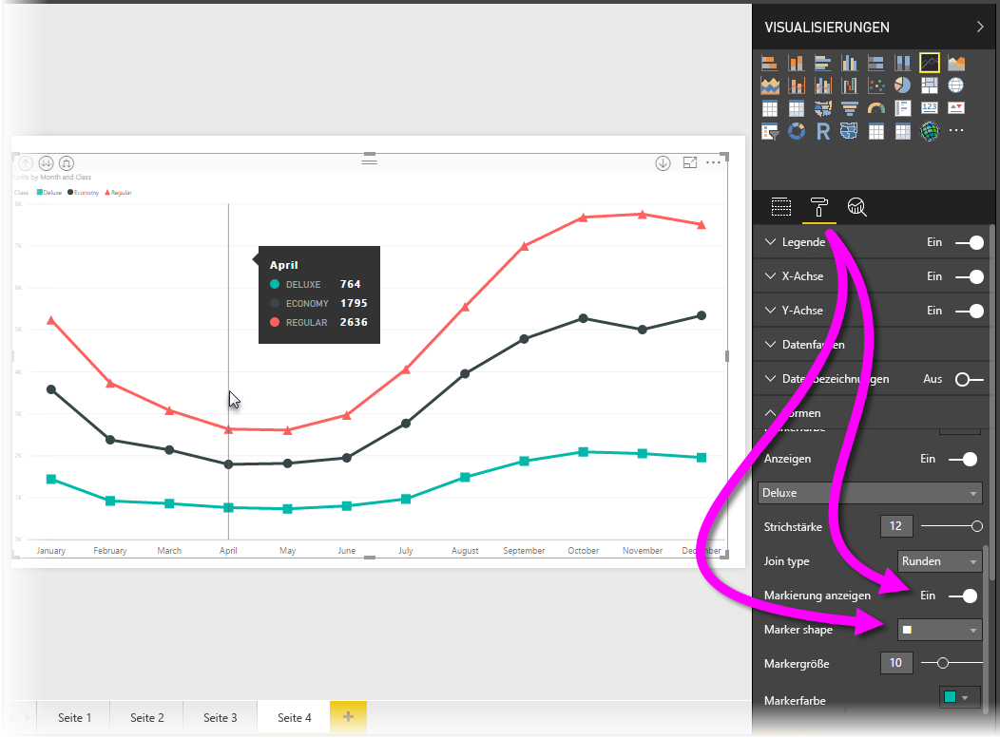
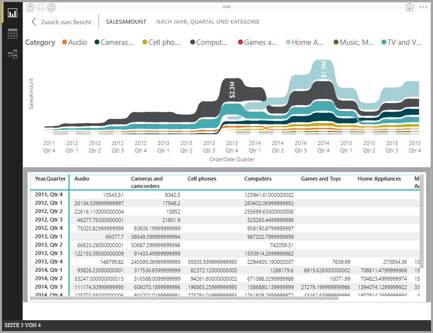
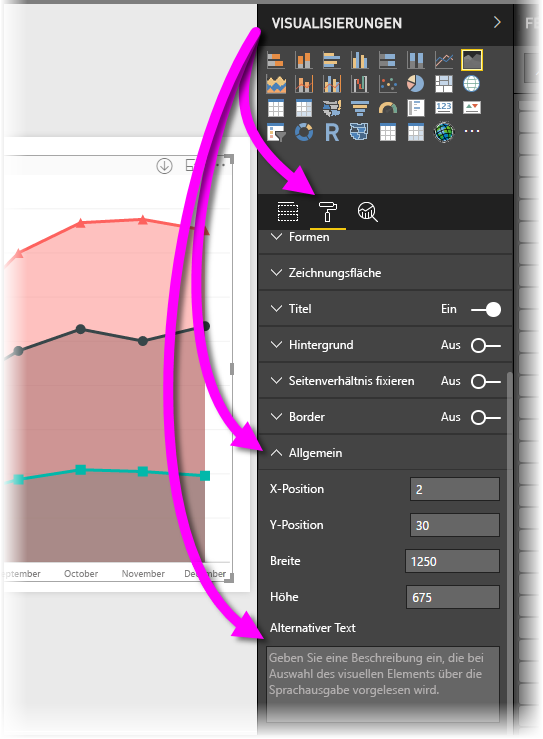

# Barrierefreiheit in Power BI Desktop-Berichten
**Power BI Desktop** verfügt über Funktionen, die von Personen mit Behinderungen für die leichtere Nutzung von und Interaktion mit **Power BI Desktop**-Berichten verwendet werden können. Zu diesen Funktionen gehört die Möglichkeit, einen Bericht mithilfe der Tastatur oder einer Sprachausgabe zu verwenden, den Fokus per TAB-Taste auf die verschiedenen Objekte auf einer Seite zu verlagern und Marker in Visualisierungen sinnvoll einzusetzen.

> [!NOTE]
> Diese Barrierefreiheitsfunktionen stehen im **Power BI Desktop**-Release von Juni 2017 und späteren Releases zur Verfügung. Weitere Barrierefreiheitsfunktionen sind für kommende Releases geplant.
> 
> 

## Nutzen eines Power BI Desktop-Berichts mit Tastatur oder Sprachausgabe
Ab der im September 2017 veröffentlichten Version von **Power BI Desktop** können Sie die **?**-Taste drücken, um ein Fenster anzuzeigen, in dem die in **Power BI Desktop** verfügbaren Tastenkombinationen für Barrierefreiheit beschrieben werden.

Mit den Barrierefreiheitserweiterungen können Sie einen **Power BI Desktop**-Bericht mithilfe der folgenden Techniken mit Tastatur oder Sprachausgabe nutzen:

**Fokus wechseln** zwischen den Seitenregisterkarten von Berichten oder den Objekten auf einer bestimmten Berichtsseite mithilfe von **STRG+F6**.

* Verwenden der *TAB*-Taste oder der *PFEILTASTEN* zum Bewegen des Fokus von einer Berichtsseite zur nächsten, wenn sich der Fokus auf *Seitenregisterkarten des Berichts* befindet. Der Titel der Berichtsseite und ihr aktueller Auswahlstatus werden von der Sprachausgabe vorgelesen. Um die Berichtsseite zu laden, die aktuell den Fokus hat, können die *EINGABETASTE* oder die *LEERTASTE* verwendet werden.
* Wenn der Fokus auf einer geladenen *Berichtsseite* liegt, verwenden Sie die *TAB*-Taste, um den Fokus auf die einzelnen Objekte auf der Seite zu bewegen. Zu diesen zählen alle Textfelder, Bilder, Formen und Diagramme. Die Sprachausgabe liest den Typ des Objekts und eine Beschreibung des Objekts vor, die von dessen Autor bereitgestellt wurde. 

Sie können **ALT+UMSCHALT+F10** drücken, um den Fokus auf ein Visualmenü zu verschieben.

Sie können **ALT+UMSCHALT+F11** drücken, um eine barrierefreie Version des Fensters *Daten anzeigen* zu öffnen.

Diese zusätzlichen Barrierefreiheitsfunktionen wurden entwickelt, damit Benutzer **Power BI Desktop**-Berichte per Sprachausgabe und Tastaturnavigation umfassend verwenden können.

## Tipps zum Erstellen barrierefreier Berichte
Die folgenden Tipps können Ihnen beim Erstellen von **Power BI Desktop**-Berichten mit besserer Barrierefreiheit helfen.

* Aktivieren Sie für **Liniendiagramm**-, **Flächendiagramm**- und **Kombinationsdiagramm**-Visuals sowie für **Punktdiagramm**- und **Blasendiagramm**-Visuals Marker, und verwenden Sie für jede Linie eine andere *Markerform*.
  
  * Um *Marker* zu aktivieren, wählen Sie im Bereich **Visualisierungen** den Abschnitt **Format** aus, erweitern Sie den Abschnitt **Formen**, scrollen Sie dann nach unten bis zum Ein-/Ausschalter **Marker**, und schalten Sie ihn *Ein*.
  * Wählen Sie anschließend im Dropdownfeld im Abschnitt **Formen** den Namen jeder Linie (oder Fläche bei einem **Flächendiagramm**) aus. Unterhalb des Dropdownfelds können Sie anschließend viele Aspekte des für die ausgewählte Linie verwendeten Markers anpassen, einschließlich dessen Form, Farbe und Größe.
  
  
  
  * Die Verwendung einer anderen *Markierungsform* für jede Linie macht es den Nutzern des Berichts leichter, die Linien (oder Flächen) voneinander zu unterscheiden.
* Verwenden Sie zum Übermitteln von Informationen nicht nur Farbmarkierungen. Es ist hilfreich, Formen für Linien (Marker, wie in den vorherigen Absätzen beschrieben) zu verwenden.
* Wählen Sie im Designkatalog ein *Design* mit hohem Kontrast aus, das für Farbenblinde geeignet ist, und importieren Sie es mithilfe der [**Design**-Vorschaufunktion](desktop-report-themes.md).
* Geben Sie zu jedem Objekt in einem Bericht *Alternativtext* an. Auf diese Weise stellen Sie sicher, dass Personen, die Ihren Bericht verwenden, verstehen, was Sie mit einem visuellen Element kommunizieren möchten, selbst wenn sie das visuelle Element, das Bild, die Form oder das Textfeld nicht sehen können. Sie können zu jedem Objekt in einem *Power BI Desktop*-Bericht **Alternativtext** angeben, indem Sie das Objekt (wie etwa ein visuelles Element, eine Form usw.) auswählen und im Bereich **Visualisierungen** den Bereich **Format** auswählen, **Allgemein** erweitern, dann nach unten scrollen und das Textfeld **Alternativtext** ausfüllen.
  
  
* Stellen Sie sicher, dass in Ihren Berichten ein ausreichender Kontrast zwischen Text- und Hintergrundfarben vorhanden ist.
* Verwenden Sie Textgrößen und -schriftarten, die leicht lesbar sind. Kleine Textgrößen oder -schriftarten, die schwierig zu lesen sind, verringern die Barrierefreiheit.
* Schließen Sie in alle Visuals einen Titel, Achsenbezeichnungen und Datenbezeichnungen ein.

## Überlegungen und Einschränkungen
Es gibt einige bekannte Probleme und Einschränkungen bei den Barrierefreiheitsfeatures. Diese werden in der folgenden Liste beschrieben:

* JAWS wird in Berichten unterstützt, die im **Power BI-Dienst** angezeigt werden, einschließlich in eingebetteten Berichten. JAWS wird auch in **Power BI Desktop** unterstützt. Sie müssen jedoch vor dem Öffnen von **Power BI Desktop**-Dateien die Sprachausgabe öffnen, damit die Sprachausgabe ordnungsgemäß erfolgt.

## Nächste Schritte
* [Verwenden von Berichtdesigns in Power BI Desktop (Vorschau)](desktop-report-themes.md)

