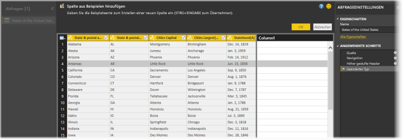
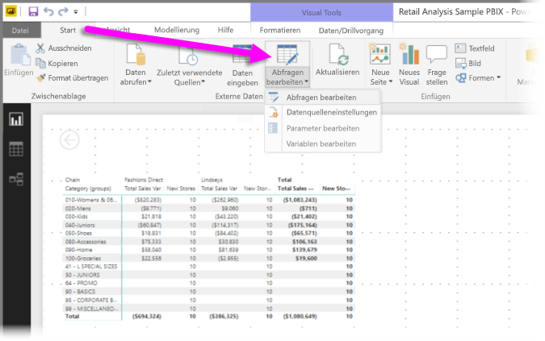
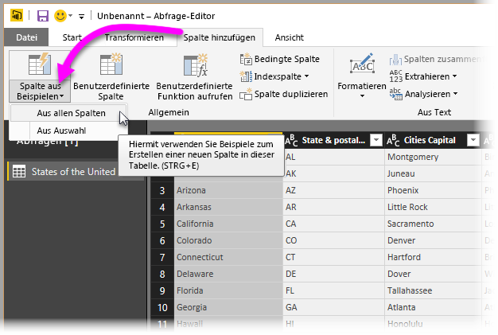
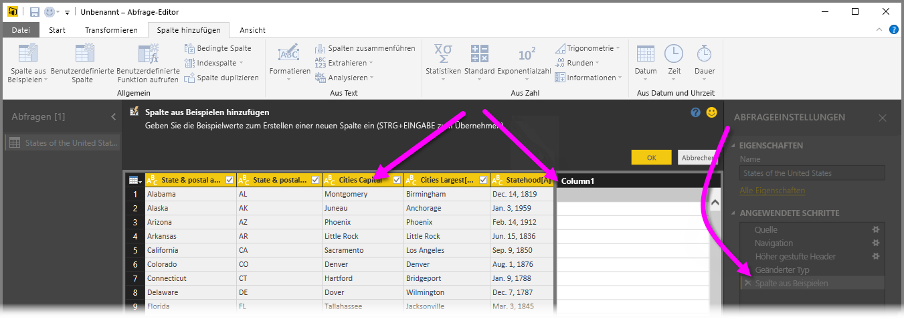
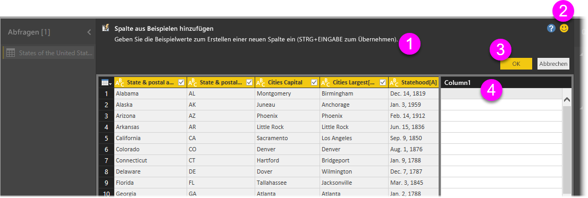
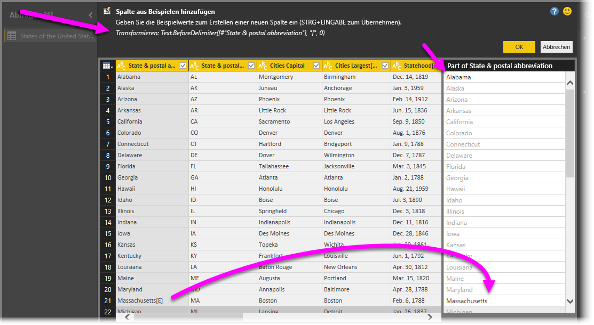

# Hinzufügen einer Spalte aus einem Beispiel in Power BI Desktop
Ab der **Power BI Desktop**-Version vom April 2017 können Sie Ihrem Modell durch Angabe von Beispielwerten über den **Abfrage-Editor** ganz einfach neue Datenspalten hinzufügen. Zur Erstellung eines Beispiels für die neue Spalte können Sie eine aktuelle Auswahl oder aber eine Eingabe verwenden, die auf allen (oder auf ausgewählten) Spalten in einer bestimmten Tabelle basiert.

Dadurch können Sie schnell und einfach neue Spalten erstellen, was besonders in folgenden Situationen hilfreich ist:

* Sie wissen, welches Datenergebnis Ihre neue Spalte enthalten soll, sind sich aber nicht sicher, welche Transformation (oder Sammlung von Transformationen) zum gewünschten Ergebnis führen.
* Sie wissen bereits, welche Transformationen Sie benötigen, sind sich aber nicht sicher, mit welcher Benutzeroberflächenoption sie ausgelöst werden.
* Sie wissen genau, welche Transformationen Sie mit einem Ausdruck vom Typ *Benutzerdefinierte Spalte* in **M** benötigen, aber mindestens einer dieser Ausdrücke steht über die Benutzeroberfläche nicht zur Verfügung.

Das Feature **Spalte nach Beispiel hinzufügen** ist überaus benutzerfreundlich. In den folgenden Abschnitten erfahren Sie, wie einfach es sich verwenden lässt.

## Hinzufügen einer neuen Spalte auf der Grundlage von Beispielen mithilfe des Abfrage-Editors
Wenn Sie eine neue Spalte auf der Grundlage eines Beispiels hinzufügen möchten, starten Sie zunächst den **Abfrage-Editor**. Wählen Sie hierzu in **Power BI Desktop** auf dem Menüband **Start** die Option **Abfragen bearbeiten** aus.

In diesem Artikel verwenden wir Daten aus dem folgenden Wikipedia-Artikel. (Sie können auf den Link klicken und die Daten selbst abrufen, um das Beispiel nachzuvollziehen.)

* [**Liste der Bundesstaaten und Gebiete der USA**](https://wikipedia.org/wiki/List_of_states_and_territories_of_the_United_States)

Nachdem Sie den **Abfrage-Editor** gestartet und einige Daten geladen haben, können Sie damit beginnen, eine Spalte auf der Grundlage von Beispielen hinzuzufügen. Wählen Sie zum Hinzufügen einer neuen Spalte im **Abfrage-Editor** auf dem Menüband die Registerkarte **Spalte hinzufügen** und anschließend die Option **Spalte aus Beispielen** aus. In der Dropdownliste können Sie zwischen **Aus allen Spalten** (Standardeinstellung, wenn Sie nur die Schaltfläche und nicht die Dropdownliste auswählen) und **Aus Auswahl** wählen. In diesem Artikel verwenden wir die Option **Aus allen Spalten**.

## Der Bereich „Spalte aus Beispielen hinzufügen“
Nachdem Sie ausgewählt haben, dass Sie eine neue Spalte auf der Grundlage von Beispielen hinzufügen möchten, wird ein neuer Bereich mit den Spalten der aktuellen Tabelle angezeigt. (Unter Umständen müssen Sie scrollen, um alle anzuzeigen.) Rechts wird auch die neue Spalte **Column1** angezeigt. Hierbei handelt es sich um die Spalte, die **Power BI Desktop** auf der Grundlage Ihrer Beispiele erstellt. Unter der Überschrift der neuen Spalte **Column1** befinden sich leere Zellen, in die Sie die Beispiele eingeben können, auf deren Grundlage Power BI dann passende Regeln und Transformationen erstellt.

Beachten Sie außerdem, dass es sich hierbei um einen **angewendeten Schritt** im Bereich **Abfrageeinstellungen** handelt. Der **Abfrage-Editor** erfasst wie gewohnt Ihre Transformationsschritte und wendet sie in der angegebenen Reihenfolge auf die Abfrage an.

Der Bereich **Spalte aus Beispielen hinzufügen** ist in vier Hauptbereiche unterteilt:

1. Die **Befehlsleiste** mit einer kurzen Beschreibung des Features oder der Transformation.
2. Die Option **Feedback senden**, um zur Verbesserung des Features in Power BI beizutragen.
3. Die Schaltflächen **OK** und **Abbrechen**, mit denen Sie Ihre Transformationen übernehmen und die Spalte hinzufügen oder den Vorgang abbrechen können.
4. Der Bereich für die neue Spalte, in dem Sie Ihre Beispielwerte in eine beliebige Zeile eingeben können, um ein Beispiel für Power BI bereitzustellen (in Relation zu anderen Spalten in dieser Zeile).

Wenn Sie Ihr Beispiel in die neue Spalte eingeben, liefert Power BI auf der Grundlage der erkannten Transformationen eine Vorschau der fertigen Spalte. Ein Beispiel: Wir haben in die erste Zeile den Wert *Alabama* eingegeben, was dem Wert *Alabama* in der ersten Spalte der Tabelle entspricht. Nach dem Drücken der *EINGABETASTE* füllt Power BI die Spalte auf der Grundlage dieses Werts aus.

Anschließend haben wir allerdings in der Zeile, die *Massachusetts[E]* enthält, das (für uns überflüssige) *[E]* gelöscht, woraufhin Power BI diese Änderung erkannt und anhand des Beispiels eine Transformation erstellt hat. Beachten Sie die Erläuterung der Transformation (oben in der Mitte).

Bei Angabe weiterer Beispiele werden die Transformationen durch den **Abfrage-Editor** entsprechend ergänzt. Wenn Sie mit dem Ergebnis zufrieden sind, können Sie **OK** auswählen, um Ihre Änderungen zu übernehmen.

## „Spalte aus Beispielen hinzufügen“ in Aktion
Möchten Sie das Feature in Aktion erleben? Das folgende Video zeigt die Nutzung dieses Features unter Verwendung der Datenquelle, die weiter oben in diesem Beispiel angegeben war. Sehen Sie sich das Video an, und probieren Sie es selbst aus.

<iframe width="560" height="315" src="https://www.youtube.com/embed/-ykbVW9wQfw" frameborder="0" allowfullscreen></iframe>

## Überlegungen und Einschränkungen
Bei der Verwendung des Features **Spalte aus Beispielen hinzufügen** stehen zwar viele Transformationen zur Verfügung, aber nicht alle. Die folgende Liste enthält alle *unterstützten* Transformationen:

* **Verweis**
  
  * Verweis auf eine bestimmte Spalte (einschließlich Kürzungs-, Bereinigungs- und Groß-/Kleinschreibungstransformation)

* **Texttransformationen**
  
  * Kombinieren (unterstützt das Kombinieren von Literalzeichenfolgen und vollständigen Spaltenwerten)
  * Ersetzen
  * Länge
  * Extrahieren   
    * Erste Zeichen
    * Letzte Zeichen
    * Bereich
    * Text vor Trennzeichen
    * Text nach Trennzeichen
    * Text zwischen Trennzeichen
    * Länge

* Die folgenden unterstützten **Texttransformationen** sind ab dem November 2017-Release von **Power BI Desktop** verfügbar:
    
  * Zeichen entfernen
  * Zeichen beibehalten

> [!NOTE]
> Bei allen *Texttransformationen* wird der potenzielle Bedarf für die Anwendung einer Kürzungs-, Bereinigungs- oder Groß-/Kleinschreibungstransformation auf den Wert berücksichtigt.
> 
> 

* **Datumstransformationen**
  
  * Tag
  * Tag der Woche
  * Name des Wochentags
  * Tag des Jahres
  * Monat
  * Monatsname
  * Quartal des Jahres
  * Woche des Monats
  * Woche des Jahres
  * Jahr
  * Alter
  * Jahresbeginn
  * Jahresende
  * Monatsbeginn
  * Monatsende
  * Quartalsbeginn
  * Tage des Monats
  * Quartalsende
  * Wochenbeginn
  * Wochenende
  * Tag des Monats
  * Tagesbeginn
  * Tagesende

* **Uhrzeittransformationen**
  
  * Stunde
  * Minute
  * Sekunde  
  * In Ortszeit

> [!NOTE]
> Bei allen *Datums-* und *Uhrzeittransformationen* wird der potenzielle Bedarf für eine Konvertierung des Spaltenwerts in *Date*, *Time* oder *DateTime* berücksichtigt.
> 
> 

* **Zahlentransformationen** 

  * Absoluter Wert
  * Arkuskosinus
  * Arkussinus
  * Arkustangens
  * In eine Zahl umwandeln
  * Kosinus
  * Cube
  * Dividieren
  * Exponent
  * Fakultät
  * Ganzzahldivision
  * Gerade
  * Ungerade
  * Ln
  * Logarithmus zur Basis 10
  * Modulo
  * Multiplizieren
  * Abrunden
  * Aufrunden
  * Vorzeichen
  * Sin
  * Quadratwurzel
  * Quadrat
  * Subtrahieren
  * Summe
  * Tangens

* Die folgenden unterstützten **Zahlentransformationen** sind ab dem November 2017-Release von **Power BI Desktop** verfügbar:

  * Zuordnen von Buckets/Bereiche

* **Allgemein**
  
  * Bedingte Spalte