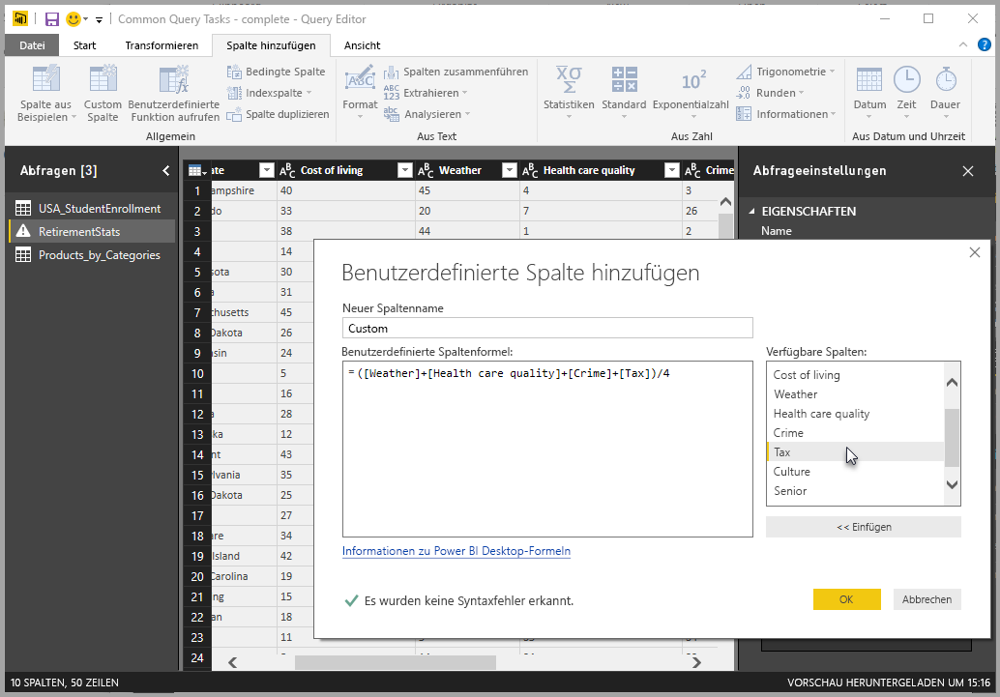
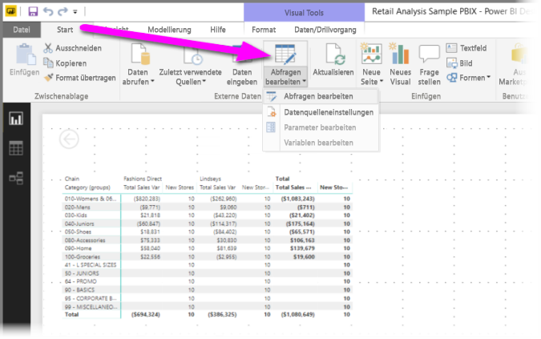
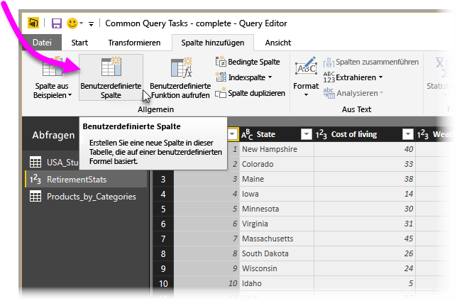
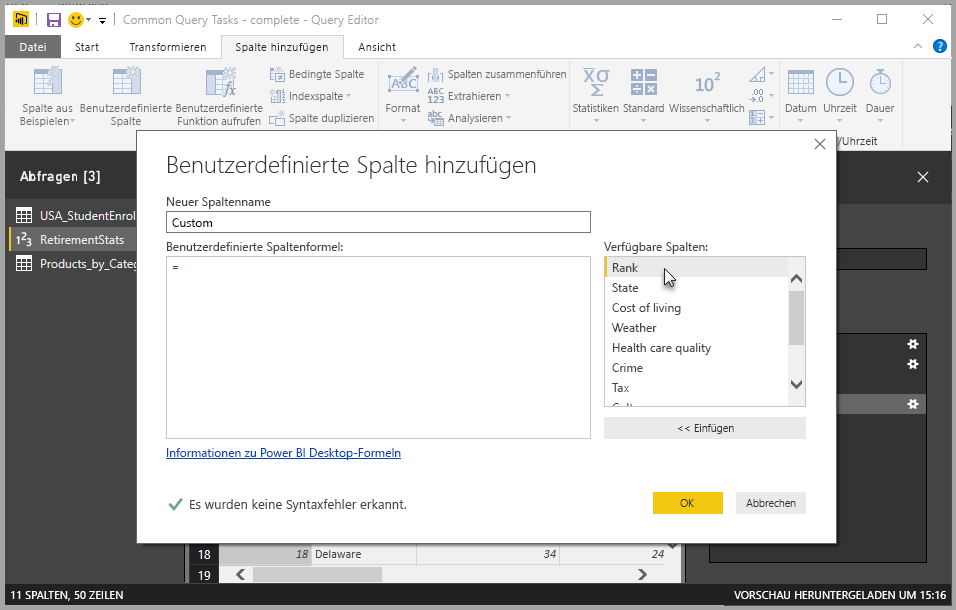
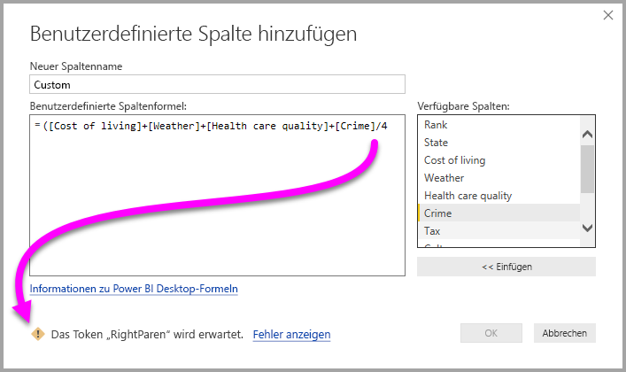
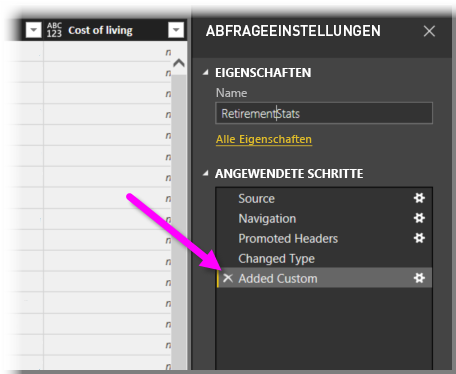
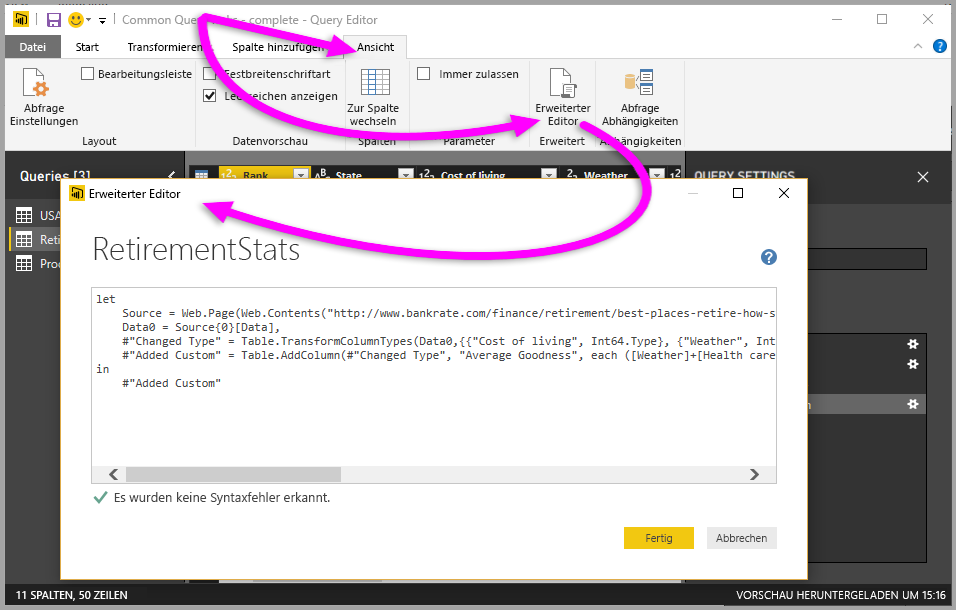

# Hinzufügen einer benutzerdefinierten Spalte in Power BI Desktop
Mit dem **Abfrage-Editor** in **Power BI Desktop** können Sie dem Modell einfach eine neue benutzerdefinierte Datenspalte hinzufügen. Sie können mit einfachen Schaltflächen die benutzerdefinierte Spalte erstellen und umbenennen, um [M-Formeln](https://msdn.microsoft.com/library/mt270235.aspx) zum Definieren der benutzerdefinierten Spalte zu entwerfen. Die M-Formel weist einen [umfassenden Funktionsreferenz-Inhaltssatz](https://msdn.microsoft.com/library/mt779182.aspx) auf. 

Das Erstellen einer benutzerdefinierten Spalte ist ein weiterer **angewendeter Schritt** für die Abfrage, die Sie im **Abfrage-Editor** erstellen. Das bedeutet, dass sie jederzeit geändert oder verschoben werden kann.

## Hinzufügen einer neuen benutzerdefinierten Spalte mithilfe des Abfrage-Editors
Starten Sie zum Erstellen einer neuen benutzerdefinierten Spalte den **Abfrage-Editor**. Wählen Sie hierzu in **Power BI Desktop** auf dem Menüband **Start** die Option **Abfragen bearbeiten** aus.

Wenn der **Abfrage-Editor** gestartet wurde und Sie Daten geladen haben, können Sie eine benutzerdefinierte Spalte hinzufügen. Wählen Sie hierzu auf dem Menüband die Registerkarte **Spalte hinzufügen** und dann **Benutzerdefinierte Spalte** aus.

Anschließend wird das Fenster **Benutzerdefinierte Spalte hinzufügen** angezeigt, das im folgenden Abschnitt erläutert wird.

## Das Fenster „Benutzerdefinierte Spalte hinzufügen“
Im Fenster **Benutzerdefinierte Spalte hinzufügen** wird im rechten Bereich die Liste der verfügbaren Felder angezeigt, und oben wird der Name der benutzerdefinierten Spalte angezeigt (Sie können sie umbenennen, indem Sie einfach in diesem Textfeld einen neuen Namen eingeben). Außerdem wird die [**M**-Formel](https://msdn.microsoft.com/library/mt779182.aspx) angezeigt, die Sie für die Definition der neuen benutzerdefinierten Spalte erstellen (oder eingeben), indem Sie Felder aus dem rechten Bereich einfügen, Operatoren hinzufügen und weitere Aktionen ausführen. 

## Erstellen von Formeln für die benutzerdefinierte Spalte
Sie können in der Liste **Verfügbare Spalten** auf der rechten Seite ein Feld auswählen und auf **<< Einfügen** klicken, um es der Formel für die benutzerdefinierte Spalte hinzuzufügen. Sie können auch einfach auf eine Spalte in der Liste doppelklicken, um es hinzuzufügen.

Während Sie die Formel eingeben, um die Spalte zu erstellen, wird am unteren Rand des Fensters in Echtzeit (während der Eingabe) angegeben, ob Syntaxfehler gefunden werden. Wenn alles in Ordnung ist, wird ein grünes Häkchen angezeigt.

Wenn die Syntax jedoch einen Fehler enthält, werden ein gelbes Warnsymbol zusammen mit dem erkannten Fehler und ein Link angezeigt, über den der Cursor (in der Formel) an die Position des erkannten Fehlers verschoben wird.

Wenn Sie auf **OK** klicken, wird die benutzerdefinierte Spalte dem Modell hinzugefügt, und den **Angewendeten Schritten** der Abfrage wird der Schritt **Hinzugefügte benutzerdefinierte Spalte** hinzugefügt.

Wenn Sie im Bereich **Angewendete Schritte** auf den Schritt **Hinzugefügte benutzerdefinierte Spalte** doppelklicken, wird erneut das Fenster **Benutzerdefinierte Spalte hinzufügen** angezeigt. In diesem ist die benutzerdefinierte Formel, die Sie erstellt haben, bereits geladen, und Sie können sie ggf. ändern.

## Verwenden des erweiterten Editors für benutzerdefinierte Spalten
Sie können auch mit dem **erweiterten Editor** benutzerdefinierte Spalten erstellen (und jeden Schritt der Abfrage ändern). Wählen Sie im **Abfrage-Editor** die Registerkarte **Ansicht** und dann **Erweiterter Editor** aus, um den **erweiterten Editor** anzuzeigen.

Der **Erweiterte Editor** bietet Ihnen vollständige Kontrolle über Ihre Abfrage.

## Nächste Schritte
Es gibt weitere Möglichkeiten zum Erstellen einer benutzerdefinierten Spalte. Zu diesen zählt das Erstellen einer Spalte anhand von Beispielen, die Sie im **Abfrage-Editor** angeben. Weitere Informationen zum Erstellen von benutzerdefinierten Spalten aus Beispielen finden Sie im folgenden Artikel:

* [Hinzufügen einer Spalte aus einem Beispiel in Power BI Desktop](desktop-add-column-from-example.md)
* [Einführung in die M-Formelsprache](https://msdn.microsoft.com/library/mt270235.aspx)
* [M-Funktionsreferenz](https://msdn.microsoft.com/library/mt779182.aspx)  

