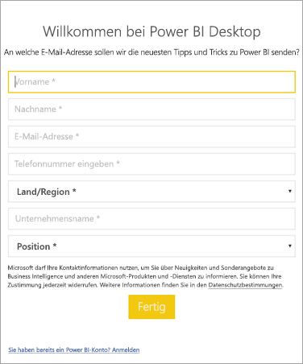

# <a name="how-administrators-can-manage-the-power-bi-desktop-sign-in-form"></a>Verwalten des Power BI Desktop-Anmeldeformulars durch Administratoren
Wenn Power BI Desktop erstmalig gestartet wird, wird ein Anmeldeformular geöffnet. Dort können Informationen eingegeben werden, oder es kann die Anmeldung bei Power BI ausgeführt werden, um fortzufahren. Administratoren verwalten dieses Formular mithilfe eines Registrierungsschlüssels. 



Administratoren verwenden den folgenden Registrierungsschlüssel, um das Anmeldeformular zu deaktivieren. Dies kann auch über globale Richtlinien mithilfe von Push an eine gesamte Organisation übertragen werden.

```
Key: HKEY_LOCAL_MACHINE\SOFTWARE\Policies\Microsoft\Power BI Desktop
valueName: ShowLeadGenDialog
```

Durch den Wert „0“ wird das Dialogfeld deaktiviert.

Weitere Fragen? [Stellen Sie Ihre Frage in der Power BI-Community.](http://community.powerbi.com/)

