# Verwenden von Lesezeichen zum Teilen von Erkenntnissen und Erstellen von Präsentationen in Power BI (Vorschau)
Mit den **Lesezeichen** in Power BI können Sie die derzeit konfigurierte Ansicht einer Berichtsseite erfassen, einschließlich der Filterung und des Status von Visuals, und später zur Ansicht in diesem Status zurückkehren, indem Sie einfach das gespeicherte Lesezeichen auswählen. 

Sie können auch eine Sammlung von Lesezeichen erstellen, sie in der gewünschten Reihenfolge anordnen und dann die einzelnen Lesezeichen in einer Präsentation durchlaufen, um eine Reihe von Einsichten hervorzuheben oder die Geschichte, die Sie mit Ihren Visuals und Berichten erzählen möchten, zu präsentieren. 

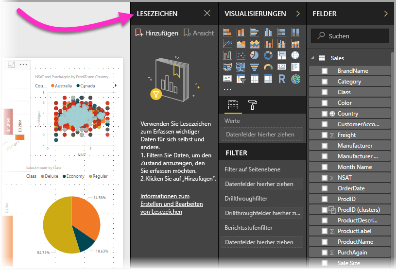

Lesezeichen können für viele unterschiedliche Zwecke hinzugefügt werden. Sie können sie zum Nachverfolgen ihrer Fortschritte beim Erstellen von Berichten verwenden (Lesezeichen lassen sich einfach hinzufügen, löschen und umbenennen). Oder Sie können Lesezeichen erstellen, um eine Präsentation wie in PowerPoint zu erzeugen, in der die Lesezeichen nacheinander aufgerufen werden, sodass Ihr Bericht eine Geschichte erzählt. Sie können Lesezeichen nach eigenem Ermessen auch für andere Zwecke nutzen.

### Aktivieren der Lesezeichenvorschau
Sie können das neue **Lesezeichenfeature** ab der im **Oktober 2017** veröffentlichten Version von **Power BI Desktop** nutzen. Für Berichte, die Lesezeichen unterstützen, können Sie das Feature auch im **Power BI-Dienst** verwenden. Wenn Sie dieses Vorschaufeature aktivieren möchten, wählen Sie **Datei > Optionen und Einstellungen > Optionen > Vorschaufeatures** aus, und aktivieren Sie dann das Kontrollkästchen neben **Lesezeichen**. Sie müssen Power BI Desktop neu starten, nachdem Sie die Auswahl vorgenommen haben.

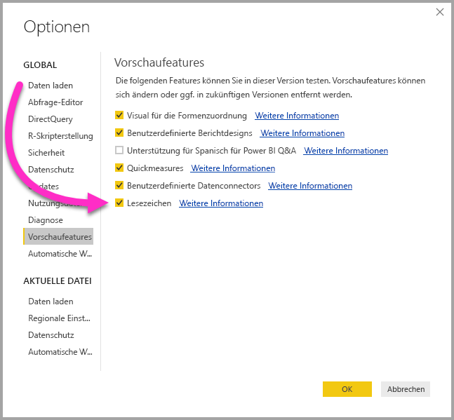

Sie müssen **Power BI Desktop** neu starten, nachdem Sie die Auswahl vorgenommen haben.

## Verwenden von Lesezeichen
Wählen Sie zum Verwenden von Lesezeichen das Menüband **Ansicht** aus, und aktivieren Sie dann das Kontrollkästchen für **Lesezeichenbereich**. 

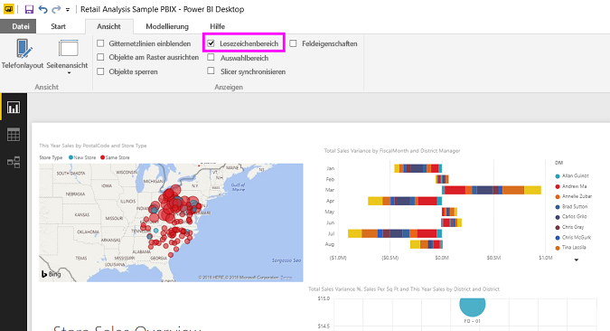

Wenn Sie ein Lesezeichen erstellen, werden die folgenden Elemente mit dem Lesezeichen gespeichert:

* Die aktuelle Seite
* Filter
* Datenschnitte
* Sortierreihenfolge
* Drilldownposition
* Sichtbarkeit (eines Objekts, im Bereich **Auswahl** festgelegt)
* Der Fokus- oder **Spotlightmodus** jedes angezeigten Objekts

Lesezeichen speichern derzeit keine übergreifenden Hervorhebungen. 

Konfigurieren Sie eine Berichtsseite so, wie sie im Lesezeichen angezeigt werden soll. Sobald die Berichtsseite und die Visuals wie gewünscht angeordnet sind, wählen Sie im Bereich **Lesezeichen** die Option **Hinzufügen** aus, um ein Lesezeichen hinzufügen. 

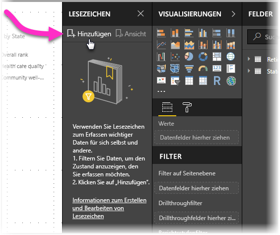

**Power BI Desktop** erstellt ein Lesezeichen und benennt es mit einem generischen Namen. Lesezeichen können einfach *umbenannt*, *gelöscht* oder *aktualisiert* werden. Wählen Sie dazu die Auslassungspunkte neben dem Namen des Lesezeichens aus, und wählen Sie im daraufhin angezeigten Menü eine Aktion.

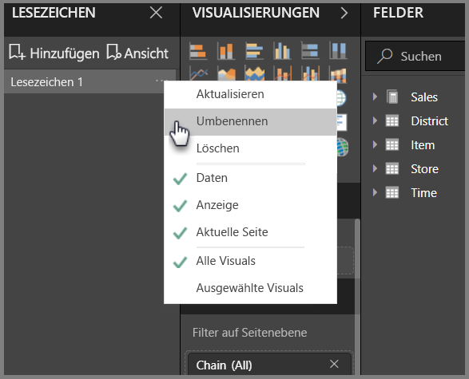

Sobald ein Lesezeichen erstellt wurde, können Sie es anzeigen, indem Sie einfach im Bereich **Lesezeichen** auf das Lesezeichen klicken. 

## Anordnen von Lesezeichen
Beim Erstellen von Lesezeichen werden Sie möglicherweise feststellen, dass die Reihenfolge ihrer Erstellung nicht unbedingt die gleiche Reihenfolge ist, in der Sie sie dem Publikum präsentieren möchten. Dies ist kein Problem, da Sie die Reihenfolge der Lesezeichen leicht ändern können.

Ändern Sie einfach im Bereich **Lesezeichen** die Reihenfolge der Lesezeichen per Drag & Drop, wie in der folgenden Abbildung dargestellt. Die gelbe Leiste zwischen Lesezeichen gibt an, wo das gezogene Lesezeichen abgelegt wird.

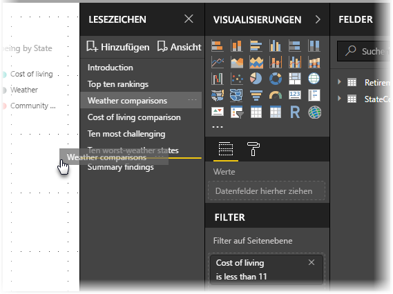

Die Reihenfolge der Lesezeichen kann wichtig werden, wenn Sie das Feature **Ansicht** für Lesezeichen verwenden, wie im nächsten Abschnitt beschrieben.

## Lesezeichen als Bildschirmpräsentation
Wenn Sie über eine Sammlung von Lesezeichen verfügen, die Sie nacheinander präsentieren möchten, können Sie im Bereich **Lesezeichen** die Option **Ansicht** auswählen, um eine Bildschirmpräsentation zu starten.

Im Modus **Ansicht** sind einige Features zu beachten:

1. Auf der Lesezeichen-Titelleiste am unteren Rand des Zeichenbereichs wird der Name des Lesezeichens angezeigt.
2. Die Lesezeichen-Titelleiste verfügt über Pfeile, mit denen Sie zum nächsten oder vorherigen Lesezeichen wechseln können.
3. Sie können den Modus **Ansicht** beenden, indem Sie im Bereich **Lesezeichen** die Option **Beenden** oder das **X** auf der Lesezeichen-Titelleiste auswählen. 

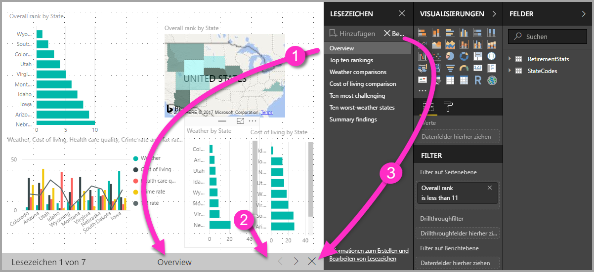

Im Modus **Ansicht** können Sie den Bereich **Lesezeichen** schließen (durch Klicken auf das „X“ in diesem Bereich), um mehr Platz für die Präsentation zu erhalten. Und im Modus **Ansicht** sind alle Visuals interaktiv und für die übergreifende Hervorhebung verfügbar, so wie bei der Interaktion mit ihnen. 

## Sichtbarkeit – mithilfe des Bereichs „Auswahl“
Zusammen mit der Einführung von Lesezeichen wird auch der neue Bereich **Auswahl** eingeführt. Der Bereich **Auswahl** enthält eine Liste aller Objekte auf der aktuellen Seite und ermöglicht es Ihnen, das Objekt auszuwählen und anzugeben, ob ein bestimmtes Objekt sichtbar ist. 

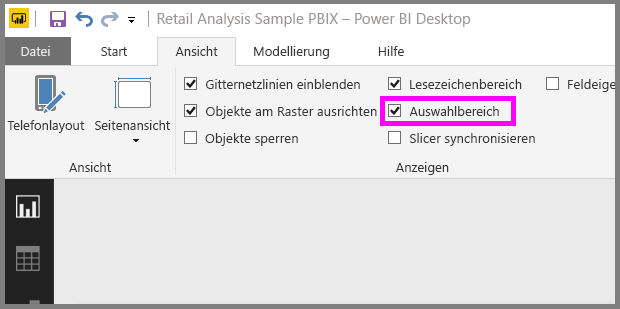

Sie können mit dem Bereich **Auswahl** ein Objekt auswählen. Sie können außerdem die Sichtbarkeit eines Objekts aktivieren/deaktivieren, indem Sie auf das Augensymbol rechts neben dem Visual klicken. 

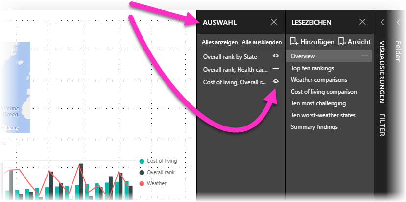

Beim Hinzufügen eines Lesezeichens wird der Sichtbarkeitsstatus jedes Objekts basierend auf der Einstellung im Bereich **Auswahl** gespeichert. 

Es ist wichtig zu beachten, dass Berichtsseiten weiterhin durch **Datenschnitte** gefiltert werden, auch wenn sie nicht sichtbar sind. Sie können daher viele verschiedene Lesezeichen mit unterschiedlichen Datenschnitteinstellungen erstellen und eine einzelne Berichtsseite in verschiedenen Lesezeichen sehr unterschiedlich darstellen (und jeweils andere Erkenntnisse hervorheben).

## Lesezeichen für Formen und Bilder
Sie können auch Formen und Bilder mit Lesezeichen verknüpfen. Wenn Sie dann auf ein Objekt klicken, wird das mit dem Objekt verknüpfte Lesezeichen angezeigt. 

Wenn Sie einem Objekt ein Lesezeichen zuweisen möchten, wählen Sie das Objekt aus, und wählen Sie dann im Bereich **Form formatieren** die Option **Link** aus, wie in der folgenden Abbildung dargestellt.

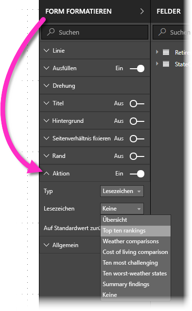

Nachdem Sie den Schieberegler **Link** auf **Ein** gestellt haben, können Sie auswählen, ob das Objekt ein Link oder ein Lesezeichen ist. Wenn Sie „Lesezeichen“ wählen, können Sie das Lesezeichen auswählen, mit dem das Objekt verknüpft wird.

Das Hinzufügen von Lesezeichen, die mit Objekten verknüpft sind, bietet Ihnen viele interessante Möglichkeiten. Sie können auf der Berichtsseite ein visuelles Inhaltsverzeichnis erstellen oder unterschiedliche Ansichten (z.B. Visualtypen) der gleichen Informationen erstellen, indem Sie einfach auf ein Objekt klicken.

Im Bearbeitungsmodus können Sie bei gedrückter STRG-TASTE klicken, um dem Link zu folgen. Außerhalb des Bearbeitungsmodus brauchen Sie nur auf das Objekt klicken, um dem Link zu folgen. 

## Verwenden von Spotlight
**Spotlight** ist ein weiteres Feature, das zusammen mit Lesezeichen veröffentlicht wird. Mit **Spotlight** können Sie die Aufmerksamkeit auf ein bestimmtes Diagramm lenken, z.B. bei der Präsentation der Lesezeichen im Modus **Ansicht**.

Lassen Sie uns **Spotlight** mit dem **Fokusmodus** vergleichen, um die Unterschiede festzustellen.

1. Im **Fokusmodus** können Sie das Symbol **Fokusmodus** auswählen, um den gesamten Zeichenbereich mit einem Visual auszufüllen.
2. Mit **Spotlight** können Sie ein Visual in seiner ursprünglichen Größe hervorheben, indem Sie alle anderen Visuals auf der Seite bis nahezu zur Transparenz verblassen lassen. 

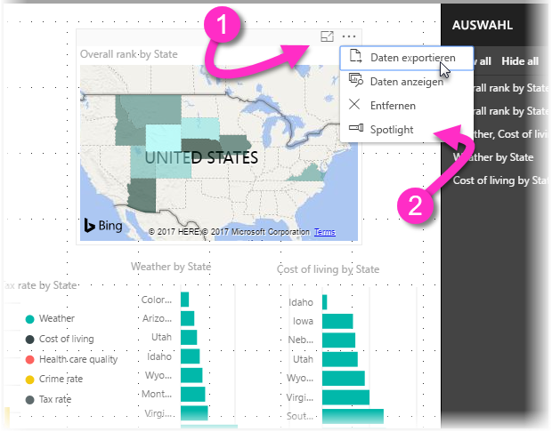

Wenn für das Visual in der vorherigen Abbildung auf das Symbol **Fokus** geklickt wird, sieht die Seite folgendermaßen aus:

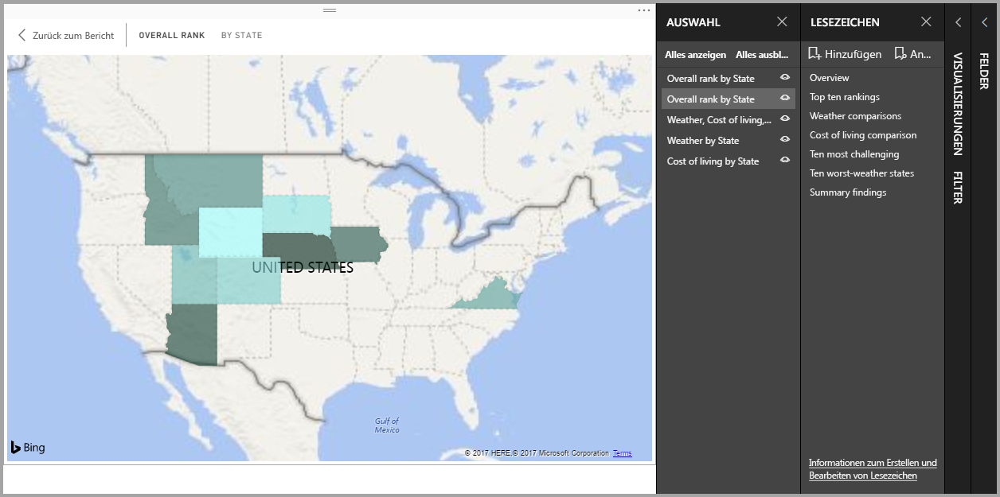

Wenn hingegen im Menü mit den drei Auslassungspunkten für das Visual **Spotlight** ausgewählt wird, sieht die Seite wie in dieser Abbildung aus:

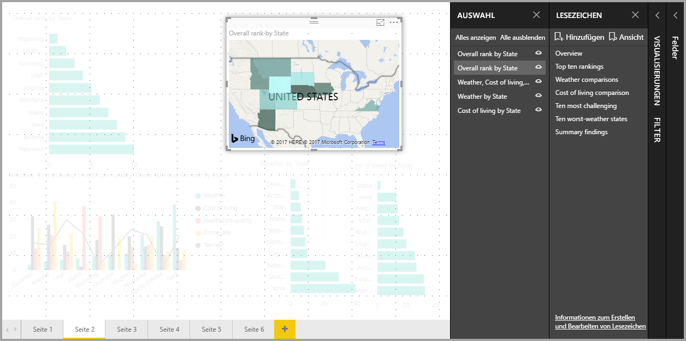

Wenn beim Hinzufügen eines Lesezeichens einer der beiden Modi ausgewählt wird, wird dieser Modus (Fokus oder Spotlight) im Lesezeichen gespeichert.

## Lesezeichen im Power BI-Dienst
Wenn Sie im **Power BI-Dienst** einen Bericht mit mindestens einem Lesezeichen veröffentlichen, können Sie diese Lesezeichen im **Power BI-Dienst** anzeigen und mit ihnen interagieren. Damit das Lesezeichenfeature im **Power BI-Dienst** verfügbar ist, müssen Sie vor dem Veröffentlichen eines Berichts mindestens ein Lesezeichen in diesem erstellt haben.

Wenn in einem Bericht Lesezeichen verfügbar sind, können Sie **Ansicht > Auswahlbereich** oder **Ansicht > Lesezeichenbereich** auswählen, um den jeweiligen Bereich anzuzeigen.

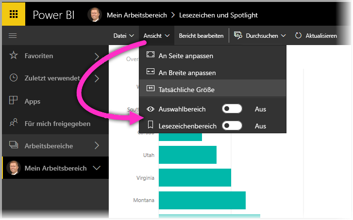

Der **Lesezeichenbereich** bietet im **Power BI-Dienst** die gleichen Funktionen wie in **Power BI Desktop**, einschließlich der Möglichkeit, durch Auswahl von **Ansicht** die Lesezeichen wie in einer Bildschirmpräsentation nacheinander anzuzeigen.

Beachten Sie, dass Sie zum Navigieren zwischen den Lesezeichen die graue Lesezeichen-Titelleiste verwenden müssen, und nicht die schwarzen Pfeile (die schwarzen Pfeile dienen der Navigation zwischen Berichtsseiten, nicht zwischen Lesezeichen).

## Einschränkungen und Überlegungen
Für die Vorschauversion von **Lesezeichen** gelten einige Einschränkungen und Überlegungen.

* Benutzerdefinierte Visuals können nicht in Lesezeichen gespeichert werden, wenn sie die *Quelle* des Filters sind. Wenn Sie zum Filtern von Elementen auf einer Seite benutzerdefinierte Visuals (z.B. den Chiclet-Datenschnitt) verwenden und mithilfe eines Lesezeichens zu dieser Seite zurückkehren, wird die Seite eventuell gefiltert, das benutzerdefinierte Visual wird jedoch nicht entsprechend der Filterung der Seite aktualisiert. 
* Beim Erstellen eines Lesezeichens wird die übergreifende Hervorhebung in einem Berichtsbereich *nicht* gespeichert. 
* Wenn Sie einer Berichtsseite nach dem Erstellen eines Lesezeichens ein Visual hinzufügen, wird das Visual in seinem Standardstatus angezeigt. Dies bedeutet auch, dass beim Anwenden eines Datenschnitts auf einer Seite, auf der Sie zuvor Lesezeichen erstellt haben, das Verhalten des Datenschnitts seinem Standardstatus entspricht.
* Das Verschieben von Visuals nach dem Erstellen des Lesezeichens wird im Lesezeichen wiedergegeben. 
* Damit Lesezeichen im **Power BI-Dienst** verfügbar sind, *muss* der Bericht mindestens ein Lesezeichen enthalten, wenn Sie ihn im Power BI-Dienst veröffentlichen. Diese Anforderung gilt für jeden Bericht, den Sie veröffentlichen.

## Nächste Schritte
Weitere Informationen zu Features, die Lesezeichen ähneln oder mit diesen interagieren, finden Sie in den folgenden Artikeln:

* [Verwenden der Drillthroughfunktion in Power BI Desktop](desktop-drillthrough.md)
* [Anzeigen einer Dashboardkachel oder eines Berichtsvisuals im Fokusmodus](service-focus-mode.md)

