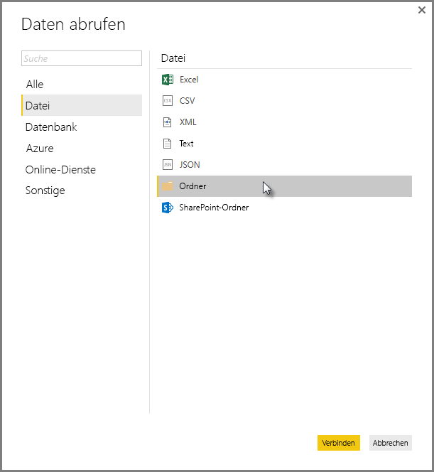
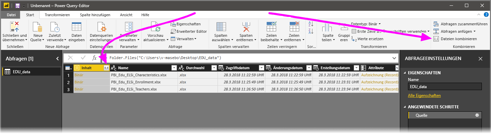
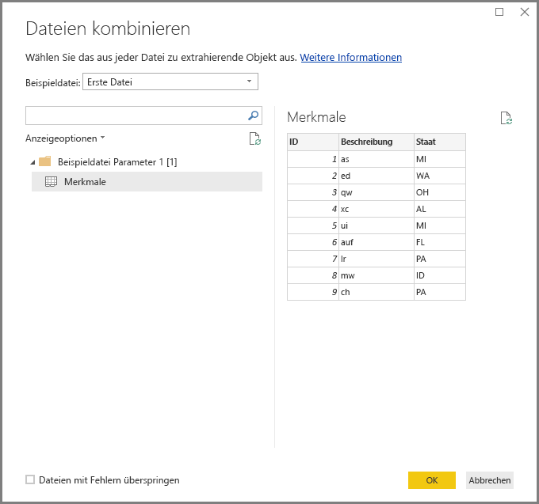
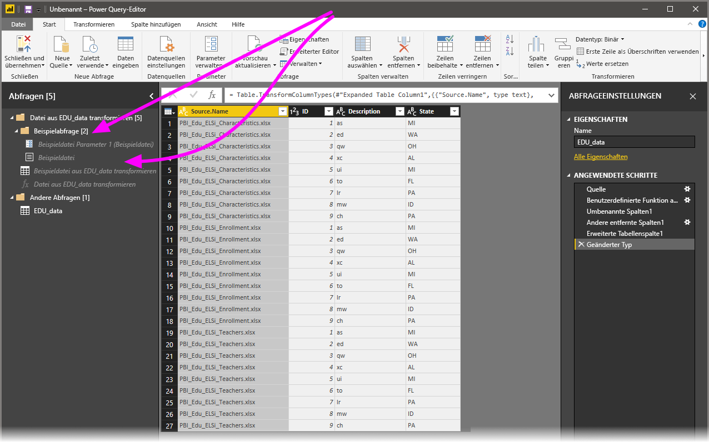

# Kombinieren von Binärdateien in Power BI Desktop
Ein sehr effizienter Ansatz zum Importieren von Daten in **Power BI Desktop** ist das Kombinieren mehrerer Dateien, die das gleiche Schema aufweisen, in einer einzelnen logischen Tabelle. Mit der **Power BI Desktop**-Version vom November 2016 (und Folgeversionen) wurde dieser beliebte Ansatz vereinfacht und erweitert, wie in diesem Artikel beschrieben.

Wählen Sie **Daten abrufen > Datei > Ordner** aus, um mit dem Kombinieren von Binärdateien aus demselben Ordner zu beginnen.

## Vorheriges Verhalten beim Kombinieren von Binärdateien
Vor der **Power BI Desktop**-Version vom November 2016 konnten Sie bestimmte Dateitypen mithilfe der Transformation **Binärdateien kombinieren** kombinieren, jedoch galten dabei Einschränkungen:

* Transformationen waren nicht für jede einzelne Datei möglich, bevor die Dateien in einer einzelnen Tabelle kombiniert wurden. Daher mussten Sie häufig Dateien kombinieren und dann im Rahmen der Bearbeitung Zeilen filtern, um *Kopfzeilenwerte* herauszufiltern.
* Die Transformation **Binärdateien kombinieren** wurde nur für *Text*- oder *CSV*-Dateien und nicht für andere unterstützte Dateiformate, z. B. Excel-Arbeitsmappen und JSON-Dateien, ausgeführt.

Da Kunden eine intuitivere Ausführung des Vorgangs **Binärdateien kombinieren** wünschten, wurde die Transformation verbessert.

## Aktuelles Verhalten beim Kombinieren von Binärdateien
**Power BI Desktop** behandelt jetzt das **Kombinieren von Binärdateien** effektiver. Sie wählen zunächst **Binärdateien kombinieren** aus, entweder auf der Registerkarte **Start** des Menübands im **Abfrage-Editor** oder in der Spalte selbst.

Die Transformation **Binärdateien kombinieren** weist jetzt das folgende Verhalten auf:

* Die Transformation **Binärdateien kombinieren** analysiert jede Eingabedatei und bestimmt das richtige zu verwendende Dateiformat, z. B. *Text*-, *Excel-Arbeitsmappen*- oder *JSON*-Datei.
* Die Transformation ermöglicht Ihnen die Auswahl eines bestimmten Objekts aus der ersten Datei, z. B. einer *Excel-Arbeitsmappe*, das extrahiert werden soll.
  
  
* Die Transformation **Binärdateien kombinieren** führt dann automatisch die folgenden Schritte aus:
  
  * Erstellen einer Musterabfrage, die alle erforderlichen Extraktionsschritte in einer einzelnen Datei ausführt.
  * Erstellen einer *Funktionsabfrage*, die die Datei-/Binäreingabe in die *Musterabfrage* parametrisiert. Die Musterabfrage und die Funktionsabfrage werden verknüpft, sodass Änderungen an der Musterabfrage in der Funktionsabfrage wiedergegeben werden.
  * Anwenden der *Funktionsabfrage* mit Eingabebinärdateien auf die ursprüngliche Abfrage (z. B. auf die *Ordner*-Abfrage), sodass die Funktionsabfrage für Binäreingaben in jeder Zeile angewendet wird. Anschließend wird die resultierende Datenextraktion als Spalten der obersten Ebene erweitert.
    
    

Mit dem neuen Verhalten von **Binärdateien kombinieren** können Sie alle Binärdateien in einem bestimmten Ordner einfach kombinieren, solange sie den gleichen Dateityp und die gleiche Struktur (z. B. die gleichen Spalten) aufweisen.

Außerdem können Sie einfach zusätzliche Transformations- oder Extraktionsschritte anwenden, indem Sie die automatisch erstellte *Musterabfrage* ändern. Dabei müssen Sie keine Schritte der *Funktionsabfrage* ändern und keine zusätzlichen Schritte für sie erstellen. Alle Änderungen an der *Musterabfrage* werden automatisch in der verknüpften *Funktionsabfrage* generiert.

## Nächste Schritte
Sie können mithilfe von Power BI Desktop eine Verbindung mit Daten jeglicher Art herstellen. Weitere Informationen zu Datenquellen finden Sie in folgenden Ressourcen:

* [Erste Schritte mit Power BI Desktop](desktop-getting-started.md)
* [Datenquellen in Power BI Desktop](desktop-data-sources.md)
* [Strukturieren und Kombinieren von Daten mit Power BI Desktop](desktop-shape-and-combine-data.md)
* [Verbinden mit CSV-Dateien in Power BI Desktop](desktop-connect-csv.md)   
* [Eingeben von Daten direkt in Power BI Desktop](desktop-enter-data-directly-into-desktop.md)   

