# Allgemeine Abfrageaufgaben in Power BI Desktop
Beim Arbeiten im Fenster **Abfrage-Editor** von Power BI Desktop haben Sie es mit einer Hand voll häufig verwendeter Aufgaben zu tun. In diesem Dokument werden diese allgemeinen Aufgaben vorgestellt. Zudem finden Sie Links zu weiteren Informationen. 

Zu den hier vorgestellten allgemeinen Abfrageaufgaben zählen folgende Aufgaben:

* Verbinden mit Daten
* Strukturieren und Kombinieren von Daten
* Gruppieren von Zeilen
* Pivot-Spalten
* Erstellen benutzerdefinierter Spalten
* Abfrageformeln

Zum Ausführen dieser Aufgaben verwenden wir einige Datenverbindungen. Diese Daten sind für Sie zum Download verfügbar. Wenn Sie die Schritte selbst ausführen möchten, können Sie auch eine Verbindung zu diesen Daten herstellen.

Die erste Datenverbindung ist eine Excel-Arbeitsmappe. Die andere ist eine Webressource (sie wird auch in anderen Inhalten der Hilfe zu Power BI Desktop verwendet), auf die über folgenden Pfad zugegriffen werden kann:

[*http://www.bankrate.com/finance/retirement/best-places-retire-how-state-ranks.aspx*](http://www.bankrate.com/finance/retirement/best-places-retire-how-state-ranks.aspx)

Mit den Schritten, die zum Verbinden mit diesen beiden Datenquellen erforderlich sind, beginnen die allgemeinen Abfrageaufgaben.

## Verbinden mit Daten
Für eine Datenverbindung in Power BI Desktop wählen Sie im Menüband auf der Registerkarte **Start** die Schaltfläche **Daten abrufen** aus. Power BI Desktop zeigt ein Menü mit den am häufigsten verwendeten Datenquellen an. Um eine vollständige Liste der Datenquellen abzurufen, zu denen Power BI Desktop eine Verbindung herstellen kann, klicken Sie unten im Menü auf die Schaltfläche **Mehr...** Weitere Informationen finden Sie unter [Datenquellen in Power BI Desktop](https://powerbi.uservoice.com/knowledgebase/articles/471643).

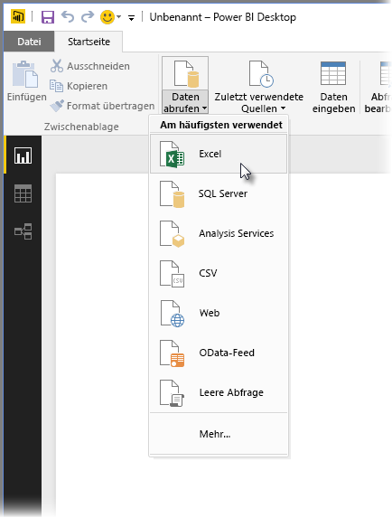

Wählen Sie zunächst **Excel** aus, navigieren Sie zu der Arbeitsmappe, und wählen Sie diese aus. Die Abfrage prüft die Arbeitsmappe und zeigt dann die gefundenen Daten im Fenster **Navigator** an.

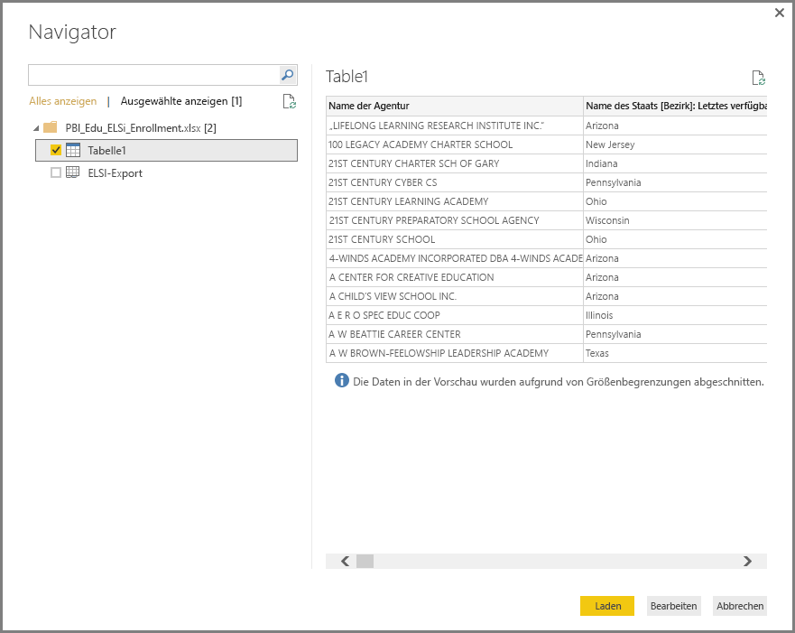

Sie können **Bearbeiten** auswählen, um die Abfrage anzupassen oder die Daten zu *modellieren* , bevor Sie sie in Power BI Desktop laden. Das Bearbeiten einer Abfrage vor dem Laden ist besonders hilfreich, wenn Sie mit großen Datasets arbeiten, die Sie vor dem Laden kürzen möchten. Wir möchten das in diesem Fall tun, also wählen wir **Bearbeiten**aus.

Das Verbinden mit anderen Datentypen ist genauso einfach. Wir möchten auch eine Verbindung zu einer Webressource herstellen. Wählen Sie **Daten abrufen \> Mehr...** und dann **Sonstige \> Web** aus.

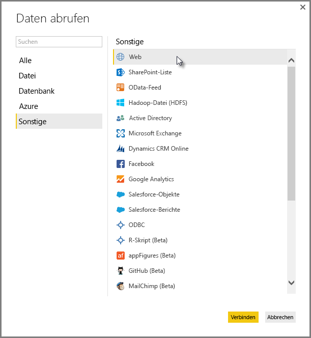

Das Fenster **Aus dem Web** wird geöffnet, in dem Sie die URL der Webseite eingeben können.

Wählen Sie **OK** aus. Wie zuvor prüft Power BI Desktop die Arbeitsmappe und zeigt die gefundenen Daten im **Navigator** an.

Andere Datenverbindungen funktionieren ähnlich. Falls für eine Datenverbindung eine Authentifizierung erforderlich ist, fordert die Power BI Query Sie auf, die entsprechenden Abmeldeinformationen einzugeben.

Das Verbinden mit Daten in Power BI Desktop wird Schritt für Schritt unter [Verbinden mit Daten in Power BI Desktop](https://powerbi.uservoice.com/knowledgebase/articles/471635) erläutert.

## Strukturieren und Kombinieren von Daten
Mit dem Abfrage-Editor können Sie ganz einfach Daten strukturieren und kombinieren. Dieser Abschnitt enthält einige Beispiele zum Strukturieren von Daten. Das Strukturieren und Kombinieren von Daten wird ausführlicher unter [Strukturieren und Kombinieren von Daten mit Power BI Desktop erläutert](https://powerbi.uservoice.com/knowledgebase/articles/471644).

Im vorherigen Abschnitt haben wir Verbindungen zu zwei Datasets hergestellt: eine Excel-Arbeitsmappe und eine Webressource. Nach dem Laden im Abfrage-Editor zeigt sich das folgende Bild, wobei die Abfrage von der Website ausgewählt ist (unter den aufgelisteten verfügbaren Abfragen im Bereich **Abfragen** auf der linken Seite des Abfrage-Editor-Fensters).

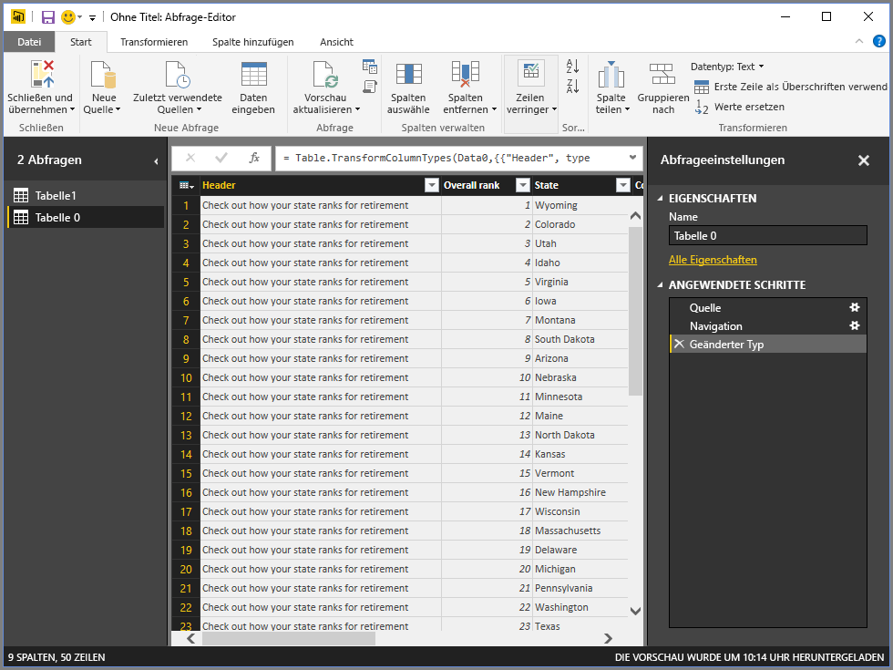

Beim Strukturieren von Daten wird eine Datenquelle in die Struktur und das Format transformiert, die bzw. das Ihren Anforderungen entspricht. In diesem Fall brauchen wird die erste Spalte namens *Header* nicht und entfernen sie.

Im **Abfrage-Editor**sind im Menüband und in Kontextmenüs (Rechtsklick) viele Befehle verfügbar. Wenn Sie beispielsweise mit der rechten Maustaste auf die Spalte *Header* klicken, wird ein Menü angezeigt, in dem Sie die Spalte löschen können. Sie könnten aber auch zuerst die Spalte und dann im Menüband die Schaltfläche **Spalten entfernen** auswählen.

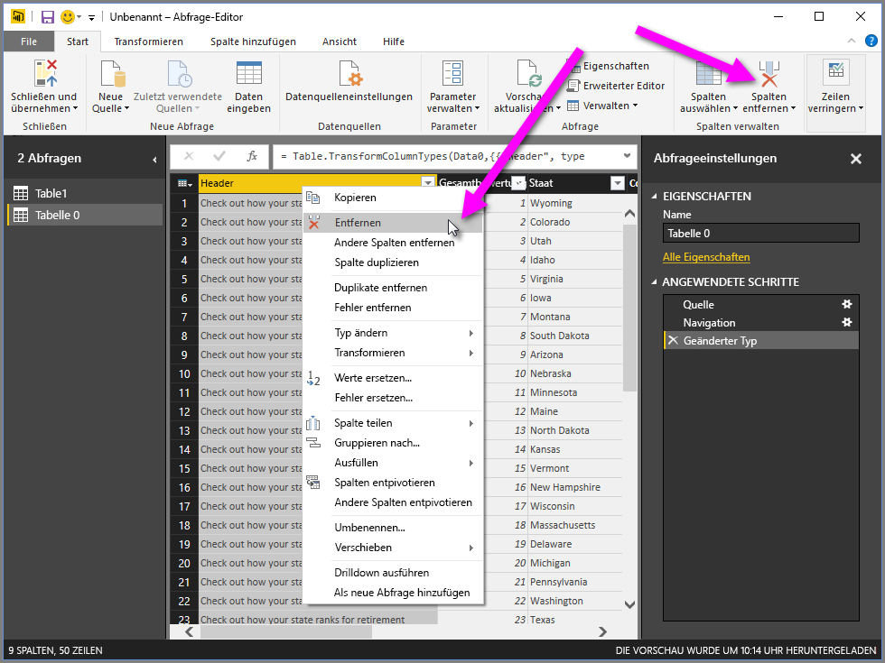

Für das Strukturieren der Daten in dieser Abfrage gibt es viele Möglichkeiten. Sie können bei Bedarf alle Zeilennummern von oben oder von unten entfernen, Spalten hinzufügen oder teilen, Werte ersetzen und andere Strukturierungsaufgaben ausführen, mit denen der Abfrage-Editor angewiesen wird, die Daten in der gewünschten Weise abzurufen.

## Gruppieren von Zeilen
Im Abfrage-Editor können Sie Werte aus mehreren Zeilen in einem Einzelwert zusammenfassen bzw. gruppieren. Das kann beispielsweise hilfreich sein, wenn Sie die Anzahl angebotener Produkte, die Gesamtumsätze oder die Anzahl von Schülern zusammenfassen möchten.

In diesem Beispiel gruppieren wir die Zeilen in einem Dataset mit den Anmeldungszahlen von Schülern. Die Daten stammen aus einer Excel-Arbeitsmappe und wurden im Abfrage-Editor so strukturiert, dass nur die benötigten Spalten abgerufen werden. Außerdem wurden noch ein paar andere Transformationen vorgenommen, und die Tabelle wurde umbenannt.

Wir wollen nun herausfinden, wie viele Bildungsträger (einschl. Schuldistrikte und andere Bildungseinrichtungen wie regionale Berufsbildungsstätten usw.) es in jedem US-Bundesstaat gibt. Wir wählen zuerst die Spalte *State Abbr* und dann die Schaltfläche **Gruppieren nach** auf der Registerkarte **Transformieren** oder **Start** im Menüband aus (**Gruppieren nach** ist auf beiden Registerkarten verfügbar).

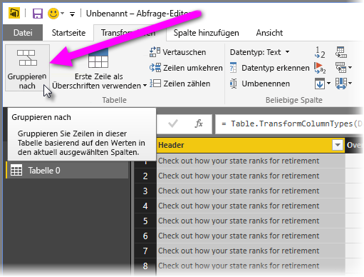

Das Fenster **Gruppieren nach...** wird angezeigt. Wenn im Abfrage-Editor Zeilen gruppiert werden, wird eine neue Spalte erstellt, in die die Ergebnisse des Vorgangs **Gruppieren nach** eingefügt werden. Sie können den Vorgang **Gruppieren nach** auf folgende Weise anpassen:

1. *Gruppieren nach* – Dies ist die zu gruppierende Spalte. Der Abfrage-Editor wählt zwar die markierte Spalte aus, aber Sie können die Spalte in diesem Fenster ändern und eine beliebige andere Spalte der Tabelle verwenden.
2. *Neuer Spaltenname* – Der Abfrage-Editor schlägt auf Basis des zum Gruppieren der Spalte ausgeführten Vorgangs einen Namen für die neue Spalte vor. Sie können den Namen der neuen Spalte jedoch beliebig ändern.
3. *Vorgang* – Hier geben Sie den Vorgang an, den der Abfrage-Editor anwenden soll.
4. *Plus-/Minuszeichen (+/-)* – Sie können im Fenster **Gruppieren nach** und in einem einzelnen Vorgang einen und sogar mehrere Aggregationsvorgänge (Aktionen des Typs **Gruppieren nach**) für mehrere Spalten ausführen. Der Abfrage-Editor erstellt eine neue Spalte (anhand Ihrer Auswahl in diesem Fenster), die für mehrere Spalten gilt. Wählen Sie die Schaltfläche **+** aus, um dem Vorgang **Gruppieren nach** mehrere Spalten oder Aggregationen hinzuzufügen. Durch Auswahl des Minuszeichens (-) können Sie eine Spalte oder Aggregation entfernen. Probieren Sie es einfach aus, und sehen Sie sich die Ergebnisse an. 
   
   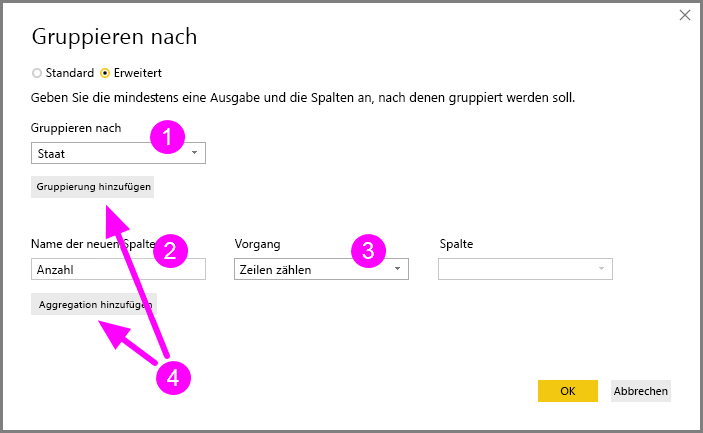

Bei Auswahl von **OK** führt die Abfrage den Vorgang **Gruppieren nach** aus und gibt die Ergebnisse zurück. Sehen Sie sich das an! Ohio, Texas, Illinois und Kalifornien haben jeweils über tausend Bildungsträger.

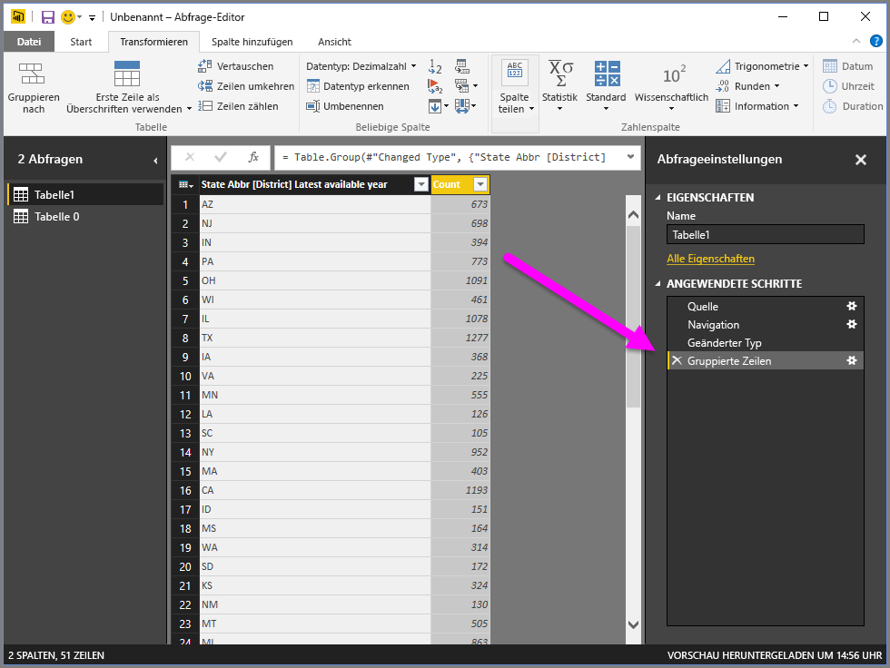

Bei der Abfrage können Sie immer den letzten Strukturierungsvorgang entfernen, indem Sie das **X** neben dem gerade ausgeführten Schritt auswählen. Also los! Experimentieren Sie! Machen Sie einfach den Schritt rückgängig, wenn Ihnen die Ergebnisse nicht gefallen, und fahren Sie solange fort, bis der Abfrage-Editor Ihre Daten so strukturiert, wie Sie es gerne hätten.

## Pivot-Spalten
Mit Power BI Desktop können Sie Pivot-Spalten und eine Tabelle erstellen, die für jeden eindeutigen Wert in einer Spalte zusammengefasste Werte enthält. Wenn Sie beispielsweise wissen müssen, wie viele verschiedene Produkte die einzelnen Produktkategorien enthalten, können Sie rasch eine Tabelle für genau diesen Zweck erstellen.

Betrachten wir dazu ein Beispiel. Die folgende Tabelle **Products** wurde so strukturiert, dass nur eindeutige Produkte (nach Namen) und die zugehörige Produktkategorie angezeigt werden. Um eine neue Tabelle zu erstellen, welche die Anzahl der Produkte in jeder Kategorie (anhand der Spalte *CategoryName* ) zeigt, markieren Sie die Spalte, und wählen Sie dann im Menüband auf der Registerkarte **Transformieren** die Option **Pivot-Spalte** aus.

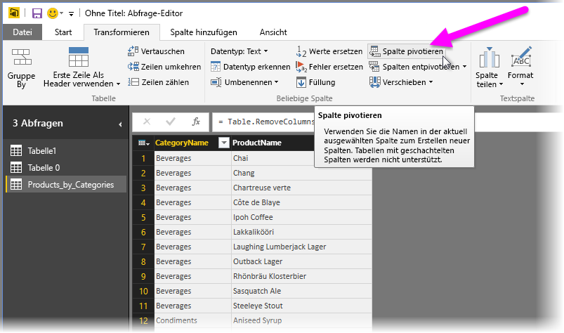

Das Fenster **Pivot-Spalte** wird geöffnet, aus dem hervorgeht, aus welcher Spalte Werte zum Erstellen neuer Spalten (1) verwendet werden. Bei Auswahl von **Erweiterte Optionen** (2) können Sie die Funktion auswählen, die auf die zusammengefassten Werte angewendet werden soll (3).

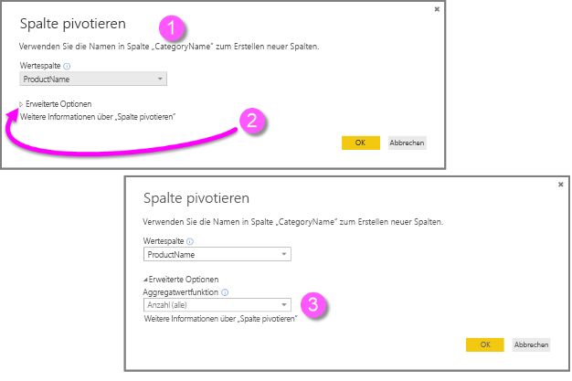

Bei Auswahl von **OK**zeigt die Abfrage die Tabelle entsprechend den im Fenster **Pivot-Spalte** vorgenommenen Anweisungen zur Transformation an.

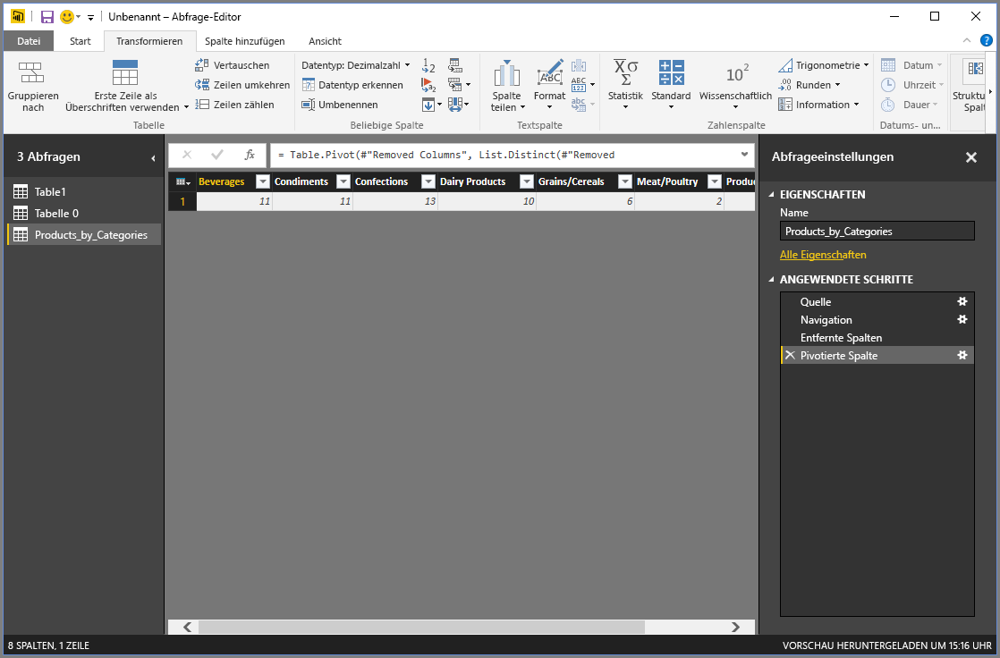

## Erstellen benutzerdefinierter Spalten
Im Abfrage-Editor können Sie benutzerdefinierte Formeln für mehrere Spalten in Ihrer Tabelle erstellen und anschließend die Ergebnisse dieser Formeln in eine neue (benutzerdefinierte) Spalte einfügen. Der Abfrage-Editor macht es Ihnen einfach, benutzerdefinierte Spalten zu erstellen.

Wählen Sie im Abfrage-Editor im Menüband auf der Registerkarte **Spalte hinzufügen** die Option **Benutzerdefinierte Spalte hinzufügen** aus.

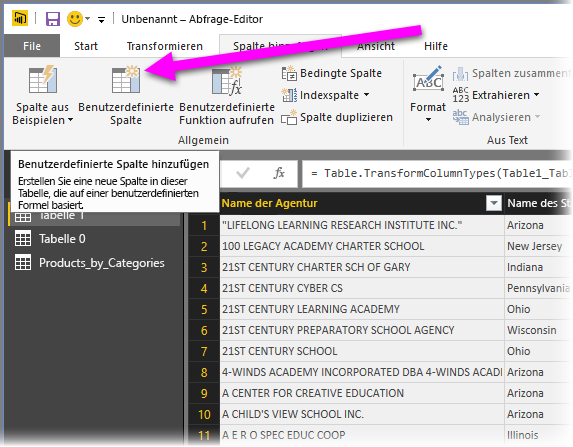

Das folgende Fenster wird angezeigt. Im folgenden Beispiel erstellen wir eine benutzerdefinierte Spalte namens *Percent ELL*, die den Prozentsatz aller Studenten berechnet, die English Language Learners (ELL) sind, d. h. die englische Sprache erlernen.

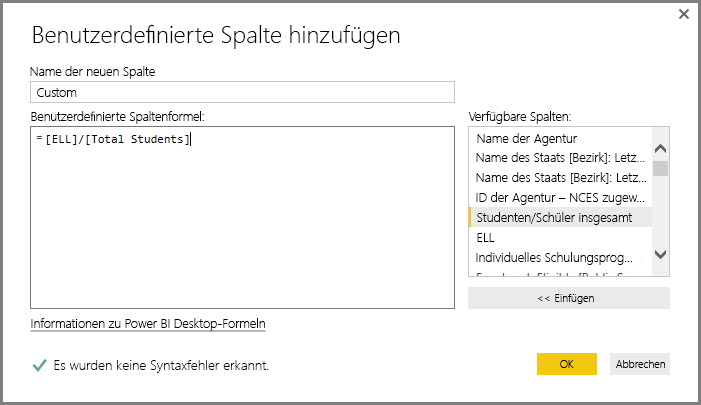

Wie bei jedem anderen angewendeten Schritt im Abfrage-Editor können Sie auch diese neue Spalte im Bereich **Abfrageeinstellungen** im Abschnitt **Angewendete Schritte** einfach löschen, wenn sie nicht Ihren Vorstellungen entspricht. Wählen Sie dazu einfach das **X** neben dem Schritt **Hinzugefügte benutzerdefinierte Spalte** aus.

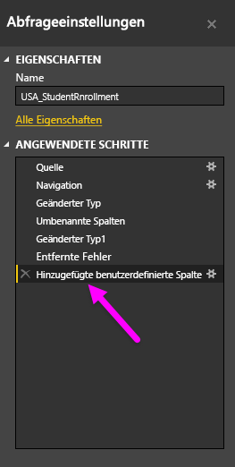

## Abfrageformeln
Sie können die vom Abfrage-Editor generierten Schritte bearbeiten und auch benutzerdefinierte Formeln erstellen, um die Datenverbindungen und die Strukturierung der Daten genau zu steuern. Jedes Mal, wenn der Abfrage-Editor eine Aktion mit den Daten ausführt, wird die mit der Aktion verbundene Formel in der **Bearbeitungsleiste**angezeigt. Zum Anzeigen der **Bearbeitungsleiste**aktivieren Sie im Menüband auf der Registerkarte **Ansicht** das Kontrollkästchen **Bearbeitungsleiste** .

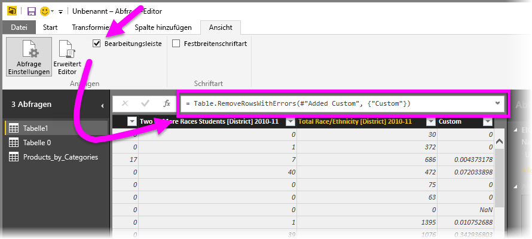

Der Abfrage-Editor zeichnet alle angewendeten Abfrageschritte als Text auf, den Sie anzeigen oder ändern können. Dafür verwenden Sie den **Erweiterter Editor**, der bei Auswahl von **Erweiterter Editor** auf der Registerkarte **Ansicht** im Menüband angezeigt wird.

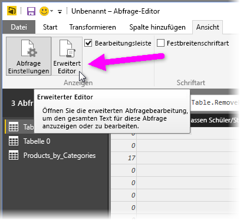

Hier sehen Sie den **Erweiterter Editor**, in dem die Abfrageschritte der Abfrage **USA\_StudentEnrollment** angezeigt werden. Diese Schritte werden in der Power Query-Formelsprache erstellt, die häufig auch nur **M** genannt wird. Informationen hierzu finden Sie unter [Informationen zu Power Query-Formeln](https://support.office.com/article/Learn-about-Power-Query-formulas-6bc50988-022b-4799-a709-f8aafdee2b2f?ui=en-US&rs=en-US&ad=US). Laden Sie die [Microsoft Power Query-Spezifikation für die Excel-Formelsprache](http://go.microsoft.com/fwlink/?linkid=320633) herunter, um die eigentliche Spezifikation dieser Formelsprache anzuzeigen.

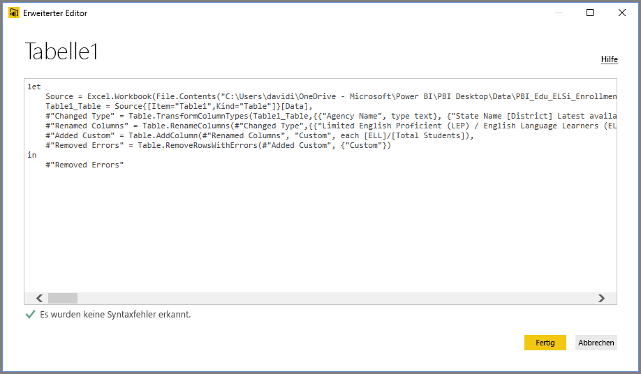

Power BI Desktop stellt einen umfangreichen Satz Formelkategorien bereit. Weitere Informationen und eine umfassende Referenz mit allen Formeln des Abfrage-Editors finden Sie in den [Power Query-Formelkategorien](https://support.office.com/en-in/article/Power-Query-formula-categories-125024ec-873c-47b9-bdfd-b437f8716819).

Die Formelkategorien für den Abfrage-Editor lauten wie folgt:

* Zahl (Number)
  * Konstanten (Constants)
  * Informationen (Information)
  * Konvertierung und Formatierung (Conversion and formatting)
  * Format
  * Rundung (Rounding)
  * Operationen (Operations)
  * Zufall (Random)
  * Trigonometrie (Trigonometry)
  * Bytes
* Text
  * Informationen (Information)
  * Textvergleiche (Text comparisons)
  * Extraktion (Extraction)
  * Modifikation (Modification)
  * Mitgliedschaft (Membership)
  * Transformationen (Transformations)
* Logik (Logical)
* Datum (Date)
* Uhrzeit (Time)
* DatumUhrzeit (DateTime)
* DatumZeitzone (DateTimeZone)
* Dauer (Duration)
* Aufzeichnung (Record)
  * Informationen (Information)
  * Transformationen (Transformations)
  * Auswahl (Selection)
  * Serialisierung (Serialization)
* Liste (List)
  * Informationen (Information)
  * Auswahl (Selection)
  * Transformation
  * Mitgliedschaft (Membership)
  * Festlegungsvorgänge (Set operations)
  * Reihenfolge (Ordering)
  * Durchschnittswerte (Averages)
  * Addition
  * Numerische Werte (Numerics)
  * Generatoren (Generators)
* Tabelle (Table)
  * Tabellenerstellung (Table construction)
  * Konvertierungen (Conversions)
  * Informationen (Information)
  * Zeilenvorgänge (Row operations)
  * Spaltenvorgänge (Column operations)
  * Mitgliedschaft (Membership)
* Werte (Values)
* Arithmetische Operationen (Arithmetic operations)
* Parametertypen (Parameter Types)
* Metadaten (Metadata)
* Datenzugriff (Accessing data)
* URI
* Binärformate (Binary formats)
  * Lesen von Zahlen (Reading numbers)
* Binär (Binary)
* Linien (Lines)
* Ausdruck (Expression)
* Funktion (Function)
* Fehler (Error)
* Vergleichsfunktion (Comparer)
* Teilungsfunktion (Splitter)
* Kombinierungsfunktion (Combiner)
* Ersetzungsfunktion (Replacer)
* Typ (Type)

## Nächste Schritte
Mit Power BI Desktop können Sie viele Aufgaben ausführen. Weitere Informationen zu den Funktionen und Möglichkeiten finden Sie in folgenden Ressourcen:

* [Erste Schritte mit Power BI Desktop](desktop-getting-started.md)
* [Übersicht zu Abfragen mit Power BI Desktop](desktop-query-overview.md)
* [Datenquellen in Power BI Desktop](desktop-data-sources.md)
* [Verbinden mit Daten in Power BI Desktop](desktop-connect-to-data.md)
* [Strukturieren und Kombinieren von Daten mit Power BI Desktop](desktop-shape-and-combine-data.md)

