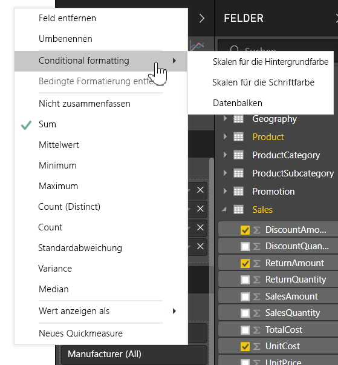
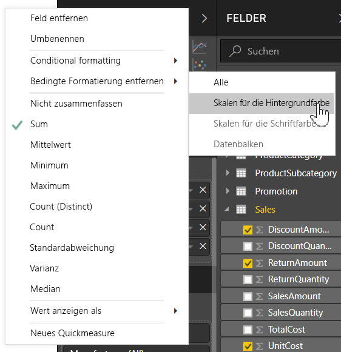
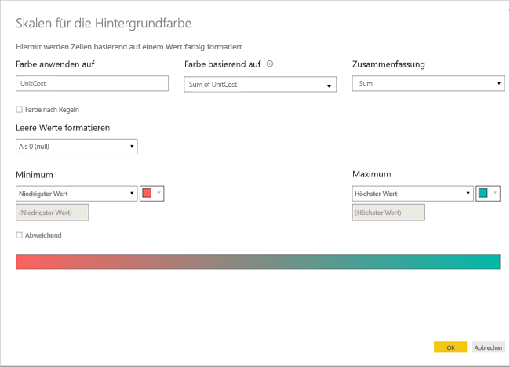
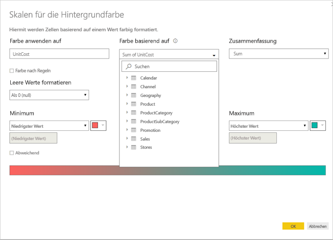
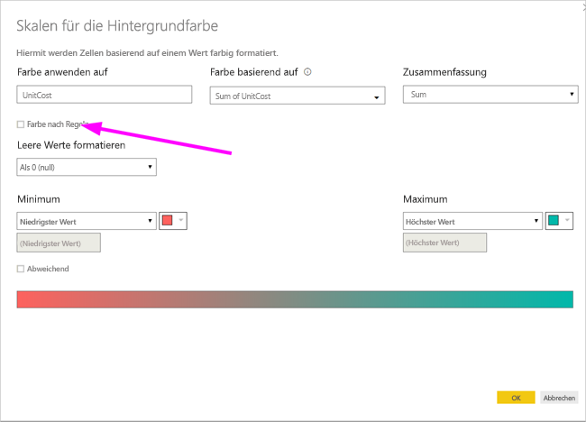
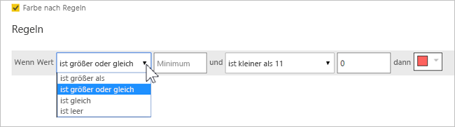
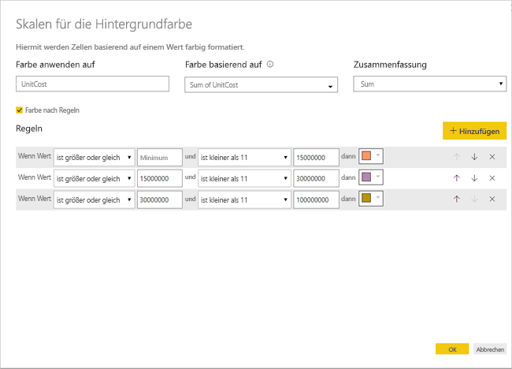
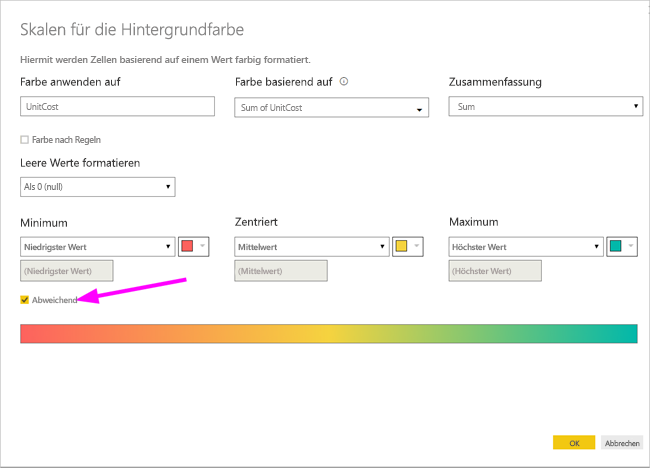
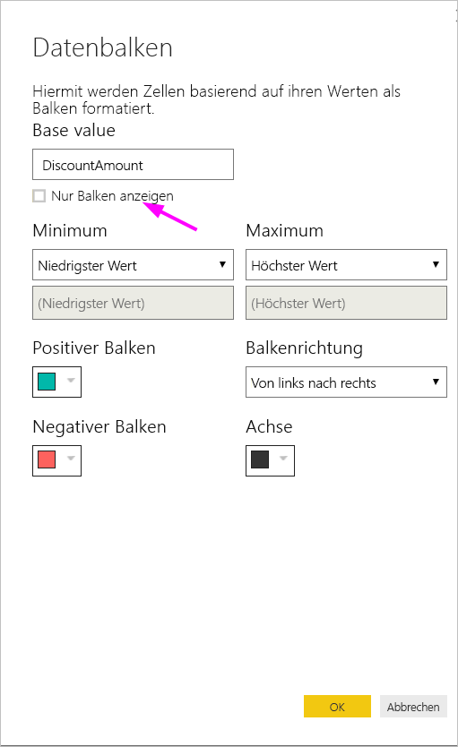

# Bedingte Formatierung in Tabellen 
Mithilfe der bedingten Formatierung für Tabellen können Sie benutzerdefinierte Zellenfarben basierend auf Zellwerten oder auf anderen Werten oder Feldern festlegen und Verlaufsfarben verwenden. Sie können auch Zellwerte mit Datenbalken darstellen. 

Wählen Sie zum Zugriff auf die bedingte Formatierung im Bereich **Felder** des Bereichs **Visualisierungen** in Power BI Desktop den Dropdownpfeil neben dem Wert im Bereich **Werte** aus, den Sie formatieren möchten (oder klicken Sie mit der rechten Maustaste in das Feld). Sie können die bedingte Formatierung nur für Felder im Bereich **Werte** des Bereichs **Felder** verwalten.

Die folgenden Abschnitte beschreiben die drei Optionen für „Bedingte Formatierung“. Eine oder mehrerer Optionen können in einer einzelnen Tabellenspalte kombiniert werden.

> [!NOTE]
> Bei der Anwendung auf eine Tabelle überschreibt die bedingte Formatierung alle benutzerdefinierten Tabellenformatierungen, die auf die Zellen mit bedingter Formatierung angewendet wurden.

Wenn Sie eine bedingte Formatierung aus einer Visualisierung entfernen möchten, klicken Sie einfach mit der rechten Maustaste erneut auf das Feld, wählen Sie **Bedingte Formatierung entfernen** und dann den Typ der zu entfernenden Formatierung aus.

## Skalen für die Hintergrundfarbe

Durch Auswahl von **Bedingte Formatierung** und **Skalen für die Hintergrundfarbe** wird das folgende Dialogfeld angezeigt.

Sie können ein Feld aus Ihrem Datenmodell auswählen, auf dem die Farben basieren sollen, indem Sie **Farbe basierend auf** für dieses Feld festlegen. Zusätzlich können Sie den Aggregationstyp für das ausgewählte Feld über den Wert **Summarization** (Zusammenfassung) angeben. Das Feld, das farbig werden soll, wird im Feld **Farbe anwenden auf** angegeben. Sie können dies also nachverfolgen. Sie können Text- und Datumsfelder auch bedingt formatieren, sofern Sie einen numerischen Wert als Grundlage für die Formatierung wählen.

Um diskrete Farbwerte für angegebene Wertbereiche zu verwenden, wählen Sie **Farbe nach Regeln** aus. Um ein Farbspektrum zu verwenden, lassen Sie **Farbe nach Regeln** deaktiviert. 

### Farbe nach Regeln

Wenn Sie **Farbe nach Regeln** auswählen, können Sie mindestens einen Wertbereich eingeben, jeweils mit einer festgelegten Farbe.  Jeder Wertbereich beginnt mit einer *Wenn Wert*-Bedingung, einem *Und*-Wertbedingung und einer Farbe.

Tabellenzellen mit Werten in jedem Bereich werden mit der angegebenen Farbe aufgefüllt. In der folgenden Abbildung werden drei Regeln dargestellt.

Die Beispieltabelle sieht nun so aus:

### Farbe Minimum zu Maximum

Sie können die Werte *Minimum* und *Maximum* sowie deren Farben konfigurieren. Wenn Sie das Kontrollkästchen **Abweichend** aktivieren, können Sie auch einen optionalen Wert für *Zentriert* konfigurieren.

Die Beispieltabelle sieht nun so aus:

## Skalen für die Schriftfarbe

Durch Auswahl von **Bedingte Formatierung** und **Skalen für die Schriftfarbe** wird das folgende Dialogfeld angezeigt. Dieses Dialogfeld ähnelt dem Dialogfeld **Skalen für die Hintergrundfarbe**, es wird jedoch die Schriftfarbe geändert und nicht die Hintergrundfarbe der Zelle.

Die Beispieltabelle sieht nun so aus:

## Datenbalken

Durch Auswahl von **Bedingte Formatierung** und **Datenbalken** wird das folgende Dialogfeld angezeigt. 

In der Standardeinstellung ist die Option **Nur Balken anzeigen** deaktiviert, deshalb werden in der Tabellenzelle jeweils die Leiste und der aktuelle Wert angezeigt.

Wenn die Option **Nur Balken anzeigen** aktiviert ist, zeigt die Tabellenzelle nur die Leiste an.

