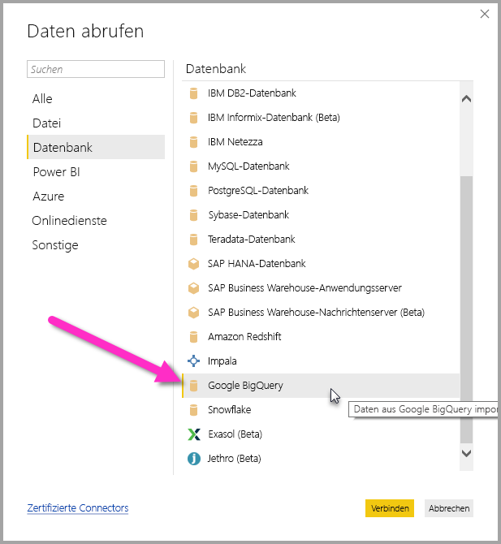
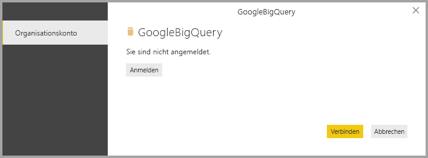
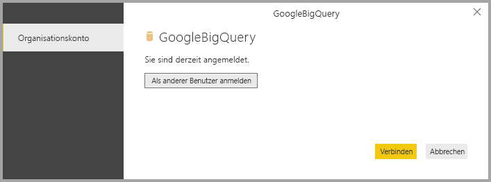
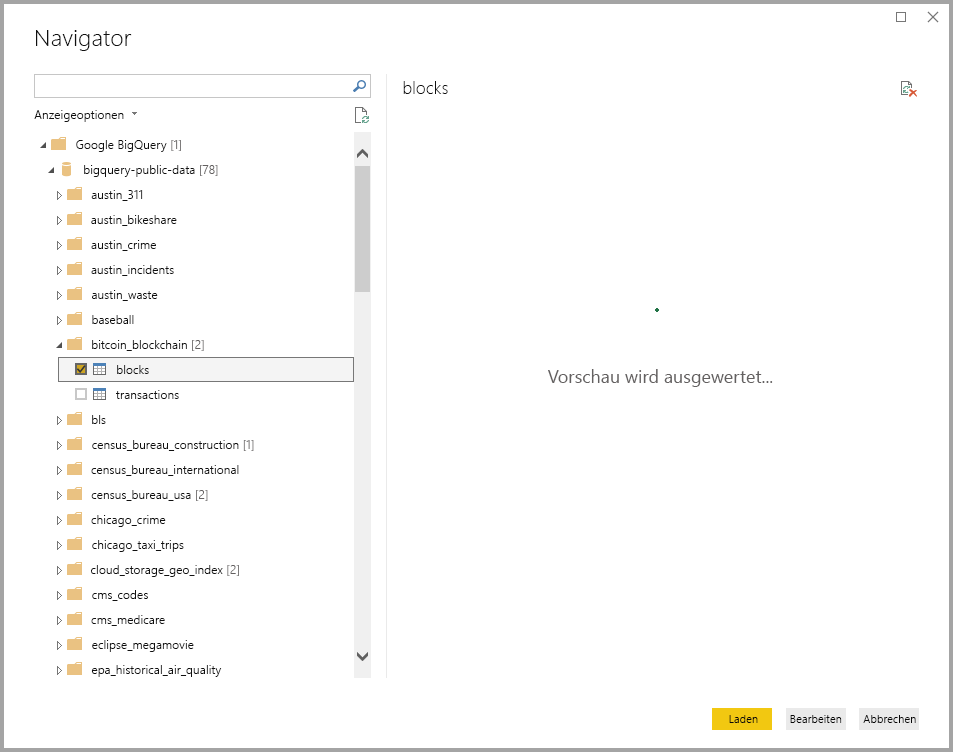

# <a name="connect-to-a-google-bigquery-database-in-power-bi-desktop"></a>Herstellen einer Verbindung mit einer Google BigQuery-Datenbank in Power BI Desktop
In Power BI Desktop können Sie eine Verbindung mit einer **BigQuery**-Datenbank herstellen und die zugrunde liegenden Daten wie alle anderen Datenquellen in Power BI Desktop verwenden.

## <a name="connect-to-google-bigquery"></a>Herstellen einer Verbindung mit Google BigQuery
Wählen Sie in Power BI Desktop im Menüband **Start** die Option **Daten abrufen** aus, um eine Verbindung mit einer **BigQuery**-Datenbank herzustellen. Wählen Sie in den Kategorien auf der linken Seite **Datenbank** aus. Anschließend wird **Google BigQuery** angezeigt.



Melden Sie sich im Fenster **Google BigQuery**, das angezeigt wird, bei Ihrem Google BigQuery-Konto an, und wählen Sie **Verbinden** aus.



Wenn Sie sich angemeldet habe, sehen Sie das folgende Fenster, das angibt, dass Sie authentifiziert wurden. 



Nachdem die Verbindung erfolgreich hergestellt wurde, wird das Fenster **Navigator** mit den auf dem Server verfügbaren Daten angezeigt. Aus diesen können Sie ein oder mehrere Elemente auswählen, die importiert und in **Power BI Desktop** verwendet werden sollen.



## <a name="considerations-and-limitations"></a>Überlegungen und Einschränkungen
Beim **BigQuery**-Connector sind einige Einschränkungen und Überlegungen zu beachten:

* Der Google BigQuery-Connector ist in Power BI Desktop und im Power BI-Dienst verfügbar. Im Power BI-Dienst kann über die Cloud-zu-Cloud-Verbindung von Power BI auf Google BigQuery zugegriffen werden.

Sie können Power BI mit dem **Abrechnungsprojekt** von Google BigQuery verwenden. Power BI verwendet standardmäßig das erste Projekt aus der Liste, die für den Benutzer zurückgegeben wird. Um das Verhalten des Abrechnungsprojekts anzupassen, wenn dieses mit Power BI verwendet wird, gehen Sie folgendermaßen vor:

 * Geben Sie folgende Option im zugrunde liegenden Quellschritt an, der mithilfe des **Power Query-Editors** in Power BI Desktop angepasst werden kann:

    ```Source = GoogleBigQuery.Database([BillingProject="Include-Billing-Project-Id-Here"])```

## <a name="next-steps"></a>Nächste Schritte
Sie können mithilfe von Power BI Desktop eine Verbindung mit Daten jeglicher Art herstellen. Weitere Informationen zu Datenquellen finden Sie in folgenden Ressourcen:

* [Was ist Power BI Desktop?](desktop-what-is-desktop.md)
* [Datenquellen in Power BI Desktop](desktop-data-sources.md)
* [Strukturieren und Kombinieren von Daten mit Power BI Desktop](desktop-shape-and-combine-data.md)
* [Verbinden mit Excel in Power BI Desktop](desktop-connect-excel.md)   
* [Eingeben von Daten direkt in Power BI Desktop](desktop-enter-data-directly-into-desktop.md)   

